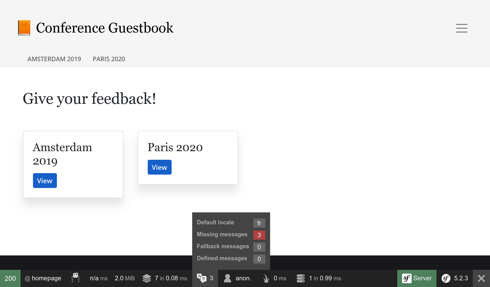
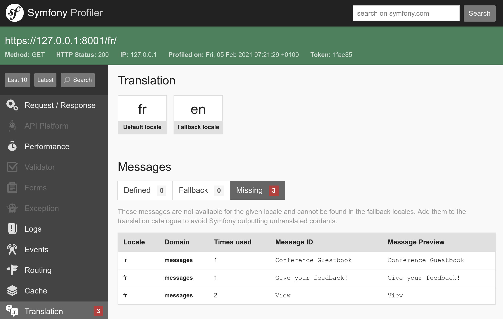
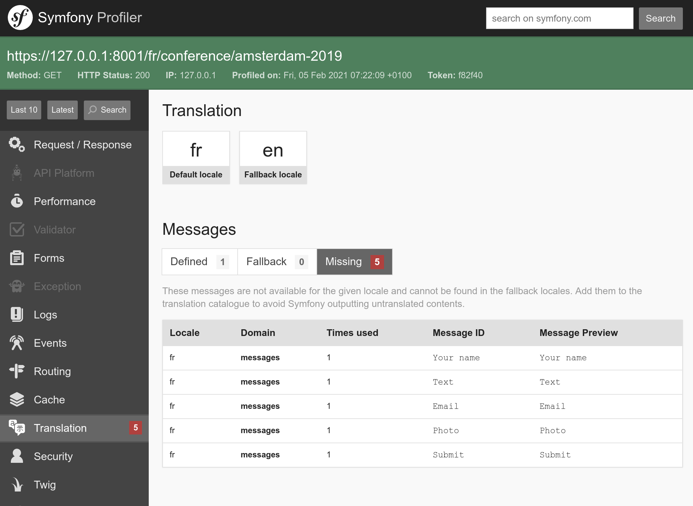

Локализация приложения
===========================================

Аудитория Symfony распределена по всему миру и благодаря этому, интернационализация (i18n) и локализация (l10n) уже очень давно доступны из коробки. Локализация приложения заключается не только в переводе интерфейса, но и в обработке форм множественного числа, форматировании даты и валюты, URL-адресов и т. д.

Интернационализация URL-адресов
---------------------------------------------------------

.. index::
    single: Components;Routing
    single: Routing;Locale
    single: Routing;Requirements
    single: Annotations;Route

Интернационализация URL-адресов — первый шаг к интернационализации сайта. Адрес сайта должен отличаться в зависимости от локали для корректной работы HTTP-кеширования (никогда не используйте одинаковый URL, сохраняя локаль в сессии).

Укажите специальный параметр маршрута ``_locale``, чтобы использовать локаль в маршрутах:

.. code-block:: diff
    :caption: patch_file
    :emphasize-lines: 8

    --- a/src/Controller/ConferenceController.php
    +++ b/src/Controller/ConferenceController.php
    @@ -33,7 +33,7 @@ class ConferenceController extends AbstractController
             $this->bus = $bus;
         }

    -    #[Route('/', name: 'homepage')]
    +    #[Route('/{_locale}/', name: 'homepage')]
         public function index(ConferenceRepository $conferenceRepository): Response
         {
             $response = new Response($this->twig->render('conference/index.html.twig', [

Теперь локаль на главной странице устанавливается в зависимости от URL; например, если вы перейдёте на ``/fr/``, вызов ``$request->getLocale()`` вернёт ``fr``.

Как правило, у вас не получится перевести содержимое для всех доступных локалей, поэтому выберите только те, которые вы можете поддерживать:

.. code-block:: diff
    :caption: patch_file
    :emphasize-lines: 8

    --- a/src/Controller/ConferenceController.php
    +++ b/src/Controller/ConferenceController.php
    @@ -33,7 +33,7 @@ class ConferenceController extends AbstractController
             $this->bus = $bus;
         }

    -    #[Route('/{_locale}/', name: 'homepage')]
    +    #[Route('/{_locale<en|fr>}/', name: 'homepage')]
         public function index(ConferenceRepository $conferenceRepository): Response
         {
             $response = new Response($this->twig->render('conference/index.html.twig', [

Вы можете ограничить любой параметр маршрута, используя регулярное выражение внутри ``<`` ``>``. Маршрут ``homepage`` сработает, только если параметр ``_locale`` будет равен ``en`` или ``fr``. Попробуйте перейти по пути ``/es/`` и вы увидите ошибку 404, потому что нет подходящего маршрута.

Поскольку мы будем использовать одно и то же ограничение практически во всех маршрутах, давайте переместим его к параметрам контейнера:

.. code-block:: diff
    :caption: patch_file

    --- a/config/services.yaml
    +++ b/config/services.yaml
    @@ -7,6 +7,7 @@ parameters:
         default_admin_email: admin@example.com
         default_domain: '127.0.0.1'
         default_scheme: 'http'
    +    app.supported_locales: 'en|fr'

         router.request_context.host: '%env(default:default_domain:SYMFONY_DEFAULT_ROUTE_HOST)%'
         router.request_context.scheme: '%env(default:default_scheme:SYMFONY_DEFAULT_ROUTE_SCHEME)%'
    --- a/src/Controller/ConferenceController.php
    +++ b/src/Controller/ConferenceController.php
    @@ -33,7 +33,7 @@ class ConferenceController extends AbstractController
             $this->bus = $bus;
         }

    -    #[Route('/{_locale<en|fr>}/', name: 'homepage')]
    +    #[Route('/{_locale<%app.supported_locales%>}/', name: 'homepage')]
         public function index(ConferenceRepository $conferenceRepository): Response
         {
             $response = new Response($this->twig->render('conference/index.html.twig', [

Обновите параметр ``app.supported_languages``, добавив в него новый язык.

Добавьте тот же префикс локали маршрута к другим URL-адресам:

.. code-block:: diff
    :caption: patch_file

    --- a/src/Controller/ConferenceController.php
    +++ b/src/Controller/ConferenceController.php
    @@ -44,7 +44,7 @@ class ConferenceController extends AbstractController
             return $response;
         }

    -    #[Route('/conference_header', name: 'conference_header')]
    +    #[Route('/{_locale<%app.supported_locales%>}/conference_header', name: 'conference_header')]
         public function conferenceHeader(ConferenceRepository $conferenceRepository): Response
         {
             $response = new Response($this->twig->render('conference/header.html.twig', [
    @@ -55,7 +55,7 @@ class ConferenceController extends AbstractController
             return $response;
         }

    -    #[Route('/conference/{slug}', name: 'conference')]
    +    #[Route('/{_locale<%app.supported_locales%>}/conference/{slug}', name: 'conference')]
         public function show(Request $request, Conference $conference, CommentRepository $commentRepository, NotifierInterface $notifier, string $photoDir): Response
         {
             $comment = new Comment();

Мы почти закончили. У нас  больше нет маршрута, который бы совпадал с ``/``. Давайте вернём его и сделаем так, чтобы он перенаправлял на ``/en/``:

.. code-block:: diff
    :caption: patch_file

    --- a/src/Controller/ConferenceController.php
    +++ b/src/Controller/ConferenceController.php
    @@ -33,6 +33,12 @@ class ConferenceController extends AbstractController
             $this->bus = $bus;
         }

    +    #[Route('/')]
    +    public function indexNoLocale(): Response
    +    {
    +        return $this->redirectToRoute('homepage', ['_locale' => 'en']);
    +    }
    +
         #[Route('/{_locale<%app.supported_locales%>}/', name: 'homepage')]
         public function index(ConferenceRepository $conferenceRepository): Response
         {

Теперь, когда все основные маршруты локализованы, обратите внимание, что генерируемые URL-адреса на страницах автоматически включают текущую локаль.

Добавление переключателя локали
------------------------------------------------------------

.. index::
    single: Twig;path
    single: Twig;Locale

Чтобы пользователи могли переключаться с локали по умолчанию ``en`` на другую, добавьте переключатель в шапку:

.. code-block:: diff
    :caption: patch_file

    --- a/templates/base.html.twig
    +++ b/templates/base.html.twig
    @@ -34,6 +34,16 @@
                                         Admin
                                     </a>
                                 </li>
    +<li class="nav-item dropdown">
    +    <a class="nav-link dropdown-toggle" href="#" id="dropdown-language" role="button"
    +        data-toggle="dropdown" aria-haspopup="true" aria-expanded="false">
    +        English
    +    </a>
    +    

    +        <a class="dropdown-item" href="{{ path('homepage', {_locale: 'en'}) }}">English</a>
    +        <a class="dropdown-item" href="{{ path('homepage', {_locale: 'fr'}) }}">Français</a>
    +    

    +</li>
                             </ul>
                         

                     

Для переключения на другую локаль, нам нужно явно передать параметр маршрута ``_locale`` в функцию ``path()``.

.. index::
    single: Twig;app.request
    single: Twig;locale_name

Обновите шаблон, чтобы вместо неизменяемой надписи "English" отображалось имя текущей локали:

.. code-block:: diff
    :caption: patch_file

    --- a/templates/base.html.twig
    +++ b/templates/base.html.twig
    @@ -37,7 +37,7 @@
     <li class="nav-item dropdown">
         <a class="nav-link dropdown-toggle" href="#" id="dropdown-language" role="button"
             data-toggle="dropdown" aria-haspopup="true" aria-expanded="false">
    -        English
    +        {{ app.request.locale|locale_name(app.request.locale) }}
         </a>
         

             <a class="dropdown-item" href="{{ path('homepage', {_locale: 'en'}) }}">English</a>

``app`` — глобальная переменная Twig для доступа к текущему запросу. Чтобы преобразовать локализацию в человеко-читаемую строку, мы используем Twig-фильтр ``locale_name``.

.. index::
    single: Components;String

В зависимости от локали, её имя не всегда пишется с большой буквы. Для правильного написания заглавных букв в предложениях нам нужен фильтр, который поддерживает Юникод. К счастью, такой Twig-фильтр уже реализован, благодаря компоненту Symfony String:

.. code-block:: bash

    $ symfony composer req twig/string-extra

.. index::
    single: Twig;u.title

.. code-block:: diff
    :caption: patch_file

    --- a/templates/base.html.twig
    +++ b/templates/base.html.twig
    @@ -37,7 +37,7 @@
     <li class="nav-item dropdown">
         <a class="nav-link dropdown-toggle" href="#" id="dropdown-language" role="button"
             data-toggle="dropdown" aria-haspopup="true" aria-expanded="false">
    -        {{ app.request.locale|locale_name(app.request.locale) }}
    +        {{ app.request.locale|locale_name(app.request.locale)|u.title }}
         </a>
         

             <a class="dropdown-item" href="{{ path('homepage', {_locale: 'en'}) }}">English</a>

Теперь при помощи переключателя вы можете поменять язык с французского на английский и весь интерфейс подхватит локализацию:

.. figure:: screenshots/intl-switcher.png
    :alt: /fr/conference/amsterdam-2019
    :align: center
    :figclass: with-browser

Перевод интерфейса
-----------------------------------

.. index::
    single: Components;Translation
    single: Translation
    single: Twig;trans

Чтобы начать переводить сайт, нужно установить компонент Symfony Translation:

.. code-block:: bash

    $ symfony composer req translation

Перевод каждого предложения на большом сайте может быть утомительным, но, к счастью, на нашем сайте всего несколько сообщений. Давайте начнём с предложений на главной странице:

.. code-block:: diff
    :caption: patch_file

    --- a/templates/base.html.twig
    +++ b/templates/base.html.twig
    @@ -20,7 +20,7 @@
                 <nav class="navbar navbar-expand-xl navbar-light bg-light">
                     

                         <a class="navbar-brand mr-4 pr-2" href="{{ path('homepage') }}">
    -                        &#128217; Conference Guestbook
    +                        &#128217; {{ 'Conference Guestbook'|trans }}
                         </a>

                         <button class="navbar-toggler border-0" type="button" data-toggle="collapse" data-target="#header-menu" aria-controls="navbarSupportedContent" aria-expanded="false" aria-label="Show/Hide navigation">
    --- a/templates/conference/index.html.twig
    +++ b/templates/conference/index.html.twig
    @@ -4,7 +4,7 @@

     
         <h2 class="mb-5">
    -        Give your feedback!
    +        {{ 'Give your feedback!'|trans }}
         </h2>

         
    @@ -21,7 +21,7 @@

                                 <a href="{{ path('conference', { slug: conference.slug }) }}"
                                    class="btn btn-sm btn-blue stretched-link">
    -                                View
    +                                {{ 'View'|trans }}
                                 </a>
                             

                         

Twig-фильтр ``trans`` ищет перевод значения в текущей локализации. Если перевода нет, то возвращается значение из *локали по умолчанию*, указанной в файле ``config/packages/translation.yaml``:

.. code-block:: yaml
    :class: ignore
    :emphasize-lines: 2

    framework:
        default_locale: en
        translator:
            default_path: '%kernel.project_dir%/translations'
            fallbacks:
                - en

Обратите внимание, что вкладка с переводами на панели отладки стала красной:

Это означает, что ещё не переведены 3 сообщения.

Нажмите на вкладку переводов, чтобы увидеть непереведённые сообщения, которые нашёл Symfony.

Добавление переводов
---------------------------------------

Возможно, вы уже заметили в файле ``config/packages/translation.yaml``, что переводы хранятся в  корневой директории ``translations/``, которая была автоматически создана при инициализации проекта.

Чтобы не создавать файлы перевода вручную, воспользуйтесь командой ``translation:update``:

.. code-block:: bash

    $ symfony console translation:update fr --force --domain=messages --sort=asc

Команда сгенерирует файл перевода (флаг ``--force``) для локали ``fr`` и домена ``messages``. Домен ``messages`` содержит все сообщения **приложения**, за исключением сообщений от Symfony, таких как ошибки валидации или безопасности.

В файл ``translations/messages+intl-icu.fr.xlf`` добавьте перевод на французский. Не говорите по-французски? Давайте я помогу:

.. code-block:: diff
    :caption: patch_file

    --- a/translations/messages+intl-icu.fr.xlf
    +++ b/translations/messages+intl-icu.fr.xlf
    @@ -7,15 +7,15 @@
         <body>
           <trans-unit id="eOy4.6V" resname="Conference Guestbook">
             <source>Conference Guestbook</source>
    -        <target>__Conference Guestbook</target>
    +        <target>Livre d'Or pour Conferences</target>
           </trans-unit>
           <trans-unit id="LNAVleg" resname="Give your feedback!">
             <source>Give your feedback!</source>
    -        <target>__Give your feedback!</target>
    +        <target>Donnez votre avis !</target>
           </trans-unit>
           <trans-unit id="3Mg5pAF" resname="View">
             <source>View</source>
    -        <target>__View</target>
    +        <target>Sélectionner</target>
           </trans-unit>
         </body>
       </file>

Следует отметить, что мы не будем переводить все шаблоны, но если хотите, сделайте это самостоятельно:

.. figure:: screenshots/intl-translated.png
    :alt: /fr/
    :align: center
    :figclass: with-browser

Перевод форм
-----------------------

.. index::
    single: Translation;Form
    single: Form;Translation

Symfony автоматически отображает переведённые метки форм. Перейдите на страницу конференции и нажмите на вкладку с переводами на панели отладки, чтобы увидеть все метки, у которых отсутствует перевод:

Локализация дат
-----------------------------

.. index::
    single: Localization
    single: Twig;format_datetime
    single: Twig;format_time
    single: Twig;format_date
    single: Twig;format_currency
    single: Twig;format_number

Если переключится на французский язык и перейти на какую-нибудь страницу конференции, у которой есть комментарии, вы заметите, что даты комментариев автоматически локализованы. Это сработало потому, что мы использовали Twig-фильтр ``format_datetime``, который поддерживает локализацию (``{{ comment.createdAt|format_datetime('medium', 'short') }}``).

Локализация поддерживается для дат, времени (``format_time``), валют (``format_currency``) и чисел (``format_number``) в разных форматах (проценты, периоды, прописью и т.д.).

Перевод сообщений во множественном числе
----------------------------------------------------------------------------

.. index::
    single: Translation;Plurals
    single: Translation;Conditions

Управление множественными формами сообщений в переводах — это одна из распространённых проблем выбора перевода в зависимости от условия.

На странице конференции отображается количество комментариев: ``There are 2 comments``. В случае 1 комментария мы неправильно  выводим ``There are 1 comments``. Поэтому измените шаблон, чтобы преобразовать эту надпись в сообщение для перевода:

.. code-block:: diff
    :caption: patch_file

    --- a/templates/conference/show.html.twig
    +++ b/templates/conference/show.html.twig
    @@ -44,7 +44,7 @@
                             

                         

                     
    -                
There are {{ comments|length }} comments.

    +                
{{ 'nb_of_comments'|trans({count: comments|length}) }}

                     
                         <a href="{{ path('conference', { slug: conference.slug, offset: previous }) }}">Previous</a>
                     

Для этого сообщения воспользуемся иной стратегией перевода: английскую версию сообщения в шаблоне заменим на уникальный идентификатор. Такой подход лучше всего работает с большим и сложным текстом.

Добавьте новое сообщение в файл с переводом:

.. code-block:: diff
    :caption: patch_file

    --- a/translations/messages+intl-icu.fr.xlf
    +++ b/translations/messages+intl-icu.fr.xlf
    @@ -17,6 +17,10 @@
             <source>Conference Guestbook</source>
             <target>Livre d'Or pour Conferences</target>
           </trans-unit>
    +      <trans-unit id="Dg2dPd6" resname="nb_of_comments">
    +        <source>nb_of_comments</source>
    +        <target>{count, plural, =0 {Aucun commentaire.} =1 {1 commentaire.} other {# commentaires.}}</target>
    +      </trans-unit>
         </body>
       </file>
     </xliff>

Мы ещё не закончили, так как теперь нам необходимо добавить перевод на английский язык. Создайте файл ``translations/messages+intl-icu.en.xlf``:

.. code-block:: xml
    :caption: translations/messages+intl-icu.en.xlf
    :emphasize-lines: 10

    <?xml version="1.0" encoding="utf-8"?>
    <xliff xmlns="urn:oasis:names:tc:xliff:document:1.2" version="1.2">
      <file source-language="en" target-language="en" datatype="plaintext" original="file.ext">
        <header>
          <tool tool-id="symfony" tool-name="Symfony"/>
        </header>
        <body>
          <trans-unit id="maMQz7W" resname="nb_of_comments">
            <source>nb_of_comments</source>
            <target>{count, plural, =0 {There are no comments.} one {There is one comment.} other {There are # comments.}}</target>
          </trans-unit>
        </body>
      </file>
    </xliff>

Обновление функциональных тестов
--------------------------------------------------------------

Не забудьте обновить URL в функциональных тестах:

.. code-block:: diff
    :caption: patch_file

    --- a/tests/Controller/ConferenceControllerTest.php
    +++ b/tests/Controller/ConferenceControllerTest.php
    @@ -11,7 +11,7 @@ class ConferenceControllerTest extends WebTestCase
         public function testIndex()
         {
             $client = static::createClient();
    -        $client->request('GET', '/');
    +        $client->request('GET', '/en/');

             $this->assertResponseIsSuccessful();
             $this->assertSelectorTextContains('h2', 'Give your feedback');
    @@ -20,7 +20,7 @@ class ConferenceControllerTest extends WebTestCase
         public function testCommentSubmission()
         {
             $client = static::createClient();
    -        $client->request('GET', '/conference/amsterdam-2019');
    +        $client->request('GET', '/en/conference/amsterdam-2019');
             $client->submitForm('Submit', [
                 'comment_form[author]' => 'Fabien',
                 'comment_form[text]' => 'Some feedback from an automated functional test',
    @@ -41,7 +41,7 @@ class ConferenceControllerTest extends WebTestCase
         public function testConferencePage()
         {
             $client = static::createClient();
    -        $crawler = $client->request('GET', '/');
    +        $crawler = $client->request('GET', '/en/');

             $this->assertCount(2, $crawler->filter('h4'));

    @@ -50,6 +50,6 @@ class ConferenceControllerTest extends WebTestCase
             $this->assertPageTitleContains('Amsterdam');
             $this->assertResponseIsSuccessful();
             $this->assertSelectorTextContains('h2', 'Amsterdam 2019');
    -        $this->assertSelectorExists('div:contains("There are 1 comments")');
    +        $this->assertSelectorExists('div:contains("There is one comment")');
         }
     }

.. sidebar:: Двигаемся дальше

    * `Перевод сообщений с использованием форматирования ICU <https://symfony.com/doc/current/translation/message_format.html>`_;

    * `Использование Twig-фильтров перевода <https://symfony.com/doc/current/translation/templates.html#translation-filters>`_.
