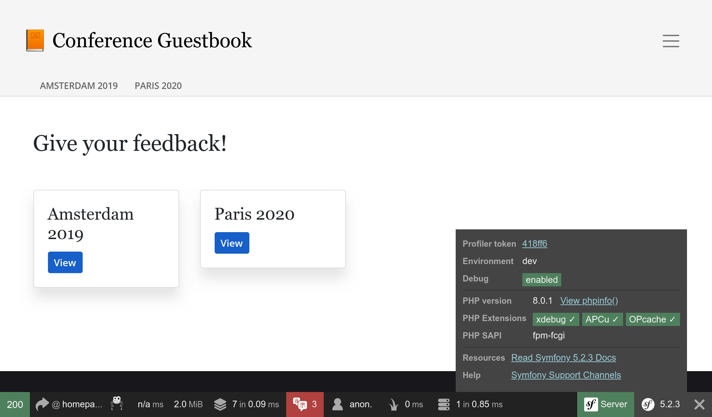

Изучение внутренностей Symfony
===================================================

.. index::
    single: Blackfire
    single: Debugging
    single: Internals

Мы уже достаточно долгое время используем Symfony и разработали внушительное приложение, при этом большая часть выполняемого кода является самим Symfony. Несколько сотен строк  нашего кода и тысячи фреймворка.

Мне нравится узнавать, как всё работает изнутри. Я всегда был очарован инструментами, помогающими мне докопаться до сути. Первый раз, когда я использовал пошаговый отладчик или когда открыл для себя ``ptrace`` — это волшебные воспоминания.

Хотите лучше понять, как работает Symfony? Тогда самое время разобраться, что происходит под капотом вашего приложения. Вместо объяснения довольно скучной обработки HTTP-запроса с теоретической точки зрения, мы будем использовать Blackfire, чтобы наглядно посмотреть как всё работает, а также познакомиться с продвинутыми темами.

Разбираемся во внутренностях Symfony и Blackfire
---------------------------------------------------------------------------

Вы уже знаете, что все HTTP-запросы обрабатываются в одной точке входа — в файле ``public/index.php``. Но что происходит потом? Как вызываются контроллеры?

Давайте спрофилируем английскую главную страницу на продакшене с помощью браузерного расширения Blackfire:

.. code-block:: bash
    :class: ignore

    $ symfony remote:open

Или непосредственно через командную строку:

.. code-block:: bash
    :class: ignore

    $ blackfire curl `symfony env:urls --first`en/

Откройте вкладку "Timeline" в профилировщике и вы увидите что-то похожее на это:

.. figure:: images/blackfire-homepage-prod.png
    :alt: /
    :align: center
    :figclass: with-browser

Наведите курсор на цветные полосы, расположенные на временной шкале, чтобы получить больше информации о каждом вызове; вы узнаете много нового о том, как работает Symfony:

* Основной точкой входа является файл ``public/index.php``;

* Метод ``Kernel::handle()`` обрабатывает запрос;

* Он вызывает ``HttpKernel``, который отправляет несколько событий;

* Первым создаётся событие ``RequestEvent``;

* Вызывается метод ``ControllerResolver::getController()`` для определения, какой контроллер должен обрабатывать входящий URL-адрес;

* Вызывается метод ``ControllerResolver::getArguments()`` для определения того, какие аргументы нужно передать контроллеру (для этого используется преобразователь параметров);

* Вызывается метод ``ConferenceController::index()`` и большая часть нашего кода выполняется этим вызовом;

* Метод ``ConferenceRepository::findAll()`` получает все конференции из базы данных (обратите внимание на соединение с базой данных с помощью ``PDO::__construct()``);

* Метод ``Twig\Environment::render()`` отображает шаблон;

* Довольно быстро выполнились ``ResponseEvent`` и ``FinishRequestEvent``, но, видимо, из-за того, что нет обработчиков этих событий.

Временная шкала — отличный способ понять, как работает код; она крайне полезна в случае унаследованного проекта, разработанного кем-то другим.

Теперь профилируйте ту же страницу с локального компьютера в окружении разработки:

.. code-block:: bash
    :class: ignore

    $ blackfire curl `symfony var:export SYMFONY_PROJECT_DEFAULT_ROUTE_URL`en/

Откройте профилировщик. Вас перенаправит на граф вызовов, так как запрос очень быстро выполнился, то и временная шкала будет совершенно пустой:

.. figure:: images/blackfire-homepage-cached-dev.png
    :alt: /
    :align: center
    :figclass: with-browser

Вы понимаете, что происходит сейчас? У нас включено HTTP-кеширование, поэтому мы профилируем кеширующий слой Symfony HTTP. А так как страница закеширована, вызов ``HttpCache\Store::restoreResponse()`` получает HTTP-ответ из кеша, следовательно контроллер никогда не будет вызван.

Отключите кеширующий слой в ``public/index.php``, как мы делали это в предыдущем шаге, и попробуйте снова профилировать код. Вы сразу увидите, что результат будет совершенно другим:

.. figure:: images/blackfire-homepage-dev.png
    :alt: /
    :align: center
    :figclass: with-browser

Основные различия заключаются в следующем:

* Обработка события ``TerminateEvent``, которая не была видна в продакшене, выполняется довольно много времени; При внимательном рассмотрении, вы увидите, что это событие отвечает за хранение данных профилировщика Symfony, собранных во время запроса;

* Под вызовом ``ConferenceController::index()`` обратите внимание на метод ``SubRequestHandler::handle()``, который отображает ESI (поэтому у нас два вызова ``Profiler::saveProfile()``: один для основного запроса, второй — для ESI).

Изучите временную шкалу, чтобы узнать больше о выполненном коде. Затем переключитесь на граф вызовов для получения другого представления данных.

Как мы только что выяснили, код, выполняемый при разработке и в продакшене, совершенно разный. В окружении разработки код работает медленнее, так как профилировщик Symfony пытается собрать больше данных, чтобы облегчить отладку. Поэтому профилировать код нужно всегда в продакшен-окружении, даже локально.

Проведите несколько интересных экспериментов: профилируйте страницу с ошибкой, страницу с путем``/`` (которая является редиректом) или ресурс API. Каждое профилирование расскажет вам немного больше о том, как работает Symfony, какой класс или метод вызывается, что работает долго, а что — быстро.

Использование отладчика Blackfire Debug Addon
-------------------------------------------------------------------

.. index::
    single: Blackfire;Debug Addon

По умолчанию Blackfire удаляет вызовы незначительных методов, чтобы не создавать лишней нагрузки и больших графиков. При использовании Blackfire в качестве инструмента отладки лучше сохранять все вызовы. Для этого воспользуйтесь дополнением отладки.

В командной строке используйте флаг ``--debug``:

.. code-block:: bash
    :class: ignore

    $ blackfire --debug curl `symfony var:export SYMFONY_PROJECT_DEFAULT_ROUTE_URL`en/
    $ blackfire --debug curl `symfony env:urls --first`en/

.. index::
    single: .env.local.prod

В продакшене вы увидите, например, загрузку файла ``.env.local.php``:

.. figure:: images/blackfire-env-local-prod.png
    :alt: /
    :align: center
    :figclass: with-browser

.. index::
    single: Composer;Optimizations
    single: Composer;Autoloader
    single: Autoloader

Откуда он взялся? SymfonyCloud выполняет оптимизацию при развёртывании приложения Symfony, например, оптимизирует автозагрузчик Composer (``--optimize-autoloader --apcu-autoloader --classmap-authoritative``). Также, чтобы не парсить файл ``.env`` с переменными окружения при каждом запросе, сгенерируем файл ``.env.local.php``:

.. code-block:: bash
    :class: ignore

    $ symfony run composer dump-env prod

Blackfire — очень производительный инструмент, который помогает понять, как выполняется PHP-код. Улучшение производительности — это только один из способов использования профилировщика.

Пошаговая отладка с Xdebug
-------------------------------------------

.. index::
    single: Xdebug
    single: Debugger

Временные шкалы и графики вызова Blackfire показывают разработчикам, какие файлы, функции, методы использовались PHP-движком, тем самым позволяя лучше понять код проекта.

Альтернативой отслеживания выполняемого кода является **пошаговый отладчик**, например, `Xdebug <https://xdebug.org>`_. Пошаговый отладчик помогает интерактивно анализировать процесс выполнения программы и структуры данных, проходя через PHP-код проекта. Это очень полезный способ поиска и исправления непредсказуемой работы приложения, заменяющий стандартную технику отладку через вывод переменных на экран при помощи "var_dump()/exit()".

Сначала установите PHP-модуль ``xdebug``. После чего проверьте правильность установки, выполнив команду ниже:

.. code-block:: bash

    $ symfony php -v

В выводе команды должны быть сведения об установленном Xdebug:

.. code-block:: text
    :emphasize-lines: 5
    :class: ignore

    PHP 8.0.1 (cli) (built: Jan 13 2021 08:22:35) ( NTS )
    Copyright (c) The PHP Group
    Zend Engine v4.0.1, Copyright (c) Zend Technologies
        with Zend OPcache v8.0.1, Copyright (c), by Zend Technologies
        with Xdebug v3.0.2, Copyright (c) 2002-2021, by Derick Rethans
        with blackfire v1.49.0~linux-x64-non_zts80, https://blackfire.io, by Blackfire

Кроме этого, вы также можете проверить, что Xdebug настроен для работы с PHP-FPM, если откроете приложение, наведёте курсор мыши на логотип Symfony в панели отладки и перейдёте по ссылке "View phpinfo()":

Теперь включите режим отладки (``debug``) в Xdebug:

.. code-block:: ini
    :caption: php.ini
    :class: ignore

    [xdebug]
    xdebug.mode=debug
    xdebug.start_with_request=yes

По умолчанию Xdebug отправляет данные на порт 9003 локального сервера.

Xdebug можно запустить различными способами, но наиболее простой из них — воспользоваться средствами вашей IDE. В этой главе настройка Xdebug будет рассматриваться на примере использования редактора Visual Studio Code. Нам потребуется установить расширение `PHP Debug <https://marketplace.visualstudio.com/items?itemName=felixfbecker.php-debug>`_, для этого запустите "Quick Open" (``Ctrl+P``), вставьте следующую команду и нажмите Enter:

.. code-block:: text
    :class: ignore

    ext install felixfbecker.php-debug

Создайте следующий файл конфигурации:

.. code-block:: json
    :caption: .vscode/launch.json
    :emphasize-lines: 8,16
    :class: ignore

    {
        "version": "0.2.0",
        "configurations": [
            {
                "name": "Listen for XDebug",
                "type": "php",
                "request": "launch",
                "port": 9003
            },
            {
                "name": "Launch currently open script",
                "type": "php",
                "request": "launch",
                "program": "${file}",
                "cwd": "${fileDirname}",
                "port": 9003
            }
        ]
    }

С открытой директорией проекта в Visual Studio Code перейдите в отладчик и нажмите зелёную кнопку запуска с надписью "Listen for Xdebug":

.. figure:: images/vs-xdebug-run.png
    :align: center

Если вы сейчас обновите страницу с приложением в браузере, то автоматически откроется IDE, это означает, что сеанс отладки запущен. По умолчанию всё является точкой останова, поэтому выполнение кода остановится на первой инструкции. Теперь можно посмотреть значение переменных, пройтись по всем этапам выполнения кода, перейти в конкретную функцию и т.д.

При отладке вы можете снять галочку напротив точки останова "Everything" и добавить только нужные точки останова в коде.

Если вы плохо знакомы с пошаговыми отладчиками, ознакомьтесь с `отличным руководством для Visual Studio Code <https://code.visualstudio.com/Docs/editor/debugging>`_, в котором всё наглядно объясняется.

.. sidebar:: Двигаемся дальше

    * `Документация пошаговой отладки Xdebug <https://xdebug.org/docs/step_debug>`_;

    * `Отладка с помощью Visual Studio Code <https://code.visualstudio.com/Docs/editor/debugging>`_.
