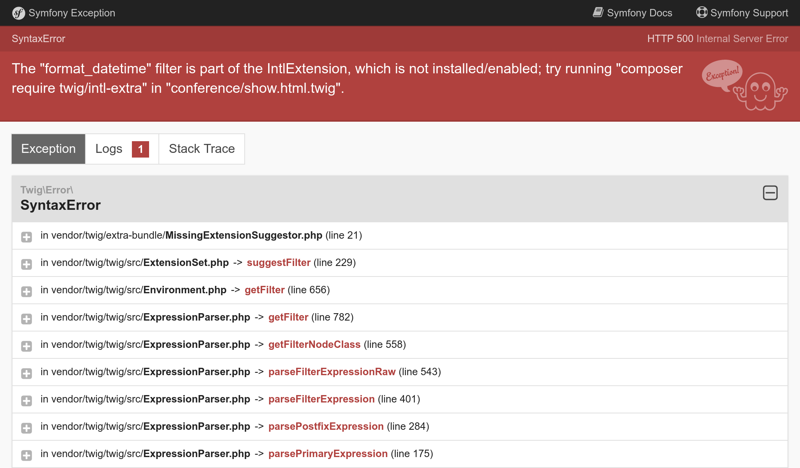
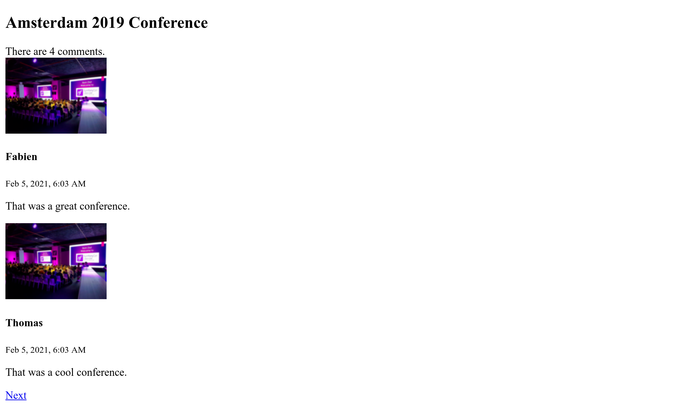

Створення інтерфейсу користувача
==============================================================

.. index::
    single: Twig
    single: Templates

Тепер все готово для створення першої версії інтерфейсу користувача веб-сайту. Ми не будемо робити його красивим. Для початку, зробимо його функціональним.

Пам’ятаєте як нам довелося екранувати рядок у контролері, щоб уникнути проблем з безпекою, коли ми робили пасхалку? Ми не будемо використовувати PHP для наших шаблонів з цієї ж причини. Замість цього будемо використовувати Twig. Окрім безпечної обробки даних, `Twig`_ надає ще багато корисних можливостей, які ми будемо використовувати (наприклад, наслідування шаблонів).

Встановлення Twig
-----------------------------

Нам не потрібно додавати Twig як залежність, оскільки він уже встановлений як *транзитивна залежність* EasyAdmin. Але що робити, якщо згодом ви вирішите перейти на інший бандл панелі керування? Наприклад, той, що використовує API та React на фронт-енді. Ймовірно, він не залежатиме від Twig, і тому Twig автоматично видалиться, коли ви видалите EasyAdmin.

Для певності вкажімо Composer, що проект дійсно залежить від Twig, незалежно від EasyAdmin. Буде достатньо додати його, як і будь-яку іншу залежність:

.. code-block:: bash

    $ symfony composer req twig

Тепер Twig є частиною основних залежностей проекту в ``composer.json``:

.. code-block:: diff
    :class: ignore

    --- a/composer.json
    +++ b/composer.json
    @@ -14,6 +14,7 @@
             "symfony/framework-bundle": "4.4.*",
             "symfony/maker-bundle": "^1.0@dev",
             "symfony/orm-pack": "dev-master",
    +        "symfony/twig-pack": "^1.0",
             "symfony/yaml": "4.4.*"
         },
         "require-dev": {

Використання Twig для шаблонів
-----------------------------------------------------

.. index::
    single: Twig;Layout
    single: Twig;block

Усі сторінки на веб-сайті матимуть однаковий *макет*. Під час встановлення Twig автоматично створюється каталог ``templates/``, а також зразок макета ``base.html.twig``.

.. code-block:: twig
    :caption: templates/base.html.twig
    :class: ignore

    <!DOCTYPE html>
    <html>
        <head>
            <meta charset="UTF-8">
            <title>Welcome!</title>
            
        </head>
        <body>
            
            
        </body>
    </html>

У макеті можуть бути визначені спеціальні елементи  ``block``, які є місцями, де *дочірні шаблони*, які *наслідують* макет, додають власний вміст.

.. index::
    single: Twig;extends
    single: Twig;for

Створімо шаблон для головної сторінки проекту у файлі ``templates/conference/index.html.twig``:

.. code-block:: twig
    :caption: templates/conference/index.html.twig

    

    Conference Guestbook

    
        <h2>Give your feedback!</h2>

        
            <h4>{{ conference }}</h4>
        
    

Шаблон *наслідує* ``base.html.twig`` і перевизначає блоки ``title`` та ``body``.

.. index::
    single: Twig;Syntax

Позначення ```` у шаблоні вказує на *дії * та *структуру*.

Позначення ``{{ }}`` використовується для *відображення* чого-небудь. ``{{ conference }}`` відображає рядкове представлення конференції (результат виклику ``__toString`` для об'єкта ``Conference``).

Використання Twig у контролері
-----------------------------------------------------

Оновіть контролер, щоб відмалювати шаблон Twig:

.. code-block:: diff
    :caption: patch_file

    --- a/src/Controller/ConferenceController.php
    +++ b/src/Controller/ConferenceController.php
    @@ -2,22 +2,19 @@

     namespace App\Controller;

    +use App\Repository\ConferenceRepository;
     use Symfony\Bundle\FrameworkBundle\Controller\AbstractController;
     use Symfony\Component\HttpFoundation\Response;
     use Symfony\Component\Routing\Annotation\Route;
    +use Twig\Environment;

     class ConferenceController extends AbstractController
     {
         #[Route('/', name: 'homepage')]
    -    public function index(): Response
    +    public function index(Environment $twig, ConferenceRepository $conferenceRepository): Response
         {
    -        return new Response(<<<EOF
    -<html>
    -    <body>
    -        
    -    </body>
    -</html>
    -EOF
    -        );
    +        return new Response($twig->render('conference/index.html.twig', [
    +            'conferences' => $conferenceRepository->findAll(),
    +        ]));
         }
     }

Тут багато чого відбувається.

Щоб відмалювати шаблон, нам потрібен об’єкт Twig — ``Environment`` (головна точка входу Twig). Зверніть увагу, щоб отримати екземпляр Twig, достатньо вказати його тип в аргументах методу контролера. Symfony достатньо розумний і знає як автоматично впровадити залежність потрібного типу.

Нам також потрібен репозиторій конференцій, щоб отримати всі конференції з бази даних.

У коді контролера метод ``render()`` відмальовує шаблон і передає йому масив змінних. Ми передаємо список об'єктів ``Conference`` у  якості змінної ``conferences``.

Контролер — це звичайний клас PHP. Нам навіть не потрібно наслідувати клас ``AbstractController``, якщо ми хочемо мати найбільш явний контроль залежностей. Ви можете видалити його (але не робіть цього, оскільки ми будемо використовувати деякі його методи, на наступних кроках).

Створення сторінки для конференції
-----------------------------------------------------------------

Кожна конференція має мати власну сторінку з коментарями. Додавання нової сторінки — це додавання контролера, визначення маршруту для нього і створення відповідного шаблону.

Додайте метод ``show()`` у ``src/Controller/ConferenceController.php``:

.. code-block:: diff
    :caption: patch_file

    --- a/src/Controller/ConferenceController.php
    +++ b/src/Controller/ConferenceController.php
    @@ -2,6 +2,8 @@

     namespace App\Controller;

    +use App\Entity\Conference;
    +use App\Repository\CommentRepository;
     use App\Repository\ConferenceRepository;
     use Symfony\Bundle\FrameworkBundle\Controller\AbstractController;
     use Symfony\Component\HttpFoundation\Response;
    @@ -17,4 +19,13 @@ class ConferenceController extends AbstractController
                 'conferences' => $conferenceRepository->findAll(),
             ]));
         }
    +
    +    #[Route('/conference/{id}', name: 'conference')]
    +    public function show(Environment $twig, Conference $conference, CommentRepository $commentRepository): Response
    +    {
    +        return new Response($twig->render('conference/show.html.twig', [
    +            'conference' => $conference,
    +            'comments' => $commentRepository->findBy(['conference' => $conference], ['createdAt' => 'DESC']),
    +        ]));
    +    }
     }

Цей метод має особливу поведінку, яку ми ще не бачили. Ми вказуємо, що екземпляр ``Conference`` має бути впроваджений у метод. Проте, в базі даних може бути багато об'єктів. Symfony може визначити, який саме вам потрібен, ґрунтуючись на ``{id}``, переданому в рядку запиту (``id`` є первинним ключем таблиці ``conference`` в базі даних).

Отримати коментарі, що стосуються конференції, можна за допомогою методу ``findBy()``, який приймає критерії у якості першого аргументу.

.. index::
    single: Twig;extends
    single: Twig;block
    single: Twig;for
    single: Twig;if
    single: Twig;else
    single: Twig;asset
    single: Twig;format_datetime
    single: Twig;length

Останнім кроком є створення файлу ``templates/conference/show.html.twig``:

.. code-block:: twig
    :caption: templates/conference/show.html.twig

    

    Conference Guestbook - {{ conference }}

    
        <h2>{{ conference }} Conference</h2>

        
            
                
                    
                

                <h4>{{ comment.author }}</h4>
                <small>
                    {{ comment.createdAt|format_datetime('medium', 'short') }}
                </small>

                
{{ comment.text }}

            
        
            
No comments have been posted yet for this conference.

        
    

У цьому шаблоні ми використовуємо позначення ``|``, щоб викликати *фільтри* Twig. Фільтр перетворює значення. Наприклад, ``comments|length`` повертає кількість коментарів, а ``comment.createdAt|format_datetime('medium', 'short')`` форматує дату в читабельне представлення.

Спробуйте відкрити сторінку "першої" конференції за шляхом ``/conference/1`` ​​і зверніть увагу на наступну помилку:

Причиною помилки є використання фільтра ``format_datetime``, оскільки він не є частиною ядра Twig. Повідомлення про помилку дає вам підказку про те, який пакет слід встановити, щоб усунути проблему:

.. code-block:: bash

    $ symfony composer req "twig/intl-extra:^3"

Тепер сторінка працює належним чином.

Перелінкування сторінок
---------------------------------------------

.. index::
    single: Twig;Link
    single: Link

Останнім кроком до завершення першої версії користувацького інтерфейсу є створення посилань на конференції з головної сторінки:

.. code-block:: diff
    :caption: patch_file

    --- a/templates/conference/index.html.twig
    +++ b/templates/conference/index.html.twig
    @@ -7,5 +7,8 @@

         
             <h4>{{ conference }}</h4>
    +        

    +            <a href="/conference/{{ conference.id }}">View</a>
    +        

         
     

Але жорстке визначення шляху є поганою ідеєю з кількох причин. Найважливіша з них полягає в тому, що якщо ви зміните шлях (наприклад, з ``/conference/{id}`` на ``/conferences/{id}``), всі посилання доведеться змінювати вручну.

.. index::
    single: Twig;path

Замість цього використовуйте *функцію* Twig ``path()`` і  *ім'я маршруту*:

.. code-block:: diff
    :caption: patch_file

    --- a/templates/conference/index.html.twig
    +++ b/templates/conference/index.html.twig
    @@ -8,7 +8,7 @@
         
             <h4>{{ conference }}</h4>
             

    -            <a href="/conference/{{ conference.id }}">View</a>
    +            <a href="{{ path('conference', { id: conference.id }) }}">View</a>
             

         
     

Функція ``path()`` генерує шлях до сторінки, використовуючи ім'я її маршруту. Значення параметрів маршруту передаються у вигляді об'єкта Twig.

Пагінація коментарів
---------------------------------------

.. index::
    single: Doctrine;Paginator
    single: Paginator

З тисячами відвідувачів ми можемо очікувати досить багато коментарів. Якщо ми будемо відображати їх на одній сторінці, вона буде дуже швидко рости.

Створіть метод ``getCommentPaginator()`` у репозиторії коментарів, який повертає *пагінатор* коментарів на основі конференції й зміщення (відносно початку):

.. code-block:: diff
    :caption: patch_file

    --- a/src/Repository/CommentRepository.php
    +++ b/src/Repository/CommentRepository.php
    @@ -3,8 +3,10 @@
     namespace App\Repository;

     use App\Entity\Comment;
    +use App\Entity\Conference;
     use Doctrine\Bundle\DoctrineBundle\Repository\ServiceEntityRepository;
     use Doctrine\Persistence\ManagerRegistry;
    +use Doctrine\ORM\Tools\Pagination\Paginator;

     /**
      * @method Comment|null find($id, $lockMode = null, $lockVersion = null)
    @@ -14,11 +16,27 @@ use Doctrine\Persistence\ManagerRegistry;
      */
     class CommentRepository extends ServiceEntityRepository
     {
    +    public const PAGINATOR_PER_PAGE = 2;
    +
         public function __construct(ManagerRegistry $registry)
         {
             parent::__construct($registry, Comment::class);
         }

    +    public function getCommentPaginator(Conference $conference, int $offset): Paginator
    +    {
    +        $query = $this->createQueryBuilder('c')
    +            ->andWhere('c.conference = :conference')
    +            ->setParameter('conference', $conference)
    +            ->orderBy('c.createdAt', 'DESC')
    +            ->setMaxResults(self::PAGINATOR_PER_PAGE)
    +            ->setFirstResult($offset)
    +            ->getQuery()
    +        ;
    +
    +        return new Paginator($query);
    +    }
    +
         // /**
         //  * @return Comment[] Returns an array of Comment objects
         //  */

Ми встановили максимальну кількість коментарів на сторінці рівним 2, щоб полегшити тестування.

Щоб керувати пагінацією в шаблоні, передайте пагінатор Doctrine замість колекції Doctrine в Twig:

.. code-block:: diff
    :caption: patch_file

    --- a/src/Controller/ConferenceController.php
    +++ b/src/Controller/ConferenceController.php
    @@ -6,6 +6,7 @@ use App\Entity\Conference;
     use App\Repository\CommentRepository;
     use App\Repository\ConferenceRepository;
     use Symfony\Bundle\FrameworkBundle\Controller\AbstractController;
    +use Symfony\Component\HttpFoundation\Request;
     use Symfony\Component\HttpFoundation\Response;
     use Symfony\Component\Routing\Annotation\Route;
     use Twig\Environment;
    @@ -21,11 +22,16 @@ class ConferenceController extends AbstractController
         }

         #[Route('/conference/{id}', name: 'conference')]
    -    public function show(Environment $twig, Conference $conference, CommentRepository $commentRepository): Response
    +    public function show(Request $request, Environment $twig, Conference $conference, CommentRepository $commentRepository): Response
         {
    +        $offset = max(0, $request->query->getInt('offset', 0));
    +        $paginator = $commentRepository->getCommentPaginator($conference, $offset);
    +
             return new Response($twig->render('conference/show.html.twig', [
                 'conference' => $conference,
    -            'comments' => $commentRepository->findBy(['conference' => $conference], ['createdAt' => 'DESC']),
    +            'comments' => $paginator,
    +            'previous' => $offset - CommentRepository::PAGINATOR_PER_PAGE,
    +            'next' => min(count($paginator), $offset + CommentRepository::PAGINATOR_PER_PAGE),
             ]));
         }
     }

Контролер отримує ``offset`` з рядка запиту (``$request->query``) у вигляді цілого числа (``getInt()``), за замовчуванням рівного 0, якщо значення відсутнє.

Зміщення ``previous`` і ``next`` обчислюються на основі всієї інформації, яку ми отримали з пагінатора.

.. index::
    single: Twig;if

Нарешті, оновіть шаблон, щоб додати посилання на наступну та попередню сторінки:

.. code-block:: diff
    :caption: patch_file

    --- a/templates/conference/show.html.twig
    +++ b/templates/conference/show.html.twig
    @@ -6,6 +6,8 @@
         <h2>{{ conference }} Conference</h2>

         
    +        
There are {{ comments|length }} comments.

    +
             
                 
                     
    @@ -18,6 +20,13 @@

                 
{{ comment.text }}

             
    +
    +        
    +            <a href="{{ path('conference', { id: conference.id, offset: previous }) }}">Previous</a>
    +        
    +        
    +            <a href="{{ path('conference', { id: conference.id, offset: next }) }}">Next</a>
    +        
         
             
No comments have been posted yet for this conference.

         

Тепер ви зможете переміщуватися по коментарях через посилання  "Previous" та "Next":

.. figure:: screenshots/pagination-previous.png
    :alt: /conference/1?offset=2
    :align: center
    :figclass: with-browser

Рефакторинг контролера
-------------------------------------------

Можливо ви помітили, що обидва методи в ``ConferenceController`` отримують середовище Twig у якості аргументу. Замість того, щоб додавати його в кожен метод, використовуймо можливості конструктора (що робить список аргументів коротшим і менш громіздким):

.. code-block:: diff
    :caption: patch_file

    --- a/src/Controller/ConferenceController.php
    +++ b/src/Controller/ConferenceController.php
    @@ -13,21 +13,28 @@ use Twig\Environment;

     class ConferenceController extends AbstractController
     {
    +    private $twig;
    +
    +    public function __construct(Environment $twig)
    +    {
    +        $this->twig = $twig;
    +    }
    +
         #[Route('/', name: 'homepage')]
    -    public function index(Environment $twig, ConferenceRepository $conferenceRepository): Response
    +    public function index(ConferenceRepository $conferenceRepository): Response
         {
    -        return new Response($twig->render('conference/index.html.twig', [
    +        return new Response($this->twig->render('conference/index.html.twig', [
                 'conferences' => $conferenceRepository->findAll(),
             ]));
         }

         #[Route('/conference/{id}', name: 'conference')]
    -    public function show(Request $request, Environment $twig, Conference $conference, CommentRepository $commentRepository): Response
    +    public function show(Request $request, Conference $conference, CommentRepository $commentRepository): Response
         {
             $offset = max(0, $request->query->getInt('offset', 0));
             $paginator = $commentRepository->getCommentPaginator($conference, $offset);

    -        return new Response($twig->render('conference/show.html.twig', [
    +        return new Response($this->twig->render('conference/show.html.twig', [
                 'conference' => $conference,
                 'comments' => $paginator,
                 'previous' => $offset - CommentRepository::PAGINATOR_PER_PAGE,

.. sidebar:: Йдемо далі

    * `Документація по Twig <https://twig.symfony.com/doc/2.x/>`_;

    * `Створення та використання шаблонів <https://symfony.com/doc/current/templates.html>`_ у застосунках Symfony;

    * `Навчальний посібник SymfonyCasts: Twig <https://symfonycasts.com/screencast/symfony/twig-recipe>`_;

    * `Функції та фільтри Twig, які доступні лише в Symfony <https://symfony.com/doc/current/reference/twig_reference.html>`_;

    * `Базовий контролер AbstractController <https://symfony.com/doc/current/controller.html#the-base-controller-classes-services>`_.

.. _`Twig`: https://twig.symfony.com/
