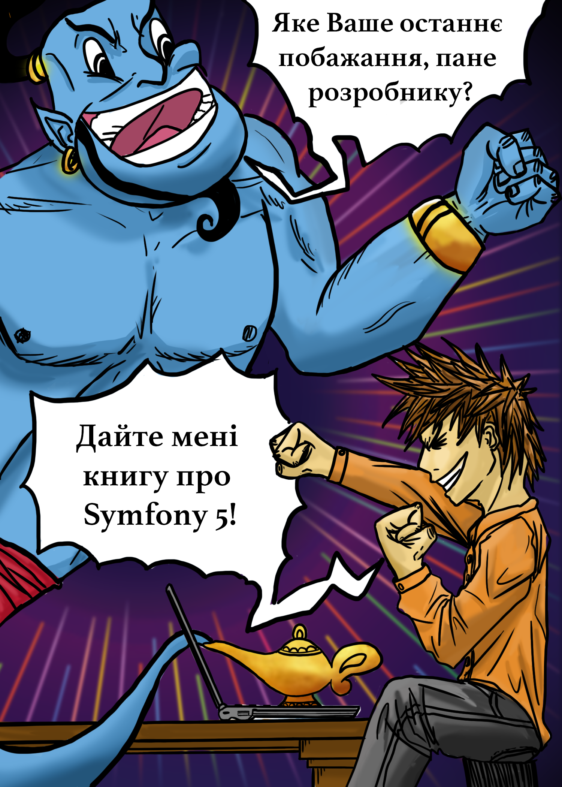

Подяки
============

.. index::
    Подяки

Я обожнюю книги. Книги, які я можу тримати в руках.

Востаннє я писав книгу про Symfony рівно 10 років тому. Вона була про версію 1.4. Відтоді я більше ніколи не писав про Symfony!

Мені було так приємно знову писати про Symfony, що я завершив першу чернетку вже за тиждень. Але версія, яку ви читаєте, зайняла набагато більше часу. Написання книги забирає багато часу й енергії. Від дизайну обкладинки до макета сторінки. Від налаштування коду до рецензій колег. Це майже ніколи не закінчується. Ви завжди можете поліпшити розділ, вдосконалити певний фрагмент коду, виправити друкарські помилки чи переписати пояснення, щоб зробити його коротшим і кращим.

Написання книги — це мандрівка, яку не хочеться здійснювати самостійно. Багато людей зробили свій внесок прямо чи опосередковано. Дякую вам всім!

Я щиро хочу подякувати всім прекрасним людям, які витратили багато часу на рецензію контенту, щоб знайти друкарські помилки й поліпшити зміст; деякі навіть допомогли мені написати певні фрагменти коду:

* Javier Eguiluz
* Ryan Weaver
* Titouan Galopin
* Nicolas Grekas
* Kévin Dunglas
* Tugdual Saunier
* Grégoire Pineau
* Alexandre Salomé

Перекладачі
----------------------

Офіційна документація Symfony доступна виключно англійською мовою. Ми практикували переклад у минулому, але вирішили це припинити, оскільки він постійно був застарілим. А застаріла документація, ймовірно, гірше, за її відсутність.

Основна проблема з перекладами — це технічне обслуговування. Документація Symfony оновлюється щоденно десятками авторів. Мати команду волонтерів, яка перекладатиме всі зміни майже в реальному часі, практично неможливо.

Однак переклад книги на зразок тієї, яку ви зараз читаєте, є більш керованим, оскільки я намагався писати про функції, які з часом не сильно зміняться. Ось чому вміст книги має залишатися досить сталим протягом довгого часу.

Але навіщо нам взагалі потрібна документація не англійською мовою в технологічному світі, де англійська є де-факто мовою за замовчуванням? Symfony використовується розробниками у всьому світі. І деяким із них менш зручно читати матеріал англійською. Переклад деякої документації "getting started" є частиною ініціативи різноманітності Symfony, у рамках якої ми прагнемо знайти способи зробити Symfony якомога інклюзивнішим.

Як ви можете собі уявити, переклад понад 300 сторінок —  це величезний обсяг роботи, і я хочу подякувати всім людям, які допомогли перекласти цю книгу:

* Oleh Sydorenko
* Oleh Vehera
* Boryslav Kosun
* Anton Karpov
* Olena Kirichok
* Serhii Kholodniuk
* Oleksii Didenko
* Vasyl Kydyba
* Ivan Shcherbak

Корпоративні спонсори
-----------------------------------------

.. index::
    Backers;Companies

Цю книгу `підтримали <https://www.kickstarter.com/projects/fabpot/symfony-5-the-fast-track>`_ люди з усього світу, надавши фінансову підтримку цьому проекту. Завдяки їм цей контент доступний безкоштовно онлайн, а також у вигляді паперової книги, під час конференцій Symfony.

.. figure:: images/logos/packagist.svg
    :align: center
    :figclass: backer

    https://packagist.com/

*
    .. figure:: images/logos/darkmira.svg
        :align: center
        :figclass: backer

        https://darkmira.io/

*
    .. figure:: images/logos/basecom.svg
        :align: center
        :figclass: backer

        https://basecom.de/

*
    .. figure:: images/logos/sensiolabs.svg
        :align: center
        :figclass: backer

        https://sensiolabs.com/

*
    .. figure:: images/logos/redant.svg
        :align: center
        :figclass: backer

        https://redant.nl/

*
    .. figure:: images/logos/facile.svg
        :align: center
        :figclass: backer

        https://www.facile.it/

*
    .. figure:: images/logos/musement.svg
        :align: center
        :figclass: backer

        https://www.musement.com/

*
    .. figure:: images/logos/blackfire.svg
        :align: center
        :figclass: backer

        https://blackfire.io/

*
    .. figure:: images/logos/datsteam.svg
        :align: center
        :figclass: backer

        https://dats.team/

*
    .. figure:: images/logos/tilleuls.svg
        :align: center
        :figclass: backer

        https://les-tilleuls.coop/

*
    .. figure:: images/logos/akeneo.svg
        :align: center
        :figclass: backer

        https://www.akeneo.com/

*
    .. figure:: images/logos/izi.svg
        :align: center
        :figclass: backer

        https://izi-by-edf.fr/

*
    .. figure:: images/logos/setono.svg
        :align: center
        :figclass: backer

        https://setono.com/

Окремі спонсори
-----------------------------

.. index::
    Backers;Individuals

=========================== =
             Javier Eguiluz github%%javiereguiluz
            Tugdual Saunier github%%tucksaun
           Alexandre Salomé link%%https://alexandre.salome.fr
                  Timo Bakx twitter%%TimoBakx
         Arkadius Stefanski link%%https://ar.kadi.us
                Oskar Stark github%%OskarStark
                     slaubi 
               Jérémy Romey twitter%%jeremyFreeAgent
            Nicolas Scolari 
Guys & Gals at SymfonyCasts link%%https://symfonycasts.com
            Roberto santana twitter%%robertosanval
             Ismael Ambrosi twitter%%iambrosi
           Mathias STRASSER link%%https://roukmoute.github.io/
           Platform.sh team link%%http://www.platform.sh
                    ongoing link%%https://www.ongoing.ch
          Magnus Nordlander github%%magnusnordlander
            Nicolas Séverin github%%nico-incubiq
                   Centarro link%%https://www.centarro.io
                Lior Chamla link%%https://learn.web-develop.me
                Art Hundiak github%%ahundiak
           Manuel de Ruiter link%%https://www.optiwise.nl/
               Vincent Huck 
              Jérôme Nadaud link%%https://nadaud.io
             Michael Piecko github%%mpiecko
           Tobias Schilling link%%https://tschilling.dev
                      ACSEO link%%https://www.acseo.fr
      Omines Internetbureau link%%https://www.omines.nl/
               Seamus Byrne link%%http://seamusbyrne.com
              Pavel Dubinin github%%geekdevs
       Jean-Jacques PERUZZI link%%https://linkedin.com/in/jjperuzzi
           Alexandre Jardin github%%ajardin
           Christian Ducrot link%%http://ducrot.de
             Alexandre HUON github%%Aleksanthaar
          François Pluchino github%%francoispluchino
            We Are Builders link%%https://we.are.builders
                     Rector github%%rectorphp
             Ilyas Salikhov twitter%%salikhov
             Romaric Drigon twitter%%romaricdrigon
              Lukáš Moravec github%%morki
          Malik Meyer-Heder github%%mehlichmeyer
             Amrouche Hamza twitter%%cDaed
              Russell Flynn link%%https://custard.no
            Shrihari Pandit twitter%%shriharipandit
                  Salma NK. twitter%%os_rescue
             Nicolas Grekas 
              Roman Ihoshyn link%%https://ihoshyn.com
                Radu Topala link%%https://www.trisoft.ro
            Andrey Reinwald link%%https://www.facebook.com/andreinwald
                   JoliCode github%%JoliCode
           Rokas Mikalkėnas 
               Zeljko Mitic github%%strictify
             Wojciech Kania github%%wkania
           Andrea Cristaudo link%%https://andrea.cristaudo.eu/
       Adrien BRAULT-LESAGE github%%AdrienBrault
  Cristoforo Stevio Cervino link%%http://www.steviostudio.it
           Michele Sangalli 
             Florian Reiner link%%http://florianreiner.com
                  Ion Bazan github%%IonBazan
              Marisa Clardy twitter%%MarisaCodes
          Donatas Lomsargis link%%http://donatas.dev
             Johnny Lattouf twitter%%johnnylattouf
            Duilio Palacios link%%https://styde.net
             Pierre Grimaud github%%pgrimaud
          Marcos Labad Díaz twitter%%esmiz
              Stephan Huber link%%https://www.factorial.io
                Loïc Vernet link%%https://www.strangebuzz.com
               Daniel Knoch link%%http://www.cariba.de
                     Emagma link%%http://www.emagma.fr
                Gilles Doge 
               Malte Wunsch github%%MalteWunsch
   Jose Maria Valera Reales github%%Chemaclass
                  Cleverway link%%https://cleverway.eu/
                     Nathan github%%nutama
       Abdellah EL GHAILANI link%%https://connect.symfony.com/profile/aelghailani
                 Solucionex link%%https://www.solucionex.com
               Elnéris Dang link%%https://linkedin.com/in/elneris-dang/
              Class Central link%%https://www.classcentral.com/
                  Ike Borup link%%https://idaho.dev/
             Christoph Lühr link%%https://www.christoph-luehr.com/
            Zig Websoftware link%%http://www.zig.nl
                Dénes Fakan twitter%%DenesFakan
           Danny van Kooten link%%http://dvk.co
               Denis Azarov link%%http://azarov.de
          Martin Poirier T. link%%https://linkedin.com/in/mpoiriert/
          Dmytro Feshchenko github%%dmytrof
               Carl Casbolt link%%https://www.platinumtechsolutions.co.uk/
                    Irontec link%%https://www.irontec.com
              Lukas Plümper link%%https://lukaspluemper.de/
                  Neil Nand link%%https://neilnand.co.uk
             Andreas Möller link%%https://localheinz.com
              Alexey Buldyk link%%https://buldyk.pw
              Page Carbajal link%%https://pagecarbajal.com
               Florian Voit link%%https://rootsh3ll.de
            Webmozarts GmbH link%%https://webmozarts.com
         Alexander M. Turek github%%derrabus
                Zan Baldwin twitter%%ZanBaldwin
         Ben Marks, Magento link%%http://bhmarks.com
=========================== =

Любов сім'ї
--------------------

.. index::
    Любов

Підтримка сім'ї — понад усе. Дуже дякую моїй дружині **Hélène** і моїм чарівним дітям **Thomas** та **Lucas** за їх постійну підтримку.

*Насолоджуйтесь ілюстрацією Thomas... і книгою!*

