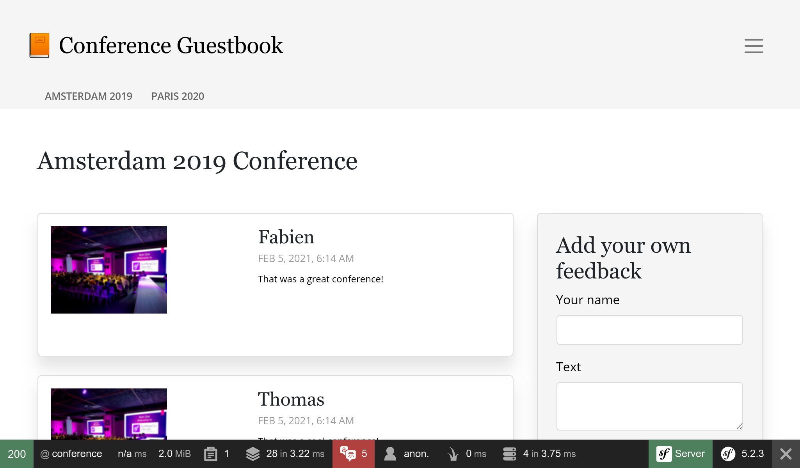

用 Webpack 来为用户界面设置样式
==========================================

.. index::
    single: Encore
    single: Webpack
    single: Components;Encore
    single: Stylesheet

我们还没有在设计用户界面上花过时间。为了让样式更专业，我们要使用一个基于 `Webpack <https://webpack.js.org/>`_ 的现代工具集。这个工具集增加了一些针对 Symfony 的定制，并且可以与应用方便地整合，它就是 *Webpack Encore* 包，我们来安装它：

.. code-block:: bash

    $ symfony composer req encore

一个完整的 Webpack 环境已经为你创建好：``package.json`` 和 ``webpack.config.js`` 文件已经生成，并且包含良好的默认配置。打开 ``webpack.config.js``，你会看到它使用了 Encore 抽象来配置 Webpack。

``package.json`` 文件定义了一些很棒的命令，我们会一直用到它们。

``assets`` 目录下包含了项目前端资源的主入口：``styles/app.css`` 和 ``app.js`` 文件。

使用 Sass
-----------

.. index::
    single: Sass

我们不用纯 CSS，而是切换到 `Sass <https://sass-lang.com/>`_：

.. code-block:: bash

    $ mv assets/styles/app.css assets/styles/app.scss

.. code-block:: diff
    :caption: patch_file

    --- a/assets/app.js
    +++ b/assets/app.js
    @@ -6,7 +6,7 @@
      */

     // any CSS you import will output into a single css file (app.css in this case)
    -import './styles/app.css';
    +import './styles/app.scss';

     // start the Stimulus application
     import './bootstrap';

安装 Sass 加载器：

.. code-block:: bash

    $ yarn add node-sass sass-loader --dev

在 webpack 里启用 Sass 加载器：

.. code-block:: diff
    :caption: patch_file

    --- a/webpack.config.js
    +++ b/webpack.config.js
    @@ -56,7 +56,7 @@ Encore
         })

         // enables Sass/SCSS support
    -    //.enableSassLoader()
    +    .enableSassLoader()

         // uncomment if you use TypeScript
         //.enableTypeScriptLoader()

我是怎么知道要安装哪些包的？如果我们没安装那些包就去尝试构建资源的话，Encore 会展示给我们一个友好的错误消息，提示我们需要执行的 ``yarn add`` 命令，这个命令用来安装加载 ``.scss`` 文件所需的依赖包。

使用 Bootstrap
----------------

.. index::
    single: Bootstrap

诸如 `Bootstrap <https://getbootstrap.com/>`_ 这样的 CSS 框架可以在很大程度上帮助我们从良好的默认样式开始构建一个响应式网站：

.. code-block:: bash

    $ yarn add bootstrap@4 jquery popper.js bs-custom-file-input --dev

在 CSS 文件中引入 Bootstrap（我们也对这个文件做了些清理）：

.. code-block:: diff
    :caption: patch_file

    --- a/assets/styles/app.scss
    +++ b/assets/styles/app.scss
    @@ -1,3 +1 @@
    -body {
    -    background-color: lightgray;
    -}
    +@import '~bootstrap/scss/bootstrap';

对 JS 文件也做同样处理：

.. code-block:: diff
    :caption: patch_file

    --- a/assets/app.js
    +++ b/assets/app.js
    @@ -7,6 +7,10 @@

     // any CSS you import will output into a single css file (app.css in this case)
     import './styles/app.scss';
    +import 'bootstrap';
    +import bsCustomFileInput from 'bs-custom-file-input';

     // start the Stimulus application
     import './bootstrap';
    +
    +bsCustomFileInput.init();

Symfony 的表单系统通过一个特殊的表单主题对 Bootstrap 提供原生支持，我们来启用这个表单主题：

.. code-block:: yaml
    :caption: config/packages/twig.yaml

    twig:
        form_themes: ['bootstrap_4_layout.html.twig']

对 HTML 设置样式
---------------------

现在我们准备好了为应用程序设置样式。下载这个打包文件，并在项目的根目录中解压：

.. code-block:: bash

    $ php -r "copy('https://symfony.com/uploads/assets/guestbook-5.2.zip', 'guestbook-5.2.zip');"
    $ unzip -o guestbook-5.2.zip
    $ rm guestbook-5.2.zip

查看下模板文件，你可能会学到一两个 Twig 的小技巧。

构建资源
------------

.. index::
    single: Symfony CLI;run

使用 Webpack 带来的主要改变之一是 CSS 和 JS 文件不能在应用中直接使用了。它们需要先经过”编译“。

开发环境中，编译资源可以用 ``encore dev`` 命令：

.. code-block:: bash

    $ symfony run yarn encore dev

把这个命令改为后台执行，让它来观察 JS 和 CSS 的改变，而不是每次更新文件时都去执行它：

.. code-block:: bash
    :class: ignore

    $ symfony run -d yarn encore dev --watch

花点时间看一下视觉效果上的改变。在浏览器里看一下新的设计。

.. figure:: screenshots/design-homepage.png
    :alt: /
    :align: center
    :figclass: with-browser

样式也应用到了生成的登录表单上，因为 *Maker Bundle* 默认使用 Bootstrap 的 CSS 类：

.. figure:: screenshots/login-styled.png
    :alt: /login
    :align: center
    :figclass: with-browser

在生产环境中，SymfonyCloud 会自动检测到你使用了 Encore，并且在构建阶段为你自动编译资源。

.. sidebar:: 深入学习

    * `Webpack 文档 <https://webpack.js.org/concepts/>`_；

    * `Symfony 的 Webpack Encore 文档 <https://symfony.com/doc/current/frontend.html>`_；

    * `SymfonyCasts 的 Webpack Encore 教程 <https://symfonycasts.com/screencast/webpack-encore>`_。
