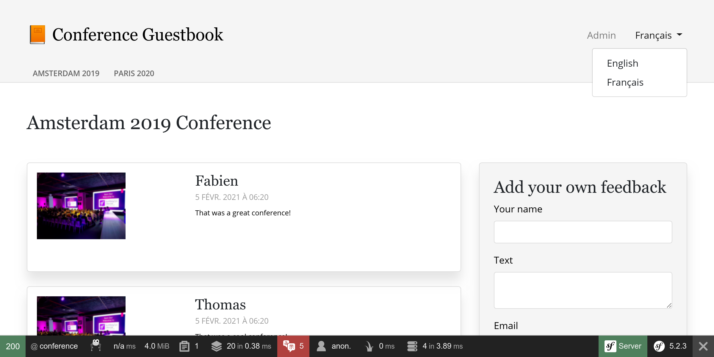
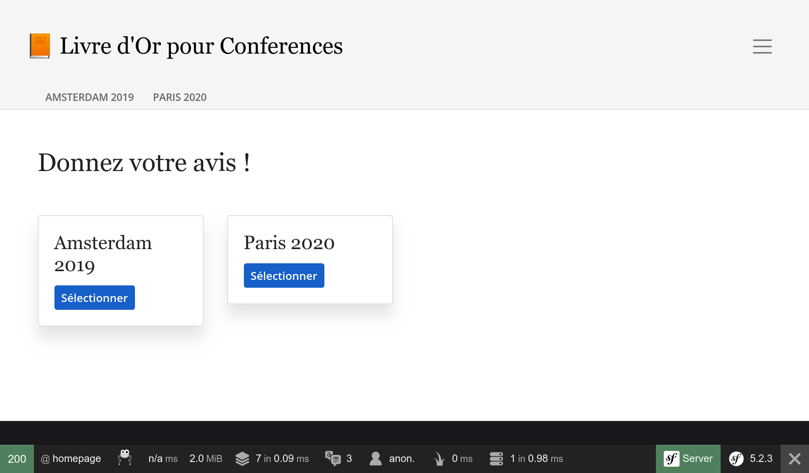

将应用程序本地化
========================

面对来自世界各地的用户，Symfony 一直以来都是自带国际化（i18n）和本地化（l10n）的功能。将一个应用程序本地化并不仅仅是翻译界面，它也包括了处理复数、日期和货币格式、URL 以及更多方面。

将 URL 国际化
-----------------

.. index::
    single: Components;Routing
    single: Routing;Locale
    single: Routing;Requirements
    single: Annotations;Route

将一个网站国际化的第一步是先将 URL 国际化。当翻译网站界面时，不同的区域设置需要对应不同的 URL，这样才能很好地搭配 HTTP 缓存（绝不要使用同样的 URL 并把区域设置放在会话数据里）。

使用特殊的 ``_locale`` 路由参数在路由中引用区域设置：

.. code-block:: diff
    :caption: patch_file
    :emphasize-lines: 8

    --- a/src/Controller/ConferenceController.php
    +++ b/src/Controller/ConferenceController.php
    @@ -33,7 +33,7 @@ class ConferenceController extends AbstractController
             $this->bus = $bus;
         }

    -    #[Route('/', name: 'homepage')]
    +    #[Route('/{_locale}/', name: 'homepage')]
         public function index(ConferenceRepository $conferenceRepository): Response
         {
             $response = new Response($this->twig->render('conference/index.html.twig', [

现在的首页里，区域设置会根据 URL 在内部设定好；比如，如果你访问 ``/fr/`` 路径，那 ``$request->getLocale()`` 会返回 ``fr``。

由于你很可能无法把内容翻译到所有合法区域设置对应的语言，我们来限制下你想要支持的区域设置：

.. code-block:: diff
    :caption: patch_file
    :emphasize-lines: 8

    --- a/src/Controller/ConferenceController.php
    +++ b/src/Controller/ConferenceController.php
    @@ -33,7 +33,7 @@ class ConferenceController extends AbstractController
             $this->bus = $bus;
         }

    -    #[Route('/{_locale}/', name: 'homepage')]
    +    #[Route('/{_locale<en|fr>}/', name: 'homepage')]
         public function index(ConferenceRepository $conferenceRepository): Response
         {
             $response = new Response($this->twig->render('conference/index.html.twig', [

可以用 ``<`` 与 ``>`` 里的正则表达式来限制每个路由参数。现在只有当 ``_locale`` 参数是 ``en`` 或 ``fr`` 时，``homepage`` 路由才会被匹配到。试一下访问 ``/es/``，你会看到 404 页面，因为没有路由被匹配到。

因为我们会在所有路由中使用这个匹配规则作为必要条件，我们来把它移动到容器参数中：

.. code-block:: diff
    :caption: patch_file

    --- a/config/services.yaml
    +++ b/config/services.yaml
    @@ -7,6 +7,7 @@ parameters:
         default_admin_email: admin@example.com
         default_domain: '127.0.0.1'
         default_scheme: 'http'
    +    app.supported_locales: 'en|fr'

         router.request_context.host: '%env(default:default_domain:SYMFONY_DEFAULT_ROUTE_HOST)%'
         router.request_context.scheme: '%env(default:default_scheme:SYMFONY_DEFAULT_ROUTE_SCHEME)%'
    --- a/src/Controller/ConferenceController.php
    +++ b/src/Controller/ConferenceController.php
    @@ -33,7 +33,7 @@ class ConferenceController extends AbstractController
             $this->bus = $bus;
         }

    -    #[Route('/{_locale<en|fr>}/', name: 'homepage')]
    +    #[Route('/{_locale<%app.supported_locales%>}/', name: 'homepage')]
         public function index(ConferenceRepository $conferenceRepository): Response
         {
             $response = new Response($this->twig->render('conference/index.html.twig', [

通过更新 ``app.supported_languages`` 参数，我们就能增加一个语言。

把同样的区域设置路由前缀加到其它 URL 上：

.. code-block:: diff
    :caption: patch_file

    --- a/src/Controller/ConferenceController.php
    +++ b/src/Controller/ConferenceController.php
    @@ -44,7 +44,7 @@ class ConferenceController extends AbstractController
             return $response;
         }

    -    #[Route('/conference_header', name: 'conference_header')]
    +    #[Route('/{_locale<%app.supported_locales%>}/conference_header', name: 'conference_header')]
         public function conferenceHeader(ConferenceRepository $conferenceRepository): Response
         {
             $response = new Response($this->twig->render('conference/header.html.twig', [
    @@ -55,7 +55,7 @@ class ConferenceController extends AbstractController
             return $response;
         }

    -    #[Route('/conference/{slug}', name: 'conference')]
    +    #[Route('/{_locale<%app.supported_locales%>}/conference/{slug}', name: 'conference')]
         public function show(Request $request, Conference $conference, CommentRepository $commentRepository, NotifierInterface $notifier, string $photoDir): Response
         {
             $comment = new Comment();

我们快完成了。我们不再有路由匹配到 ``/`` 路径了。我们来把它加回来，让它重定向到 ``/en/``：

.. code-block:: diff
    :caption: patch_file

    --- a/src/Controller/ConferenceController.php
    +++ b/src/Controller/ConferenceController.php
    @@ -33,6 +33,12 @@ class ConferenceController extends AbstractController
             $this->bus = $bus;
         }

    +    #[Route('/')]
    +    public function indexNoLocale(): Response
    +    {
    +        return $this->redirectToRoute('homepage', ['_locale' => 'en']);
    +    }
    +
         #[Route('/{_locale<%app.supported_locales%>}/', name: 'homepage')]
         public function index(ConferenceRepository $conferenceRepository): Response
         {

请注意，由于所有的路由都能处理区域配置了，页面上生成的 URL 会自动包含这个信息。

添加区域设置切换器
---------------------------

.. index::
    single: Twig;path
    single: Twig;Locale

我们在页头里增加一个切换器，让用户可以从默认的 ``en`` 切换到其它区域设置：

.. code-block:: diff
    :caption: patch_file

    --- a/templates/base.html.twig
    +++ b/templates/base.html.twig
    @@ -34,6 +34,16 @@
                                         Admin
                                     </a>
                                 </li>
    +<li class="nav-item dropdown">
    +    <a class="nav-link dropdown-toggle" href="#" id="dropdown-language" role="button"
    +        data-toggle="dropdown" aria-haspopup="true" aria-expanded="false">
    +        English
    +    </a>
    +    

    +        <a class="dropdown-item" href="{{ path('homepage', {_locale: 'en'}) }}">English</a>
    +        <a class="dropdown-item" href="{{ path('homepage', {_locale: 'fr'}) }}">Français</a>
    +    

    +</li>
                             </ul>
                         

                     

为了切换区域设置，我们显示地传递 ``_locale`` 路由参数给 ``path()`` 函数。

.. index::
    single: Twig;app.request
    single: Twig;locale_name

更新模板来展示当前的区域设置名称，用它取代硬编码的 “English”：

.. code-block:: diff
    :caption: patch_file

    --- a/templates/base.html.twig
    +++ b/templates/base.html.twig
    @@ -37,7 +37,7 @@
     <li class="nav-item dropdown">
         <a class="nav-link dropdown-toggle" href="#" id="dropdown-language" role="button"
             data-toggle="dropdown" aria-haspopup="true" aria-expanded="false">
    -        English
    +        {{ app.request.locale|locale_name(app.request.locale) }}
         </a>
         

             <a class="dropdown-item" href="{{ path('homepage', {_locale: 'en'}) }}">English</a>

``app`` 是一个全局的 Twig 变量，通过它可以访问当前请求对象。我们使用 ``locale_name`` 这个 Twig 过滤器来把区域设置转换为有良好可读性的字符串。

.. index::
    single: Components;String

区域设置名并不总是用大写，这要根据具体的区域设置而定。为了正确地将其转化为大写，我们需要一个能处理 Unicode 的过滤器。Symfony 的 String 组件和它的 Twig 实现就提供这样一个过滤器：

.. code-block:: bash

    $ symfony composer req twig/string-extra

.. index::
    single: Twig;u.title

.. code-block:: diff
    :caption: patch_file

    --- a/templates/base.html.twig
    +++ b/templates/base.html.twig
    @@ -37,7 +37,7 @@
     <li class="nav-item dropdown">
         <a class="nav-link dropdown-toggle" href="#" id="dropdown-language" role="button"
             data-toggle="dropdown" aria-haspopup="true" aria-expanded="false">
    -        {{ app.request.locale|locale_name(app.request.locale) }}
    +        {{ app.request.locale|locale_name(app.request.locale)|u.title }}
         </a>
         

             <a class="dropdown-item" href="{{ path('homepage', {_locale: 'en'}) }}">English</a>

现在你能通过切换器从法语切换到英语，界面会漂亮地跟着适配：

对界面进行翻译
---------------------

.. index::
    single: Components;Translation
    single: Translation
    single: Twig;trans

为了开始翻译网站，我们需要安装 Symfony 的 Translation 组件：

.. code-block:: bash

    $ symfony composer req translation

翻译大型网站上的每一句话是很枯燥的，但幸运的是我们的网站上只有几句话。我们从首页上的句子开始翻译：

.. code-block:: diff
    :caption: patch_file

    --- a/templates/base.html.twig
    +++ b/templates/base.html.twig
    @@ -20,7 +20,7 @@
                 <nav class="navbar navbar-expand-xl navbar-light bg-light">
                     

                         <a class="navbar-brand mr-4 pr-2" href="{{ path('homepage') }}">
    -                        &#128217; Conference Guestbook
    +                        &#128217; {{ 'Conference Guestbook'|trans }}
                         </a>

                         <button class="navbar-toggler border-0" type="button" data-toggle="collapse" data-target="#header-menu" aria-controls="navbarSupportedContent" aria-expanded="false" aria-label="Show/Hide navigation">
    --- a/templates/conference/index.html.twig
    +++ b/templates/conference/index.html.twig
    @@ -4,7 +4,7 @@

     
         <h2 class="mb-5">
    -        Give your feedback!
    +        {{ 'Give your feedback!'|trans }}
         </h2>

         
    @@ -21,7 +21,7 @@

                                 <a href="{{ path('conference', { slug: conference.slug }) }}"
                                    class="btn btn-sm btn-blue stretched-link">
    -                                View
    +                                {{ 'View'|trans }}
                                 </a>
                             

                         

Twig 的 ``trans`` 过滤器会为给定输入寻找当前区域设置对应的翻译。如果没有找到，它就会回退到 ``config/packages/translation.yaml`` 中配置的 *默认区域设置*：

.. code-block:: yaml
    :class: ignore
    :emphasize-lines: 2

    framework:
        default_locale: en
        translator:
            default_path: '%kernel.project_dir%/translations'
            fallbacks:
                - en

注意，web 调试工具栏的翻译“标签”变成了红色：

.. figure:: screenshots/intl-wdt.png
    :alt: /fr/
    :align: center
    :figclass: with-browser

它告诉我们有 3 个消息还没有翻译：

点击这个“标签”，它会列出所有那些 Symfony 没有找到翻译的消息：

.. figure:: screenshots/intl-profiler.png
    :alt: /_profiler/64282d?panel=translation
    :align: center
    :figclass: with-browser

提供翻译文案
------------------

正如你可能在 ``config/packages/translation.yaml`` 中看到的那样，翻译文案存放在 ``translations/`` 根目录下，这个目录已为我们自动创建好了。

使用 ``translation:update`` 命令，这样我们就不用手工创建翻译文件了：

.. code-block:: bash

    $ symfony console translation:update fr --force --domain=messages --sort=asc

这个命令（使用 ``--force`` 选项）为 ``fr`` 区域配置和 ``messages`` 域生成了一个翻译文件。``messages`` 域包含了应用本身的消息，不包含那些来自 Symfony 自身的消息，比如验证和安全方面的错误消息。

编辑 ``translations/messages+intl-icu.fr.xlf`` 文件，把里面的消息翻译成法语。你不说法语？我来帮你：

.. code-block:: diff
    :caption: patch_file

    --- a/translations/messages+intl-icu.fr.xlf
    +++ b/translations/messages+intl-icu.fr.xlf
    @@ -7,15 +7,15 @@
         <body>
           <trans-unit id="eOy4.6V" resname="Conference Guestbook">
             <source>Conference Guestbook</source>
    -        <target>__Conference Guestbook</target>
    +        <target>Livre d'Or pour Conferences</target>
           </trans-unit>
           <trans-unit id="LNAVleg" resname="Give your feedback!">
             <source>Give your feedback!</source>
    -        <target>__Give your feedback!</target>
    +        <target>Donnez votre avis !</target>
           </trans-unit>
           <trans-unit id="3Mg5pAF" resname="View">
             <source>View</source>
    -        <target>__View</target>
    +        <target>Sélectionner</target>
           </trans-unit>
         </body>
       </file>

注意，我们不会翻译所有的模板，但你自己当然可以去这样做：

翻译表单
------------

.. index::
    single: Translation;Form
    single: Form;Translation

Symfony 自动展示翻译系统处理过的表单 label 文本。打开会议页面，点击 web 调试工具栏上的 “Translation” 标签；你应该会看到要翻译的所有 label：

.. figure:: screenshots/intl-form-profiler.png
    :alt: /_profiler/64282d?panel=translation
    :align: center
    :figclass: with-browser

对日期进行本地化
------------------------

.. index::
    single: Localization
    single: Twig;format_datetime
    single: Twig;format_time
    single: Twig;format_date
    single: Twig;format_currency
    single: Twig;format_number

如果你切换到法语并且打开带有评论的会议页面，你会注意到评论的日期已经被本地化了。之所以这样是因为我们使用了 Twig 的 ``format_datetime`` 过滤器，它知道如何处理区域设置（``{{ comment.createdAt|format_datetime('medium', 'short') }}``）。

本地化可用于日期、时间（``format_time``）、货币（``format_currency``）和各种数字（``format_number``，它可以处理百分数、时间长度和书写成单词形式的数字）。

翻译复数
------------

.. index::
    single: Translation;Plurals
    single: Translation;Conditions

根据条件来选择翻译，这是个更具一般性的问题，它的应用之一就是管理复数的翻译。

在会议页上，我们展示评论的数量：``There are 2 comments``。对于只有 1 条评论的情况，我们展示 ``There are 1 comments``，但从语法上这是错误的。修改模板，将这个句子转换成一个可翻译的消息：

.. code-block:: diff
    :caption: patch_file

    --- a/templates/conference/show.html.twig
    +++ b/templates/conference/show.html.twig
    @@ -44,7 +44,7 @@
                             

                         

                     
    -                
There are {{ comments|length }} comments.

    +                
{{ 'nb_of_comments'|trans({count: comments|length}) }}

                     
                         <a href="{{ path('conference', { slug: conference.slug, offset: previous }) }}">Previous</a>
                     

我们对这个消息用了另一个翻译策略。我们在模板中用一个唯一标识符代替了英文版本消息。这个策略更适用于翻译复杂和大量的文本。

更新翻译文件，在其中加入这个新消息：

.. code-block:: diff
    :caption: patch_file

    --- a/translations/messages+intl-icu.fr.xlf
    +++ b/translations/messages+intl-icu.fr.xlf
    @@ -17,6 +17,10 @@
             <source>Conference Guestbook</source>
             <target>Livre d'Or pour Conferences</target>
           </trans-unit>
    +      <trans-unit id="Dg2dPd6" resname="nb_of_comments">
    +        <source>nb_of_comments</source>
    +        <target>{count, plural, =0 {Aucun commentaire.} =1 {1 commentaire.} other {# commentaires.}}</target>
    +      </trans-unit>
         </body>
       </file>
     </xliff>

我们还没有完成，现在我们需要提供英文翻译。创建 ``translations/messages+intl-icu.en.xlf`` 文件。

.. code-block:: xml
    :caption: translations/messages+intl-icu.en.xlf
    :emphasize-lines: 10

    <?xml version="1.0" encoding="utf-8"?>
    <xliff xmlns="urn:oasis:names:tc:xliff:document:1.2" version="1.2">
      <file source-language="en" target-language="en" datatype="plaintext" original="file.ext">
        <header>
          <tool tool-id="symfony" tool-name="Symfony"/>
        </header>
        <body>
          <trans-unit id="maMQz7W" resname="nb_of_comments">
            <source>nb_of_comments</source>
            <target>{count, plural, =0 {There are no comments.} one {There is one comment.} other {There are # comments.}}</target>
          </trans-unit>
        </body>
      </file>
    </xliff>

更新功能测试
------------------

不要忘记更新功能测试，让它使用更新后的 URL 和网站内容：

.. code-block:: diff
    :caption: patch_file

    --- a/tests/Controller/ConferenceControllerTest.php
    +++ b/tests/Controller/ConferenceControllerTest.php
    @@ -11,7 +11,7 @@ class ConferenceControllerTest extends WebTestCase
         public function testIndex()
         {
             $client = static::createClient();
    -        $client->request('GET', '/');
    +        $client->request('GET', '/en/');

             $this->assertResponseIsSuccessful();
             $this->assertSelectorTextContains('h2', 'Give your feedback');
    @@ -20,7 +20,7 @@ class ConferenceControllerTest extends WebTestCase
         public function testCommentSubmission()
         {
             $client = static::createClient();
    -        $client->request('GET', '/conference/amsterdam-2019');
    +        $client->request('GET', '/en/conference/amsterdam-2019');
             $client->submitForm('Submit', [
                 'comment_form[author]' => 'Fabien',
                 'comment_form[text]' => 'Some feedback from an automated functional test',
    @@ -41,7 +41,7 @@ class ConferenceControllerTest extends WebTestCase
         public function testConferencePage()
         {
             $client = static::createClient();
    -        $crawler = $client->request('GET', '/');
    +        $crawler = $client->request('GET', '/en/');

             $this->assertCount(2, $crawler->filter('h4'));

    @@ -50,6 +50,6 @@ class ConferenceControllerTest extends WebTestCase
             $this->assertPageTitleContains('Amsterdam');
             $this->assertResponseIsSuccessful();
             $this->assertSelectorTextContains('h2', 'Amsterdam 2019');
    -        $this->assertSelectorExists('div:contains("There are 1 comments")');
    +        $this->assertSelectorExists('div:contains("There is one comment")');
         }
     }

.. sidebar:: 深入学习

    * `用 ICU 格式化器翻译消息 <https://symfony.com/doc/current/translation/message_format.html>`_；

    * `使用 Twig 翻译过滤器 <https://symfony.com/doc/current/translation/templates.html#translation-filters>`_。
