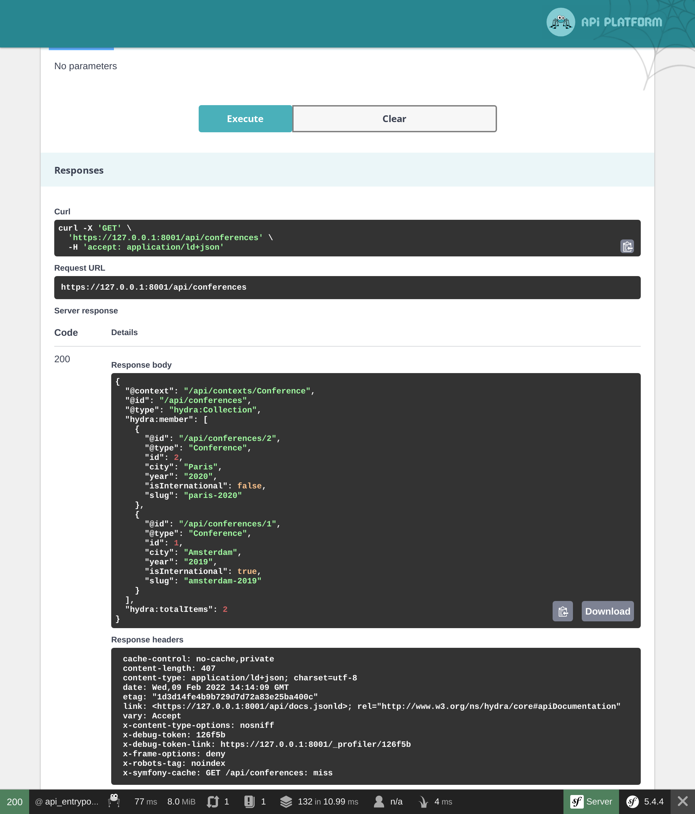

Eine API mit API Platform bereitstellen
=======================================

.. index::
    single: API
    single: HTTP API
    single: API Platform

Wir haben die Implementierung der Gästebuch-Website abgeschlossen. Wie wäre es, wenn Du jetzt eine API veröffentlichen würdest, um eine bessere Nutzung der Daten zu ermöglichen? Eine API könnte von einer mobilen Anwendung verwendet werden, um alle Konferenzen und deren Kommentare anzuzeigen und die Teilnehmer*innen eventuell Kommentare abgeben zu lassen.

In diesem Schritt werden wir eine schreibgeschützte API implementieren.

API Platform installieren
-------------------------

Eine API durch Schreiben von Code anzulegen ist möglich, aber wenn wir Standards verwenden wollen, sollten wir besser eine Lösung verwenden, die sich bereits um einen Großteil der Aufgaben kümmert. Eine Lösung wie API Platform:

.. code-block:: terminal

    $ symfony composer req api

Eine API für Konferenzen bereitstellen
---------------------------------------

.. index::
    single: Attributes;ApiResource
    single: Attributes;Groups

Ein paar Attribute in der Konferenzklasse reichen aus, um die API zu konfigurieren:

.. code-block:: diff
    :caption: patch_file

    --- a/src/Entity/Conference.php
    +++ b/src/Entity/Conference.php
    @@ -2,35 +2,48 @@

     namespace App\Entity;

    +use ApiPlatform\Core\Annotation\ApiResource;
     use App\Repository\ConferenceRepository;
     use Doctrine\Common\Collections\ArrayCollection;
     use Doctrine\Common\Collections\Collection;
     use Doctrine\ORM\Mapping as ORM;
     use Symfony\Bridge\Doctrine\Validator\Constraints\UniqueEntity;
    +use Symfony\Component\Serializer\Annotation\Groups;
     use Symfony\Component\String\Slugger\SluggerInterface;

     #[ORM\Entity(repositoryClass: ConferenceRepository::class)]
     #[UniqueEntity('slug')]
    +#[ApiResource(
    +    collectionOperations: ['get' => ['normalization_context' => ['groups' => 'conference:list']]],
    +    itemOperations: ['get' => ['normalization_context' => ['groups' => 'conference:item']]],
    +    order: ['year' => 'DESC', 'city' => 'ASC'],
    +    paginationEnabled: false,
    +)]
     class Conference
     {
         #[ORM\Id]
         #[ORM\GeneratedValue]
         #[ORM\Column(type: 'integer')]
    +    #[Groups(['conference:list', 'conference:item'])]
         private $id;

         #[ORM\Column(type: 'string', length: 255)]
    +    #[Groups(['conference:list', 'conference:item'])]
         private $city;

         #[ORM\Column(type: 'string', length: 4)]
    +    #[Groups(['conference:list', 'conference:item'])]
         private $year;

         #[ORM\Column(type: 'boolean')]
    +    #[Groups(['conference:list', 'conference:item'])]
         private $isInternational;

         #[ORM\OneToMany(mappedBy: 'conference', targetEntity: Comment::class, orphanRemoval: true)]
         private $comments;

         #[ORM\Column(type: 'string', length: 255, unique: true)]
    +    #[Groups(['conference:list', 'conference:item'])]
         private $slug;

         public function __construct()

Das Haupt-Attribute ``ApiResource`` konfiguriert die API für Konferenzen. Sie beschränkt die möglichen Operationen auf ``get`` und konfiguriert verschiedene Dinge: z. B. welche Felder angezeigt werden und wie die Konferenzen sortiert werden sollen.

Der Haupteinstiegspunkt für die API ist standardmässig ``/api``. Das ist so dank der Konfiguration in ``config/routes/api_platform.yaml``,  die durch das Recipe des Pakets hinzugefügt wurde.

Ein Web-Interface ermöglicht die Interaktion mit der API:

.. figure:: screenshots/api.png
    :alt: /api
    :align: center
    :figclass: with-browser

Benutze es, um die verschiedenen Möglichkeiten zu testen:

Stell Dir vor, wie lange es dauern würde, all dies von Grund auf neu zu implementieren!

Eine API für Kommentare bereitstellen
--------------------------------------

.. index::
    single: Attributes;ApiResource
    single: Attributes;ApiFilter
    single: Attributes;Groups

Mach das Gleiche für Kommentare:

.. code-block:: diff
    :caption: patch_file

    --- a/src/Entity/Comment.php
    +++ b/src/Entity/Comment.php
    @@ -2,40 +2,58 @@

     namespace App\Entity;

    +use ApiPlatform\Core\Annotation\ApiFilter;
    +use ApiPlatform\Core\Annotation\ApiResource;
    +use ApiPlatform\Core\Bridge\Doctrine\Orm\Filter\SearchFilter;
     use App\Repository\CommentRepository;
     use Doctrine\ORM\Mapping as ORM;
    +use Symfony\Component\Serializer\Annotation\Groups;
     use Symfony\Component\Validator\Constraints as Assert;

     #[ORM\Entity(repositoryClass: CommentRepository::class)]
     #[ORM\HasLifecycleCallbacks]
    +#[ApiResource(
    +    collectionOperations: ['get' => ['normalization_context' => ['groups' => 'comment:list']]],
    +    itemOperations: ['get' => ['normalization_context' => ['groups' => 'comment:item']]],
    +    order: ['createdAt' => 'DESC'],
    +    paginationEnabled: false,
    +)]
    +#[ApiFilter(SearchFilter::class, properties: ['conference' => 'exact'])]
     class Comment
     {
         #[ORM\Id]
         #[ORM\GeneratedValue]
         #[ORM\Column(type: 'integer')]
    +    #[Groups(['comment:list', 'comment:item'])]
         private $id;

         #[ORM\Column(type: 'string', length: 255)]
         #[Assert\NotBlank]
    +    #[Groups(['comment:list', 'comment:item'])]
         private $author;

         #[ORM\Column(type: 'text')]
         #[Assert\NotBlank]
    +    #[Groups(['comment:list', 'comment:item'])]
         private $text;

         #[ORM\Column(type: 'string', length: 255)]
         #[Assert\NotBlank]
         #[Assert\Email]
    +    #[Groups(['comment:list', 'comment:item'])]
         private $email;

         #[ORM\Column(type: 'datetime_immutable')]
    +    #[Groups(['comment:list', 'comment:item'])]
         private $createdAt;

         #[ORM\ManyToOne(targetEntity: Conference::class, inversedBy: 'comments')]
         #[ORM\JoinColumn(nullable: false)]
    +    #[Groups(['comment:list', 'comment:item'])]
         private $conference;

         #[ORM\Column(type: 'string', length: 255, nullable: true)]
    +    #[Groups(['comment:list', 'comment:item'])]
         private $photoFilename;

         #[ORM\Column(type: 'string', length: 255, options: ["default" => "submitted"])]

Die gleiche Art von Attributen werden verwendet, um die Klasse zu konfigurieren.

Einschränkung der Kommentare, die über die API zugänglich sind
-----------------------------------------------------------------

Standardmäßig stellt die API Platform alle Einträge aus der Datenbank zur Verfügung. Aber für Kommentare sollten nur die veröffentlichten Teil der API sein.

Wenn Du die von der API zurückgegebenen Elemente einschränken musst, erstelle einen Service, der ``QueryCollectionExtensionInterface`` implementiert, um die Doctrine-Abfragen für Collections zu steuern, und/oder einen Service, der ``QueryItemExtensionInterface`` implementiert für die Steuerung von einzelnen Items (Elementen):

.. code-block:: php
    :caption: src/Api/FilterPublishedCommentQueryExtension.php
    :emphasize-lines: 13-15,20-22

    namespace App\Api;

    use ApiPlatform\Core\Bridge\Doctrine\Orm\Extension\QueryCollectionExtensionInterface;
    use ApiPlatform\Core\Bridge\Doctrine\Orm\Extension\QueryItemExtensionInterface;
    use ApiPlatform\Core\Bridge\Doctrine\Orm\Util\QueryNameGeneratorInterface;
    use App\Entity\Comment;
    use Doctrine\ORM\QueryBuilder;

    class FilterPublishedCommentQueryExtension implements QueryCollectionExtensionInterface, QueryItemExtensionInterface
    {
        public function applyToCollection(QueryBuilder $qb, QueryNameGeneratorInterface $queryNameGenerator, string $resourceClass, string $operationName = null)
        {
            if (Comment::class === $resourceClass) {
                $qb->andWhere(sprintf("%s.state = 'published'", $qb->getRootAliases()[0]));
            }
        }

        public function applyToItem(QueryBuilder $qb, QueryNameGeneratorInterface $queryNameGenerator, string $resourceClass, array $identifiers, string $operationName = null, array $context = [])
        {
            if (Comment::class === $resourceClass) {
                $qb->andWhere(sprintf("%s.state = 'published'", $qb->getRootAliases()[0]));
            }
        }
    }

Die Query-Extension-Klasse wendet ihre Logik nur auf die ``Comment`` Ressource an und ändert den Doctrine Query Builder so, dass er nur Kommentare im ``published``-Zustand berücksichtigt.

CORS konfigurieren
------------------

.. index::
    single: CORS
    single: Cross-Origin Resource Sharing

Standardmäßig ist der Aufruf der API von einer anderen Domain aus aufgrund der Same-Origin Sicherheitsrichtlinie moderner HTTP-Clients verboten. Das CORS-Bundle, das als Teil von ``composer req api`` installiert wurde, sendet Cross-Origin-Resource-Sharing-Header basierend auf der Environment-Variable ``CORS_ALLOW_ORIGIN``.

Standardmäßig erlaubt sind HTTP-Anfragen von ``localhost`` und ``127.0.0.1`` auf jedem Port (in ``.env`` definiert). Das ist genau das, was wir für den nächsten Schritt benötigen, denn wir werden eine SPA (Single-Page Web Application) erstellen, welche über einen eigenen Webserver verfügt, der die API aufruft.

.. sidebar:: Weiterführendes

    * `SymfonyCasts API Platform Tutorial`_;

    * Um die GraphQL-Unterstützung zu aktivieren, führe ``composer require webonyx/graphql-php`` aus, navigiere dann zu ``/api/graphql``.

.. _`SymfonyCasts API Platform Tutorial`: https://symfonycasts.com/screencast/api-platform
