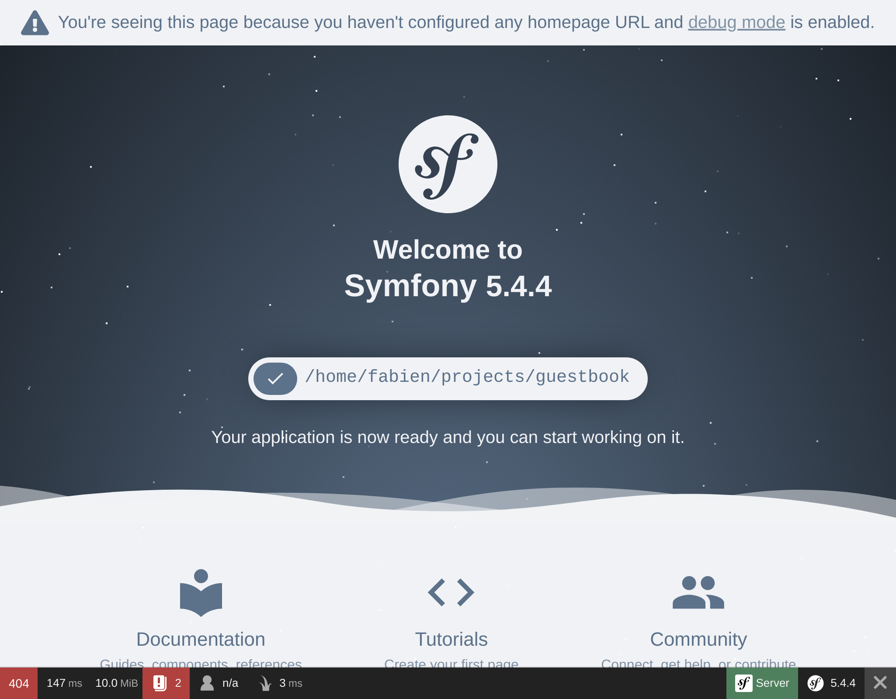

Fehlerbehebung
==============

Bei der Einrichtung eines Projekts geht es auch darum, die richtigen Werkzeuge zu haben, um Probleme zu beheben. Glücklicherweise sind viele kleine Helfer bereits Teil des ``webapp``-Paketes

Symfony-Debugging-Tools entdecken
---------------------------------

.. index::
    single: Components;Profiler
    single: Profiler
    single: Web Profiler
    single: Web Debug Toolbar

Zuerst fügen wir den Symfony Profiler hinzu. Er ist ein gute Hilfe, wenn es darum geht, die Ursache eines Problems zu finden:

Wenn Du die Homepage anschaust, solltest Du eine Symbolleiste am unteren Bildschirmrand sehen:

Das erste, was Du vielleicht bemerkst, ist das **404** in rot. Beachte, dass diese Seite ein Platzhalter ist, da wir noch keine Homepage definiert haben. Selbst wenn die Standardseite, die Dich begrüßt, schön ist, ist es immer noch eine Fehlerseite. Der richtige HTTP-Statuscode ist also 404 und nicht 200. Dank der Web-Debug-Toolbar hast Du diese Information sofort zur Hand.

Wenn du auf das kleine Ausrufezeichen klickst, erhältst du die "echte" Fehlermeldung als Teil der Logs im Symfony Profiler. Wenn Du den Stack Trace sehen möchtest, klicke auf den Link "Exception" im linken Menü.

Wann immer es ein Problem mit Deinem Code gibt, siehst Du eine Fehlerseite wie die Folgende, die Dir alles zeigt, was Du brauchst, um das Problem zu verstehen und herauszufinden woher es kommt:

.. figure:: screenshots/exception.png
    :alt: //
    :align: center
    :figclass: with-browser

Nimm Dir etwas Zeit, um die Informationen im Symfony Profiler zu erkunden.

.. index::
    single: Symfony CLI;server:log

Logs sind auch beim Debuggen von Sessions sehr nützlich. Symfony hat einen komfortablen Befehl, um alle Logs zu verfolgen (vom Webserver, PHP und Deiner Anwendung):

.. code-block:: terminal
    :class: ignore

    $ symfony server:log

Lass uns ein kleines Experiment machen. Öffne ``public/index.php`` und baue einen Fehler in den PHP-Code ein (füge z. B. foobar in der Mitte des Codes hinzu). Aktualisiere die Seite im Browser und beobachte den Log-Stream:

.. code-block:: text
    :class: ignore

    Dec 21 10:04:59 |DEBUG| PHP    PHP Parse error:  syntax error, unexpected 'use' (T_USE) in public/index.php on line 5 path="/usr/bin/php7.42" php="7.42.0"
    Dec 21 10:04:59 |ERROR| SERVER GET  (500) / ip="127.0.0.1"

Die Ausgabe ist schön gefärbt, um Deine Aufmerksamkeit auf Fehler zu lenken.

Symfony-Environments verstehen
------------------------------

.. index::
    single: Symfony Environments

Da der Symfony Profiler nur sinnvoll während der Entwicklungsphase ist, wollen wir eine Installation auf dem Produktivsystem vermeiden. Standardmäßig installiert Symfony es automatisch nur für die ``dev`` und ``Test``-Environment.

Symfony unterstützt den Umgang mit *Environments* (Umgebungen). Standardmäßig hat Symfony drei eingebaute Environments (``dev``, ``prod`` und ``test``) – Du kannst aber so viele hinzufügen, wie Du willst. Alle Environments teilen sich den gleichen Code, repräsentieren aber unterschiedliche *Konfigurationen*.

Beispielsweise sind alle Debugging-Tools in der ``dev``-Environment aktiviert. In der ``prod``-Environment ist die Anwendung auf Performance optimiert.

Der Wechsel von einer Environment zur anderen kann durch Ändern der Environment-Variable ``APP_ENV`` erfolgen.

Bei der Bereitstellung in der Platform.sh wurde die Environment (gespeichert in ``APP_ENV``) automatisch auf ``prod`` gesetzt.

Environment-Konfigurationen verwalten
-------------------------------------

.. index::
    single: Environment Variables
    single: .env
    single: .env.local

``APP_ENV`` kann durch die Verwendung von "echten" Environment-Variablen in Deinem Terminal festgelegt werden:

.. code-block:: terminal
    :class: ignore

    $ export APP_ENV=dev

Die Verwendung von realen Environment-Variablen ist der bevorzugte Weg, um Werte wie ``APP_ENV`` auf Produktivsystemen zu setzen. Aber auf Entwicklungsmaschinen kann es mühsam sein, viele Environment-Variablen zu definieren. Definiere sie stattdessen in einer ``.env``-Datei.

Bei der Erstellung des Projekts wurde automatisch eine sinnvolle ``.env``-Datei für Dich generiert:

.. code-block:: text
    :caption: .env
    :class: ignore

    ###> symfony/framework-bundle ###
    APP_ENV=dev
    APP_SECRET=c2927f273163f7225a358e3a1bbbed8a
    #TRUSTED_PROXIES=127.0.0.1,127.0.0.2
    #TRUSTED_HOSTS='^localhost|example\.com$'
    ###< symfony/framework-bundle ###

.. tip::

    Jedes Paket kann dank seines von Symfony Flex verwendeten Recipes weitere Environment-Variablen zu dieser Datei hinzufügen.

Die ``.env``-Datei wird in das Repository commitet und beschreibt die *Standardwerte* für die Produktivumgebung. Du kannst diese Werte überschreiben, indem Du eine ``.env.local``-Datei erstellst. Diese Datei sollte nicht committet werden, weshalb sie in der ``.gitignore``-Datei bereits ignoriert wird.

Speichere niemals geheime oder sensible Werte in diesen Dateien. Wie solche Werte (Secrets) verwaltet werden, sehen wir in einem anderen Schritt.

Konfiguration Deiner IDE
------------------------

Wenn in der Development-Environment (Entwicklungsumgebung) eine Exception ausgelöst wird, zeigt Symfony eine Seite mit der Fehlermeldung und deren Verlauf an. Wenn einen Dateipfad angezeigt wird, wird ein Link hinzugefügt, der die Datei in der richtigen Zeile in Deiner bevorzugten IDE öffnet. Um von dieser Funktion zu profitieren, musst Du Deine IDE konfigurieren. Symfony unterstützt viele IDEs direkt; ich verwende Visual Studio Code für dieses Projekt:

.. code-block:: diff
    :caption: patch_file

    --- a/php.ini
    +++ b/php.ini
    @@ -6,3 +6,4 @@ max_execution_time=30
     session.use_strict_mode=On
     realpath_cache_ttl=3600
     zend.detect_unicode=Off
    +xdebug.file_link_format=vscode://file/%f:%l

Dateien sind nicht nur bei Exceptions verlinkt - so wird beispielsweise auch der Controller in der Web-Debug-Toolbar nach der Konfiguration der IDE anklickbar.

Debuggen im Produktivsystem
---------------------------

.. index::
    single: Platform.sh;Remote Logs
    single: Platform.sh;SSH
    single: Symfony CLI;cloud:logs
    single: Symfony CLI;cloud:ssh

Das Debuggen von Produktivsystemen ist immer schwieriger. Du hast zum Beispiel keinen Zugriff auf den Symfony Profiler; Logs sind weniger ausführlich. Aber es ist möglich die Logs einzusehen:

.. code-block:: terminal
    :class: ignore

    $ symfony cloud:logs --tail

Du kannst Dich sogar über SSH zum Web-Container verbinden:

.. code-block:: terminal
    :class: ignore

    $ symfony cloud:ssh

Keine Sorge, du kannst nicht einfach etwas kaputt machen. Der größte Teil des Dateisystems ist schreibgeschützt. Du wirst nicht in der Lage sein, einen Hotfix auf dem Produktivsystem durchzuführen. Aber du wirst später im Buch einen viel besseren Weg kennen lernen.

.. sidebar:: Weiterführendes

    * `SymfonyCasts-Tutorial zu Environments und Konfigurationsdateien`_;

    * `SymfonyCasts-Tutorial zu Environment-Variablen`_;

    * `SymfonyCasts-Tutorial zur Web-Debug-Toolbar und zum Profiler`_;

    * `Verwaltung mehrerer .env-Dateien`_ in Symfony-Anwendungen.

.. _`SymfonyCasts-Tutorial zu Environments und Konfigurationsdateien`: https://symfonycasts.com/screencast/symfony-fundamentals/environment-config-files
.. _`SymfonyCasts-Tutorial zu Environment-Variablen`: https://symfonycasts.com/screencast/symfony-fundamentals/environment-variables
.. _`SymfonyCasts-Tutorial zur Web-Debug-Toolbar und zum Profiler`: https://symfonycasts.com/screencast/symfony/debug-toolbar-profiler
.. _`Verwaltung mehrerer .env-Dateien`: https://symfony.com/doc/current/configuration.html#managing-multiple-env-files
