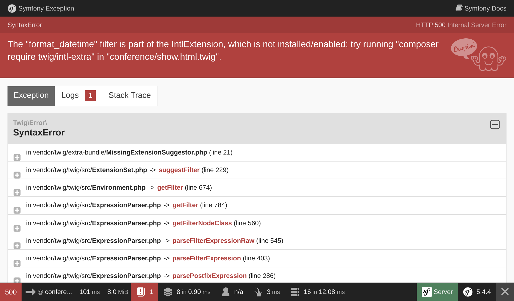
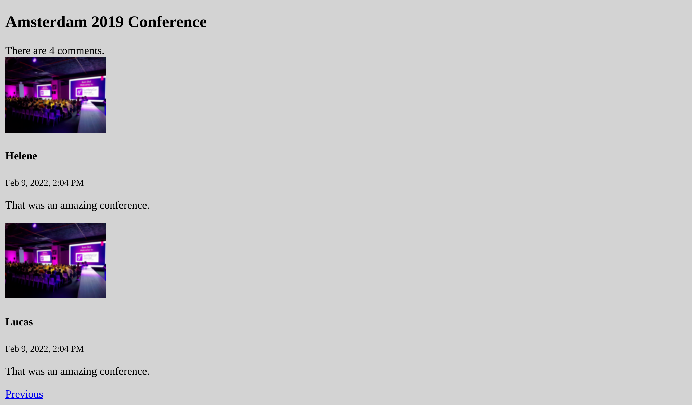

Building the User Interface
===========================

.. index::
    single: Twig
    single: Templates

Everything is now in place to create the first version of the website user interface. We won't make it pretty. Just functional for now.

Remember the escaping we had to do in the controller for the easter egg to avoid security issues? We won't use PHP for our templates for that reason. Instead, we will use Twig. Besides handling output escaping for us, `Twig`_ brings a lot of nice features we will leverage, like template inheritance.

Using Twig for the Templates
----------------------------

.. index::
    single: Twig;Layout
    single: Twig;block

All pages on the website will share the same *layout*. When installing Twig, a ``templates/`` directory has been created automatically and a sample layout was created as well in ``base.html.twig``.

.. code-block:: html+twig
    :caption: templates/base.html.twig
    :class: ignore

    <!DOCTYPE html>
    <html>
        <head>
            <meta charset="UTF-8">
            <title>Welcome!</title>
            <link rel="icon" href="data:image/svg+xml,<svg xmlns=%22http://www.w3.org/2000/svg%22 viewBox=%220 0 128 128%22><text y=%221.2em%22 font-size=%2296%22>⚫️</text></svg>">
            {# Run `composer require symfony/webpack-encore-bundle` to start using Symfony UX #}
            
                {{ encore_entry_link_tags('app') }}
            

            
                {{ encore_entry_script_tags('app') }}
            
        </head>
        <body>
            
        </body>
    </html>

A layout can define ``block`` elements, which are the places where *child templates* that *extend* the layout add their contents.

.. index::
    single: Twig;extends
    single: Twig;for

Let's create a template for the project's homepage in ``templates/conference/index.html.twig``:

.. code-block:: html+twig
    :caption: templates/conference/index.html.twig

    

    Conference Guestbook

    
        <h2>Give your feedback!</h2>

        
            <h4>{{ conference }}</h4>
        
    

The template *extends* ``base.html.twig`` and redefines the ``title`` and ``body`` blocks.

.. index::
    single: Twig;Syntax

The ```` notation in a template indicates *actions* and *structure*.

The ``{{ }}`` notation is used to *display* something. ``{{ conference }}`` displays the conference representation (the result of calling ``__toString`` on the ``Conference`` object).

Using Twig in a Controller
--------------------------

Update the controller to render the Twig template:

.. code-block:: diff
    :caption: patch_file

    --- a/src/Controller/ConferenceController.php
    +++ b/src/Controller/ConferenceController.php
    @@ -2,22 +2,19 @@

     namespace App\Controller;

    +use App\Repository\ConferenceRepository;
     use Symfony\Bundle\FrameworkBundle\Controller\AbstractController;
     use Symfony\Component\HttpFoundation\Response;
     use Symfony\Component\Routing\Annotation\Route;
    +use Twig\Environment;

     class ConferenceController extends AbstractController
     {
         #[Route('/', name: 'homepage')]
    -    public function index(): Response
    +    public function index(Environment $twig, ConferenceRepository $conferenceRepository): Response
         {
    -        return new Response(<<<EOF
    -            <html>
    -                <body>
    -                    
    -                </body>
    -            </html>
    -            EOF
    -        );
    +        return new Response($twig->render('conference/index.html.twig', [
    +            'conferences' => $conferenceRepository->findAll(),
    +        ]));
         }
     }

There is a lot going on here.

To be able to render a template, we need the Twig ``Environment`` object (the main Twig entry point). Notice that we ask for the Twig instance by type-hinting it in the controller method. Symfony is smart enough to know how to inject the right object.

We also need the conference repository to get all conferences from the database.

In the controller code, the ``render()`` method renders the template and passes an array of variables to the template. We are passing the list of ``Conference`` objects as a ``conferences`` variable.

A controller is a standard PHP class. We don't even need to extend the ``AbstractController`` class if we want to be explicit about our dependencies. You can remove it (but don't do it, as we will use the nice shortcuts it provides in future steps).

Creating the Page for a Conference
----------------------------------

Each conference should have a dedicated page to list its comments. Adding a new page is a matter of adding a controller, defining a route for it, and creating the related template.

Add a ``show()`` method in ``src/Controller/ConferenceController.php``:

.. code-block:: diff
    :caption: patch_file

    --- a/src/Controller/ConferenceController.php
    +++ b/src/Controller/ConferenceController.php
    @@ -2,6 +2,8 @@

     namespace App\Controller;

    +use App\Entity\Conference;
    +use App\Repository\CommentRepository;
     use App\Repository\ConferenceRepository;
     use Symfony\Bundle\FrameworkBundle\Controller\AbstractController;
     use Symfony\Component\HttpFoundation\Response;
    @@ -17,4 +19,13 @@ class ConferenceController extends AbstractController
                 'conferences' => $conferenceRepository->findAll(),
             ]));
         }
    +
    +    #[Route('/conference/{id}', name: 'conference')]
    +    public function show(Environment $twig, Conference $conference, CommentRepository $commentRepository): Response
    +    {
    +        return new Response($twig->render('conference/show.html.twig', [
    +            'conference' => $conference,
    +            'comments' => $commentRepository->findBy(['conference' => $conference], ['createdAt' => 'DESC']),
    +        ]));
    +    }
     }

This method has a special behavior we have not seen yet. We ask for a ``Conference`` instance to be injected in the method. But there may be many of these in the database. Symfony is able to determine which one you want based on the ``{id}`` passed in the request path (``id`` being the primary key of the ``conference`` table in the database).

Retrieving the comments related to the conference can be done via the ``findBy()`` method which takes a criteria as a first argument.

.. index::
    single: Twig;extends
    single: Twig;block
    single: Twig;for
    single: Twig;if
    single: Twig;else
    single: Twig;asset
    single: Twig;format_datetime
    single: Twig;length

The last step is to create the ``templates/conference/show.html.twig`` file:

.. code-block:: html+twig
    :caption: templates/conference/show.html.twig

    

    Conference Guestbook - {{ conference }}

    
        <h2>{{ conference }} Conference</h2>

        
            
                
                    
                

                <h4>{{ comment.author }}</h4>
                <small>
                    {{ comment.createdAt|format_datetime('medium', 'short') }}
                </small>

                
{{ comment.text }}

            
        
            
No comments have been posted yet for this conference.

        
    

In this template, we are using the ``|`` notation to call Twig *filters*. A filter transforms a value. ``comments|length`` returns the number of comments and ``comment.createdAt|format_datetime('medium', 'short')`` formats the date in a human readable representation.

Try to reach the "first" conference via ``/conference/1``, and notice the following error:

The error comes from the ``format_datetime`` filter as it is not part of Twig core. The error message gives you a hint about which package should be installed to fix the problem:

.. code-block:: terminal

    $ symfony composer req "twig/intl-extra:^3"

Now the page works properly.

Linking Pages Together
----------------------

.. index::
    single: Twig;Link
    single: Link

The very last step to finish our first version of the user interface is to link the conference pages from the homepage:

.. code-block:: diff
    :caption: patch_file

    --- a/templates/conference/index.html.twig
    +++ b/templates/conference/index.html.twig
    @@ -7,5 +7,8 @@

         
             <h4>{{ conference }}</h4>
    +        

    +            <a href="/conference/{{ conference.id }}">View</a>
    +        

         
     

But hard-coding a path is a bad idea for several reasons. The most important reason is if you change the path (from ``/conference/{id}`` to ``/conferences/{id}`` for instance), all links must be updated manually.

.. index::
    single: Twig;path

Instead, use the ``path()`` Twig *function* and use the *route name*:

.. code-block:: diff
    :caption: patch_file

    --- a/templates/conference/index.html.twig
    +++ b/templates/conference/index.html.twig
    @@ -8,7 +8,7 @@
         
             <h4>{{ conference }}</h4>
             

    -            <a href="/conference/{{ conference.id }}">View</a>
    +            <a href="{{ path('conference', { id: conference.id }) }}">View</a>
             

         
     

The ``path()`` function generates the path to a page using its route name. The values of the route parameters are passed as a Twig map.

Paginating the Comments
-----------------------

.. index::
    single: Doctrine;Paginator
    single: Paginator

With thousands of attendees, we can expect quite a few comments. If we display them all on a single page, it will grow very fast.

Create a ``getCommentPaginator()`` method in the Comment Repository that returns a Comment *Paginator* based on a conference and an offset (where to start):

.. code-block:: diff
    :caption: patch_file

    --- a/src/Repository/CommentRepository.php
    +++ b/src/Repository/CommentRepository.php
    @@ -3,8 +3,10 @@
     namespace App\Repository;

     use App\Entity\Comment;
    +use App\Entity\Conference;
     use Doctrine\Bundle\DoctrineBundle\Repository\ServiceEntityRepository;
     use Doctrine\Persistence\ManagerRegistry;
    +use Doctrine\ORM\Tools\Pagination\Paginator;

     /**
      * @extends ServiceEntityRepository<Comment>
    @@ -16,11 +18,27 @@ use Doctrine\Persistence\ManagerRegistry;
      */
     class CommentRepository extends ServiceEntityRepository
     {
    +    public const PAGINATOR_PER_PAGE = 2;
    +
         public function __construct(ManagerRegistry $registry)
         {
             parent::__construct($registry, Comment::class);
         }

    +    public function getCommentPaginator(Conference $conference, int $offset): Paginator
    +    {
    +        $query = $this->createQueryBuilder('c')
    +            ->andWhere('c.conference = :conference')
    +            ->setParameter('conference', $conference)
    +            ->orderBy('c.createdAt', 'DESC')
    +            ->setMaxResults(self::PAGINATOR_PER_PAGE)
    +            ->setFirstResult($offset)
    +            ->getQuery()
    +        ;
    +
    +        return new Paginator($query);
    +    }
    +
         public function add(Comment $entity, bool $flush = false): void
         {
             $this->getEntityManager()->persist($entity);

We have set the maximum number of comments per page to 2 to ease testing.

To manage the pagination in the template, pass the Doctrine Paginator instead of the Doctrine Collection to Twig:

.. code-block:: diff
    :caption: patch_file

    --- a/src/Controller/ConferenceController.php
    +++ b/src/Controller/ConferenceController.php
    @@ -6,6 +6,7 @@ use App\Entity\Conference;
     use App\Repository\CommentRepository;
     use App\Repository\ConferenceRepository;
     use Symfony\Bundle\FrameworkBundle\Controller\AbstractController;
    +use Symfony\Component\HttpFoundation\Request;
     use Symfony\Component\HttpFoundation\Response;
     use Symfony\Component\Routing\Annotation\Route;
     use Twig\Environment;
    @@ -21,11 +22,16 @@ class ConferenceController extends AbstractController
         }

         #[Route('/conference/{id}', name: 'conference')]
    -    public function show(Environment $twig, Conference $conference, CommentRepository $commentRepository): Response
    +    public function show(Request $request, Environment $twig, Conference $conference, CommentRepository $commentRepository): Response
         {
    +        $offset = max(0, $request->query->getInt('offset', 0));
    +        $paginator = $commentRepository->getCommentPaginator($conference, $offset);
    +
             return new Response($twig->render('conference/show.html.twig', [
                 'conference' => $conference,
    -            'comments' => $commentRepository->findBy(['conference' => $conference], ['createdAt' => 'DESC']),
    +            'comments' => $paginator,
    +            'previous' => $offset - CommentRepository::PAGINATOR_PER_PAGE,
    +            'next' => min(count($paginator), $offset + CommentRepository::PAGINATOR_PER_PAGE),
             ]));
         }
     }

The controller gets the ``offset`` from the Request query string (``$request->query``) as an integer (``getInt()``), defaulting to 0 if not available.

The ``previous`` and ``next`` offsets are computed based on all the information we have from the paginator.

.. index::
    single: Twig;if

Finally, update the template to add links to the next and previous pages:

.. code-block:: diff
    :caption: patch_file

    --- a/templates/conference/show.html.twig
    +++ b/templates/conference/show.html.twig
    @@ -6,6 +6,8 @@
         <h2>{{ conference }} Conference</h2>

         
    +        
There are {{ comments|length }} comments.

    +
             
                 
                     
    @@ -18,6 +20,13 @@

                 
{{ comment.text }}

             
    +
    +        
    +            <a href="{{ path('conference', { id: conference.id, offset: previous }) }}">Previous</a>
    +        
    +        
    +            <a href="{{ path('conference', { id: conference.id, offset: next }) }}">Next</a>
    +        
         
             
No comments have been posted yet for this conference.

         

You should now be able to navigate the comments via the "Previous" and "Next" links:

.. figure:: screenshots/pagination-next.png
    :alt: /conference/1
    :align: center
    :figclass: with-browser

Refactoring the Controller
--------------------------

You might have noticed that both methods in ``ConferenceController`` take a Twig environment as an argument. Instead of injecting it into each method, let's use some constructor injection instead (that makes the list of arguments shorter and less redundant):

.. code-block:: diff
    :caption: patch_file

    --- a/src/Controller/ConferenceController.php
    +++ b/src/Controller/ConferenceController.php
    @@ -13,21 +13,28 @@ use Twig\Environment;

     class ConferenceController extends AbstractController
     {
    +    private $twig;
    +
    +    public function __construct(Environment $twig)
    +    {
    +        $this->twig = $twig;
    +    }
    +
         #[Route('/', name: 'homepage')]
    -    public function index(Environment $twig, ConferenceRepository $conferenceRepository): Response
    +    public function index(ConferenceRepository $conferenceRepository): Response
         {
    -        return new Response($twig->render('conference/index.html.twig', [
    +        return new Response($this->twig->render('conference/index.html.twig', [
                 'conferences' => $conferenceRepository->findAll(),
             ]));
         }

         #[Route('/conference/{id}', name: 'conference')]
    -    public function show(Request $request, Environment $twig, Conference $conference, CommentRepository $commentRepository): Response
    +    public function show(Request $request, Conference $conference, CommentRepository $commentRepository): Response
         {
             $offset = max(0, $request->query->getInt('offset', 0));
             $paginator = $commentRepository->getCommentPaginator($conference, $offset);

    -        return new Response($twig->render('conference/show.html.twig', [
    +        return new Response($this->twig->render('conference/show.html.twig', [
                 'conference' => $conference,
                 'comments' => $paginator,
                 'previous' => $offset - CommentRepository::PAGINATOR_PER_PAGE,

.. sidebar:: Going Further

    * `Twig docs`_;

    * `Creating and Using Templates`_ in Symfony applications;

    * `SymfonyCasts Twig tutorial`_;

    * `Twig functions and filters only available in Symfony`_;

    * The `AbstractController base controller`_.

.. _`Twig`: https://twig.symfony.com/
.. _`Twig docs`: https://twig.symfony.com/doc/3.x/
.. _`Creating and Using Templates`: https://symfony.com/doc/current/templates.html
.. _`SymfonyCasts Twig tutorial`: https://symfonycasts.com/screencast/symfony/twig-recipe
.. _`Twig functions and filters only available in Symfony`: https://symfony.com/doc/current/reference/twig_reference.html
.. _`AbstractController base controller`: https://symfony.com/doc/current/controller.html#the-base-controller-classes-services
