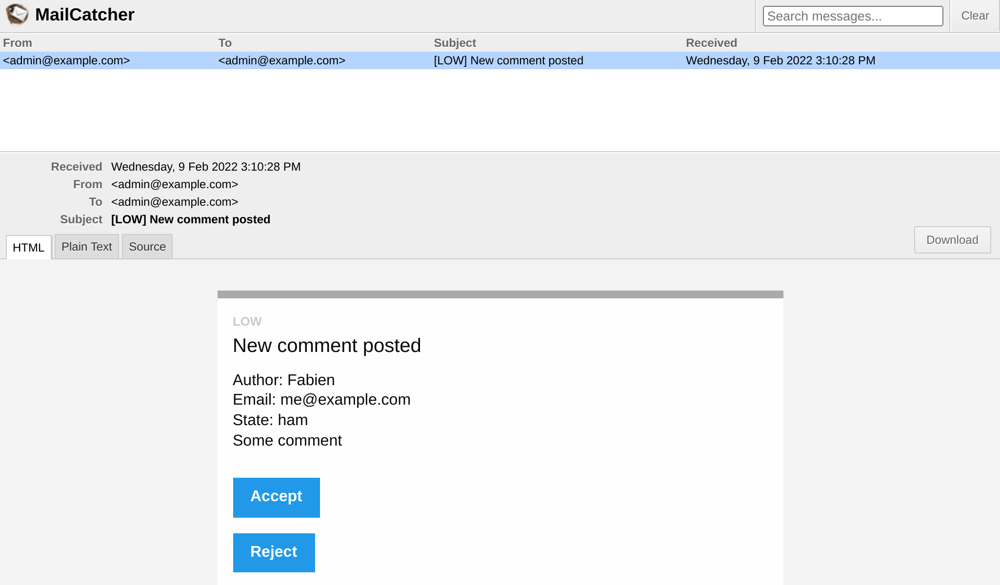

Emailing Admins
===============

.. index::
    single: Components;Mailer
    single: Mailer
    single: Emails

To ensure high quality feedback, the admin must moderate all comments. When a comment is in the ``ham`` or ``potential_spam`` state, an *email* should be sent to the admin with two links: one to accept the comment and one to reject it.

Setting an Email for the Admin
------------------------------

To store the admin email, use a container parameter. For demonstration purpose, we also allow it to be set via an environment variable (should not be needed in "real life"). To ease injection in services that need the admin email, define a container ``bind`` setting:

.. code-block:: diff
    :caption: patch_file

    --- a/config/services.yaml
    +++ b/config/services.yaml
    @@ -4,6 +4,7 @@
     # Put parameters here that don't need to change on each machine where the app is deployed
     # https://symfony.com/doc/current/best_practices.html#use-parameters-for-application-configuration
     parameters:
    +    default_admin_email: admin@example.com

     services:
         # default configuration for services in *this* file
    @@ -13,6 +14,7 @@ services:
             bind:
                 string $photoDir: "%kernel.project_dir%/public/uploads/photos"
                 string $akismetKey: "%env(AKISMET_KEY)%"
    +            string $adminEmail: "%env(string:default:default_admin_email:ADMIN_EMAIL)%"

         # makes classes in src/ available to be used as services
         # this creates a service per class whose id is the fully-qualified class name

An environment variable might be "processed" before being used. Here, we are using the ``default`` processor to fall back to the value of the ``default_admin_email`` parameter if the ``ADMIN_EMAIL`` environment variable does not exist.

Sending a Notification Email
----------------------------

To send an email, you can choose between several ``Email`` class abstractions; from ``Message``, the lowest level, to ``NotificationEmail``, the highest one. You will probably use the ``Email`` class the most, but ``NotificationEmail`` is the perfect choice for internal emails.

In the message handler, let's replace the auto-validation logic:

.. code-block:: diff
    :caption: patch_file

    --- a/src/MessageHandler/CommentMessageHandler.php
    +++ b/src/MessageHandler/CommentMessageHandler.php
    @@ -7,6 +7,8 @@ use App\Repository\CommentRepository;
     use App\SpamChecker;
     use Doctrine\ORM\EntityManagerInterface;
     use Psr\Log\LoggerInterface;
    +use Symfony\Bridge\Twig\Mime\NotificationEmail;
    +use Symfony\Component\Mailer\MailerInterface;
     use Symfony\Component\Messenger\Handler\MessageHandlerInterface;
     use Symfony\Component\Messenger\MessageBusInterface;
     use Symfony\Component\Workflow\WorkflowInterface;
    @@ -18,15 +20,19 @@ class CommentMessageHandler implements MessageHandlerInterface
         private $commentRepository;
         private $bus;
         private $workflow;
    +    private $mailer;
    +    private $adminEmail;
         private $logger;

    -    public function __construct(EntityManagerInterface $entityManager, SpamChecker $spamChecker, CommentRepository $commentRepository, MessageBusInterface $bus, WorkflowInterface $commentStateMachine, LoggerInterface $logger = null)
    +    public function __construct(EntityManagerInterface $entityManager, SpamChecker $spamChecker, CommentRepository $commentRepository, MessageBusInterface $bus, WorkflowInterface $commentStateMachine, MailerInterface $mailer, string $adminEmail, LoggerInterface $logger = null)
         {
             $this->entityManager = $entityManager;
             $this->spamChecker = $spamChecker;
             $this->commentRepository = $commentRepository;
             $this->bus = $bus;
             $this->workflow = $commentStateMachine;
    +        $this->mailer = $mailer;
    +        $this->adminEmail = $adminEmail;
             $this->logger = $logger;
         }

    @@ -51,8 +57,13 @@ class CommentMessageHandler implements MessageHandlerInterface

                 $this->bus->dispatch($message);
             } elseif ($this->workflow->can($comment, 'publish') || $this->workflow->can($comment, 'publish_ham')) {
    -            $this->workflow->apply($comment, $this->workflow->can($comment, 'publish') ? 'publish' : 'publish_ham');
    -            $this->entityManager->flush();
    +            $this->mailer->send((new NotificationEmail())
    +                ->subject('New comment posted')
    +                ->htmlTemplate('emails/comment_notification.html.twig')
    +                ->from($this->adminEmail)
    +                ->to($this->adminEmail)
    +                ->context(['comment' => $comment])
    +            );
             } elseif ($this->logger) {
                 $this->logger->debug('Dropping comment message', ['comment' => $comment->getId(), 'state' => $comment->getState()]);
             }

The ``MailerInterface`` is the main entry point and allows to ``send()`` emails.

To send an email, we need a sender (the ``From``/``Sender`` header). Instead of setting it explicitly on the Email instance, define it globally:

.. code-block:: diff
    :caption: patch_file

    --- a/config/packages/mailer.yaml
    +++ b/config/packages/mailer.yaml
    @@ -1,3 +1,5 @@
     framework:
         mailer:
             dsn: '%env(MAILER_DSN)%'
    +        envelope:
    +            sender: "%env(string:default:default_admin_email:ADMIN_EMAIL)%"

Extending the Notification Email Template
-----------------------------------------

.. index::
    single: Twig;extends
    single: Twig;block
    single: Twig;url

The notification email template inherits from the default notification email template that comes with Symfony:

.. code-block:: html+twig
    :caption: templates/emails/comment_notification.html.twig

    

    
        Author: {{ comment.author }} 
        Email: {{ comment.email }} 
        State: {{ comment.state }} 

        

            {{ comment.text }}
        

    

    
        <spacer size="16"></spacer>
        <button href="{{ url('review_comment', { id: comment.id }) }}">Accept</button>
        <button href="{{ url('review_comment', { id: comment.id, reject: true }) }}">Reject</button>
    

The template overrides a few blocks to customize the message of the email and to add some links that allow the admin to accept or reject a comment. Any route argument that is not a valid route parameter is added as a query string item (the reject URL looks like ``/admin/comment/review/42?reject=true``).

The default ``NotificationEmail`` template uses `Inky`_ instead of HTML to design emails. It helps create responsive emails that are compatible with all popular email clients.

For maximum compatibility with email readers, the notification base layout inlines all stylesheets (via the CSS inliner package) by default.

These two features are part of optional Twig extensions that need to be installed:

.. code-block:: bash

    $ symfony composer req "twig/cssinliner-extra:^3" "twig/inky-extra:^3"

Generating Absolute URLs in a Symfony Command
---------------------------------------------

.. index::
    single: Twig;Link
    single: Link

In emails, generate URLs with ``url()`` instead of ``path()`` as you need absolute ones (with scheme and host).

The email is sent from the message handler, in a console context. Generating absolute URLs in a Web context is easier as we know the scheme and domain of the current page. This is not the case in a console context.

Define the domain name and scheme to use explicitly:

.. code-block:: diff
    :caption: patch_file

    --- a/config/services.yaml
    +++ b/config/services.yaml
    @@ -5,6 +5,11 @@
     # https://symfony.com/doc/current/best_practices.html#use-parameters-for-application-configuration
     parameters:
         default_admin_email: admin@example.com
    +    default_domain: '127.0.0.1'
    +    default_scheme: 'http'
    +
    +    router.request_context.host: '%env(default:default_domain:SYMFONY_DEFAULT_ROUTE_HOST)%'
    +    router.request_context.scheme: '%env(default:default_scheme:SYMFONY_DEFAULT_ROUTE_SCHEME)%'

     services:
         # default configuration for services in *this* file

The ``SYMFONY_DEFAULT_ROUTE_HOST`` and ``SYMFONY_DEFAULT_ROUTE_PORT`` environment variables are automatically set locally when using the ``symfony`` CLI and determined based on the configuration on Platform.sh.

Wiring a Route to a Controller
------------------------------

The ``review_comment`` route does not exist yet, let's create an admin controller to handle it:

.. code-block:: php
    :caption: src/Controller/AdminController.php

    namespace App\Controller;

    use App\Entity\Comment;
    use App\Message\CommentMessage;
    use Doctrine\ORM\EntityManagerInterface;
    use Symfony\Bundle\FrameworkBundle\Controller\AbstractController;
    use Symfony\Component\HttpFoundation\Request;
    use Symfony\Component\HttpFoundation\Response;
    use Symfony\Component\Messenger\MessageBusInterface;
    use Symfony\Component\Routing\Annotation\Route;
    use Symfony\Component\Workflow\Registry;
    use Twig\Environment;

    class AdminController extends AbstractController
    {
        private $twig;
        private $entityManager;
        private $bus;

        public function __construct(Environment $twig, EntityManagerInterface $entityManager, MessageBusInterface $bus)
        {
            $this->twig = $twig;
            $this->entityManager = $entityManager;
            $this->bus = $bus;
        }

        #[Route('/admin/comment/review/{id}', name: 'review_comment')]
        public function reviewComment(Request $request, Comment $comment, Registry $registry): Response
        {
            $accepted = !$request->query->get('reject');

            $machine = $registry->get($comment);
            if ($machine->can($comment, 'publish')) {
                $transition = $accepted ? 'publish' : 'reject';
            } elseif ($machine->can($comment, 'publish_ham')) {
                $transition = $accepted ? 'publish_ham' : 'reject_ham';
            } else {
                return new Response('Comment already reviewed or not in the right state.');
            }

            $machine->apply($comment, $transition);
            $this->entityManager->flush();

            if ($accepted) {
                $this->bus->dispatch(new CommentMessage($comment->getId()));
            }

            return new Response($this->twig->render('admin/review.html.twig', [
                'transition' => $transition,
                'comment' => $comment,
            ]));
        }
    }

The review comment URL starts with ``/admin/`` to protect it with the firewall defined in a previous step. The admin needs to be authenticated to access this resource.

Instead of creating a ``Response`` instance, we have used ``render()``, a shortcut method provided by the ``AbstractController`` controller base class.

.. index::
    single: Twig;extends
    single: Twig;block

When the review is done, a short template thanks the admin for their hard work:

.. code-block:: html+twig
    :caption: templates/admin/review.html.twig

    

    
        <h2>Comment reviewed, thank you!</h2>

        
Applied transition: <strong>{{ transition }}</strong>

        
New state: <strong>{{ comment.state }}</strong>

    

Using a Mail Catcher
--------------------

.. index::
    single: Docker;Mail Catcher

Instead of using a "real" SMTP server or a third-party provider to send emails, let's use a mail catcher. A mail catcher provides a SMTP server that does not deliver the emails, but makes them available through a Web interface instead. Fortunately, Symfony has already configured such a mail catcher automatically for us:

.. code-block:: yaml
    :caption: docker-compose.override.yml
    :class: ignore

    services:
    ###> symfony/mailer ###
      mailer:
        image: schickling/mailcatcher
        ports: [1025, 1080]
    ###< symfony/mailer ###

Accessing the Webmail
---------------------

.. index::
    single: Symfony CLI;open:local:webmail

You can open the webmail from a terminal:

.. code-block:: bash
    :class: ignore

    $ symfony open:local:webmail

Or from the web debug toolbar:

.. figure:: screenshots/webmail-wdt.png
    :alt: /
    :align: center
    :figclass: with-browser

Submit a comment, you should receive an email in the webmail interface:

Click on the email title on the interface and accept or reject the comment as you see fit:

.. figure:: screenshots/webmail-rejected.png
    :alt: /
    :align: center
    :figclass: with-browser

Check the logs with ``server:log`` if that does not work as expected.

Managing Long-Running Scripts
-----------------------------

Having long-running scripts comes with behaviors that you should be aware of. Unlike the PHP model used for HTTP where each request starts with a clean state, the message consumer is running continuously in the background. Each handling of a message inherits the current state, including the memory cache. To avoid any issues with Doctrine, its entity managers are automatically cleared after the handling of a message. You should check if your own services need to do the same or not.

Sending Emails Asynchronously
-----------------------------

The email sent in the message handler might take some time to be sent. It might even throw an exception. In case of an exception being thrown during the handling of a message, it will be retried. But instead of retrying to consume the comment message, it would be better to actually just retry sending the email.

We already know how to do that: send the email message on the bus.

A ``MailerInterface`` instance does the hard work: when a bus is defined, it dispatches the email messages on it instead of sending them. No changes are needed in your code.

The bus is already sending the email asynchronously as per the default Messenger configuration:

.. code-block:: yaml
    :caption: config/packages/messenger.yaml
    :emphasize-lines: 4
    :class: ignore

    framework:
        messenger:
            routing:
                Symfony\Component\Mailer\Messenger\SendEmailMessage: async
                Symfony\Component\Notifier\Message\ChatMessage: async
                Symfony\Component\Notifier\Message\SmsMessage: async

                # Route your messages to the transports
                App\Message\CommentMessage: async

Even if we are using the same transport for comment messages and email messages, it does not have to be the case. You could decide to use another transport to manage different message priorities for instance. Using different transports also gives you the opportunity to have different worker machines handling different kind of messages. It is flexible and up to you.

Testing Emails
--------------

There are many ways to test emails.

You can write unit tests if you write a class per email (by extending ``Email`` or ``TemplatedEmail`` for instance).

The most common tests you will write though are functional tests that check that some actions trigger an email, and probably tests about the content of the emails if they are dynamic.

Symfony comes with assertions that ease such tests, here is a test example that demonstrates some possibilities:

.. code-block:: php
    :class: ignore

    public function testMailerAssertions()
    {
        $client = static::createClient();
        $client->request('GET', '/');

        $this->assertEmailCount(1);
        $event = $this->getMailerEvent(0);
        $this->assertEmailIsQueued($event);

        $email = $this->getMailerMessage(0);
        $this->assertEmailHeaderSame($email, 'To', 'fabien@example.com');
        $this->assertEmailTextBodyContains($email, 'Bar');
        $this->assertEmailAttachmentCount($email, 1);
    }

These assertions work when emails are sent synchronously or asynchronously.

Sending Emails on Platform.sh
-----------------------------

.. index::
    single: Platform.sh;Emails
    single: Platform.sh;Mailer
    single: Platform.sh;SMTP
    single: Emails

There is no specific configuration for Platform.sh. All accounts come with a SendGrid account that is automatically used to send emails.

.. index::
    single: Symfony CLI;cloud:env:info

.. note::

    To be on the safe side, emails are *only* sent on the ``master`` branch by default. Enable SMTP explicitly on non-``master`` branches if you know what you are doing:

    .. code-block:: bash

        $ symfony cloud:env:info enable_smtp on

.. sidebar:: Going Further

    * `SymfonyCasts Mailer tutorial`_;

    * The `Inky templating language docs`_;

    * The `Environment Variable Processors`_;

    * The `Symfony Framework Mailer documentation`_;

    * The `Platform.sh documentation about Emails`_.

.. _`Inky`: https://get.foundation/emails/docs/inky.html
.. _`SymfonyCasts Mailer tutorial`: https://symfonycasts.com/screencast/mailer
.. _`Inky templating language docs`: https://get.foundation/emails/docs/inky.html
.. _`Environment Variable Processors`: https://symfony.com/doc/current/configuration/env_var_processors.html
.. _`Symfony Framework Mailer documentation`: https://symfony.com/doc/current/mailer.html
.. _`Platform.sh documentation about Emails`: https://symfony.com/doc/current/cloud/services/emails.html
