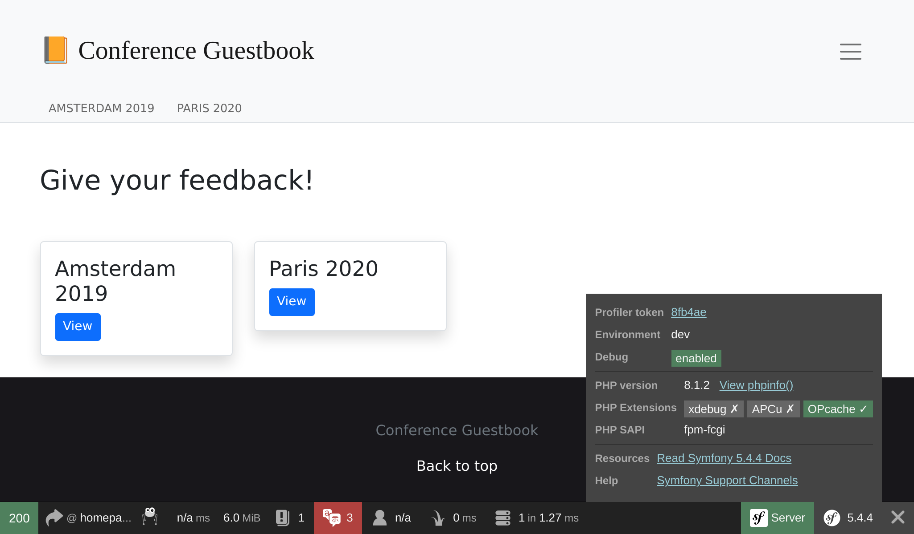

Discovering Symfony Internals
=============================

.. index::
    single: Blackfire
    single: Debugging
    single: Internals

We have been using Symfony to develop a powerful application for quite a while now, but most of the code executed by the application comes from Symfony. A few hundred lines of code versus thousands of lines of code.

I like to understand how things work behind the scenes. And I have always been fascinated by tools that help me understand how things work. The first time I used a step by step debugger or the first time I discovered ``ptrace`` are magical memories.

Would you like to better understand how Symfony works? Time to dig into how Symfony makes your application tick. Instead of describing how Symfony handles an HTTP request from a theoretical perspective, which would be quite boring, we are going to use Blackfire to get some visual representations and use it to discover some more advanced topics.

Understanding Symfony Internals with Blackfire
----------------------------------------------

You already know that all HTTP requests are served by a single entry point: the ``public/index.php`` file. But what happens next? How controllers are called?

Let's profile the English homepage in production with Blackfire via the Blackfire browser extension:

.. code-block:: terminal
    :class: ignore

    $ symfony remote:open

Or directly via the command line:

.. code-block:: terminal
    :class: ignore

    $ blackfire curl `symfony cloud:env:url --pipe --primary`en/

Go to the "Timeline" view of the profile, you should see something similar to the following:

.. figure:: images/blackfire-homepage-prod.png
    :alt: /
    :align: center
    :figclass: with-browser

From the timeline, hover on the colored bars to have more information about each call; you will learn a lot about how Symfony works:

* The main entry point is ``public/index.php``;

* The ``Kernel::handle()`` method handles the request;

* It calls the ``HttpKernel`` that dispatches some events;

* The first event is ``RequestEvent``;

* The ``ControllerResolver::getController()`` method is called to determine which controller should be called for the incoming URL;

* The ``ControllerResolver::getArguments()`` method is called to determine which arguments to pass to the controller (the param converter is called);

* The ``ConferenceController::index()`` method is called and most of our code is executed by this call;

* The ``ConferenceRepository::findAll()`` method gets all conferences from the database (notice the connection to the database via ``PDO::__construct()``);

* The ``Twig\Environment::render()`` method renders the template;

* The ``ResponseEvent`` and the ``FinishRequestEvent`` are dispatched, but it looks like no listeners are actually registered as they seem to be really fast to execute.

The timeline is a great way to understand how some code works; which is very useful when you get a project developed by someone else.

Now, profile the same page from the local machine in the development environment:

.. code-block:: terminal
    :class: ignore

    $ blackfire curl `symfony var:export SYMFONY_PROJECT_DEFAULT_ROUTE_URL`en/

Open the profile. You should be redirected to the call graph view as the request was really quick and the timeline would be quite empty:

.. figure:: images/blackfire-homepage-cached-dev.png
    :alt: /
    :align: center
    :figclass: with-browser

Do you understand what's going on? The HTTP cache is enabled and as such, we are profiling the Symfony HTTP cache layer. As the page is in the cache, ``HttpCache\Store::restoreResponse()`` is getting the HTTP response from its cache and the controller is never called.

Disable the cache layer in ``public/index.php`` as we did in the previous step and try again. You can immediately see that the profile looks very different:

.. figure:: images/blackfire-homepage-dev.png
    :alt: /
    :align: center
    :figclass: with-browser

The main differences are the following:

* The ``TerminateEvent``, which was not visible in production, takes a large percentage of the execution time; looking closer, you can see that this is the event responsible for storing the Symfony profiler data gathered during the request;

* Under the ``ConferenceController::index()`` call, notice the ``SubRequestHandler::handle()`` method that renders the ESI (that's why we have two calls to ``Profiler::saveProfile()``, one for the main request and one for the ESI).

Explore the timeline to learn more; switch to the call graph view to have a different representation of the same data.

As we have just discovered, the code executed in development and production is quite different. The development environment is slower as the Symfony profiler tries to gather many data to ease debugging problems. This is why you should always profile with the production environment, even locally.

Some interesting experiments: profile an error page, profile the ``/`` page (which is a redirect), or an API resource. Each profile will tell you a bit more about how Symfony works, which class/methods are called, what is expensive to run and what is cheap.

Using the Blackfire Debug Addon
-------------------------------

.. index::
    single: Blackfire;Debug Addon

By default, Blackfire removes all method calls that are not significant enough to avoid having big payloads and big graphs. When using Blackfire as a debugging tool, it is better to keep all calls. This is provided by the debug addon.

From the command line, use the ``--debug`` flag:

.. code-block:: terminal
    :class: ignore

    $ blackfire --debug curl `symfony var:export SYMFONY_PROJECT_DEFAULT_ROUTE_URL`en/
    $ blackfire --debug curl `symfony cloud:env:url --pipe --primary`en/

.. index::
    single: .env.local.prod

In production, you would see for instance the loading of a file named ``.env.local.php``:

.. figure:: images/blackfire-env-local-prod.png
    :alt: /
    :align: center
    :figclass: with-browser

.. index::
    single: Composer;Optimizations
    single: Composer;Autoloader
    single: Autoloader

Where does it come from? Platform.sh does some optimizations when deploying a Symfony application like optimizing the Composer autoloader (``--optimize-autoloader --apcu-autoloader --classmap-authoritative``). It also optimizes environment variables defined in the ``.env`` file (to avoid parsing the file for every request) by generating the ``.env.local.php`` file:

.. code-block:: terminal
    :class: ignore

    $ symfony run composer dump-env prod

Blackfire is a very powerful tool that helps understand how code is executed by PHP. Improving performance is just one way to use a profiler.

Using a Step Debugger with Xdebug
---------------------------------

.. index::
    single: Xdebug
    single: Debugger

Blackfire timelines and call graphs allow developers to visualize which files/functions/methods are executed by the PHP engine to better understand the project's code base.

Another way to follow code execution is to use a **step debugger** like `Xdebug`_. A step debugger allows developers to interactively walk through a PHP project code to debug control flow and examine data structures. It is very useful to debug unexpected behaviors and it replaces the common "var_dump()/exit()" debugging technique.

First, install the ``xdebug`` PHP extension. Check that it is installed by running the following command:

.. code-block:: terminal

    $ symfony php -v

You should see Xdebug in the output:

.. code-block:: text
    :emphasize-lines: 5
    :class: ignore

    PHP 8.0.1 (cli) (built: Jan 13 2021 08:22:35) ( NTS )
    Copyright (c) The PHP Group
    Zend Engine v4.0.1, Copyright (c) Zend Technologies
        with Zend OPcache v8.0.1, Copyright (c), by Zend Technologies
        with Xdebug v3.0.2, Copyright (c) 2002-2021, by Derick Rethans
        with blackfire v1.49.0~linux-x64-non_zts80, https://blackfire.io, by Blackfire

You can also check that Xdebug is enabled for PHP-FPM by going in the browser and clicking on the "View phpinfo()" link when hovering on the Symfony logo of the web debug toolbar:

Now, enable the ``debug`` mode of Xdebug:

.. code-block:: ini
    :caption: php.ini
    :class: ignore

    [xdebug]
    xdebug.mode=debug
    xdebug.start_with_request=yes

By default, Xdebug sends data to port 9003 of the local host.

Triggering Xdebug can be done in many ways, but the easiest is to use Xdebug from your IDE. In this chapter, we will use Visual Studio Code to demonstrate how it works. Install the `PHP Debug`_ extension by launching the "Quick Open" feature (``Ctrl+P``), paste the following command, and press enter:

.. code-block:: text
    :class: ignore

    ext install felixfbecker.php-debug

Create the following configuration file:

.. code-block:: json
    :caption: .vscode/launch.json
    :emphasize-lines: 8,16
    :class: ignore

    {
        "version": "0.2.0",
        "configurations": [
            {
                "name": "Listen for XDebug",
                "type": "php",
                "request": "launch",
                "port": 9003
            },
            {
                "name": "Launch currently open script",
                "type": "php",
                "request": "launch",
                "program": "${file}",
                "cwd": "${fileDirname}",
                "port": 9003
            }
        ]
    }

From Visual Studio Code and while being in your project directory, go to the debugger and click on the green play button labelled "Listen for Xdebug":

.. figure:: images/vs-xdebug-run.png
    :align: center

If you go to the browser and refresh, the IDE should automatically take the focus, meaning that the debugging session is ready. By default, everything is a breakpoint, so execution stops at the first instruction. It's then up to you to inspect the current variables, step over the code, step into the code, ...

When debugging, you can uncheck the "Everything" breakpoint and explicitely set breakpoints in your code.

If you are new to step debuggers, read the `excellent tutorial for Visual Studio Code`_, which explains everything visually.

.. sidebar:: Going Further

    * `The Xdebug Step Debugging docs`_;

    * `Debugging with Visual Studio Code`_.

.. _`Xdebug`: https://xdebug.org
.. _`PHP Debug`: https://marketplace.visualstudio.com/items?itemName=felixfbecker.php-debug
.. _`The Xdebug Step Debugging docs`: https://xdebug.org/docs/step_debug
.. _`excellent tutorial for Visual Studio Code`: https://code.visualstudio.com/Docs/editor/debugging
.. _`Debugging with Visual Studio Code`: https://code.visualstudio.com/Docs/editor/debugging
