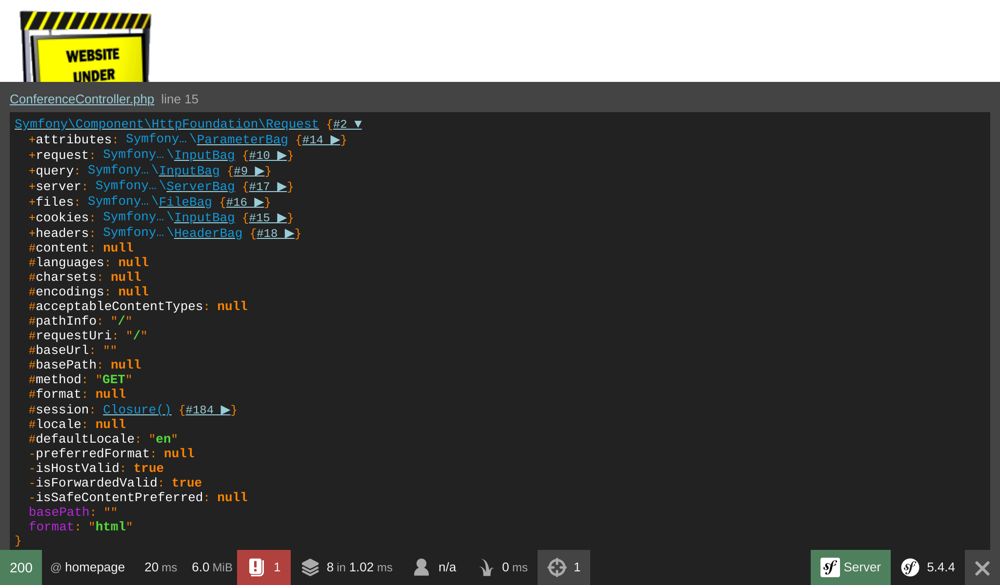

Creating a Controller
=====================

.. index::
    single: Controller
    single: Routing;Route

Our guestbook project is already live on production servers but we cheated a little bit. The project doesn't have any web pages yet. The homepage is served as a boring 404 error page. Let's fix that.

When an HTTP request comes in, like for the homepage (``http://localhost:8000/``), Symfony tries to find a *route* that matches the *request path* (``/`` here). A *route* is the link between the request path and a *PHP callable*, a function that creates the HTTP *response* for that request.

These callables are called "controllers". In Symfony, most controllers are implemented as PHP classes. You can create such a class manually, but because we like to go fast, let's see how Symfony can help us.

Being Lazy with the Maker Bundle
--------------------------------

.. index::
    single: Components;Maker Bundle
    single: Maker Bundle

To generate controllers effortlessly, we can use the ``symfony/maker-bundle`` package, which has been installed as part of the ``webapp`` package.

The maker bundle helps you generate a lot of different classes. We will use it all the time in this book. Each "generator" is defined in a command and all commands are part of the ``make`` command namespace.

.. index::
    single: Command;list

The Symfony Console built-in ``list`` command lists all commands available under a given namespace; use it to discover all generators provided by the maker bundle:

.. code-block:: terminal
    :class: ignore

    $ symfony console list make

Choosing a Configuration Format
-------------------------------

Before creating the first controller of the project, we need to decide on the configuration formats we want to use. Symfony supports YAML, XML, PHP, and PHP attributes out of the box.

For *configuration related to packages*, *YAML* is the best choice. This is the format used in the ``config/`` directory. Often, when you install a new package, that package's recipe will add a new file ending in ``.yaml`` to that directory.

For *configuration related to PHP code*, *attributes* are a better choice as they are defined next to the code. Let me explain with an example. When a request comes in, some configuration needs to tell Symfony that the request path should be handled by a specific controller (a PHP class). When using YAML, XML or PHP configuration formats, two files are involved (the configuration file and the PHP controller file). When using attributes, the configuration is done directly in the controller class.

You might wonder how you can guess the package name you need to install for a feature? Most of the time, you don't need to know. In many cases, Symfony contains the package to install in its error messages. Running ``symfony console make:message`` without the ``messenger`` package for instance would have ended with an exception containing a hint about installing the right package.

Generating a Controller
-----------------------

.. index::
    single: Command;make:controller

Create your first *Controller* via the ``make:controller`` command:

.. code-block:: terminal

    $ symfony console make:controller ConferenceController

.. index::
    single: Components;Routing
    single: Attributes;Route

The command creates a ``ConferenceController`` class under the ``src/Controller/`` directory. The generated class consists of some boilerplate code ready to be fine-tuned:

.. code-block:: php
    :caption: src/Controller/ConferenceController.php
    :class: ignore
    :emphasize-lines: 9

    namespace App\Controller;

    use Symfony\Bundle\FrameworkBundle\Controller\AbstractController;
    use Symfony\Component\HttpFoundation\Response;
    use Symfony\Component\Routing\Annotation\Route;

    class ConferenceController extends AbstractController
    {
        #[Route('/conference', name: 'conference')]
        public function index(): Response
        {
            return $this->render('conference/index.html.twig', [
                'controller_name' => 'ConferenceController',
            ]);
        }
    }

The ``#[Route('/conference', name: 'conference')]`` attribute is what makes the ``index()`` method a controller (the configuration is next to the code that it configures).

When you hit ``/conference`` in a browser, the controller is executed and a response is returned.

Tweak the route to make it match the homepage:

.. code-block:: diff
    :caption: patch_file
    :emphasize-lines: 7

    --- a/src/Controller/ConferenceController.php
    +++ b/src/Controller/ConferenceController.php
    @@ -8,7 +8,7 @@ use Symfony\Component\Routing\Annotation\Route;

     class ConferenceController extends AbstractController
     {
    -    #[Route('/conference', name: 'conference')]
    +    #[Route('/', name: 'homepage')]
         public function index(): Response
         {
             return $this->render('conference/index.html.twig', [

The route ``name`` will be useful when we want to reference the homepage in the code. Instead of hard-coding the ``/`` path, we will use the route name.

Instead of the default rendered page, let's return a simple HTML one:

.. code-block:: diff
    :caption: patch_file
    :emphasize-lines: 18

    --- a/src/Controller/ConferenceController.php
    +++ b/src/Controller/ConferenceController.php
    @@ -11,8 +11,13 @@ class ConferenceController extends AbstractController
         #[Route('/', name: 'homepage')]
         public function index(): Response
         {
    -        return $this->render('conference/index.html.twig', [
    -            'controller_name' => 'ConferenceController',
    -        ]);
    +        return new Response(<<<EOF
    +<html>
    +    <body>
    +        
    +    </body>
    +</html>
    +EOF
    +        );
         }
     }

Refresh the browser:

.. figure:: screenshots/under-construction-homepage.png
    :alt: /
    :align: center
    :figclass: with-browser

The main responsibility of a controller is to return an HTTP ``Response`` for the request.

As the rest of the chapter is about code that we won't keep, let's commit our changes now:

.. code-block:: terminal
    :class: ignore

    $ git add .
    $ git commit -m'Add the index controller'

.. _easter-egg:

Adding an Easter Egg
--------------------

To demonstrate how a response can leverage information from the request, let's add a small `Easter egg`_. Whenever the homepage contains a query string like ``?hello=Fabien``, let's add some text to greet the person:

.. code-block:: diff
    :emphasize-lines: 18

    --- a/src/Controller/ConferenceController.php
    +++ b/src/Controller/ConferenceController.php
    @@ -3,17 +3,24 @@
     namespace App\Controller;

     use Symfony\Bundle\FrameworkBundle\Controller\AbstractController;
    +use Symfony\Component\HttpFoundation\Request;
     use Symfony\Component\HttpFoundation\Response;
     use Symfony\Component\Routing\Annotation\Route;

     class ConferenceController extends AbstractController
     {
         #[Route('/', name: 'homepage')]
    -    public function index(): Response
    +    public function index(Request $request): Response
         {
    +        $greet = '';
    +        if ($name = $request->query->get('hello')) {
    +            $greet = sprintf('<h1>Hello %s!</h1>', htmlspecialchars($name));
    +        }
    +
             return new Response(<<<EOF
     <html>
         <body>
    +        $greet
             
         </body>
     </html>

Symfony exposes the request data through a ``Request`` object. When Symfony sees a controller argument with this type-hint, it automatically knows to pass it to you. We can use it to get the ``name`` item from the query string and add an ``<h1>`` title.

Try hitting ``/`` then ``/?hello=Fabien`` in a browser to see the difference.

.. note::

    Notice the call to ``htmlspecialchars()`` to avoid XSS issues. This is something that will be done automatically for us when we switch to a proper template engine.

We could also have made the name part of the URL:

.. code-block:: diff

    --- a/src/Controller/ConferenceController.php
    +++ b/src/Controller/ConferenceController.php
    @@ -9,11 +9,11 @@ use Symfony\Component\Routing\Annotation\Route;

     class ConferenceController extends AbstractController
     {
    -    #[Route('/', name: 'homepage')]
    -    public function index(Request $request): Response
    +    #[Route('/hello/{name}', name: 'homepage')]
    +    public function index(string $name = ''): Response
         {
             $greet = '';
    -        if ($name = $request->query->get('hello')) {
    +        if ($name) {
                 $greet = sprintf('<h1>Hello %s!</h1>', htmlspecialchars($name));
             }

The ``{name}`` part of the route is a dynamic *route parameter* - it works like a wildcard. You can now hit ``/hello`` then ``/hello/Fabien`` in a browser to get the same results as before. You can get the *value* of the ``{name}`` parameter by adding a controller argument with the same *name*. So, ``$name``.

Revert the changes we have just made:

.. code-block:: terminal

    $ git checkout src/Controller/ConferenceController.php

.. code-block:: terminal
    :class: hide

    $ git reset HEAD src/Controller/ConferenceController.php
    $ git checkout src/Controller/ConferenceController.php

Debugging Variables
-------------------

.. index::
    single: Components;VarDumper
    single: VarDumper
    single: dump

A great debug helper is the Symfony ``dump()`` function. It is always available and allows you to dump complex variables in a nice and interactive format.

Temporarily change ``src/Controller/ConferenceController.php`` to dump the Request object:

.. code-block:: diff
    :emphasize-lines: 17

    --- a/src/Controller/ConferenceController.php
    +++ b/src/Controller/ConferenceController.php
    @@ -3,14 +3,17 @@
     namespace App\Controller;

     use Symfony\Bundle\FrameworkBundle\Controller\AbstractController;
    +use Symfony\Component\HttpFoundation\Request;
     use Symfony\Component\HttpFoundation\Response;
     use Symfony\Component\Routing\Annotation\Route;

     class ConferenceController extends AbstractController
     {
         #[Route('/', name: 'homepage')]
    -    public function index(): Response
    +    public function index(Request $request): Response
         {
    +        dump($request);
    +
             return new Response(<<<EOF
     <html>
         <body>

When refreshing the page, notice the new "target" icon in the toolbar; it lets you inspect the dump. Click on it to access a full page where navigating is made simpler:

.. index::
    single: Git;checkout

Revert the changes we have just made:

.. code-block:: terminal

    $ git checkout src/Controller/ConferenceController.php

.. code-block:: terminal
    :class: hide

    $ git reset HEAD src/Controller/ConferenceController.php
    $ git checkout src/Controller/ConferenceController.php

.. sidebar:: Going Further

    * The Symfony `Routing`_ system;

    * `SymfonyCasts Routes, Controllers & Pages tutorial`_;

    * `PHP attributes`_;

    * The `HttpFoundation`_ component;

    * `XSS (Cross-Site Scripting)`_ security attacks;

    * The `Symfony Routing Cheat Sheet`_.

.. _`Easter egg`: https://en.wikipedia.org/wiki/Easter_egg_(media)#In_computing
.. _`Routing`: https://symfony.com/doc/current/routing.html
.. _`SymfonyCasts Routes, Controllers & Pages tutorial`: https://symfonycasts.com/screencast/symfony/route-controller
.. _`PHP attributes`: https://www.php.net/attributes
.. _`HttpFoundation`: https://symfony.com/doc/current/components/http_foundation.html
.. _`XSS (Cross-Site Scripting)`: https://owasp.org/www-community/attacks/xss/
.. _`Symfony Routing Cheat Sheet`: https://github.com/andreia/symfony-cheat-sheets/blob/master/Symfony4/routing_en_part1.pdf
