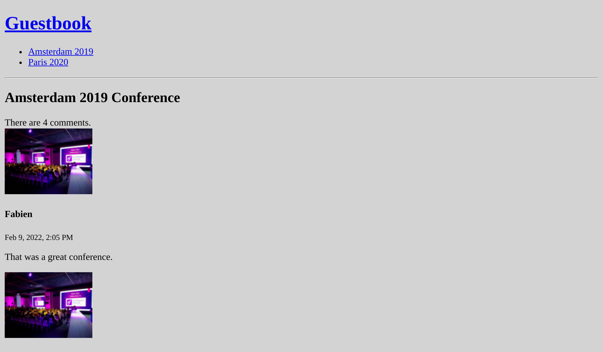

Gestione del ciclo di vita degli oggetti Doctrine
=================================================

Quando si crea un nuovo commento, sarebbe fantastico se la data ``createdAt`` fosse impostata automaticamente su data e ora correnti.

Doctrine ha diversi modi per manipolare oggetti e proprietà durante il loro ciclo di vita (prima della creazione della riga nel database, dopo l'aggiornamento della riga, ....).

Definizione delle callback nel ciclo di vita
--------------------------------------------

.. index::
    single: Doctrine;Lifecycle
    single: Attributes;ORM\\Entity
    single: Attributes;ORM\\HasLifecycleCallbacks
    single: Attributes;ORM\\PrePersist

Quando la funzionalità non necessita di alcun servizio e dovrebbe essere applicato a un solo tipo di entity, definiamo una callback nella classe entity:

.. code-block:: diff
    :caption: patch_file

    --- a/src/Entity/Comment.php
    +++ b/src/Entity/Comment.php
    @@ -6,6 +6,7 @@ use App\Repository\CommentRepository;
     use Doctrine\ORM\Mapping as ORM;

     #[ORM\Entity(repositoryClass: CommentRepository::class)]
    +#[ORM\HasLifecycleCallbacks]
     class Comment
     {
         #[ORM\Id]
    @@ -90,6 +91,12 @@ class Comment
             return $this;
         }

    +    #[ORM\PrePersist]
    +    public function setCreatedAtValue()
    +    {
    +        $this->createdAt = new \DateTimeImmutable();
    +    }
    +
         public function getConference(): ?Conference
         {
             return $this->conference;

L'*evento* ``ORM\PrePersist`` viene invocato quando l'oggetto viene salvato nel database per la prima volta. Quando questo accade, il metodo ``setCreatedAtValue()``  viene chiamato e data e ora corrente vengono assegnati alla proprietà ``createdAt``.

Aggiungiamo uno slug alle conferenze
------------------------------------

Gli URL per le conferenze non sono significativi: ``/conference/1``. Ancora più importante, essi dipendono da un dettaglio d'implementazione (la chiave primaria del database è esposta).

Che ne pensi di usare invece il seguente URL ``/conference/paris-2020``? Molto meglio, no? ``paris-2020`` non è altro che lo *slug*  della conferenza.

.. index::
    single: Command;make:entity

Aggiungere una nuova proprietà ``slug`` per le conferenze (una stringa ``not null`` di 255 caratteri):

.. code-block:: terminal
    :class: answers(slug||string||255||no)

    $ symfony console make:entity Conference

.. index::
    single: Command;make:migration

Creare un file di migrazione per aggiungere la nuova colonna:

.. code-block:: terminal

    $ symfony console make:migration

.. index::
    single: Command;doctrine:migrations:migrate

Ed eseguire la nuova migrazione:

.. code-block:: terminal
    :class: ignore

    $ symfony console doctrine:migrations:migrate

Riceviamo un errore? È previsto. Perché? Perché abbiamo chiesto che il campo slug sia ``not null``, ma le tuple esistenti nel tabella delle conferenze avranno un ``null`` come valore quando si esegue la migrazione. Sistemiamo la situazione modificando la migrazione:

.. code-block:: diff
    :caption: patch_file

    --- a/migrations/Version00000000000000.php
    +++ b/migrations/Version00000000000000.php
    @@ -20,7 +20,9 @@ final class Version00000000000000 extends AbstractMigration
         public function up(Schema $schema): void
         {
             // this up() migration is auto-generated, please modify it to your needs
    -        $this->addSql('ALTER TABLE conference ADD slug VARCHAR(255) NOT NULL');
    +        $this->addSql('ALTER TABLE conference ADD slug VARCHAR(255)');
    +        $this->addSql("UPDATE conference SET slug=CONCAT(LOWER(city), '-', year)");
    +        $this->addSql('ALTER TABLE conference ALTER COLUMN slug SET NOT NULL');
         }

         public function down(Schema $schema): void

Il trucco da applicare in questo caso è quello di aggiungere la colonna e permettergli di essere ``null``, poi impostare lo slug con un valore non ``null`` e infine modificare la colonna ``slug`` per non consentire più valori ``null``.

.. note::

    Per un progetto reale, l'uso di ``CONCAT(LOWER(city), '-', year)`` potrebbe non essere sufficiente. In questo caso, dovremmo usare il "vero" Slugger.

.. index::
    single: Command;doctrine:migrations:migrate

La migrazione dovrebbe funzionare correttamente ora:

.. code-block:: terminal
    :class: answers(y)

    $ symfony console doctrine:migrations:migrate

.. index::
    single: Attributes;ORM\\UniqueEntity
    single: Attributes;ORM\\Column
    single: Components;Validator

Poiché l'applicazione utilizzerà presto lo slug per trovare ogni conferenza, modifichiamo l'entity Conference per assicurarci che i valori della colonna slug siano unici nel database:

.. code-block:: diff
    :caption: patch_file

    --- a/src/Entity/Conference.php
    +++ b/src/Entity/Conference.php
    @@ -6,8 +6,10 @@ use App\Repository\ConferenceRepository;
     use Doctrine\Common\Collections\ArrayCollection;
     use Doctrine\Common\Collections\Collection;
     use Doctrine\ORM\Mapping as ORM;
    +use Symfony\Bridge\Doctrine\Validator\Constraints\UniqueEntity;

     #[ORM\Entity(repositoryClass: ConferenceRepository::class)]
    +#[UniqueEntity('slug')]
     class Conference
     {
         #[ORM\Id]
    @@ -27,7 +29,7 @@ class Conference
         #[ORM\OneToMany(mappedBy: 'conference', targetEntity: Comment::class, orphanRemoval: true)]
         private $comments;

    -    #[ORM\Column(type: 'string', length: 255)]
    +    #[ORM\Column(type: 'string', length: 255, unique: true)]
         private $slug;

         public function __construct()

.. index::
    single: Command;make:migration

Come avrete intuito, dobbiamo eseguire una migrazione:

.. code-block:: terminal

    $ symfony console make:migration

.. index::
    single: Command;doctrine:migrations:migrate

.. code-block:: terminal
    :class: answers(y)

    $ symfony console doctrine:migrations:migrate

Generazione di slug
-------------------

.. index::
    single: Components;String
    single: Slug

Generare uno slug in modo da rendere gli URL più parlanti (dove tutti i caratteri non ASCII dovrebbero essere codificati) è un compito impegnativo, specialmente per lingue diverse dall'inglese. Come possiamo convertire ad esempio ``é`` con ``e``?

Invece di reinventare la ruota, usiamo il componente Symfony ``String``, che facilita la manipolazione delle stringhe e fornisce uno *slugger*.

Aggiungiamo alla classe ``Conference`` un metodo ``computeSlug()``, che calcola lo slug in base ai dati della conferenza:

.. code-block:: diff
    :caption: patch_file

    --- a/src/Entity/Conference.php
    +++ b/src/Entity/Conference.php
    @@ -7,6 +7,7 @@ use Doctrine\Common\Collections\ArrayCollection;
     use Doctrine\Common\Collections\Collection;
     use Doctrine\ORM\Mapping as ORM;
     use Symfony\Bridge\Doctrine\Validator\Constraints\UniqueEntity;
    +use Symfony\Component\String\Slugger\SluggerInterface;

     #[ORM\Entity(repositoryClass: ConferenceRepository::class)]
     #[UniqueEntity('slug')]
    @@ -47,6 +48,13 @@ class Conference
             return $this->id;
         }

    +    public function computeSlug(SluggerInterface $slugger)
    +    {
    +        if (!$this->slug || '-' === $this->slug) {
    +            $this->slug = (string) $slugger->slug((string) $this)->lower();
    +        }
    +    }
    +
         public function getCity(): ?string
         {
             return $this->city;

Il metodo ``computeSlug()`` calcola uno slug solo quando la proprietà slug corrente è vuota oppure impostata a un valore speciale ``-``. Perché ci serve il valore speciale ``-``? Perché quando si aggiunge una conferenza nel backend, lo slug è obbligatorio. Quindi, abbiamo bisogno di un valore non vuoto che dica all'applicazione che vogliamo che lo slug sia generato automaticamente.

Definizione di una callback complessa del ciclo di vita
-------------------------------------------------------

.. index::
    single: Doctrine;Entity Listener

Come per la proprietà ``createdAt``,  anche la proprietà ``slug`` dovrebbe essere impostata automaticamente ogni volta che la conferenza viene aggiornata, richiamando il metodo ``computeSlug()``.

Ma poiché questo metodo dipende dall'implementazione di ``SluggerInterface``, non possiamo aggiungere un'evento ``prePersist`` come fatto in precedenza (non abbiamo modo di iniettare il servizio slugger).

Invece, creiamo un listener per entity di Doctrine:

.. code-block:: php
    :caption: src/EntityListener/ConferenceEntityListener.php

    namespace App\EntityListener;

    use App\Entity\Conference;
    use Doctrine\ORM\Event\LifecycleEventArgs;
    use Symfony\Component\String\Slugger\SluggerInterface;

    class ConferenceEntityListener
    {
        private $slugger;

        public function __construct(SluggerInterface $slugger)
        {
            $this->slugger = $slugger;
        }

        public function prePersist(Conference $conference, LifecycleEventArgs $event)
        {
            $conference->computeSlug($this->slugger);
        }

        public function preUpdate(Conference $conference, LifecycleEventArgs $event)
        {
            $conference->computeSlug($this->slugger);
        }
    }

Si noti che lo slug viene aggiornato quando viene creata una nuova conferenza (``prePersist()``) e ogni volta che viene aggiornata (``preUpdate()``).

Configurazione di un servizio nel container
-------------------------------------------

.. index::
    single: Components;Dependency Injection
    single: Dependency Injection

Finora non si è parlato di un componente chiave di Symfony, il *dependency injection container* . Il container è responsabile della gestione dei *servizi* : li crea e li inietta quando necessario.

Un *servizio* è un oggetto "globale" che fornisce funzionalità (es. un mailer, un logger, uno slugger, ecc.) a differenza dei *data object* (es. istanze di entity di Doctrine).

Raramente si interagisce direttamente con il container, che automaticamente inietta i servizi ogni volta che ne avete bisogno: il container inietta gli oggetti come parametri dei controller, se tipizzati.

Se ci si è chiesti come è stato registrato il listener nel passo precedente, ora si ha la risposta: il container. Quando una classe implementa alcune interfacce specifiche, il container sa che la classe deve essere registrata in un certo modo.

Purtroppo, l'automazione non è prevista per tutto, specialmente per i pacchetti di terze parti. Il listener per entity che abbiamo appena scritto ne è un esempio: non può essere gestito automaticamente dal container di servizi di Symfony, in quanto non implementa alcuna interfaccia e non estende una "classe nota".

Dobbiamo dichiarare parzialmente il listener nel container. La configurazione delle dipendenze può essere omessa, in quanto può essere ricavata dal container, ma occorre aggiungere manualmente alcuni *tag* per registrare il listener nel dispatcher di eventi di Doctrine:

.. code-block:: diff
    :caption: patch_file

    --- a/config/services.yaml
    +++ b/config/services.yaml
    @@ -22,3 +22,7 @@ services:

         # add more service definitions when explicit configuration is needed
         # please note that last definitions always *replace* previous ones
    +    App\EntityListener\ConferenceEntityListener:
    +        tags:
    +            - { name: 'doctrine.orm.entity_listener', event: 'prePersist', entity: 'App\Entity\Conference'}
    +            - { name: 'doctrine.orm.entity_listener', event: 'preUpdate', entity: 'App\Entity\Conference'}

.. note::

    Non confondiamo i listener di eventi di Doctrine con quelli di Symfony. Anche se hanno un aspetto molto simile, dietro le quinte non utilizzano la stessa struttura.

Usare gli slug nell'applicazione
--------------------------------

Proviamo ad aggiungere più conferenze nel backend e cambiamo la città o l'anno di una esistente: lo slug non verrà aggiornato a meno che non si utilizzi il valore speciale ``-``.

.. index::
    single: Twig;for
    single: Twig;if
    single: Twig;path
    single: Attributes;Route

L'ultima modifica è quella di aggiornare i controller e i template per utilizzare nelle rotte lo ``slug`` della conferenza al posto del suo ``id``:

.. code-block:: diff
    :caption: patch_file

    --- a/src/Controller/ConferenceController.php
    +++ b/src/Controller/ConferenceController.php
    @@ -28,7 +28,7 @@ class ConferenceController extends AbstractController
             ]));
         }

    -    #[Route('/conference/{id}', name: 'conference')]
    +    #[Route('/conference/{slug}', name: 'conference')]
         public function show(Request $request, Conference $conference, CommentRepository $commentRepository): Response
         {
             $offset = max(0, $request->query->getInt('offset', 0));
    --- a/templates/base.html.twig
    +++ b/templates/base.html.twig
    @@ -18,7 +18,7 @@
                 <h1><a href="{{ path('homepage') }}">Guestbook</a></h1>
                 <ul>
                 
    -                <li><a href="{{ path('conference', { id: conference.id }) }}">{{ conference }}</a></li>
    +                <li><a href="{{ path('conference', { slug: conference.slug }) }}">{{ conference }}</a></li>
                 
                 </ul>
                 

    --- a/templates/conference/index.html.twig
    +++ b/templates/conference/index.html.twig
    @@ -8,7 +8,7 @@
         
             <h4>{{ conference }}</h4>
             

    -            <a href="{{ path('conference', { id: conference.id }) }}">View</a>
    +            <a href="{{ path('conference', { slug: conference.slug }) }}">View</a>
             

         
     
    --- a/templates/conference/show.html.twig
    +++ b/templates/conference/show.html.twig
    @@ -22,10 +22,10 @@
             

             
    -            <a href="{{ path('conference', { id: conference.id, offset: previous }) }}">Previous</a>
    +            <a href="{{ path('conference', { slug: conference.slug, offset: previous }) }}">Previous</a>
             
             
    -            <a href="{{ path('conference', { id: conference.id, offset: next }) }}">Next</a>
    +            <a href="{{ path('conference', { slug: conference.slug, offset: next }) }}">Next</a>
             
         
             
No comments have been posted yet for this conference.

L'accesso alle pagine della conferenza dovrebbe ora avvenire tramite il suo slug:

.. sidebar:: Andare oltre

    * Il `sistema di eventi di Doctrine`_ (ciclo di vita delle callback, dei listener e dei subscriber);

    * `Documentazione del componente String`_;

    * Il `Service container`_;

    * `Cheat Sheet di Symfony Services`_.

.. _`sistema di eventi di Doctrine`: https://symfony.com/doc/current/doctrine/events.html
.. _`Documentazione del componente String`: https://symfony.com/doc/current/components/string.html
.. _`Service container`: https://symfony.com/doc/current/service_container.html
.. _`Cheat Sheet di Symfony Services`: https://github.com/andreia/symfony-cheat-sheets/blob/master/Symfony4/services_en_42.pdf
