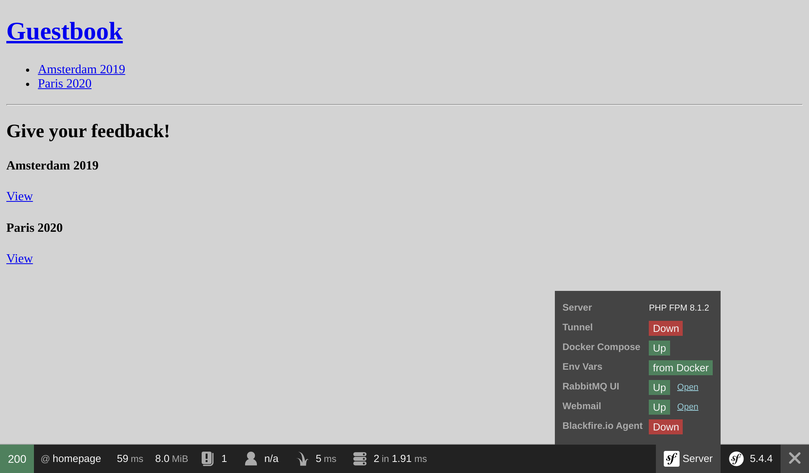

Invio di e-mail agli amministratori
===================================

.. index::
    single: Components;Mailer
    single: Mailer
    single: Emails

Per garantire un feedback di alta qualità, l'amministratore deve moderare tutti i commenti. Quando un commento è nello stato ``ham`` o ``potential_spam`` deve essere inviata un'*e-mail* all'amministratore con due link: uno per accettare il commento e uno per rifiutarlo.

Impostare un'e-mail per l'amministratore
----------------------------------------

Per memorizzare l'e-mail dell'amministratore utilizziamo un parametro del container. A scopo dimostrativo permetteremo di impostarlo tramite una variabile d'ambiente (non dovrebbe essere necessario nella "vita reale"). Per facilitarne l'iniezione nei servizi che richiedono l'e-mail dell'amministratore, definiamo un ``bind`` nelle impostazioni del container.

.. code-block:: diff
    :caption: patch_file

    --- a/config/services.yaml
    +++ b/config/services.yaml
    @@ -4,6 +4,7 @@
     # Put parameters here that don't need to change on each machine where the app is deployed
     # https://symfony.com/doc/current/best_practices.html#use-parameters-for-application-configuration
     parameters:
    +    default_admin_email: admin@example.com

     services:
         # default configuration for services in *this* file
    @@ -13,6 +14,7 @@ services:
             bind:
                 string $photoDir: "%kernel.project_dir%/public/uploads/photos"
                 string $akismetKey: "%env(AKISMET_KEY)%"
    +            string $adminEmail: "%env(string:default:default_admin_email:ADMIN_EMAIL)%"

         # makes classes in src/ available to be used as services
         # this creates a service per class whose id is the fully-qualified class name

Una variabile d'ambiente può essere "processata" prima di essere utilizzata. Qui stiamo usando il processore di ``default`` per restituire il valore del parametro ``default_admin_email`` nel caso in cui la variabile d'ambiente ``ADMIN_EMAIL``  non esista.

Invio di un'e-mail di notifica
------------------------------

Per inviare un'e-mail, è possibile scegliere tra diverse astrazioni della classe ``Email``: da ``Message``, il livello più basso, a ``NotificationEmail``, quello più alto. Probabilmente utilizzeremo più di frequente la classe ``Email``, tuttavia ``NotificationEmail`` è la scelta perfetta per le e-mail interne.

Nel gestore dei messaggi, sostituiamo la logica di auto-validazione:

.. code-block:: diff
    :caption: patch_file

    --- a/src/MessageHandler/CommentMessageHandler.php
    +++ b/src/MessageHandler/CommentMessageHandler.php
    @@ -7,6 +7,8 @@ use App\Repository\CommentRepository;
     use App\SpamChecker;
     use Doctrine\ORM\EntityManagerInterface;
     use Psr\Log\LoggerInterface;
    +use Symfony\Bridge\Twig\Mime\NotificationEmail;
    +use Symfony\Component\Mailer\MailerInterface;
     use Symfony\Component\Messenger\Handler\MessageHandlerInterface;
     use Symfony\Component\Messenger\MessageBusInterface;
     use Symfony\Component\Workflow\WorkflowInterface;
    @@ -18,15 +20,19 @@ class CommentMessageHandler implements MessageHandlerInterface
         private $commentRepository;
         private $bus;
         private $workflow;
    +    private $mailer;
    +    private $adminEmail;
         private $logger;

    -    public function __construct(EntityManagerInterface $entityManager, SpamChecker $spamChecker, CommentRepository $commentRepository, MessageBusInterface $bus, WorkflowInterface $commentStateMachine, LoggerInterface $logger = null)
    +    public function __construct(EntityManagerInterface $entityManager, SpamChecker $spamChecker, CommentRepository $commentRepository, MessageBusInterface $bus, WorkflowInterface $commentStateMachine, MailerInterface $mailer, string $adminEmail, LoggerInterface $logger = null)
         {
             $this->entityManager = $entityManager;
             $this->spamChecker = $spamChecker;
             $this->commentRepository = $commentRepository;
             $this->bus = $bus;
             $this->workflow = $commentStateMachine;
    +        $this->mailer = $mailer;
    +        $this->adminEmail = $adminEmail;
             $this->logger = $logger;
         }

    @@ -51,8 +57,13 @@ class CommentMessageHandler implements MessageHandlerInterface

                 $this->bus->dispatch($message);
             } elseif ($this->workflow->can($comment, 'publish') || $this->workflow->can($comment, 'publish_ham')) {
    -            $this->workflow->apply($comment, $this->workflow->can($comment, 'publish') ? 'publish' : 'publish_ham');
    -            $this->entityManager->flush();
    +            $this->mailer->send((new NotificationEmail())
    +                ->subject('New comment posted')
    +                ->htmlTemplate('emails/comment_notification.html.twig')
    +                ->from($this->adminEmail)
    +                ->to($this->adminEmail)
    +                ->context(['comment' => $comment])
    +            );
             } elseif ($this->logger) {
                 $this->logger->debug('Dropping comment message', ['comment' => $comment->getId(), 'state' => $comment->getState()]);
             }

L'interfaccia ``MailerInterface`` è il punto di ingresso principale e permette di inviare e-mail tramite il metodo ``send()``.

Per inviare un'e-mail abbiamo bisogno di un mittente (l'intestazione ``From`` o ``Sender``). Invece di impostarlo esplicitamente nell'istanza della classe Email, definiamolo globalmente:

.. code-block:: diff
    :caption: patch_file

    --- a/config/packages/mailer.yaml
    +++ b/config/packages/mailer.yaml
    @@ -1,3 +1,5 @@
     framework:
         mailer:
             dsn: '%env(MAILER_DSN)%'
    +        envelope:
    +            sender: "%env(string:default:default_admin_email:ADMIN_EMAIL)%"

Estendere il template dell'e-mail di notifica.
----------------------------------------------

.. index::
    single: Twig;extends
    single: Twig;block
    single: Twig;url

Il template dell'e-mail di notifica eredita dal template dell'e-mail predefinito, fornito da Symfony:

.. code-block:: html+twig
    :caption: templates/emails/comment_notification.html.twig

    

    
        Author: {{ comment.author }} 
        Email: {{ comment.email }} 
        State: {{ comment.state }} 

        

            {{ comment.text }}
        

    

    
        <spacer size="16"></spacer>
        <button href="{{ url('review_comment', { id: comment.id }) }}">Accept</button>
        <button href="{{ url('review_comment', { id: comment.id, reject: true }) }}">Reject</button>
    

Il modello sovrascrive alcuni blocchi per personalizzare il messaggio dell'e-mail e per aggiungere alcuni link che permettono all'amministratore di accettare o rifiutare un commento. Qualsiasi parametro non incluso nella rotta viene aggiunto come elemento di query string (l'URL di rifiuto sarà simile a ``/admin/comment/review/42?reject=true``).

Il modello predefinito ``NotificationEmail`` utilizza `Inky`_ invece di HTML per il design delle e-mail. Aiuta a creare e-mail responsive e compatibili con tutti i client di posta elettronica più diffusi.

Per la massima compatibilità con i lettori di posta elettronica, il layout base della notifica riporta, per impostazione predefinita, tutti i fogli di stile (tramite il pacchetto CSS inliner).

Queste due caratteristiche fanno parte delle estensioni opzionali di Twig, che devono essere installate:

.. code-block:: terminal

    $ symfony composer req "twig/cssinliner-extra:^3" "twig/inky-extra:^3"

Generare URL assoluti in un comando
-----------------------------------

.. index::
    single: Twig;Link
    single: Link

Nelle e-mail, dobbiamo generare gli URL usando ``url()`` al posto di ``path()``, perché devono essere assoluti (comprensivi di schema e host).

L'e-mail viene inviata dal message handler, nella console. Generare URL assoluti soiltamente è più facile, poiché conosciamo lo schema e il dominio della pagina corrente. Questo non è il caso della console.

Definire il nome di dominio e lo schema da utilizzare esplicitamente:

.. code-block:: diff
    :caption: patch_file

    --- a/config/services.yaml
    +++ b/config/services.yaml
    @@ -5,6 +5,11 @@
     # https://symfony.com/doc/current/best_practices.html#use-parameters-for-application-configuration
     parameters:
         default_admin_email: admin@example.com
    +    default_domain: '127.0.0.1'
    +    default_scheme: 'http'
    +
    +    router.request_context.host: '%env(default:default_domain:SYMFONY_DEFAULT_ROUTE_HOST)%'
    +    router.request_context.scheme: '%env(default:default_scheme:SYMFONY_DEFAULT_ROUTE_SCHEME)%'

     services:
         # default configuration for services in *this* file

Le variabili d'ambiente ``SYMFONY_DEFAULT_ROUTE_HOST`` e ``SYMFONY_DEFAULT_ROUTE_PORT`` sono impostate automaticamente in locale quando si usa il binario ``symfony``. Sono determinate in base alla configurazione di Platform.sh.

Collegare una rotta a un controller
-----------------------------------

La rotta ``review_comment`` non esiste ancora: creiamo un controller di amministrazione per gestirla:

.. code-block:: php
    :caption: src/Controller/AdminController.php

    namespace App\Controller;

    use App\Entity\Comment;
    use App\Message\CommentMessage;
    use Doctrine\ORM\EntityManagerInterface;
    use Symfony\Bundle\FrameworkBundle\Controller\AbstractController;
    use Symfony\Component\HttpFoundation\Request;
    use Symfony\Component\HttpFoundation\Response;
    use Symfony\Component\Messenger\MessageBusInterface;
    use Symfony\Component\Routing\Annotation\Route;
    use Symfony\Component\Workflow\Registry;
    use Twig\Environment;

    class AdminController extends AbstractController
    {
        private $twig;
        private $entityManager;
        private $bus;

        public function __construct(Environment $twig, EntityManagerInterface $entityManager, MessageBusInterface $bus)
        {
            $this->twig = $twig;
            $this->entityManager = $entityManager;
            $this->bus = $bus;
        }

        #[Route('/admin/comment/review/{id}', name: 'review_comment')]
        public function reviewComment(Request $request, Comment $comment, Registry $registry): Response
        {
            $accepted = !$request->query->get('reject');

            $machine = $registry->get($comment);
            if ($machine->can($comment, 'publish')) {
                $transition = $accepted ? 'publish' : 'reject';
            } elseif ($machine->can($comment, 'publish_ham')) {
                $transition = $accepted ? 'publish_ham' : 'reject_ham';
            } else {
                return new Response('Comment already reviewed or not in the right state.');
            }

            $machine->apply($comment, $transition);
            $this->entityManager->flush();

            if ($accepted) {
                $this->bus->dispatch(new CommentMessage($comment->getId()));
            }

            return new Response($this->twig->render('admin/review.html.twig', [
                'transition' => $transition,
                'comment' => $comment,
            ]));
        }
    }

L'URL per la revisione del commento deve iniziare con ``/admin/``, per essere protetto dal firewall definito in un passo precedente. L'amministratore deve essere autenticato per accedere a questa risorsa.

Invece di creare un'istanza della classe ``Response`` abbiamo usato il metodo ``render()``, una scorciatoia fornita dalla classe controller base ``AbstractController``.

.. index::
    single: Twig;extends
    single: Twig;block

Una volta eseguita la revisione, un breve template mostra un ringraziamento all'admin per il duro lavoro svolto:

.. code-block:: html+twig
    :caption: templates/admin/review.html.twig

    

    
        <h2>Comment reviewed, thank you!</h2>

        
Applied transition: <strong>{{ transition }}</strong>

        
New state: <strong>{{ comment.state }}</strong>

    

Usare un mail catcher
---------------------

.. index::
    single: Docker;Mail Catcher

Invece di inviare e-mail tramite un server SMTP "reale" o un provider di terze parti, possiamo usare un mail catcher. Un mail catcher fornisce un server SMTP che non invia i messaggi, ma li rende disponibili attraverso un'interfaccia web. Fortunatamente, Symfony ha già configurato automaticamente questo mail catcher per noi:

.. code-block:: yaml
    :caption: docker-compose.override.yml
    :class: ignore

    services:
    ###> symfony/mailer ###
      mailer:
        image: schickling/mailcatcher
        ports: [1025, 1080]
    ###< symfony/mailer ###

Accedere alla Webmail
---------------------

.. index::
    single: Symfony CLI;open:local:webmail

È possibile aprire la webmail da un terminale:

.. code-block:: terminal
    :class: ignore

    $ symfony open:local:webmail

Oppure dalla barra degli strumenti di debug:

Inviando un commento, si dovrebbe ricevere un'e-mail sull'interfaccia webmail:

.. figure:: screenshots/webmail.png
    :alt: /
    :align: center
    :figclass: with-browser

Cliccare sul titolo dell'e-mail sull'interfaccia e accettare o rifiutare il commento:

.. figure:: screenshots/webmail-rejected.png
    :alt: /
    :align: center
    :figclass: with-browser

In caso di problemi, controllare i log con ``server:log``.

Gestione di script con lunghi tempi di esecuzione
-------------------------------------------------

Avere script che durano a lungo implica alcuni fattori di cui si dovrebbe essere consapevoli. A differenza del modello PHP usato per l'HTTP, dove ogni richiesta inizia in uno stato pulito, il consumer dei messaggi resta in esecuzione in background. Ogni messaggio eredita lo stato attuale, compresa la cache di memoria. Per evitare problemi con Doctrine, i suoi entity manager vengono automaticamente cancellati dopo la gestione di ciascun messaggio. Controllate che tutti i servizi si comportino in questo modo.

Inviare e-mail asincrone
------------------------

L'invio da parte del message handler potrebbe richiedere un po' di tempo. Potrebbe persino sollevare un'eccezione. Nel caso in cui un'eccezione venga sollevata durante la gestione di un messaggio, sarà recuperata. Ma invece di riprovare a consumare il messaggio del commento, sarebbe meglio riprovare ad inviare l'e-mail.

Sappiamo già come fare: inviare il messaggio e-mail al bus.

Un'istanza ``MailerInterface`` si occupa del lavoro sporco: se è definito un bus, gli manda i messaggi e-mail invece di inviarli direttamente. Non sono necessarie modifiche al codice.

Il bus sta già inviando email asincrone, secondo la configurazione predefinita di Messenger:

.. code-block:: yaml
    :caption: config/packages/messenger.yaml
    :emphasize-lines: 4
    :class: ignore

    framework:
        messenger:
            routing:
                Symfony\Component\Mailer\Messenger\SendEmailMessage: async
                Symfony\Component\Notifier\Message\ChatMessage: async
                Symfony\Component\Notifier\Message\SmsMessage: async

                # Route your messages to the transports
                App\Message\CommentMessage: async

Anche se stiamo usando lo stesso transport per i messaggi di commento e i messaggi e-mail, ci sono delle alternative. Si potrebbe decidere di utilizzarne un altro per gestire diverse priorità dei messaggi, ad esempio. L'utilizzo di diversi transport offre anche la possibilità di avere diversi worker per gestire diversi tipi di messaggi. Questo implica una certa flessibilità e quindi dipende dallo sviluppatore.

Testare le e-mail
-----------------

Ci sono molti modi per testare le e-mail.

Si possono scrivere test unitari se si scrive una classe per email (che estenda ``Email`` o ``TemplatedEmail``, per esempio).

I test più comuni che scriverete sono i test funzionali, che controllano che alcune azioni inviino un'e-mail, e probabilmente che verifichino il contenuto delle e-mail (nel caso sia dinamico).

Symfony ha delle asserzioni che facilitano tali test, qui è riportato un esempio di test per mostrare alcune possibilità:

.. code-block:: php
    :class: ignore

    public function testMailerAssertions()
    {
        $client = static::createClient();
        $client->request('GET', '/');

        $this->assertEmailCount(1);
        $event = $this->getMailerEvent(0);
        $this->assertEmailIsQueued($event);

        $email = $this->getMailerMessage(0);
        $this->assertEmailHeaderSame($email, 'To', 'fabien@example.com');
        $this->assertEmailTextBodyContains($email, 'Bar');
        $this->assertEmailAttachmentCount($email, 1);
    }

Queste asserzioni funzionano quando le email sono inviate in modo sincrono o asincrono.

Invio di email su Platform.sh
-----------------------------

.. index::
    single: Platform.sh;Emails
    single: Platform.sh;Mailer
    single: Platform.sh;SMTP
    single: Emails

Non c'è una configurazione specifica per Platform.sh. Tutti gli account sono dotati di un account SendGrid che viene utilizzato automaticamente per inviare e-mail.

.. index::
    single: Symfony CLI;cloud:env:info

.. note::

    Per questioni di sicurezza, le e-mail vengono inviate *solamente* sul branch ``master``. Occorre impostare esplicitamente l'SMTP su altri branch, con la dovuta cautela:

    .. code-block:: terminal

        $ symfony cloud:env:info enable_smtp on

.. sidebar:: Andare oltre

    * `Tutorial su Mailer in SymfonyCasts`_;

    * `Documentazione sul linguaggio di template Inky`_;

    * `Processori di variabili d'ambiente`_;

    * `Documentazione sull'uso di Mailer nel framework`_;

    * `Documentazione di Platform.sh sulle e-mail`_.

.. _`Inky`: https://get.foundation/emails/docs/inky.html
.. _`Tutorial su Mailer in SymfonyCasts`: https://symfonycasts.com/screencast/mailer
.. _`Documentazione sul linguaggio di template Inky`: https://get.foundation/emails/docs/inky.html
.. _`Processori di variabili d'ambiente`: https://symfony.com/doc/current/configuration/env_var_processors.html
.. _`Documentazione sull'uso di Mailer nel framework`: https://symfony.com/doc/current/mailer.html
.. _`Documentazione di Platform.sh sulle e-mail`: https://symfony.com/doc/current/cloud/services/emails.html
