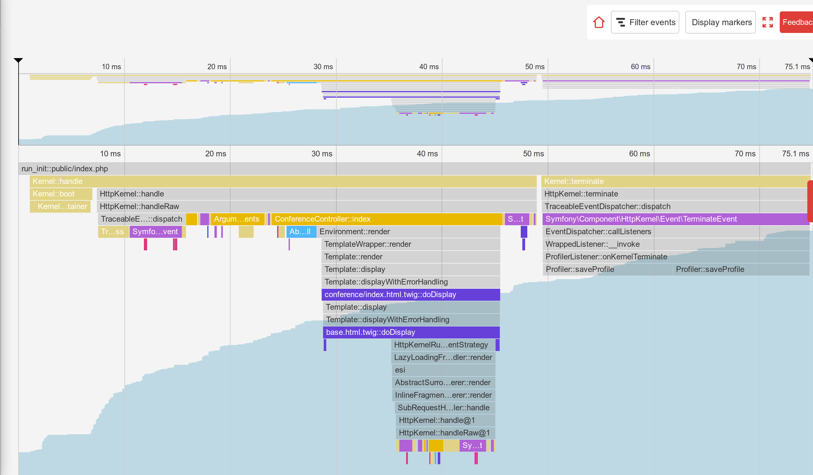

Scoprire il cuore di Symfony
============================

.. index::
    single: Blackfire
    single: Debugging
    single: Internals

Abbiamo usato Symfony per sviluppare una potente applicazione per un bel po' di tempo, ma la maggior parte del codice eseguito dall'applicazione proviene da Symfony. Poche centinaia di righe di codice contro migliaia di righe di codice.

Mi piace capire come funzionano le cose dietro le quinte. E sono sempre stato affascinato da strumenti che mi aiutano a capire come funzionano le cose. La prima volta che ho usato un debugger passo dopo passo o la prima volta che ho scoperto ``ptrace`` sono ricordi magici.

Volete capire meglio come funziona Symfony? È tempo di scoprire come Symfony faccia funzionare un'applicazione. Invece di descrivere come Symfony gestisce una richiesta HTTP da una prospettiva teorica, che sarebbe abbastanza noiosa, useremo Blackfire per ottenere alcune rappresentazioni visive e usarlo per scoprire alcuni argomenti più avanzati.

Comprendere a fondo Symfony con Blackfire
-----------------------------------------

Sappiamo già che tutte le richieste HTTP sono servite da un unico punto di ingresso: il file ``public/index.php``. Ma cosa succede dopo? Come vengono richiamati i controller?

Profiliamo la homepage inglese in produzione con Blackfire tramite l'estensione del browser Blackfire:

.. code-block:: terminal
    :class: ignore

    $ symfony remote:open

O direttamente dalla linea di comando:

.. code-block:: terminal
    :class: ignore

    $ blackfire curl `symfony cloud:env:url --pipe --primary`en/

Andiamo alla vista "Timeline" del profilo, dovremmo vedere qualcosa di simile a quanto segue:

.. figure:: images/blackfire-homepage-prod.png
    :alt: /
    :align: center
    :figclass: with-browser

Dalla timeline, passare con il mouse sulle barre colorate per avere maggiori informazioni su ogni chiamata; si imparerà molto su come funziona Symfony:

* Il punto di ingresso principale è ``public/index.php``;

* Il metodo ``Kernel::handle()`` gestisce la richiesta;

* Richiama ``HttpKernel``, che invia alcuni eventi;

* Il primo evento è ``RequestEvent``;

* Il metodo ``ControllerResolver::getController()`` determina il controller da richiamare in base all'URL;

* Il metodo ``ControllerResolver::getArguments()`` è richiamato e determina quali parametri passare al controller (usando il ParamConverter);

* Viene richiamato il metodo ``ConferenceController::index()``, in cui risiede gran parte del nostro codice;

* Il metodo ``ConferenceRepository::findAll()`` recupera tutte le conferenze dal database (si noti la connessione al database tramite ``PDO::__construct()``);

* Il metodo ``Twig\Environment::render()`` esegue il render del template;

* Sono inviati ``ResponseEvent`` e ``FinishRequestEvent``, ma sembra che nessun listener sia effettivamente registrato, in quanto sembrano essere molto veloci nell'esecuzione.

La timeline è un ottimo modo per capire come funziona un codice, che è molto utile quando si eredita un progetto sviluppato da qualcun altro.

Ora, profilare la stessa pagina dalla macchina locale nell'ambiente di sviluppo:

.. code-block:: terminal
    :class: ignore

    $ blackfire curl `symfony var:export SYMFONY_PROJECT_DEFAULT_ROUTE_URL`en/

Apriamo il profilo. Dovremmo essere reindirizzati alla visualizzazione del grafico delle chiamate, dato che la richiesta è stata molto veloce e la timeline sarebbe stata pressoché vuota:

.. figure:: images/blackfire-homepage-cached-dev.png
    :alt: /
    :align: center
    :figclass: with-browser

È chiaro cosa sta succedendo? La cache HTTP è abilitata e quindi stiamo profilando il livello di cache HTTP di Symfony. Poiché la pagina è nella cache, ``HttpCache\Store::restoreResponse()`` sta ricevendo la risposta HTTP dalla sua cache e il controller non viene mai richiamato.

Disabilitare il livello della cache in ``public/index.php``, come abbiamo fatto nel passo precedente, e riprovare. Si vede subito che il profilo ha un aspetto molto diverso:

Le principali differenze sono le seguenti:

* ``TerminateEvent``, che non era visibile in produzione, richiede una grande percentuale del tempo di esecuzione; guardando meglio, si può vedere che questo è l'evento responsabile della memorizzazione dei dati del Profiler di Symfony raccolti durante la richiesta;

* Sotto la chiamata ``ConferenceController::index()``, si noti il metodo ``SubRequestHandler::handle()`` che esegue il render degli "Edge Side Include", d'ora in avanti ESI, (ecco perché abbiamo due chiamate a ``Profiler::saveProfile()``, una per la richiesta principale e una per l'ESI).

Esploriamo la timeline per saperne di più; passiamo alla visualizzazione del grafico delle chiamate per avere una rappresentazione diversa degli stessi dati.

Come abbiamo appena scoperto, il codice eseguito in sviluppo e in produzione è molto diverso. L'ambiente di sviluppo è più lento, dato che il Profiler di Symfony cerca di raccogliere molti dati per facilitare il debug. Per questo motivo si dovrebbe sempre profilare con l'ambiente di produzione, anche in locale.

Alcuni esperimenti interessanti: profilare una pagina di errore, profilare la pagina  ``/`` (che è un redirect) o una risorsa API. Ogni profilo vi dirà un po' di più su come funziona Symfony, quali classi e metodi sono chiamati, quali esecuzioni costano tanto e quali costano poco.

Utilizzo del plugin per il debug di Blackfire
---------------------------------------------

.. index::
    single: Blackfire;Debug Addon

Per impostazione predefinita, Blackfire rimuove tutte le chiamate non abbastanza significative, per evitare di produrre grafici troppo grandi. Quando si utilizza Blackfire come strumento di debug, è meglio tenere tutte le chiamate. L'addon "debug" ci viene in aiuto.

Dalla linea di comando, usare il parametro ``--debug``:

.. code-block:: terminal
    :class: ignore

    $ blackfire --debug curl `symfony var:export SYMFONY_PROJECT_DEFAULT_ROUTE_URL`en/
    $ blackfire --debug curl `symfony cloud:env:url --pipe --primary`en/

.. index::
    single: .env.local.prod

In produzione, si vedrebbe ad esempio il caricamento di un file di nome ``.env.local.php``:

.. figure:: images/blackfire-env-local-prod.png
    :alt: /
    :align: center
    :figclass: with-browser

.. index::
    single: Composer;Optimizations
    single: Composer;Autoloader
    single: Autoloader

Da dove viene? Platform.sh fa alcune ottimizzazioni quando si effettua il deploy un'applicazione Symfony, come l'ottimizzazione dell'autoloader di Composer  ( ``--optimize-autoloader --apcu-autoloader --classmap-authoritative``). Ottimizza anche le variabili d'ambiente definite nel file ``.env`` (per evitare di analizzare il file a ogni richiesta) generando il file ``.env.local.php``:

.. code-block:: terminal
    :class: ignore

    $ symfony run composer dump-env prod

Blackfire è uno strumento molto potente, che aiuta a capire il modo in cui il codice viene eseguito da PHP. Migliorare le prestazioni è solo uno dei modi per utilizzare un profiler.

Usare un debugger a step con Xdebug
-----------------------------------

.. index::
    single: Xdebug
    single: Debugger

Le timeline e i call graph di Blackfire consentono allo sviluppatore di visualizzare file, funzioni e metodi eseguiti dal motore di PHP, per capire meglio il codice del progetto.

Un altro modo di eseguire l'esecuzione del codice è quello di utilizzare un **debug a step** come `Xdebug`_. Un debug a step consente allo sviluppatore di ispezionare interattivamente il codice di un progetto PHP, per eseguire il debug di un certo flusso d'esecuzione, esaminando le strutture dati (ad esempio quale valore hanno le variabili in un certo momento del flusso di esecuzione). È molto utile effettuare il debug di comportamenti inattesi, sostituendo la più comune tecnica di debug tramite "var_dump()/exit()".

Iniziamo installando l'estensione ``xdebug``. Verifichiamo che sia installata, eseguendo il seguente comando:

.. code-block:: terminal

    $ symfony php -v

Si dovrebbe vedere Xdebug nell'output:

.. code-block:: text
    :emphasize-lines: 5
    :class: ignore

    PHP 8.0.1 (cli) (built: Jan 13 2021 08:22:35) ( NTS )
    Copyright (c) The PHP Group
    Zend Engine v4.0.1, Copyright (c) Zend Technologies
        with Zend OPcache v8.0.1, Copyright (c), by Zend Technologies
        with Xdebug v3.0.2, Copyright (c) 2002-2021, by Derick Rethans
        with blackfire v1.49.0~linux-x64-non_zts80, https://blackfire.io, by Blackfire

Si può verificare che Xdebug sia abilitato anche su PHP-FPM aprendo un browser e cliccando sul collegamento "View phpinfo()", che appare andando sul logo di Symfony nella barra di debug:

.. figure:: screenshots/phpinfo.png
    :alt: /
    :align: center
    :figclass: with-browser

Ora, abilitiamo la modalità ``debug`` di Xdebug:

.. code-block:: ini
    :caption: php.ini
    :class: ignore

    [xdebug]
    xdebug.mode=debug
    xdebug.start_with_request=yes

La porta predefinita a cui Xdebug invia dati è la 9003 su localhost.

Xdebug può essere innescato in tanti modi, ma il più semplice è quello di utilizzare Xdebug attraverso il proprio IDE. In questo capitolo, utilizzeremo Visual Studio Code per dimostrare come funziona. Installare l'estensione `PHP Debug`_ lanciando la funzione "Quick Opener" (``Ctrl+P``), incollando il seguente comando, e premendo invio:

.. code-block:: text
    :class: ignore

    ext install felixfbecker.php-debug

Creiamo il seguente file di configurazione:

.. code-block:: json
    :caption: .vscode/launch.json
    :emphasize-lines: 8,16
    :class: ignore

    {
        "version": "0.2.0",
        "configurations": [
            {
                "name": "Listen for XDebug",
                "type": "php",
                "request": "launch",
                "port": 9003
            },
            {
                "name": "Launch currently open script",
                "type": "php",
                "request": "launch",
                "program": "${file}",
                "cwd": "${fileDirname}",
                "port": 9003
            }
        ]
    }

Da Visual Studio Code e dalla cartella del progetto, andare sul debugger e cliccare sul pulsante verde con scritto "Listen for Xdebug":

.. figure:: images/vs-xdebug-run.png
    :align: center

Se andiamo sul browser e aggiorniamo la pagina, l'IDE dovrebbe automaticamente prendere il controllo, il che significa che la sessione di debug è pronta. Per impostazione predefinita, tutto è un breakpoint, quindi l'esecuzione si fermerà alla prima istruzione. È poi vostro compito ispezionare le variabili, saltare alcuni blocchi di codice, entrare in altri blocchi di codice, e così via.

Durante il debug, si può togliere la spunta dal breakpoint "Everything" e usare invece dei breakpoint espliciti nel codice.

Chi non conosce il debug a step può leggere `l'ottima guida per Visual Studio Code`_, che spiega tutto in modo visuale.

.. sidebar:: Andare oltre

    * `Documentazione sul debug a step di Xdebug`_;

    * `Debug con Visual Studio Code`_.

.. _`Xdebug`: https://xdebug.org
.. _`PHP Debug`: https://marketplace.visualstudio.com/items?itemName=felixfbecker.php-debug
.. _`Documentazione sul debug a step di Xdebug`: https://xdebug.org/docs/step_debug
.. _`l'ottima guida per Visual Studio Code`: https://code.visualstudio.com/Docs/editor/debugging
.. _`Debug con Visual Studio Code`: https://code.visualstudio.com/Docs/editor/debugging
