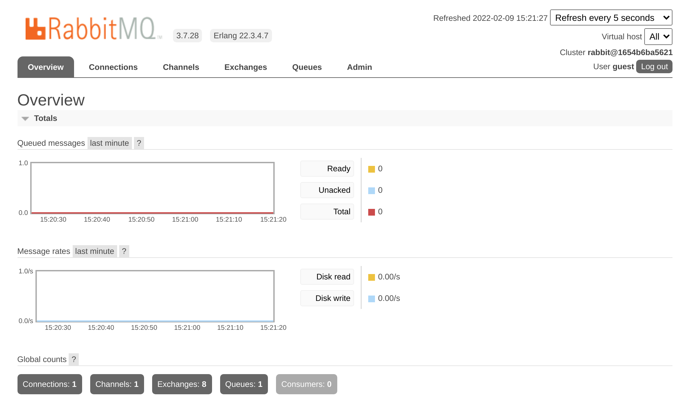

Usare RabbitMQ come Message Broker
==================================

.. index::
    single: RabbitMQ

RabbitMQ è un message broker molto popolare che può essere utilizzato come alternativa a PostgreSQL.

Passare da PostgreSQL a RabbitMQ
--------------------------------

Per utilizzare RabbitMQ al posto di PostgreSQL come message broker:

.. code-block:: diff
    :caption: patch_file

    --- a/config/packages/messenger.yaml
    +++ b/config/packages/messenger.yaml
    @@ -5,10 +5,7 @@ framework:
             transports:
                 # https://symfony.com/doc/current/messenger.html#transport-configuration
                 async:
    -                dsn: '%env(MESSENGER_TRANSPORT_DSN)%'
    -                options:
    -                    use_notify: true
    -                    check_delayed_interval: 60000
    +                dsn: '%env(RABBITMQ_URL)%'
                     retry_strategy:
                         max_retries: 3
                         multiplier: 2

Abbiamo anche bisogno di aggiungere il supporto RabbitMQ per Messenger:

.. code-block:: terminal

    $ symfony composer req amqp-messenger

Aggiungere RabbitMQ allo stack Docker
-------------------------------------

.. index::
    single: Docker;RabbitMQ

Come potreste aver intuito, abbiamo bisogno di aggiungere RabbitMQ allo stack di Docker Compose:

.. code-block:: diff
    :caption: patch_file

    --- a/docker-compose.yml
    +++ b/docker-compose.yml
    @@ -19,6 +19,10 @@ services:
         image: redis:5-alpine
         ports: [6379]

    +  rabbitmq:
    +    image: rabbitmq:3.7-management
    +    ports: [5672, 15672]
    +
     volumes:
     ###> doctrine/doctrine-bundle ###
       db-data:

Riavviare i servizi Docker
--------------------------

Per forzare Docker Compose a prendere in considerazione il container RabbitMQ, fermare i container e riavviarli:

.. code-block:: terminal

    $ docker-compose stop
    $ docker-compose up -d

.. code-block:: terminal
    :class: hide

    $ sleep 10

Esplorare l'interfaccia web di gestione di RabbitMQ
---------------------------------------------------

.. index::
    single: Symfony CLI;open:local:rabbitmq

Se volete vedere le code e i messaggi che transitano attraverso RabbitMQ, aprite l'interfaccia web di gestione:

.. code-block:: terminal
    :class: ignore

    $ symfony open:local:rabbitmq

O dalla barra di debug:

.. figure:: screenshots/rabbitmq-wdt.png
    :alt: /
    :align: center
    :figclass: with-browser

Inserire ``guest``/``guest`` come username e password, per accedere alla UI di gestione di RabbitMQ:

Distribuire RabbitMQ
--------------------

.. index::
    single: Platform.sh;RabbitMQ
    single: RabbitMQ

Aggiungere RabbitMQ ai server di produzione può essere fatto aggiungendolo alla lista dei servizi:

.. code-block:: diff
    :caption: patch_file

    --- a/.platform/services.yaml
    +++ b/.platform/services.yaml
    @@ -18,3 +18,8 @@ files:

     rediscache:
         type: redis:5.0
    +
    +queue:
    +    type: rabbitmq:3.7
    +    disk: 1024
    +    size: S

Fare riferimento ad esso anche nella configurazione del container web, ed abilitare l'estensione PHP ``amqp``:

.. code-block:: diff
    :caption: patch_file

    --- a/.platform.app.yaml
    +++ b/.platform.app.yaml
    @@ -8,6 +8,7 @@ dependencies:

     runtime:
         extensions:
    +        - amqp
             - apcu
             - blackfire
             - ctype
    @@ -41,6 +42,7 @@ mounts:
     relationships:
         database: "database:postgresql"
         redis: "rediscache:redis"
    +    rabbitmq: "queue:rabbitmq"
         
     hooks:
         build: |

.. index::
    single: Platform.sh;Tunnel
    single: Symfony CLI;cloud:tunnel:open
    single: Symfony CLI;cloud:tunnel:close
    single: Symfony CLI;open:remote:rabbitmq

Quando il servizio RabbitMQ è installato su di un progetto, potete accedere alla sua interfaccia di gestione web aprendo un tunnel:

.. code-block:: terminal
    :class: ignore

    $ symfony cloud:tunnel:open
    $ symfony open:remote:rabbitmq

    # when done
    $ symfony cloud:tunnel:close

.. sidebar:: Andare oltre

    * `Documentazione di RabbitMQ`_.

.. _`Documentazione di RabbitMQ`: https://www.rabbitmq.com/documentation.html
