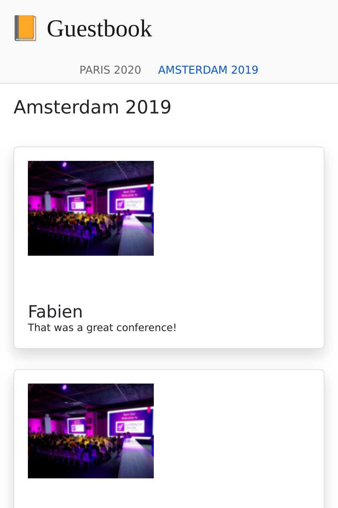

SPAサイトをビルドする
==============================

.. index::
    single: SPA
    single: Mobile

コメントのほとんどはカンファレンスの開催中に投稿されでしょう。参加者がノートパソコンを持ってきていなくてもスマートフォンは持っているでしょうから、そこから投稿することがあります。カンファレンスのコメントをチェックするモバイルアプリを作成してみましょう。

モバイルアプリを作成するのに JavaScript で SPA サイトを作ることがあります。 SPA はローカルで動き、ローカルストレージの使用、リモート HTTP API の呼び出し、そして、ネイティブに近いサービスワーカーの恩恵を受けることができます。

アプリケーションを作成する
---------------------------------------

`Preact`_ と **Symfony Encore** を使用して、モバイルアプリケーションを作成します。**Preact** は小さく効率的な出発点で、ゲストブックSPAに最適です。

Webサイトと SPA の整合性を保つために、Webサイトの Sass スタイルシートをモバイルアプリケーションにも再利用します。

``spa`` ディレクトリ以下にSPA アプリケーションを作成し、Webサイトのスタイルシートをコピーしてください:

.. code-block:: terminal

    $ mkdir -p spa/src spa/public spa/assets/styles
    $ cp assets/styles/*.scss spa/assets/styles/
    $ cd spa

.. note::

    既に、SPA にブラウザから主に参照される ``public`` ディレクトリを作成してありますが、モバイルアプリケーションのみ用でしたら、 ``build`` と名前を変えることもできます。

さらに、 ``.gitignore`` も追加しておきましょう:

.. code-block:: text
    :caption: .gitignore

    /node_modules/
    /public/
    /npm-debug.log
    /yarn-error.log
    # used later by Cordova
    /app/

``package.json`` ファイルを初期化してください（ ``composer.json`` の JavaScript 版のようなものです ）:

.. code-block:: terminal

    $ yarn init -y

ここで必要な依存パッケージを追加しましょう:

.. code-block:: terminal

    $ yarn add @symfony/webpack-encore @babel/core @babel/preset-env babel-preset-preact preact html-webpack-plugin bootstrap

最後のステップとして、 Webpack  の Encore の設定を作成しておきます:

.. code-block:: javascript
    :caption: webpack.config.js
    :emphasize-lines: 8,11

    const Encore = require('@symfony/webpack-encore');
    const HtmlWebpackPlugin = require('html-webpack-plugin');

    Encore
        .setOutputPath('public/')
        .setPublicPath('/')
        .cleanupOutputBeforeBuild()
        .addEntry('app', './src/app.js')
        .enablePreactPreset()
        .enableSingleRuntimeChunk()
        .addPlugin(new HtmlWebpackPlugin({ template: 'src/index.ejs', alwaysWriteToDisk: true }))
    ;

    module.exports = Encore.getWebpackConfig();

SPAのメインテンプレートを作成する
------------------------------------------------

Preact がアプリケーションをレンダリングする最初のテンプレートを作成しましょう:

.. code-block:: html
    :caption: src/index.ejs
    :emphasize-lines: 12

    <!DOCTYPE html>
    <html>
    <head>
        <meta http-equiv="Content-Type" content="text/html; charset=utf-8" />
        <meta http-equiv="X-UA-Compatible" content="IE=edge" />
        <meta name="msapplication-tap-highlight" content="no" />
        <meta name="viewport" content="user-scalable=no, initial-scale=1, maximum-scale=1, minimum-scale=1, width=device-width" />

        <title>Conference Guestbook application</title>
    </head>
    <body>
        

    </body>
    </html>

アプリケーションが入ることになる ``
`` タグは、JavaScript によって表示されます。これが "Hello World" と表示するコードの最初のバージョンです:

.. code-block:: text
    :caption: src/app.js
    :emphasize-lines: 3,11

    import {h, render} from 'preact';

    function App() {
        return (
            

                Hello world!
            

        )
    }

    render(<App />, document.getElementById('app'));

最後の行で、HTML ページの ``#app`` 要素に ``App()`` 関数を登録します。

これで準備ができました！

SPA サイトをブラウザで動かす
----------------------------------------

.. index::
    single: Symfony CLI;server:start
    single: Symfony CLI;server:stop

このアプリケーションはメインのWebサイトには依存していないので、別の Webサーバーで動かす必要があります:

.. code-block:: terminal
    :class: hide

    $ symfony server:stop

.. code-block:: terminal

    $ symfony server:start -d --passthru=index.html

``--passthru`` フラグを付けて、すべての HTTP リクエストを ``public/index.html`` ファイルへ渡すように Webサーバーに伝えます（``public/`` はWebサーバーのデフォルトの Webルートディレクトリです）。このページは、 Preact アプリケーションによって管理され、 "ブラウザ" の履歴からページをレンダリングします。

``yarn`` を実行してCSS と **JavaScript** ファイルをコンパイルしてください:

.. code-block:: terminal

    $ yarn encore dev

SPAサイトをブラウザで開いてください:

.. code-block:: terminal
    :class: ignore

    $ symfony open:local

そして、hello world SPA と見えるか確認してください:

.. figure:: screenshots/spa.png
    :alt: /
    :align: center
    :figclass: with-browser spa

状態をハンドルするルーターを追加する
------------------------------------------------------

まだ、SPA は異なるページを扱うことができません。複数のページを実装するには、 Symfony のようなルーター機能が必要です。 **preact-router** を使用することにしましょう。 入力から URL を受け取り、 対応する Preact コンポーネントを表示します。

preact-router をインストールしてください:

.. code-block:: terminal

    $ yarn add preact-router

*Preact コンポーネント* のホームページ用のページを作成してください:

.. code-block:: text
    :caption: src/pages/home.js

    import {h} from 'preact';

    export default function Home() {
        return (
            
Home

        );
    };

カンファレンスページも作成してください:

.. code-block:: text
    :caption: src/pages/conference.js

    import {h} from 'preact';

    export default function Conference() {
        return (
            
Conference

        );
    };

"Hello World" の ``div`` を ``Router`` コンポーネントに書き換えてください:

.. code-block:: diff
    :caption: patch_file
    :emphasize-lines: 15,17,20-23

    --- a/src/app.js
    +++ b/src/app.js
    @@ -1,9 +1,22 @@
     import {h, render} from 'preact';
    +import {Router, Link} from 'preact-router';
    +
    +import Home from './pages/home';
    +import Conference from './pages/conference';

     function App() {
         return (
             

    -            Hello world!
    +            <header>
    +                <Link href="/">Home</Link>
    +                 
    +                <Link href="/conference/amsterdam2019">Amsterdam 2019</Link>
    +            </header>
    +
    +            <Router>
    +                <Home path="/" />
    +                <Conference path="/conference/:slug" />
    +            </Router>
             

         )
     }

アプリケーションをリビルドしてください:

.. code-block:: terminal

    $ yarn encore dev

ブラウザでアプリケーションを再読み込みすると、 "Home" とカンファレンスへのリンクをクリックできるようになっています。ブラウザの URL を確認して、ブラウザの 戻る／進むボタンが動くか確認してください。

SPA サイトをスタイルする
----------------------------------

Webサイトに Sass ローダーを追加しましょう:

.. code-block:: terminal

    $ yarn add node-sass sass-loader

Webpack で Sass ローダーを有効化し、スタイルシートへの参照を追加してください:

.. code-block:: diff
    :caption: patch_file

    --- a/src/app.js
    +++ b/src/app.js
    @@ -1,3 +1,5 @@
    +import '../assets/styles/app.scss';
    +
     import {h, render} from 'preact';
     import {Router, Link} from 'preact-router';

    --- a/webpack.config.js
    +++ b/webpack.config.js
    @@ -7,6 +7,7 @@ Encore
         .cleanupOutputBeforeBuild()
         .addEntry('app', './src/app.js')
         .enablePreactPreset()
    +    .enableSassLoader()
         .enableSingleRuntimeChunk()
         .addPlugin(new HtmlWebpackPlugin({ template: 'src/index.ejs', alwaysWriteToDisk: true }))
     ;

これでスタイルシートを使うため、アプリケーションを更新できるようになりました:

.. code-block:: diff
    :caption: patch_file

    --- a/src/app.js
    +++ b/src/app.js
    @@ -9,10 +9,20 @@ import Conference from './pages/conference';
     function App() {
         return (
             

    -            <header>
    -                <Link href="/">Home</Link>
    -                 
    -                <Link href="/conference/amsterdam2019">Amsterdam 2019</Link>
    +            <header className="header">
    +                <nav className="navbar navbar-light bg-light">
    +                    

    +                        <Link className="navbar-brand mr-4 pr-2" href="/">
    +                            &#128217; Guestbook
    +                        </Link>
    +                    

    +                </nav>
    +
    +                <nav className="bg-light border-bottom text-center">
    +                    <Link className="nav-conference" href="/conference/amsterdam2019">
    +                        Amsterdam 2019
    +                    </Link>
    +                </nav>
                 </header>

                 <Router>

もう一度アプリケーションをリビルドしてください:

.. code-block:: terminal

    $ yarn encore dev

これで完全にスタイルされた SPAサイトができました:

.. figure:: screenshots/spa-home.png
    :alt: /
    :align: center
    :figclass: with-browser spa

API からデータを取得する
----------------------------------

Preact アプリケーションの構築はこれで終わりです。これで、Preact ルーターは、カンファレンスのスラッグのプレースホルダーも含めページの状態を扱えるようになり、メインアプリケーションのスタイルシートは、SPAのスタイルに使用されるようになりました。

SPA を動的にするには、 HTTP 呼び出しで API からデータを取得する必要があります。

Webpack を設定して、 API のエンドポイントの環境変数を公開してください:

.. code-block:: diff
    :caption: patch_file

    --- a/webpack.config.js
    +++ b/webpack.config.js
    @@ -1,3 +1,4 @@
    +const webpack = require('webpack');
     const Encore = require('@symfony/webpack-encore');
     const HtmlWebpackPlugin = require('html-webpack-plugin');

    @@ -10,6 +11,9 @@ Encore
         .enableSassLoader()
         .enableSingleRuntimeChunk()
         .addPlugin(new HtmlWebpackPlugin({ template: 'src/index.ejs', alwaysWriteToDisk: true }))
    +    .addPlugin(new webpack.DefinePlugin({
    +        'ENV_API_ENDPOINT': JSON.stringify(process.env.API_ENDPOINT),
    +    }))
     ;

     module.exports = Encore.getWebpackConfig();

環境変数 ``API_ENDPOINT`` は、 ``/api`` 以下のAPIのエンドポイントのWebサーバーを指しています。後に ``yarn`` で実行して正しく設定できるようにします。

API からのデータ取得を行う ``api.js`` ファイルを作成してください:

.. code-block:: text
    :caption: src/api/api.js

    function fetchCollection(path) {
        return fetch(ENV_API_ENDPOINT + path).then(resp => resp.json()).then(json => json['hydra:member']);
    }

    export function findConferences() {
        return fetchCollection('api/conferences');
    }

    export function findComments(conference) {
        return fetchCollection('api/comments?conference='+conference.id);
    }

これでヘッダーとホームのコンポーネントに適応できるようになりました:

.. code-block:: diff
    :caption: patch_file

    --- a/src/app.js
    +++ b/src/app.js
    @@ -2,11 +2,23 @@ import '../assets/styles/app.scss';

     import {h, render} from 'preact';
     import {Router, Link} from 'preact-router';
    +import {useState, useEffect} from 'preact/hooks';

    +import {findConferences} from './api/api';
     import Home from './pages/home';
     import Conference from './pages/conference';

     function App() {
    +    const [conferences, setConferences] = useState(null);
    +
    +    useEffect(() => {
    +        findConferences().then((conferences) => setConferences(conferences));
    +    }, []);
    +
    +    if (conferences === null) {
    +        return 
Loading...
;
    +    }
    +
         return (
             

                 <header className="header">
    @@ -19,15 +31,17 @@ function App() {
                     </nav>

                     <nav className="bg-light border-bottom text-center">
    -                    <Link className="nav-conference" href="/conference/amsterdam2019">
    -                        Amsterdam 2019
    -                    </Link>
    +                    {conferences.map((conference) => (
    +                        <Link className="nav-conference" href={'/conference/'+conference.slug}>
    +                            {conference.city} {conference.year}
    +                        </Link>
    +                    ))}
                     </nav>
                 </header>

                 <Router>
    -                <Home path="/" />
    -                <Conference path="/conference/:slug" />
    +                <Home path="/" conferences={conferences} />
    +                <Conference path="/conference/:slug" conferences={conferences} />
                 </Router>
             

         )
    --- a/src/pages/home.js
    +++ b/src/pages/home.js
    @@ -1,7 +1,28 @@
     import {h} from 'preact';
    +import {Link} from 'preact-router';
    +
    +export default function Home({conferences}) {
    +    if (!conferences) {
    +        return 
No conferences yet
;
    +    }

    -export default function Home() {
         return (
    -        
Home

    +        

    +            {conferences.map((conference)=> (
    +                

    +                    

    +                        

    +                            <h4 className="font-weight-light">
    +                                {conference.city} {conference.year}
    +                            </h4>
    +                        

    +
    +                        <Link className="btn btn-sm btn-primary stretched-link" href={'/conference/'+conference.slug}>
    +                            View
    +                        </Link>
    +                    

    +                

    +            ))}
    +        

         );
    -};
    +}

最後に Preact ルーターは、 "slug" のプレースホルダーを Conference コンポーネントにプロパティとして渡します。このプロパティを使ってAPIでカンファレンスとそのコメントが正しく表示されるようにしてください。そして、API のデータを使ってレンダリングをします:

.. code-block:: diff
    :caption: patch_file

    --- a/src/pages/conference.js
    +++ b/src/pages/conference.js
    @@ -1,7 +1,48 @@
     import {h} from 'preact';
    +import {findComments} from '../api/api';
    +import {useState, useEffect} from 'preact/hooks';
    +
    +function Comment({comments}) {
    +    if (comments !== null && comments.length === 0) {
    +        return 
No comments yet
;
    +    }
    +
    +    if (!comments) {
    +        return 
Loading...
;
    +    }
    +
    +    return (
    +        

    +            {comments.map(comment => (
    +                

    +                    

    +                        {!comment.photoFilename ? '' : (
    +                            <a href={ENV_API_ENDPOINT+'uploads/photos/'+comment.photoFilename} target="_blank">
    +                                
    +                            </a>
    +                        )}
    +                    

    +
    +                    <h5 className="font-weight-light mt-3 mb-0">{comment.author}</h5>
    +                    
{comment.text}

    +                

    +            ))}
    +        

    +    );
    +}
    +
    +export default function Conference({conferences, slug}) {
    +    const conference = conferences.find(conference => conference.slug === slug);
    +    const [comments, setComments] = useState(null);
    +
    +    useEffect(() => {
    +        findComments(conference).then(comments => setComments(comments));
    +    }, [slug]);

    -export default function Conference() {
         return (
    -        
Conference

    +        

    +            <h4>{conference.city} {conference.year}</h4>
    +            <Comment comments={comments} />
    +        

         );
    -};
    +}

これでSPAは、環境変数 ``API_ENDOPOINT`` からAPIのURLを知る必要があります。APIのWebサーバーのURLをセットしてください（ ``..`` ディレクトリで実行します）:

.. code-block:: terminal

    $ API_ENDPOINT=`symfony var:export SYMFONY_PROJECT_DEFAULT_ROUTE_URL --dir=..` yarn encore dev

これでバックグラウンドでも実行できるようになったはずです:

.. code-block:: terminal

    $ API_ENDPOINT=`symfony var:export SYMFONY_PROJECT_DEFAULT_ROUTE_URL --dir=..` symfony run -d --watch=webpack.config.js yarn encore dev --watch

これで、ブラウザ内のアプリケーションをが正しく動くのを確認できるはずです:

.. figure:: screenshots/spa-home-final.png
    :alt: /
    :align: center
    :figclass: with-browser spa

できましたね！ルーターも実際のデータもちゃんと機能する SPA が完成しました。 Preact アプリをさらに整理することもできますが、ここではこのくらいにしておきましょう。

本番に SPA サイトをデプロイする
--------------------------------------------

.. index::
    single: Platform.sh;Multi-Applications

Platform.sh では、各プロジェクト毎に複数のアプリケーションをデプロイすることができます。アプリケーションは、 サブディレクトリ内に``.platform.app.yaml`` ファイルを作成することで追加できます。 ``spa/`` のディレクトリ以下に ``spa`` と命名して作成しましょう:

.. code-block:: yaml
    :caption: .platform.app.yaml
    :emphasize-lines: 1

    name: spa

    size: S

    build:
        flavor: none

    web:
        commands:
            start: sleep
        locations:
            "/":
                root: "public"
                index:
                    - "index.html"
                scripts: false
                expires: 10m

    hooks:
        build: |
            set -x -e

            curl -fs https://get.symfony.com/cloud/configurator | bash

            yarn-install
            unset NPM_CONFIG_PREFIX
            export NVM_DIR=${PLATFORM_APP_DIR}/.nvm
            set +x && . "${PLATFORM_APP_DIR}/.nvm/nvm.sh" && set -x
            yarn encore prod

.. index::
    single: Platform.sh;Routes

``.platform/routes.yaml`` ファイルを編集して、プロジェクトのルートディレクリにある ``spa`` アプリケーションに ``spa.`` サブドメインにルート指定をしてください:

.. code-block:: terminal

    $ cd ../

.. code-block:: diff
    :caption: patch_file
    :emphasize-lines: 4,5

    --- a/.platform/routes.yaml
    +++ b/.platform/routes.yaml
    @@ -1,2 +1,5 @@
     "https://{all}/": { type: upstream, upstream: "varnish:http", cache: { enabled: false } }
     "http://{all}/": { type: redirect, to: "https://{all}/" }
    +
    +"https://spa.{all}/": { type: upstream, upstream: "spa:http" }
    +"http://spa.{all}/": { type: redirect, to: "https://spa.{all}/" }

SPA サイトの CORS を設定する
-------------------------------------

.. index::
    single: CORS
    single: Cross-Origin Resource Sharing

コードをデプロイしても、API リクエストがブラウザからブロックされるので動作しません。SPA が API にアクセスできるように明示する必要があります。アプリケーションに現在のドメイン名をアタッチしてください:

.. code-block:: terminal

    $ symfony cloud:env:url --pipe --primary

``CORS_ALLOW_ORIGIN`` 環境変数を定義してください:

.. code-block:: terminal

    $ symfony cloud:variable:create --sensitive=1 --level=project -y --name=env:CORS_ALLOW_ORIGIN --value="^`symfony cloud:env:url --pipe --primary | sed 's#/$##' | sed 's#https://#https://spa.#'`$"

ドメインが、 ``https://master-5szvwec-hzhac461b3a6o.eu-5.platformsh.site/`` であったなら、 ``sed`` コマンドで ``https://spa.master-5szvwec-hzhac461b3a6o.eu-5.platformsh.site`` と変換しましょう。

環境変数 ``API_ENDPOINT`` をセットする必要もあります:

.. code-block:: terminal

    $ symfony cloud:variable:create --sensitive=1 --level=project -y --name=env:API_ENDPOINT --value=`symfony cloud:env:url --pipe --primary`

コミットしてデプロイしてください:

.. code-block:: terminal
    :class: ignore

    $ git add .
    $ git commit -a -m'Add the SPA application'
    $ symfony cloud:deploy

アプリケーションをフラグで指定して、ブラウザで SPA にアクセスしてください:

.. code-block:: terminal
    :class: ignore

    $ symfony cloud:url -1 --app=spa

Cordova を使用して、スマートフォンアプリケーションをビルドする
-----------------------------------------------------------------------------------------

.. index::
    single: SPA;Cordova
    single: Apache Cordova
    single: Cordova

**Apache Cordova** は、クロスプラットフォームでスマートフォンアプリケーションをビルドすることができるツールです。 今作成した SPA にも使うことができます。

インストールしてみましょう:

.. code-block:: terminal

    $ cd spa
    $ yarn global add cordova

.. note::

    Android SDK もインストールする必要があります。このセクションでは、 Android しか触れませんが、Cordova を使用すれば、iOS などの他のモバイルプラットフォームでも動きます。

アプリケーションのディレクトリ構造を作成してください:

.. code-block:: terminal
    :class: answers(n)

    $ ~/.yarn/bin/cordova create app

さらに、Android アプリケーションを生成してください:

.. code-block:: terminal
    :class: ignore

    $ cd app
    $ ~/.yarn/bin/cordova platform add android
    $ cd ..

これだけです。これで、本番ファイルをビルドして、 Cordova にそのファイルを移動することができるようになりました:

.. code-block:: terminal

    $ API_ENDPOINT=`symfony var:export SYMFONY_PROJECT_DEFAULT_ROUTE_URL --dir=..` yarn encore production
    $ rm -rf app/www
    $ mkdir -p app/www
    $ cp -R public/ app/www

スマートフォンかエミュレーターでアプリケーションを実行してください:

.. code-block:: terminal
    :class: ignore

    $ ~/.yarn/bin/cordova run android

.. sidebar:: より深く学ぶために

    * `Preact の公式サイト`_;

    * `Cordova の公式サイト`_.

.. _`Preact`: https://preactjs.com/
.. _`Preact の公式サイト`: https://preactjs.com/
.. _`Cordova の公式サイト`: https://cordova.apache.org/
