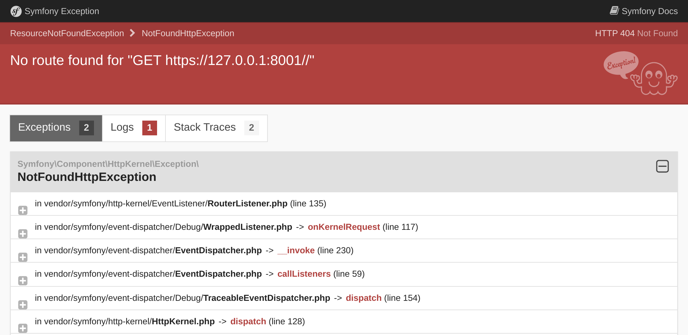

トラブルシューティング
=================================

プロジェクトのセットアップは、正しいデバッグツールを用意することでもあります。幸運にも、たくさんの便利なツールが ``webapp`` パッケージの一部として既に含まれています。

Symfony Debugging Tools について
------------------------------------

.. index::
    single: Components;Profiler
    single: Profiler
    single: Web Profiler
    single: Web Debug Toolbar

まずはじめに、Symfony Profilerは問題の原因を調べるときに役に立ちます。

ホームページを見てみると、スクリーンの一番下にツールバーが表示されていると思います:

.. figure:: screenshots/wdt.png
    :alt: /
    :align: center
    :figclass: with-browser

最初に気づくこととして **404** が赤字で表示されていますね。このページはまだホームページとして定義していないので最初の表示として使われています。エラーページですが、デフォルトでも、ちゃんと表示されるなんて素敵でしょう。正しい HTTP ステータスコードは 200 ではなく 404 となっています。このようにデバッグツールバーがあるので、正しい情報を見ることができます。

小さな感嘆符（!）をクリックすると、Symfony profiler 内のログから "実際の" 例外のメッセージを見ることができます。スタックトレースを見たいときは、左のメニューの "Exception"  リンクをクリックしてください。

コードに問題があるときは、以下のような問題が起きている箇所を調べることができる例外ページが表示されます:

いくつかクリックして、Symfony profiler でどんな情報にアクセスができるか試してくてください。

.. index::
    single: Symfony CLI;server:log

デバッグ時にはログはとても役に立ちます。Symfony には、すべてのログ（Webサーバのログ、PHPのログ、アプリケーションのログ）を tail できる便利なコマンドがあります。

.. code-block:: terminal
    :class: ignore

    $ symfony server:log

では、小さな実験をしてみましょう。 ``public/index.php`` を開いて、 PHP のコードを壊してみてください（たとえばfoobar という文字をコードの途中に追加してみましょう）。ブラウザでページを更新して何がログに流れてくるか見てみましょう:

.. code-block:: text
    :class: ignore

    Dec 21 10:04:59 |DEBUG| PHP    PHP Parse error:  syntax error, unexpected 'use' (T_USE) in public/index.php on line 5 path="/usr/bin/php7.42" php="7.42.0"
    Dec 21 10:04:59 |ERROR| SERVER GET  (500) / ip="127.0.0.1"

エラーに気づきやすいように色付けされて出力されます。

Symfony の環境について
-----------------------------

.. index::
    single: Symfony Environments

Symfony Profilerは開発中のみ有用なので、プロダクション環境にはインストールされないようにしたいです。デフォルトで、Symfonyは自動的に ``dev`` と ``test`` 環境のみにインストールします。

Symfony は、 *環境* の概念があります。デフォルトでは、 ``dev``, ``prod``, ``test`` の3つの環境がありますが、必要であれば追加することができます。すべての環境において、同じコードが使われますが、異なる *設定* をすることが可能です。

例えば、``dev`` 環境では、すべてのデバッグツールを有効にしています。しかし、``prod`` 環境では、アプリケーションのパフォーマンスを最適にしています。

``APP_ENV`` の環境変数を変更することで、環境をスイッチすることができます。

Platform.sh へデプロイする際は ``APP_ENV`` に既にセットされている環境は、自動的に ``prod`` となります。

環境設定の扱いに関して
---------------------------------

.. index::
    single: Environment Variables
    single: .env
    single: .env.local

``APP_ENV`` はあなたのターミナルにセットしてある "実際の" 環境変数です。

.. code-block:: terminal
    :class: ignore

    $ export APP_ENV=dev

本番のサーバーで、環境変数を使用して ``APP_ENV`` のような値をセットするのは良いことです。しかし、開発時のマシンでは、環境変数をたくさん定義するとややこしくなりますので、代わりに ``.env`` ファイルに定義します。

注意が必要な ``.env`` ファイルはプロジェクトを作成したときに自動的に生成されます:

.. code-block:: text
    :caption: .env
    :class: ignore

    ###> symfony/framework-bundle ###
    APP_ENV=dev
    APP_SECRET=c2927f273163f7225a358e3a1bbbed8a
    #TRUSTED_PROXIES=127.0.0.1,127.0.0.2
    #TRUSTED_HOSTS='^localhost|example\.com$'
    ###< symfony/framework-bundle ###

.. tip::

    Symfony Flex のレシピによって、``.env`` を使用すれば、どんなパッケージも環境変数をセットすることが可能です。

``.env`` ファイルはリポジトリにコミットされ、本番の *デフォルト* の値として使われます。 ``.env.local`` ファイルを作成すれば値を上書きすることができますが、リポジトリにコミットするべきファイルではないので、 ``.gitignore`` に既に書いてあります。

シークレットな値や注意が必要な値をこれらのファイルに書かないでください。他のステップでシークレットな値を扱う方法を学びますので、待っていてください。

IDE の設定
-------------

開発環境では、例外が投げられると Symfony は、例外メッセージとスタックトレースのページを表示します。ファイルパスから、自分の使っている IDE で問題の箇所を開くことができます。この機能を使うには、 IDE を設定する必要があります。Symfony は最初からたくさんの IDE をサポートしています; 私は VSCode を今回のプロジェクトで使用しています:

.. code-block:: diff
    :caption: patch_file

    --- a/php.ini
    +++ b/php.ini
    @@ -6,3 +6,4 @@ max_execution_time=30
     session.use_strict_mode=On
     realpath_cache_ttl=3600
     zend.detect_unicode=Off
    +xdebug.file_link_format=vscode://file/%f:%l

ファイルへのリンクは例外だけではありません。例えば、IDE に設定すれば、デバッグの際のコントローラも開くことができます。

本番のデバッグ
---------------------

.. index::
    single: Platform.sh;Remote Logs
    single: Platform.sh;SSH
    single: Symfony CLI;cloud:logs
    single: Symfony CLI;cloud:ssh

本番サーバのデバッグは、より複雑です。例えば、 Symfony profiler は使えませんし、ログの情報も冗長にしていません。それでも、ログの tail は可能です:

.. code-block:: terminal
    :class: ignore

    $ symfony cloud:logs --tail

また、Webコンテナ上に SSH で接続することも可能です:

.. code-block:: terminal
    :class: ignore

    $ symfony cloud:ssh

簡単に壊すことはできないので心配しないでください。ほとんどのファイルシステムは書き込み権限はありません。本番でのホットフィックスはできないようになっています。より良い方法はこの書籍の後の方で説明します。

.. sidebar:: より深く学ぶために

    * `SymfonyCasts Environment と設定ファイルのチュートリアル`_;

    * `SymfonyCasts Environment Variables のチュートリアル`_;

    * `SymfonyCasts: Webデバッグツールバーとプロファイラーのチュートリアル`_;

    * Symfony アプリケーションにおける `複数の .env ファイルの使い方`_

.. _`SymfonyCasts Environment と設定ファイルのチュートリアル`: https://symfonycasts.com/screencast/symfony-fundamentals/environment-config-files
.. _`SymfonyCasts Environment Variables のチュートリアル`: https://symfonycasts.com/screencast/symfony-fundamentals/environment-variables
.. _`SymfonyCasts: Webデバッグツールバーとプロファイラーのチュートリアル`: https://symfonycasts.com/screencast/symfony/debug-toolbar-profiler
.. _`複数の .env ファイルの使い方`: https://symfony.com/doc/current/configuration.html#managing-multiple-env-files
