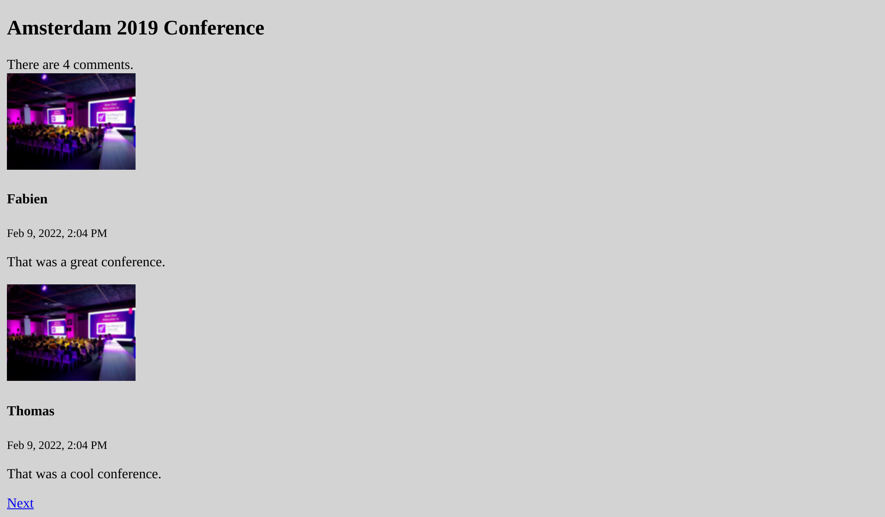

De gebruikersinterface bouwen
=============================

.. index::
    single: Twig
    single: Templates

Alles staat nu klaar om de eerste versie van de gebruikersinterface te maken. We houden het voor nu functioneel en zullen de interface later pas mooi maken.

Herinner je je nog dat we escaping aan de controller van de easter egg moesten toevoegen om beveiligingsproblemen te voorkomen? Om die reden zullen we PHP niet gebruiken voor onze templates. In plaats daarvan zullen we Twig gebruiken. Naast het zorgdragen van escaping van output, brengt `Twig`_ een heleboel andere leuke functies die we ook zullen gebruiken, zoals template overerving.

Twig gebruiken voor de templates
--------------------------------

.. index::
    single: Twig;Layout
    single: Twig;block

Alle pagina's op de website zullen dezelfde *lay-out* delen. Bij de installatie van Twig is er automatisch een ``templates/`` directory aangemaakt en is er ook een voorbeeldlay-out gemaakt in ``base.html.twig``.

.. code-block:: html+twig
    :caption: templates/base.html.twig
    :class: ignore

    <!DOCTYPE html>
    <html>
        <head>
            <meta charset="UTF-8">
            <title>Welcome!</title>
            
        </head>
        <body>
            
            
        </body>
    </html>

Een lay-out kan ``block`` elementen definiëren. Dat zijn plaatsen waar *child templates* - die de lay-out *extenden* - hun inhoud toevoegen.

.. index::
    single: Twig;extends
    single: Twig;for

Laten we een template maken voor de homepage van het project in ``templates/conference/index.html.twig``:

.. code-block:: html+twig
    :caption: templates/conference/index.html.twig

    

    Conference Guestbook

    
        <h2>Give your feedback!</h2>

        
            <h4>{{ conference }}</h4>
        
    

De template *extends* ``base.html.twig`` en herdefinieert de ``title`` en ``body`` blokken.

.. index::
    single: Twig;Syntax

De ```` notatie in een template geeft *acties* en *structuur* aan.

De ``{{ }}`` notatie wordt gebruikt om iets *weer te geven* . ``{{ conference }}`` toont de conferentieweergave (het resultaat van het uitvoeren ``__toString`` op het ``Conference`` object).

Twig in een controller gebruiken
--------------------------------

Update de controller om de Twig-template weer te geven:

.. code-block:: diff
    :caption: patch_file

    --- a/src/Controller/ConferenceController.php
    +++ b/src/Controller/ConferenceController.php
    @@ -2,22 +2,19 @@

     namespace App\Controller;

    +use App\Repository\ConferenceRepository;
     use Symfony\Bundle\FrameworkBundle\Controller\AbstractController;
     use Symfony\Component\HttpFoundation\Response;
     use Symfony\Component\Routing\Annotation\Route;
    +use Twig\Environment;

     class ConferenceController extends AbstractController
     {
         #[Route('/', name: 'homepage')]
    -    public function index(): Response
    +    public function index(Environment $twig, ConferenceRepository $conferenceRepository): Response
         {
    -        return new Response(<<<EOF
    -<html>
    -    <body>
    -        
    -    </body>
    -</html>
    -EOF
    -        );
    +        return new Response($twig->render('conference/index.html.twig', [
    +            'conferences' => $conferenceRepository->findAll(),
    +        ]));
         }
     }

Er gebeurt hier veel.

Om een template te kunnen renderen, hebben we het Twig ``Environment`` object  (het belangrijkste Twig-toegangspunt) nodig. Merk op dat we om de Twig instantie vragen door het type te suggereren in de controller methode. Symfony is slim genoeg om te weten hoe het juiste object geïnjecteerd moet worden.

We hebben ook de conference repository nodig om alle conferenties uit de database te halen.

In de controller geeft de ``render()`` methode de template weer en geeft het een reeks variabelen door aan de template. We geven de lijst van ``Conference`` objecten door als een ``conferences`` variabele.

Een controller is een standaard PHP-class. We hoeven de ``AbstractController`` class niet eens te extenden als we expliciet willen zijn over onze dependencies. Je kan dit verwijderen (maar doe het niet, want in de volgende stappen zullen we handige shortcuts hiervan gebruiken).

Het maken van de pagina voor een conferentie
--------------------------------------------

Elke conferentie zou een specifieke pagina met reacties moeten hebben. Het toevoegen van een nieuwe pagina is een kwestie van het toevoegen van een controller, het definiëren van een route en het maken van de bijbehorende template.

Voeg een ``show()`` methode toe aan ``src/Controller/ConferenceController.php`` :

.. code-block:: diff
    :caption: patch_file

    --- a/src/Controller/ConferenceController.php
    +++ b/src/Controller/ConferenceController.php
    @@ -2,6 +2,8 @@

     namespace App\Controller;

    +use App\Entity\Conference;
    +use App\Repository\CommentRepository;
     use App\Repository\ConferenceRepository;
     use Symfony\Bundle\FrameworkBundle\Controller\AbstractController;
     use Symfony\Component\HttpFoundation\Response;
    @@ -17,4 +19,13 @@ class ConferenceController extends AbstractController
                 'conferences' => $conferenceRepository->findAll(),
             ]));
         }
    +
    +    #[Route('/conference/{id}', name: 'conference')]
    +    public function show(Environment $twig, Conference $conference, CommentRepository $commentRepository): Response
    +    {
    +        return new Response($twig->render('conference/show.html.twig', [
    +            'conference' => $conference,
    +            'comments' => $commentRepository->findBy(['conference' => $conference], ['createdAt' => 'DESC']),
    +        ]));
    +    }
     }

Deze methode heeft bijzonder gedrag dat we nog niet gezien hebben. We vragen om een ``Conference`` instantie in de methode te injecteren. Maar er kunnen er veel van deze in de database staan. Symfony is in staat om te bepalen welke je wil op basis van het ``{id}`` dat is doorgegeven in het urlpad (de primaire sleutel van de ``conference`` tabel in de database).

Het opvragen van de reacties met betrekking tot de conferentie kan worden gedaan via de ``findBy()`` methode met als eerste argument het criterium.

.. index::
    single: Twig;extends
    single: Twig;block
    single: Twig;for
    single: Twig;if
    single: Twig;else
    single: Twig;asset
    single: Twig;format_datetime
    single: Twig;length

De laatste stap is het aanmaken van het ``templates/conference/show.html.twig`` bestand:

.. code-block:: html+twig
    :caption: templates/conference/show.html.twig

    

    Conference Guestbook - {{ conference }}

    
        <h2>{{ conference }} Conference</h2>

        
            
                
                    
                

                <h4>{{ comment.author }}</h4>
                <small>
                    {{ comment.createdAt|format_datetime('medium', 'short') }}
                </small>

                
{{ comment.text }}

            
        
            
No comments have been posted yet for this conference.

        
    

In deze template gebruiken we de ``|`` notatie om Twig-*filters* aan te roepen. Een filter transformeert een waarde. ``comments|length`` geeft het aantal reacties weer en ``comment.createdAt|format_datetime('medium', 'short')`` zorgt voor een leesbare datum.

Probeer de "eerste" conferentie te bereiken via ``/conference/1`` , en merk de volgende fout op:

.. figure:: screenshots/intl-twig-error.png
    :alt: /conference/1
    :align: center
    :figclass: with-browser

De fout komt van het ``format_datetime`` filter, omdat het geen deel uitmaakt van de Twig core. De foutmelding geeft je een hint over welke package geïnstalleerd moet worden om het probleem op te lossen:

.. code-block:: terminal

    $ symfony composer req "twig/intl-extra:^3"

Nu werkt de pagina goed.

Pagina's aan elkaar koppelen
----------------------------

.. index::
    single: Twig;Link
    single: Link

De allerlaatste stap om onze eerste versie van de gebruikersinterface af te ronden is het linken van de conferentiepagina's vanaf de homepage:

.. code-block:: diff
    :caption: patch_file

    --- a/templates/conference/index.html.twig
    +++ b/templates/conference/index.html.twig
    @@ -7,5 +7,8 @@

         
             <h4>{{ conference }}</h4>
    +        

    +            <a href="/conference/{{ conference.id }}">View</a>
    +        

         
     

Maar het is om verschillende redenen een slecht idee om een pad te hardcoden. De belangrijkste reden is dat als je het pad wijzigt (bijvoorbeeld van ``/conference/{id}`` naar ``/conferences/{id}``), alle links handmatig moeten worden bijgewerkt.

.. index::
    single: Twig;path

Gebruik in plaats daarvan de Twig *functie* ``path()`` en gebruik de *naam van de route*:

.. code-block:: diff
    :caption: patch_file

    --- a/templates/conference/index.html.twig
    +++ b/templates/conference/index.html.twig
    @@ -8,7 +8,7 @@
         
             <h4>{{ conference }}</h4>
             

    -            <a href="/conference/{{ conference.id }}">View</a>
    +            <a href="{{ path('conference', { id: conference.id }) }}">View</a>
             

         
     

De ``path()`` functie genereert het pad naar een pagina met behulp van de naam van de route. De waarden van de routeparameters worden als een Twig-map doorgegeven.

Het pagineren van de reacties
-----------------------------

.. index::
    single: Doctrine;Paginator
    single: Paginator

Met duizenden deelnemers kunnen we heel wat reacties verwachten. Als we ze allemaal op één enkele pagina weergeven, zal deze zeer snel groeien.

Maak een ``getCommentPaginator()`` methode in de Comment Repository die een Comment *Paginator* retourneert op basis van een conferentie en een offset (waar te beginnen):

.. code-block:: diff
    :caption: patch_file

    --- a/src/Repository/CommentRepository.php
    +++ b/src/Repository/CommentRepository.php
    @@ -3,8 +3,10 @@
     namespace App\Repository;

     use App\Entity\Comment;
    +use App\Entity\Conference;
     use Doctrine\Bundle\DoctrineBundle\Repository\ServiceEntityRepository;
     use Doctrine\Persistence\ManagerRegistry;
    +use Doctrine\ORM\Tools\Pagination\Paginator;

     /**
      * @method Comment|null find($id, $lockMode = null, $lockVersion = null)
    @@ -14,11 +16,27 @@ use Doctrine\Persistence\ManagerRegistry;
      */
     class CommentRepository extends ServiceEntityRepository
     {
    +    public const PAGINATOR_PER_PAGE = 2;
    +
         public function __construct(ManagerRegistry $registry)
         {
             parent::__construct($registry, Comment::class);
         }

    +    public function getCommentPaginator(Conference $conference, int $offset): Paginator
    +    {
    +        $query = $this->createQueryBuilder('c')
    +            ->andWhere('c.conference = :conference')
    +            ->setParameter('conference', $conference)
    +            ->orderBy('c.createdAt', 'DESC')
    +            ->setMaxResults(self::PAGINATOR_PER_PAGE)
    +            ->setFirstResult($offset)
    +            ->getQuery()
    +        ;
    +
    +        return new Paginator($query);
    +    }
    +
         // /**
         //  * @return Comment[] Returns an array of Comment objects
         //  */

We hebben het maximaal aantal reacties per pagina ingesteld op 2 om het testen te vergemakkelijken.

Om de paginering in de template te beheren, geef je de Doctrine Paginator in plaats van de Doctrine Collection mee aan Twig:

.. code-block:: diff
    :caption: patch_file

    --- a/src/Controller/ConferenceController.php
    +++ b/src/Controller/ConferenceController.php
    @@ -6,6 +6,7 @@ use App\Entity\Conference;
     use App\Repository\CommentRepository;
     use App\Repository\ConferenceRepository;
     use Symfony\Bundle\FrameworkBundle\Controller\AbstractController;
    +use Symfony\Component\HttpFoundation\Request;
     use Symfony\Component\HttpFoundation\Response;
     use Symfony\Component\Routing\Annotation\Route;
     use Twig\Environment;
    @@ -21,11 +22,16 @@ class ConferenceController extends AbstractController
         }

         #[Route('/conference/{id}', name: 'conference')]
    -    public function show(Environment $twig, Conference $conference, CommentRepository $commentRepository): Response
    +    public function show(Request $request, Environment $twig, Conference $conference, CommentRepository $commentRepository): Response
         {
    +        $offset = max(0, $request->query->getInt('offset', 0));
    +        $paginator = $commentRepository->getCommentPaginator($conference, $offset);
    +
             return new Response($twig->render('conference/show.html.twig', [
                 'conference' => $conference,
    -            'comments' => $commentRepository->findBy(['conference' => $conference], ['createdAt' => 'DESC']),
    +            'comments' => $paginator,
    +            'previous' => $offset - CommentRepository::PAGINATOR_PER_PAGE,
    +            'next' => min(count($paginator), $offset + CommentRepository::PAGINATOR_PER_PAGE),
             ]));
         }
     }

De controller krijgt de ``offset`` uit de Request query string ( ``$request->query`` ) als een heel getal ( ``getInt()`` ), deze is standaard 0 als deze niet beschikbaar is.

De ``previous`` en ``next`` waarden worden berekend op basis van alle informatie die we hebben in de paginator.

.. index::
    single: Twig;if

Werk ten slotte de template bij om links naar de volgende en vorige pagina's toe te voegen:

.. code-block:: diff
    :caption: patch_file

    --- a/templates/conference/show.html.twig
    +++ b/templates/conference/show.html.twig
    @@ -6,6 +6,8 @@
         <h2>{{ conference }} Conference</h2>

         
    +        
There are {{ comments|length }} comments.

    +
             
                 
                     
    @@ -18,6 +20,13 @@

                 
{{ comment.text }}

             
    +
    +        
    +            <a href="{{ path('conference', { id: conference.id, offset: previous }) }}">Previous</a>
    +        
    +        
    +            <a href="{{ path('conference', { id: conference.id, offset: next }) }}">Next</a>
    +        
         
             
No comments have been posted yet for this conference.

         

Je zou nu in staat moeten zijn om door de reacties te navigeren via de "Vorige" en "Volgende" links:

.. figure:: screenshots/pagination-previous.png
    :alt: /conference/1?offset=2
    :align: center
    :figclass: with-browser

Refactoren van de controller
----------------------------

Je hebt misschien gemerkt dat beide methoden in ``ConferenceController`` een Twig environment als argument nemen. In plaats van dit in elke methode te injecteren, gebruiken we constructor injection (dat maakt de lijst met argumenten korter en minder repeterend):

.. code-block:: diff
    :caption: patch_file

    --- a/src/Controller/ConferenceController.php
    +++ b/src/Controller/ConferenceController.php
    @@ -13,21 +13,28 @@ use Twig\Environment;

     class ConferenceController extends AbstractController
     {
    +    private $twig;
    +
    +    public function __construct(Environment $twig)
    +    {
    +        $this->twig = $twig;
    +    }
    +
         #[Route('/', name: 'homepage')]
    -    public function index(Environment $twig, ConferenceRepository $conferenceRepository): Response
    +    public function index(ConferenceRepository $conferenceRepository): Response
         {
    -        return new Response($twig->render('conference/index.html.twig', [
    +        return new Response($this->twig->render('conference/index.html.twig', [
                 'conferences' => $conferenceRepository->findAll(),
             ]));
         }

         #[Route('/conference/{id}', name: 'conference')]
    -    public function show(Request $request, Environment $twig, Conference $conference, CommentRepository $commentRepository): Response
    +    public function show(Request $request, Conference $conference, CommentRepository $commentRepository): Response
         {
             $offset = max(0, $request->query->getInt('offset', 0));
             $paginator = $commentRepository->getCommentPaginator($conference, $offset);

    -        return new Response($twig->render('conference/show.html.twig', [
    +        return new Response($this->twig->render('conference/show.html.twig', [
                 'conference' => $conference,
                 'comments' => $paginator,
                 'previous' => $offset - CommentRepository::PAGINATOR_PER_PAGE,

.. sidebar:: Verder gaan

    * `Twig documentatie`_;

    * `Templates maken en gebruiken`_ in Symfony applicaties;

    * `SymfonyCasts Twig tutorial`_;

    * `Twig functies en filters die alleen beschikbaar zijn in Symfony`_;

    * De `AbstractController base controller`_.

.. _`Twig`: https://twig.symfony.com/
.. _`Twig documentatie`: https://twig.symfony.com/doc/3.x/
.. _`Templates maken en gebruiken`: https://symfony.com/doc/current/templates.html
.. _`SymfonyCasts Twig tutorial`: https://symfonycasts.com/screencast/symfony/twig-recipe
.. _`Twig functies en filters die alleen beschikbaar zijn in Symfony`: https://symfony.com/doc/current/reference/twig_reference.html
.. _`AbstractController base controller`: https://symfony.com/doc/current/controller.html#the-base-controller-classes-services
