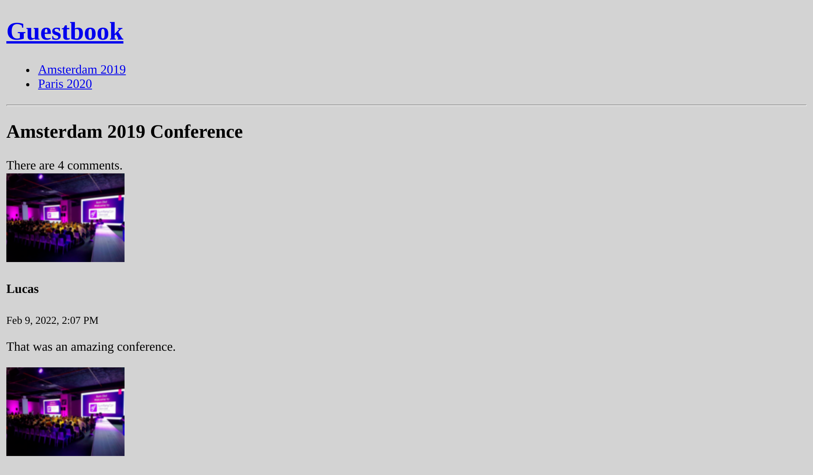

Testen
======

.. index::
    single: PHPUnit

Nu we meer en meer functionaliteit aan de applicatie aan het toevoegen zijn moeten we eens praten over hoe we deze gaan testen.

*Leuke anekdote*: Ik vond een bug tijdens het schrijven van de tests in dit hoofdstuk.

Symfony maakt gebruik van PHPUnit voor unit tests. We installeren dit:

.. code-block:: terminal

    $ symfony composer req phpunit --dev

Unit tests schrijven
--------------------

.. index::
    single: Test;Unit Tests
    single: Unit Tests
    single: Command;make:test

De eerste class waarvoor we tests gaan schrijven is ``SpamChecker``. Genereer een unittest:

.. code-block:: terminal

    $ symfony console make:test TestCase SpamCheckerTest

Het testen van de SpamChecker is een uitdaging, want we willen niet telkens de Akismet API aanroepen. We gaan de API *mocken*.

.. index::
    single: Mock

We schrijven een eerste test voor wanneer de API een fout teruggeeft:

.. code-block:: diff
    :caption: patch_file

    --- a/tests/SpamCheckerTest.php
    +++ b/tests/SpamCheckerTest.php
    @@ -2,12 +2,26 @@

     namespace App\Tests;

    +use App\Entity\Comment;
    +use App\SpamChecker;
     use PHPUnit\Framework\TestCase;
    +use Symfony\Component\HttpClient\MockHttpClient;
    +use Symfony\Component\HttpClient\Response\MockResponse;
    +use Symfony\Contracts\HttpClient\ResponseInterface;

     class SpamCheckerTest extends TestCase
     {
    -    public function testSomething(): void
    +    public function testSpamScoreWithInvalidRequest(): void
         {
    -        $this->assertTrue(true);
    +        $comment = new Comment();
    +        $comment->setCreatedAtValue();
    +        $context = [];
    +
    +        $client = new MockHttpClient([new MockResponse('invalid', ['response_headers' => ['x-akismet-debug-help: Invalid key']])]);
    +        $checker = new SpamChecker($client, 'abcde');
    +
    +        $this->expectException(\RuntimeException::class);
    +        $this->expectExceptionMessage('Unable to check for spam: invalid (Invalid key).');
    +        $checker->getSpamScore($comment, $context);
         }
     }

De ``MockHttpClient`` class maakt het mogelijk om elke HTTP server te mocken. Deze aanvaard een array met ``MockResponse`` instanties die de verwachte body en Response headers bevatten.

Vervolgens roepen we de ``getSpamScore()`` methode aan en controleren we of er een exception wordt getriggerd via de ``expectException()`` methode van PHPUnit.

Voer de tests uit om te controleren of ze slagen:

.. code-block:: terminal

    $ symfony php bin/phpunit

.. index::
    single: PHPUnit;Data Provider
    single: Data Provider
    single: Attributes;@dataProvider

Laten we tests toevoegen voor de happy flow:

.. code-block:: diff
    :caption: patch_file

    --- a/tests/SpamCheckerTest.php
    +++ b/tests/SpamCheckerTest.php
    @@ -24,4 +24,32 @@ class SpamCheckerTest extends TestCase
             $this->expectExceptionMessage('Unable to check for spam: invalid (Invalid key).');
             $checker->getSpamScore($comment, $context);
         }
    +
    +    /**
    +     * @dataProvider getComments
    +     */
    +    public function testSpamScore(int $expectedScore, ResponseInterface $response, Comment $comment, array $context)
    +    {
    +        $client = new MockHttpClient([$response]);
    +        $checker = new SpamChecker($client, 'abcde');
    +
    +        $score = $checker->getSpamScore($comment, $context);
    +        $this->assertSame($expectedScore, $score);
    +    }
    +
    +    public function getComments(): iterable
    +    {
    +        $comment = new Comment();
    +        $comment->setCreatedAtValue();
    +        $context = [];
    +
    +        $response = new MockResponse('', ['response_headers' => ['x-akismet-pro-tip: discard']]);
    +        yield 'blatant_spam' => [2, $response, $comment, $context];
    +
    +        $response = new MockResponse('true');
    +        yield 'spam' => [1, $response, $comment, $context];
    +
    +        $response = new MockResponse('false');
    +        yield 'ham' => [0, $response, $comment, $context];
    +    }
     }

PHPUnit-dataproviders stellen ons in staat om dezelfde testlogica voor meerdere testcases te hergebruiken.

Functionele tests schrijven voor controllers
--------------------------------------------

.. index::
    single: Test;Functional Tests
    single: Functional Tests
    single: Components;Browser Kit
    single: Browser Kit

Het testen van controllers is een beetje anders dan het testen van een "gewone" PHP class, omdat we ze willen uitvoeren in de context van een HTTP request.

Maak een functionele test voor de Conference-controller:

.. code-block:: php
    :caption: tests/Controller/ConferenceControllerTest.php

    namespace App\Tests\Controller;

    use Symfony\Bundle\FrameworkBundle\Test\WebTestCase;

    class ConferenceControllerTest extends WebTestCase
    {
        public function testIndex()
        {
            $client = static::createClient();
            $client->request('GET', '/');

            $this->assertResponseIsSuccessful();
            $this->assertSelectorTextContains('h2', 'Give your feedback');
        }
    }

Het gebruik van ``Symfony\Bundle\FrameworkBundle\Test\WebTestCase`` in plaats van ``PHPUnit\Framework\TestCase`` als basisklasse voor onze tests geeft ons een mooie abstractie voor functionele tests.

De ``$client`` variabele simuleert een browser. In plaats van HTTP-calls naar de server uit te voeren, wordt de Symfony-toepassing rechtstreeks opgeroepen. Deze strategie heeft een aantal voordelen: het is veel sneller dan te moeten communiceren tussen de client en de server, maar het maakt het ook mogelijk om na elke HTTP-request, de staat van de services te inspecteren.

Deze eerste test controleert of de homepage een 200 HTTP response terugstuurt.

Assertions zoals ``assertResponseIsSuccessful`` worden boven op PHPUnit toegevoegd om het werk te vergemakkelijken. Zo zijn er veel van dit soort assertions door Symfony toegevoegd.

.. tip::

    We hebben ``/`` gebruikt voor de URL, in plaats van deze te genereren via de router. Dit doen we bewust zo, omdat het testen van de URL's van eindgebruikers deel uitmaakt van wat we willen testen. Als het routepad wijzigt, zullen de tests falen en je herinneren dat je waarschijnlijk de oude URL moet omleiden naar de nieuwe, om zoekmachines en externe websites die er naar linken tevreden te houden.

Configuratie voor de testomgeving
---------------------------------

.. index::
    single: Symfony Environments

Standaard worden PHPUnit-tests gedraaid in de Symfony ``test`` omgeving zoals staat gedefinieerd in het PHPUnit configuratiebestand.

.. code-block:: xml
    :caption: phpunit.xml.dist
    :emphasize-lines: 4
    :class: ignore

    <phpunit>
        <php>
            <ini name="error_reporting" value="-1" />
            <server name="APP_ENV" value="test" force="true" />
            <server name="SHELL_VERBOSITY" value="-1" />
            <server name="SYMFONY_PHPUNIT_REMOVE" value="" />
            <server name="SYMFONY_PHPUNIT_VERSION" value="8.5" />
        </php>
    </phpunit>

.. index:: Command;secrets:set

Om de tests te laten functioneren dienen we de ``AKISMET_KEY`` voor deze ``test`` omgeving in te stellen:

.. code-block:: terminal
    :class: answers(AKISMET_KEY_VALUE)

    $ symfony console secrets:set AKISMET_KEY --env=test

Werken met een testdatabase
---------------------------

.. index::
    single: Test;Database
    single: Functional Tests,Database

Zoals we al hebben gezien, stelt de Symfony CLI automatisch de omgevingsvariabele ``DATABASE_URL`` ter beschikking. Wanneer ``APP_ENV`` gelijk is aan ``test``, zoals ingesteld bij het draaien van PHPUnit, verandert het de databasenaam van ``main`` naar ``main_test``. Hierdoor hebben de tests hun eigen database. Dit is erg belangrijk omdat we stabiele gegevens nodig hebben om onze tests uit te voeren en we willen zeker niet de gegevens in de ontwikkelings-database overschrijven.

Voordat we in staat zijn de tests te draaien dienen we de ``test`` database te "initialiseren" (het aanmaken van de database en deze migreren):

.. code-block:: terminal

    $ symfony console doctrine:database:create --env=test
    $ symfony console doctrine:migrations:migrate -n --env=test

.. note:

    On Linux and similiar OSes, you can use ``APP_ENV=prod`` instead of
    ``--env=prod``:

    .. code-block:: terminal
        :class: ignore

        $ APP_ENV=prod symfony console doctrine:database:create

Als je de tests nu draait zal PHPUnit niet communiceren met je ontwikkelings-database. Om enkel de nieuwe tests te draaien geef je het pad van de class door:

.. code-block:: terminal

    $ symfony php bin/phpunit tests/Controller/ConferenceControllerTest.php

.. tip::

    Als een test mislukt, kan het nuttig zijn om het Response-object nader te onderzoeken. Je kan het object benaderen via ``$client->getResponse()`` en middels ``echo`` bekijken hoe het eruitziet.

Fixtures definiëren
--------------------

.. index::
    single: Doctrine;Fixtures
    single: Fixtures

Om de lijst van reacties, de paginering en het indienen van het formulier te kunnen testen, moeten we de database vullen met enkele gegevens. En we willen dat de gegevens tussen de testruns hetzelfde zijn om de tests te laten slagen. Fixtures zijn precies wat we nodig hebben.

Installeer de Doctrine Fixtures bundle:

.. code-block:: terminal

    $ symfony composer req orm-fixtures --dev

Tijdens de installatie is een nieuwe ``src/DataFixtures/`` directory aangemaakt met een voorbeeldclass, klaar om te worden aangepast. Voeg voor nu twee conferenties en een reactie toe:

.. code-block:: diff
    :caption: patch_file

    --- a/src/DataFixtures/AppFixtures.php
    +++ b/src/DataFixtures/AppFixtures.php
    @@ -2,6 +2,8 @@

     namespace App\DataFixtures;

    +use App\Entity\Comment;
    +use App\Entity\Conference;
     use Doctrine\Bundle\FixturesBundle\Fixture;
     use Doctrine\Persistence\ObjectManager;

    @@ -9,8 +11,24 @@ class AppFixtures extends Fixture
     {
         public function load(ObjectManager $manager): void
         {
    -        // $product = new Product();
    -        // $manager->persist($product);
    +        $amsterdam = new Conference();
    +        $amsterdam->setCity('Amsterdam');
    +        $amsterdam->setYear('2019');
    +        $amsterdam->setIsInternational(true);
    +        $manager->persist($amsterdam);
    +
    +        $paris = new Conference();
    +        $paris->setCity('Paris');
    +        $paris->setYear('2020');
    +        $paris->setIsInternational(false);
    +        $manager->persist($paris);
    +
    +        $comment1 = new Comment();
    +        $comment1->setConference($amsterdam);
    +        $comment1->setAuthor('Fabien');
    +        $comment1->setEmail('fabien@example.com');
    +        $comment1->setText('This was a great conference.');
    +        $manager->persist($comment1);

             $manager->flush();
         }

Wanneer we de fixtures laden, worden alle gegevens verwijderd; inclusief de admin-gebruiker. Om dat te voorkomen, voegen we de admin-gebruiker toe aan de fixtures:

.. code-block:: diff

    --- a/src/DataFixtures/AppFixtures.php
    +++ b/src/DataFixtures/AppFixtures.php
    @@ -2,13 +2,22 @@

     namespace App\DataFixtures;

    +use App\Entity\Admin;
     use App\Entity\Comment;
     use App\Entity\Conference;
     use Doctrine\Bundle\FixturesBundle\Fixture;
     use Doctrine\Persistence\ObjectManager;
    +use Symfony\Component\PasswordHasher\Hasher\PasswordHasherFactoryInterface;

     class AppFixtures extends Fixture
     {
    +    private $passwordHasherFactory;
    +
    +    public function __construct(PasswordHasherFactoryInterface $encoderFactory)
    +    {
    +        $this->passwordHasherFactory = $encoderFactory;
    +    }
    +
         public function load(ObjectManager $manager): void
         {
             $amsterdam = new Conference();
    @@ -30,6 +39,12 @@ class AppFixtures extends Fixture
             $comment1->setText('This was a great conference.');
             $manager->persist($comment1);

    +        $admin = new Admin();
    +        $admin->setRoles(['ROLE_ADMIN']);
    +        $admin->setUsername('admin');
    +        $admin->setPassword($this->passwordHasherFactory->getPasswordHasher(Admin::class)->hash('admin', null));
    +        $manager->persist($admin);
    +
             $manager->flush();
         }
     }

.. index::
    single: Command;debug:autowiring
    single: Debug;Container
    single: Container;Debug

.. tip::

    Als je niet meer weet welke service je voor een bepaalde taak moet gebruiken, gebruik dan ``debug:autowiring`` met een bepaald trefwoord:

    .. code-block:: terminal

        $ symfony console debug:autowiring encoder

Fixtures laden
--------------

.. index:: ! Command;doctrine:fixtures:load

Laad de fixtures voor de ``test`` omgeving/database:

.. code-block:: terminal
    :class: answers(y)

    $ symfony console doctrine:fixtures:load --env=test

Het crawlen van een website in functionele tests
------------------------------------------------

.. index::
    single: Components;CssSelector
    single: Components;DomCrawler
    single: Test;Crawling
    single: Crawling

Zoals we hebben gezien, simuleert de HTTP-client die in de tests wordt gebruikt een browser, zodat we door de website kunnen navigeren alsof we een headless browser gebruiken.

Voeg een nieuwe test toe die op een conferentiepagina van de homepage klikt:

.. code-block:: diff
    :caption: patch_file

    --- a/tests/Controller/ConferenceControllerTest.php
    +++ b/tests/Controller/ConferenceControllerTest.php
    @@ -14,4 +14,19 @@ class ConferenceControllerTest extends WebTestCase
             $this->assertResponseIsSuccessful();
             $this->assertSelectorTextContains('h2', 'Give your feedback');
         }
    +
    +    public function testConferencePage()
    +    {
    +        $client = static::createClient();
    +        $crawler = $client->request('GET', '/');
    +
    +        $this->assertCount(2, $crawler->filter('h4'));
    +
    +        $client->clickLink('View');
    +
    +        $this->assertPageTitleContains('Amsterdam');
    +        $this->assertResponseIsSuccessful();
    +        $this->assertSelectorTextContains('h2', 'Amsterdam 2019');
    +        $this->assertSelectorExists('div:contains("There are 1 comments")');
    +    }
     }

Laten we in eenvoudige taal beschrijven wat er in deze test gebeurt:

* Net als bij de eerste test gaan we naar de homepage;

* De ``request()`` methode geeft een ``Crawler`` instantie terug die je helpt elementen op de pagina te vinden (zoals links, formulieren, of alles wat je kan bereiken met CSS-selectors of XPath);

* Dankzij een CSS-selector kunnen we vaststellen dat er twee conferenties op de homepage staan vermeld;

* Vervolgens klikken we op de link "Bekijken" (omdat er niet meer dan één link tegelijk kan worden aangeklikt, kiest Symfony automatisch de eerste die gevonden wordt);

* We checken op de paginatitel, de response en de ``<h2>`` van de pagina, om er zeker van te zijn dat we op de juiste pagina zitten (we hadden ook de route kunnen vergelijken);

* Tot slot stellen we vast dat er 1 reactie op de pagina staat. ``div:contains()`` is geen geldige CSS-selector, maar Symfony heeft een aantal leuke toevoegingen, ontleend aan jQuery.

In plaats van op tekst te klikken (d.w.z. ``Bekijken`` ), hadden we de link ook via een CSS-selector kunnen aanduiden:

.. code-block:: php
    :class: ignore

    $client->click($crawler->filter('h4 + p a')->link());

Controleer of de nieuwe test groen is:

.. code-block:: terminal

    $ symfony php bin/phpunit tests/Controller/ConferenceControllerTest.php

Een formulier indienen in een functionele test
----------------------------------------------

Wil je naar een hoger niveau? Probeer een nieuwe reactie met foto toe te voegen op een conferentie via een test door het indienen van een formulier te simuleren. Dat lijkt ambitieus, nietwaar? Kijk naar de benodigde code: niet complexer dan wat we al schreven:

.. code-block:: diff
    :caption: patch_file

    --- a/tests/Controller/ConferenceControllerTest.php
    +++ b/tests/Controller/ConferenceControllerTest.php
    @@ -29,4 +29,19 @@ class ConferenceControllerTest extends WebTestCase
             $this->assertSelectorTextContains('h2', 'Amsterdam 2019');
             $this->assertSelectorExists('div:contains("There are 1 comments")');
         }
    +
    +    public function testCommentSubmission()
    +    {
    +        $client = static::createClient();
    +        $client->request('GET', '/conference/amsterdam-2019');
    +        $client->submitForm('Submit', [
    +            'comment_form[author]' => 'Fabien',
    +            'comment_form[text]' => 'Some feedback from an automated functional test',
    +            'comment_form[email]' => 'me@automat.ed',
    +            'comment_form[photo]' => dirname(__DIR__, 2).'/public/images/under-construction.gif',
    +        ]);
    +        $this->assertResponseRedirects();
    +        $client->followRedirect();
    +        $this->assertSelectorExists('div:contains("There are 2 comments")');
    +    }
     }

Om een formulier in te dienen via ``submitForm()``, vind je de veldnamen via de browser DevTools of via het Symfony Profiler Form-panel. Merk het slimme hergebruik van het under construction plaatje op!

Voer de tests opnieuw uit om te controleren of alles groen is:

.. code-block:: terminal

    $ symfony php bin/phpunit tests/Controller/ConferenceControllerTest.php

Als je de resultaten in een browser wilt bekijken dien je de Web server te stoppen en opnieuw te starten voor de ``test`` omgeving:

.. code-block:: terminal
    :class: ignore

    $ symfony server:stop
    $ symfony server:start -d --env=test

De fixtures herladen
--------------------

.. index::
    single: Command;doctrine:fixtures:load

Als je de tests een tweede keer uitvoert, zouden ze moeten mislukken. Aangezien er nu meer reacties in de database staan, is de bewering van het aantal reacties niet langer geldig. We moeten de data in de database tussen elke run resetten door de fixtures voor elke run opnieuw te laden:

.. code-block:: terminal
    :class: answers(y)

    $ symfony console doctrine:fixtures:load --env=test
    $ symfony php bin/phpunit tests/Controller/ConferenceControllerTest.php

Jouw workflow automatiseren met een Makefile
--------------------------------------------

.. index::
    single: Makefile

Het is vervelend om een reeks commando's te moeten onthouden bij het uitvoeren van de tests. Dit moet minstens worden gedocumenteerd. Maar documentatie moet een laatste redmiddel zijn. Kunnen we de day-to-day handelingen automatiseren? Dat zou kunnen dienen als documentatie, andere ontwikkelaars helpen om taken te terug te vinden en vergemakkelijkt en versnelt het ontwikkelen.

.. index::
    single: Command;doctrine:fixtures:load

Het gebruik van een ``Makefile`` is een manier om commando's te automatiseren:

.. code-block:: makefile
    :caption: Makefile

    SHELL := /bin/bash

    tests:
    	symfony console doctrine:database:drop --force --env=test || true
    	symfony console doctrine:database:create --env=test
    	symfony console doctrine:migrations:migrate -n --env=test
    	symfony console doctrine:fixtures:load -n --env=test
    	symfony php bin/phpunit $@
    .PHONY: tests

.. warning::

    De indentatie in een Makerfile regel ``moet`` bestaan uit een enkel tab karakter en niet uit spaties.

Merk de ``-n`` optie op bij het Doctrine commando; het is een globale parameter op Symfony commando's, die ze niet-interactief maakt.

Wanneer je de tests wilt uitvoeren, gebruik dan ``make tests``:

.. code-block:: terminal

    $ make tests

De database resetten na elke test
---------------------------------

.. index::
    single: PHPUnit;Performance

Het resetten van de database na elke test is leuk, maar het is nog beter om echt onafhankelijke tests te hebben. We willen niet dat één test afhankelijk is van de resultaten van de vorige. Het wijzigen van de volgorde van de tests mag de uitkomst niet veranderen. Zoals we nu gaan ontdekken, is dat op dit moment niet het geval.

Verplaats de ``testConferencePage`` test na de ``testCommentSubmission`` test:

.. code-block:: diff
    :caption: patch_file

    --- a/tests/Controller/ConferenceControllerTest.php
    +++ b/tests/Controller/ConferenceControllerTest.php
    @@ -15,21 +15,6 @@ class ConferenceControllerTest extends WebTestCase
             $this->assertSelectorTextContains('h2', 'Give your feedback');
         }

    -    public function testConferencePage()
    -    {
    -        $client = static::createClient();
    -        $crawler = $client->request('GET', '/');
    -
    -        $this->assertCount(2, $crawler->filter('h4'));
    -
    -        $client->clickLink('View');
    -
    -        $this->assertPageTitleContains('Amsterdam');
    -        $this->assertResponseIsSuccessful();
    -        $this->assertSelectorTextContains('h2', 'Amsterdam 2019');
    -        $this->assertSelectorExists('div:contains("There are 1 comments")');
    -    }
    -
         public function testCommentSubmission()
         {
             $client = static::createClient();
    @@ -44,4 +29,19 @@ class ConferenceControllerTest extends WebTestCase
             $client->followRedirect();
             $this->assertSelectorExists('div:contains("There are 2 comments")');
         }
    +
    +    public function testConferencePage()
    +    {
    +        $client = static::createClient();
    +        $crawler = $client->request('GET', '/');
    +
    +        $this->assertCount(2, $crawler->filter('h4'));
    +
    +        $client->clickLink('View');
    +
    +        $this->assertPageTitleContains('Amsterdam');
    +        $this->assertResponseIsSuccessful();
    +        $this->assertSelectorTextContains('h2', 'Amsterdam 2019');
    +        $this->assertSelectorExists('div:contains("There are 1 comments")');
    +    }
     }

Tests falen nu.

.. index::
    single: Doctrine;TestBundle

Om de database tussen de tests door te resetten, installeer je de DoctrineTestBundle:

.. code-block:: terminal
    :class: hide

    $ symfony composer config extra.symfony.allow-contrib true

.. code-block:: terminal

    $ symfony composer req "dama/doctrine-test-bundle:^6" --dev

Je moet het uitvoeren van de recipe bevestigen (aangezien het geen "officieel" ondersteunde bundle is):

.. code-block:: text
    :class: ignore

    Symfony operations: 1 recipe (a5c79a9ff21bc3ae26d9bb25f1262ed7)
      -  WARNING  dama/doctrine-test-bundle (>=4.0): From github.com/symfony/recipes-contrib:master
        The recipe for this package comes from the "contrib" repository, which is open to community contributions.
        Review the recipe at https://github.com/symfony/recipes-contrib/tree/master/dama/doctrine-test-bundle/4.0

        Do you want to execute this recipe?
        [y] Yes
        [n] No
        [a] Yes for all packages, only for the current installation session
        [p] Yes permanently, never ask again for this project
        (defaults to n): p

Activeer de PHPUnit listener:

.. code-block:: diff
    :caption: patch_file

    --- a/phpunit.xml.dist
    +++ b/phpunit.xml.dist
    @@ -29,6 +29,10 @@
             </include>
         </coverage>

    +    <extensions>
    +        <extension class="DAMA\DoctrineTestBundle\PHPUnit\PHPUnitExtension" />
    +    </extensions>
    +
         <listeners>
             <listener class="Symfony\Bridge\PhpUnit\SymfonyTestsListener" />
         </listeners>

En klaar. Eventuele datawijzigingen gemaakt door tests worden nu aan het einde van elke test automatisch teruggedraaid.

De tests moeten weer groen zijn:

.. code-block:: terminal

    $ make tests

Gebruik van een echte browser voor functionele tests
----------------------------------------------------

.. index::
    single: Test;Panther
    single: Panther

Functionele tests maken gebruik van een speciale browser die de Symfony-laag rechtstreeks aanroept. Maar je kunt ook een echte browser en de echte HTTP-laag gebruiken dankzij Symfony Panther:

.. code-block:: terminal

    $ symfony composer req panther --dev

Je kan dan tests schrijven die gebruik maken van een echte Google Chrome-browser door het maken van volgende wijzigingen:

.. code-block:: diff
    :class: ignore

    --- a/tests/Controller/ConferenceControllerTest.php
    +++ b/tests/Controller/ConferenceControllerTest.php
    @@ -2,13 +2,13 @@

     namespace App\Tests\Controller;

    -use Symfony\Bundle\FrameworkBundle\Test\WebTestCase;
    +use Symfony\Component\Panther\PantherTestCase;

    -class ConferenceControllerTest extends WebTestCase
    +class ConferenceControllerTest extends PantherTestCase
     {
         public function testIndex()
         {
    -        $client = static::createClient();
    +        $client = static::createPantherClient(['external_base_uri' => $_SERVER['SYMFONY_PROJECT_DEFAULT_ROUTE_URL']]);
             $client->request('GET', '/');

             $this->assertResponseIsSuccessful();

De ``SYMFONY_PROJECT_DEFAULT_ROUTE_URL`` omgevingsvariabele bevat de URL van de lokale webserver.

Het Juiste Test Type Kiezen
---------------------------

.. index::
    single: Command;make:test

We hebben tot nu toe drie verschillende type tests gemaakt. Hoewel we de maker bundle enkel gebruikt hebben om om de unit test class te genereren, zouden we deze ook gebruikt kunnen hebben om de andere test classes te genereren:

.. code-block:: terminal
    :class: ignore

    $ symfony console make:test WebTestCase Controller\\ConferenceController

    $ symfony console make:test PantherTestCase Controller\\ConferenceController

De maker bundle ondersteunt het genereren van de volgende test types, afhankelijk van hoe je je je applicatie wil testen:

* ``TestCase``: Basis PHPUnit testen;

* ``KernelTestCase``: Basis testen die toegang hebben tot Symfony services;

* ``WebTestCase``: Om browser-achtige scenario's te draaien, maar die geen JavaScript code uitvoeren;

* ``ApiTestCase``: Om API-georiënteerde scenario's uit te voeren;

* ``PantherTestCase``: Om e2e scenario's uit te voeren, gebruik makend van een echte browser of HTTP client en een echte web server.

Black-box functionele tests draaien met Blackfire
-------------------------------------------------

Een andere manier om functionele tests uit te voeren is via de `Blackfire player`_. Naast wat je kan testen met de functionele tests, kan je ook performance-tests uitvoeren.

Lees de stap over :doc:`Prestaties <29-performance>` om hier meer over te leren.

.. sidebar:: Verder gaan

    * `Assertions die door Symfony gedefinieerd worden`_ voor functionele testen;

    * `PHPUnit docs`_;

    * De `Faker library`_ om realistische fixture data te genereren;

    * De `CssSelector component documentatie`_;

    * De `Symfony Panther library`_ voor browser tests en web crawling in Symfony applicaties:

    * De `Make/Makefile documentatie`_.

.. _`Blackfire player`: https://blackfire.io/player
.. _`Assertions die door Symfony gedefinieerd worden`: https://symfony.com/doc/current/testing/functional_tests_assertions.html
.. _`PHPUnit docs`: https://phpunit.de/documentation.html
.. _`Faker library`: https://github.com/FakerPHP/Faker
.. _`CssSelector component documentatie`: https://symfony.com/doc/current/components/css_selector.html
.. _`Symfony Panther library`: https://github.com/symfony/panther
.. _`Make/Makefile documentatie`: https://www.gnu.org/software/make/manual/make.html
