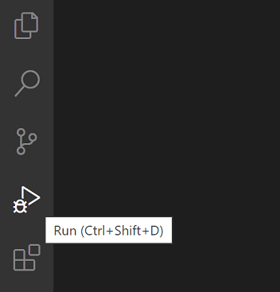

Het ontdekken van Symfony Internals
===================================

.. index::
    single: Blackfire
    single: Debugging
    single: Internals

We gebruiken Symfony al geruime tijd om een krachtige applicatie te ontwikkelen, maar het grootste deel van de code die door de applicatie wordt uitgevoerd komt van Symfony. Een paar honderd regels code tegenover duizenden regels code.

Ik wil graag begrijpen hoe dingen achter de schermen werken. En ik ben altijd gefascineerd geweest door tools die me helpen begrijpen hoe dingen werken. De eerste keer dat ik een stapsgewijze debugger gebruikte of de eerste keer dat ik ``ptrace`` ontdekte zullen magische herinneringen blijven.

Wil je beter begrijpen hoe Symfony werkt? Tijd om onder de motorkap te kijken en te ontdekken hoe Symfony jouw applicatie laat werken. In plaats van te beschrijven hoe Symfony een HTTP-verzoek vanuit een theoretisch perspectief behandelt, wat nogal saai zou zijn, gaan we Blackfire gebruiken om wat visuele representaties te krijgen en enkele geavanceerde onderwerpen aan te snijden.

Symfony internals begrijpen met Blackfire
-----------------------------------------

Je weet al dat alle HTTP-verzoeken worden bediend door één enkel toegangspunt: het ``public/index.php``-bestand. Maar wat gebeurt er daarna? Hoe worden controllers aangeroepen?

Laten we de Engelse homepage in productie met Blackfire profileren via de Blackfire browserextensie:

.. code-block:: terminal
    :class: ignore

    $ symfony remote:open

Of rechtstreeks via de commandline:

.. code-block:: terminal
    :class: ignore

    $ blackfire curl `symfony cloud:env:url --pipe --primary`en/

Ga naar de "Tijdlijn"-weergave van het profiel, je ziet dan iets als het volgende:

.. figure:: images/blackfire-homepage-prod.png
    :alt: /
    :align: center
    :figclass: with-browser

Hover op de tijdlijn over de gekleurde balken voor meer informatie over iedere call; je leert zo meer over hoe Symfony werkt:

* Het belangrijkste startpunt is ``public/index.php``;

* De ``Kernel::handle()`` methode verwerkt het verzoek;

* Het roept de ``HttpKernel`` aan, die enkele events uitstuurt;

* Het eerste event is het ``RequestEvent``;

* De ``ControllerResolver::getController()`` methode wordt aangeroepen om te bepalen welke controller moet worden opgeroepen voor de inkomende URL;

* De ``ControllerResolver::getArguments()`` methode wordt aangeroepen om te bepalen welke argumenten aan de controller moeten worden doorgegeven (de param-converter wordt aangeroepen);

* De ``ConferenceController::index()`` methode wordt aangeroepen en de meeste van onze code wordt daar uitgevoerd;

* De ``ConferenceRepository::findAll()`` methode haalt alle conferenties op uit de database (let op de verbinding met de database via ``PDO::__construct()``);

* De ``Twig\Environment::render()`` methode rendert de template;

* De ``ResponseEvent`` en de ``FinishRequestEvent`` events worden uitgestuurd, maar het lijkt er op dat er geen listeners zijn geregistreerd aangezien ze erg snel uitgevoerd worden.

De tijdlijn is een handige manier om te begrijpen hoe code in elkaar zit; wat van pas kan komen als je op een project moet werken dat door iemand anders ontwikkeld werd.

Profileer nu dezelfde pagina van de lokale machine in de ontwikkelomgeving:

.. code-block:: terminal
    :class: ignore

    $ blackfire curl `symfony var:export SYMFONY_PROJECT_DEFAULT_ROUTE_URL`en/

Open het profiel. Je zou doorgestuurd moeten worden naar de call graph weergave, omdat het verzoek heel snel was en de tijdlijn vrij leeg zou zijn:

.. figure:: images/blackfire-homepage-cached-dev.png
    :alt: /
    :align: center
    :figclass: with-browser

Begrijp je wat er aan de hand is? De HTTP-cache is ingeschakeld en daardoor profileren we de Symfony HTTP cache laag. Aangezien de pagina in de cache zit, zal ``HttpCache\Store::restoreResponse()`` de HTTP-response uit de cache nemen en wordt de controller nooit aangeroepen.

Schakel de cache-laag uit in ``public/index.php`` zoals in de vorige stap en probeer het opnieuw. Je kan meteen zien dat het profiel er heel anders uitziet:

.. figure:: images/blackfire-homepage-dev.png
    :alt: /
    :align: center
    :figclass: with-browser

De belangrijkste verschillen zijn de volgende:

* Het ``TerminateEvent``, dat niet zichtbaar was in productie, neemt een groot percentage van de uitvoeringstijd in beslag; als je beter kijkt, zie je dat dit het event is dat verantwoordelijk is voor het opslaan van de gegevens van de Symfony profiler die tijdens de request werden verzameld;

* Onder de ``ConferenceController::index()`` wordt de method ``SubRequestHandler::handle()`` uitgevoerd die de ESI rendered (daarom hebben we twee calls naar ``Profiler::saveProfile()``, één voor het hoofdrequest en één voor de ESI).

Verken de tijdlijn om meer te weten te komen; schakel over naar de call graph weergave om een andere beeld te krijgen van dezelfde gegevens.

Zoals we zojuist hebben ontdekt is de code die tijdens ontwikkeling en productie wordt uitgevoerd heel anders. De ontwikkelomgeving is langzamer omdat de Symfony profiler veel gegevens probeert te verzamelen om het debuggen te vergemakkelijken. Daarom moet je altijd profileren in de productieomgeving, ook lokaal.

Enkele interessante experimenten: profileer een foutpagina, profileer de ``/`` pagina (dat is een redirect), of een API resource. Elk profiel vertelt je iets meer over hoe Symfony werkt, welke classes/methods worden aangeroepen, welke operaties zwaar doorwegen en welke licht zijn.

De Blackfire debug addon gebruiken
----------------------------------

.. index::
    single: Blackfire;Debug Addon

Standaard verwijdert Blackfire alle method calls die niet belangrijk genoeg zijn, om te voorkomen dat je moet werken met zware datasets en grote grafieken. Bij het gebruik van Blackfire als debugging-tool is het echter beter om alle calls te behouden. Deze functionaliteit wordt door de debug addon toegevoegd.

Gebruik vanaf de command line de ``--debug`` parameter:

.. code-block:: terminal
    :class: ignore

    $ blackfire --debug curl `symfony var:export SYMFONY_PROJECT_DEFAULT_ROUTE_URL`en/
    $ blackfire --debug curl `symfony cloud:env:url --pipe --primary`en/

.. index::
    single: .env.local.prod

In de productieomgeving zie je bijvoorbeeld dat een bestand genaamd ``.env.local.php`` wordt ingeladen:

.. figure:: images/blackfire-env-local-prod.png
    :alt: /
    :align: center
    :figclass: with-browser

.. index::
    single: Composer;Optimizations
    single: Composer;Autoloader
    single: Autoloader

Waar komt dit vandaan? Platform.sh doet enkele optimalisaties bij het deployen van een Symfony applicatie, zoals het optimaliseren van de Composer autoloader ( ``--optimize-autoloader --apcu-autoloader --classmap-authoritative`` ). Ook de omgevingsvariabelen die in het ``.env`` bestand zijn gedefinieerd, worden geoptimaliseerd door het ``.env.local.php`` bestand te genereren (om te voorkomen dat het bestand bij elk verzoek opnieuw wordt geparsed):

.. code-block:: terminal
    :class: ignore

    $ symfony run composer dump-env prod

Blackfire is een zeer krachtige tool die je helpt inzicht te krijgen in hoe code wordt uitgevoerd door PHP. Het verbeteren van prestaties is slechts één manier om een profiler te gebruiken.

Een Stap-debugger gebruiken met Xdebug
--------------------------------------

.. index::
    single: Xdebug
    single: Debugger

Met behulp van Blackfire-tijdlijnen en aanroep-grafieken kunnen ontwikkelaars visualiseren welke bestanden/functies/methoden door de PHP-engine worden uitgevoerd om de code van het project beter te begrijpen.

Een andere manier om de uitvoering van de code te volgen, is door een **stap debugger** te gebruiken, zoals `Xdebug`_. Met een stap debugger kunnen ontwikkelaars interactief door de PHP-code lopen om de controle-stroom te debuggen en gegevensstructuren te onderzoeken. Het is erg handig om onverwacht gedrag te debuggen en het vervangt de gebruikelijke "var_dump()/exit()"-debug techniek.

Installeer eerst de PHP-extensie ``xdebug``. Controleer of het is geïnstalleerd door de volgende opdracht uit te voeren:

.. code-block:: terminal

    $ symfony php -v

Je zou Xdebug in de output moeten zien:

.. code-block:: text
    :emphasize-lines: 5
    :class: ignore

    PHP 8.0.1 (cli) (built: Jan 13 2021 08:22:35) ( NTS )
    Copyright (c) The PHP Group
    Zend Engine v4.0.1, Copyright (c) Zend Technologies
        with Zend OPcache v8.0.1, Copyright (c), by Zend Technologies
        with Xdebug v3.0.2, Copyright (c) 2002-2021, by Derick Rethans
        with blackfire v1.49.0~linux-x64-non_zts80, https://blackfire.io, by Blackfire

U kunt ook controleren of Xdebug is ingeschakeld voor PHP-FPM door de browser te openen en op de link "View phpinfo()" te klikken wanneer je op het Symfony-logo van de debug-toolbar hovert:

.. figure:: screenshots/phpinfo.png
    :alt: /
    :align: center
    :figclass: with-browser

Schakel nu de ``debug``-modus van Xdebug in:

.. code-block:: ini
    :caption: php.ini
    :class: ignore

    [xdebug]
    xdebug.mode=debug
    xdebug.start_with_request=yes

Xdebug stuurt standaard gegevens naar poort 9003 van de lokale host.

Het activeren van Xdebug kan op veel manieren worden gedaan, maar het gemakkelijkst is om Xdebug te gebruiken vanaf jouw IDE. In dit hoofdstuk zullen we Visual Studio Code gebruiken om te demonstreren hoe het werkt. Installeer de `PHP Debug`_ extensie door de 'Quick Open'-functie te starten (``Ctrl+P``), plak het volgende commando, en druk op enter:

.. code-block:: text
    :class: ignore

    ext install felixfbecker.php-debug

Maak het volgende configuratiebestand aan:

.. code-block:: json
    :caption: .vscode/launch.json
    :emphasize-lines: 8,16
    :class: ignore

    {
        "version": "0.2.0",
        "configurations": [
            {
                "name": "Listen for XDebug",
                "type": "php",
                "request": "launch",
                "port": 9003
            },
            {
                "name": "Launch currently open script",
                "type": "php",
                "request": "launch",
                "program": "${file}",
                "cwd": "${fileDirname}",
                "port": 9003
            }
        ]
    }

Ga vanuit Visual Studio Code, terwijl je je in jouw projectmap bevindt, naar de debugger en klik op de groene afspeelknop met het label "Listen for Xdebug":

Als je naar de browser gaat en ververst dan zou de IDE automatisch de focus moeten krijgen, wat betekent dat de debug-sessie klaar is. Standaard is alles een breekpunt, dus de uitvoering stopt bij de eerste instructie. Het is dan aan jou om de huidige variabelen te inspecteren, over de code te stappen, in de code te stappen, ...

Bij het debuggen kan je het breekpunt "Everything" uitschakelen en expliciet breekpunten in jouw code code instellen.

Als je nieuw bent met stap-debuggers, lees dan de `uitstekende tutorial voor Visual Studio Code`_, waarin alles visueel wordt uitgelegd.

.. sidebar:: Verder gaan

    * `De Xdebug Step Debugging documentatie`_;

    * `Debuggen met Visual Studio Code`_.

.. _`Xdebug`: https://xdebug.org
.. _`PHP Debug`: https://marketplace.visualstudio.com/items?itemName=felixfbecker.php-debug
.. _`De Xdebug Step Debugging documentatie`: https://xdebug.org/docs/step_debug
.. _`uitstekende tutorial voor Visual Studio Code`: https://code.visualstudio.com/Docs/editor/debugging
.. _`Debuggen met Visual Studio Code`: https://code.visualstudio.com/Docs/editor/debugging
