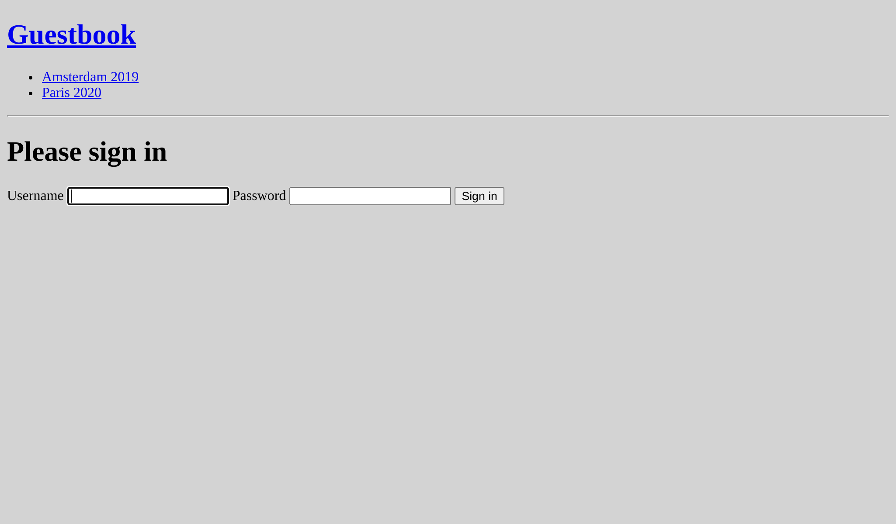
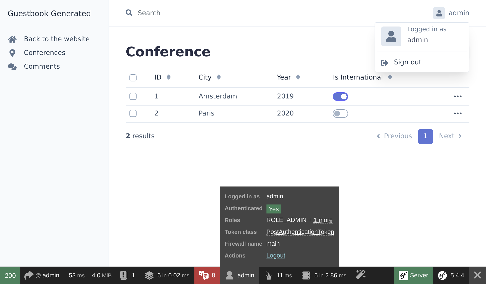

Zabezpieczenie panelu administracyjnego
=======================================

.. index::
    single: Components;Security
    single: Security

Panel administracyjny powinien być dostępny tylko dla zaufanych osób. Zabezpieczenie tego obszaru strony internetowej można wykonać przy użyciu komponentu Symfony Security.

Definiowanie encji (ang. entity) użytkownika
---------------------------------------------

Nawet jeśli uczestnicy nie będą w stanie utworzyć własnych kont na stronie internetowej, stworzymy w pełni funkcjonalny system uwierzytelniania do administracji. W związku z tym będziemy mieli tylko jedno konto – administracyjne.

Pierwszym krokiem jest zdefiniowanie encji ``User``. Aby uniknąć nieporozumień, nazwijmy encję ``Admin``.

Aby zintegrować encję ``Admin`` z systemem uwierzytelniania (ang. authentication system) Symfony Security, encja musi spełnić pewne wymagania. Na przykład potrzebuje atrybutu (ang. property) ``password``.

.. index::
    single: Command;make:user

Użyj polecenia ``make:user`` aby utworzyć encję ``Admin`` zamiast tradycyjnego ``make:entity``:

.. code-block:: terminal
    :class: answers(yes||username||yes)

    $ symfony console make:user Admin

Odpowiedz na pytania interaktywne: chcemy używać Doctrine do przechowywania kont administracyjnych (``yes``), używać ``username`` jako unikalnej nazwy użytkownika, a każdy użytkownik będzie miał hasło (``yes``).

Wygenerowana klasa zawiera metody takie jak ``getRoles()``, ``eraseCredentials()`` oraz kilka innych, które są potrzebne w systemie uwierzytelniania Symfony.

Jeśli chcesz dodać więcej atrybutów do encji użytkownika ``Admin``, użyj ``make:entity``.

Dodajmy metodę ``__toString()``, której używa EasyAdmin:

.. code-block:: diff

    --- a/src/Entity/Admin.php
    +++ b/src/Entity/Admin.php
    @@ -54,6 +54,11 @@ class Admin implements UserInterface, PasswordAuthenticatedUserInterface
             return (string) $this->username;
         }

    +    public function __toString(): string
    +    {
    +        return $this->username;
    +    }
    +
         /**
          * @see UserInterface
          */

Oprócz wygenerowania encji ``Admin``, polecenie zaktualizowało również konfigurację zabezpieczeń, aby połączyć encję z systemem uwierzytelniania:

.. code-block:: diff
    :class: ignore
    :emphasize-lines: 6,7,15,16

    --- a/config/packages/security.yaml
    +++ b/config/packages/security.yaml
    @@ -1,7 +1,15 @@
     security:
    +    password_hashers:
    +        App\Entity\Admin:
    +            algorithm: auto
    +
         # https://symfony.com/doc/current/security.html#where-do-users-come-from-user-providers
         providers:
    -        in_memory: { memory: null }
    +        # used to reload user from session & other features (e.g. switch_user)
    +        app_user_provider:
    +            entity:
    +                class: App\Entity\Admin
    +                property: username
         firewalls:
             dev:
                 pattern: ^/(_(profiler|wdt)|css|images|js)/

Pozwalamy Symfony wybrać najlepszy możliwy algorytm hashowania haseł (który będzie ewoluował w czasie).

Czas wygenerować migrację i uaktualnić schemat bazy danych:

.. code-block:: terminal

    $ symfony console make:migration
    $ symfony console doctrine:migrations:migrate -n

Generowanie hasła dla konta administracyjnego
----------------------------------------------

.. index::
    single: Security;Password Hashes

Nie stworzymy dedykowanego systemu do tworzenia kont administracyjnych. Będziemy mieli tylko jedno konto administracyjne. Loginem będzie ``admin`` i musimy wygenerować hasha hasła.

.. index::
    single: Command;security:hash-password

Wybierz ``App\Entity\Admin``, a następnie wymyśl dowolne hasło i uruchom poniższą komendę, aby wygenerować hasha hasła:

.. code-block:: terminal
    :class: answers(0||admin)

    $ symfony console security:hash-password

.. code-block:: text
    :class: ignore
    :emphasize-lines: 11

    Symfony Password Hash Utility
    =============================

     Type in your password to be hashed:
     >

     ------------------ ---------------------------------------------------------------------------------------------------
      Key                Value
     ------------------ ---------------------------------------------------------------------------------------------------
      Hasher used        Symfony\Component\PasswordHasher\Hasher\MigratingPasswordHasher
      Password hash      $argon2id$v=19$m=65536,t=4,p=1$BQG+jovPcunctc30xG5PxQ$TiGbx451NKdo+g9vLtfkMy4KjASKSOcnNxjij4gTX1s
     ------------------ ---------------------------------------------------------------------------------------------------

     ! [NOTE] Self-salting hasher used: the hasher generated its own built-in salt.

     [OK] Password hashing succeeded

Tworzenie konta administracyjnego
---------------------------------

.. index::
    single: Symfony CLI;run psql

Dodaj konto administracyjne poprzez zapytanie SQL:

.. code-block:: terminal

    $ symfony run psql -c "INSERT INTO admin (id, username, roles, password) \
      VALUES (nextval('admin_id_seq'), 'admin', '[\"ROLE_ADMIN\"]', \
      '\$argon2id\$v=19\$m=65536,t=4,p=1\$BQG+jovPcunctc30xG5PxQ\$TiGbx451NKdo+g9vLtfkMy4KjASKSOcnNxjij4gTX1s')"

Zwróć uwagę na filtrowanie (ang. escaping) znaku ``$`` w wartości kolumny hasła; odfiltruj je wszystkie!

Konfigurowanie systemu uwierzytelniania
---------------------------------------

.. index::
    single: Command;make:auth
    single: Security;Authenticator
    single: Security;Form Login
    single: Login
    single: Logout

Teraz, gdy mamy konto administracyjne, możemy zabezpieczyć panel administracyjny. Symfony obsługuje kilka strategii uwierzytelniania. Wykorzystajmy klasyczny i popularny *system uwierzytelniania formularzem*.

Uruchom polecenie ``make:auth`` aby zaktualizować konfigurację zabezpieczeń, wygenerować szablon (ang. template) logowania i utworzyć *klasę uwierzytelniania* (ang. authenticator):

.. code-block:: terminal
    :class: answers(1||AppAuthenticator||SecurityController||yes)

    $ symfony console make:auth

Wybierz ``1`` aby wygenerować klasę uwierzytelniania dla formularza logowania (ang. form authenticator), nazwij klasę ``AppAuthenticator``, kontroler ``SecurityController`` i wygeneruj URL ``/logout`` (``yes``).

Polecenie zaktualizowało konfigurację zabezpieczeń w celu połączenia (ang. wire) wygenerowanych klas:

.. code-block:: diff
    :class: ignore
    :emphasize-lines: 9

    --- a/config/packages/security.yaml
    +++ b/config/packages/security.yaml
    @@ -16,6 +16,13 @@ security:
                 security: false
             main:
                 anonymous: lazy
    +            guard:
    +                authenticators:
    +                    - App\Security\AppAuthenticator
    +            logout:
    +                path: app_logout
    +                # where to redirect after logout
    +                # target: app_any_route

                 # activate different ways to authenticate
                 # https://symfony.com/doc/current/security.html#firewalls-authentication

Jak wynika z wskazówki na wyjściu komendy, musimy dostosować trasę (ang. route) w metodzie ``onAuthenticationSuccess()``, aby przekierować użytkownika, gdy pomyślnie się zaloguje:

.. code-block:: diff

    --- a/src/Security/AppAuthenticator.php
    +++ b/src/Security/AppAuthenticator.php
    @@ -49,9 +49,7 @@ class AppAuthenticator extends AbstractLoginFormAuthenticator
                 return new RedirectResponse($targetPath);
             }

    -        // For example:
    -        //return new RedirectResponse($this->urlGenerator->generate('some_route'));
    -        throw new \Exception('TODO: provide a valid redirect inside '.__FILE__);
    +        return new RedirectResponse($this->urlGenerator->generate('admin'));
         }

         protected function getLoginUrl(Request $request): string

.. index::
    single: Command;debug:router
    single: Routing;Debug
    single: Debug;Routing

.. tip::

    Skąd mam pamiętać, że trasa EasyAdmin to ``admin`` (taka jaką ustawiłem w ``App\Controller\Admin\DashboardController``)?? Nie wiem. Możesz sprawdzić to w pliku, ale możesz również uruchomić poniższą komendę, która pokazuje związek między nazwami tras (ang. route) a ścieżkami:

    .. code-block:: terminal

        $ symfony console debug:router

Dodawanie reguł kontroli dostępu do autoryzacji
-------------------------------------------------

.. index::
    single: Security;Authorization
    single: Security;Access Control

System bezpieczeństwa składa się z dwóch części: *uwierzytelniania* (ang. authentication) i *autoryzacji* (ang. authorization). Tworząc konto administracyjne, nadaliśmy mu rolę ``ROLE_ADMIN``. Ograniczmy ścieżkę ``/admin`` do użytkowników mających tę rolę poprzez dodanie reguły do ``access_control``:

.. code-block:: diff
    :emphasize-lines: 8

    --- a/config/packages/security.yaml
    +++ b/config/packages/security.yaml
    @@ -35,7 +35,7 @@ security:
         # Easy way to control access for large sections of your site
         # Note: Only the *first* access control that matches will be used
         access_control:
    -        # - { path: ^/admin, roles: ROLE_ADMIN }
    +        - { path: ^/admin, roles: ROLE_ADMIN }
             # - { path: ^/profile, roles: ROLE_USER }

     when@test:

Reguły w ``access_control`` ograniczają dostęp za pomocą wyrażeń regularnych (ang. regular expressions). Przy próbie uzyskania dostępu do adresu URL, który zaczyna się od ``/admin``, system bezpieczeństwa sprawdzi czy zalogowany użytkownik posiada rolę ``ROLE_ADMIN``.

Uwierzytelnianie za pomocą formularza logowania
------------------------------------------------

Próba dostępu do panelu administracyjnego skutkuje przekierowaniem na stronę logowania i prośbą o podanie loginu i hasła:

Zaloguj się używając nazwy użytkownika ``admin`` i hasła, które zostało wymyślone wcześniej. Jeśli użyto dokładnie mojego polecenia SQL, hasło brzmi ``admin``.

Zauważ, że EasyAdmin automatycznie rozpoznaje system uwierzytelniania Symfony:

Spróbuj kliknąć w link "Wyloguj się". Udało się! Mamy pełni zabezpieczony panel administracyjny.

.. index::
    single: Command;make:registration-form

.. note::

    Jeśli chcesz stworzyć w pełni funkcjonalny system uwierzytelniania formularzem, spójrz na polecenie ``make:registration-form``.

.. sidebar:: Idąc dalej

    * `Dokumentacja Symfony Security`_;

    * `Samouczek Security w SymfonyCasts`_;

    * `Jak zbudować formularz logowania`_ w aplikacjach Symfony;

    * `Ściągawka Symfony Security`_.

.. _`Dokumentacja Symfony Security`: https://symfony.com/doc/current/security.html
.. _`Samouczek Security w SymfonyCasts`: https://symfonycasts.com/screencast/symfony-security
.. _`Jak zbudować formularz logowania`: https://symfony.com/doc/current/security/form_login_setup.html
.. _`Ściągawka Symfony Security`: https://github.com/andreia/symfony-cheat-sheets/blob/master/Symfony4/security_en_44.pdf
