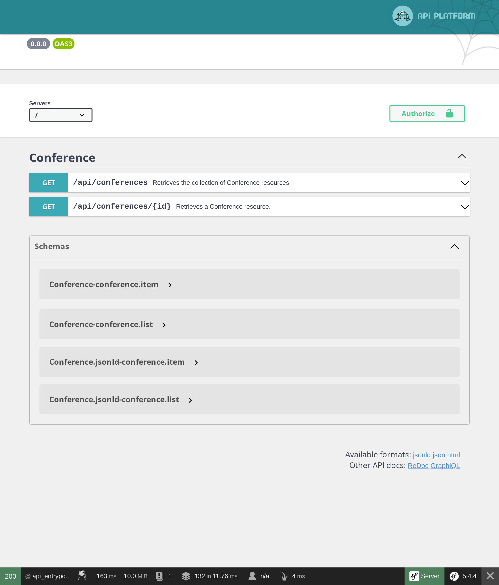

Udostępnianie API za pomocą biblioteki API Platform
=====================================================

.. index::
    single: API
    single: HTTP API
    single: API Platform

Zakończyliśmy implementację strony internetowej księgi gości. Aby lepiej wykorzystać nasze dane, może udostępnimy teraz API? API może być używane przez aplikację mobilną do wyświetlania wszystkich konferencji, ich komentarzy, a może nawet umożliwić uczestnikom dodawanie nowych komentarzy.

W tym kroku zamierzamy wdrożyć API tylko do odczytu.

Instalowanie API Platform
-------------------------

Udostępnianie API poprzez napisanie kodu samemu jest możliwe, ale jeśli zależy nam na zgodności ze standardami, lepiej użyć rozwiązania, które wykona za nas tę ciężką pracę. Rozwiązanie takie jak API Platform:

.. code-block:: terminal

    $ symfony composer req api

Udostępnianie API dla konferencji
----------------------------------

.. index::
    single: Attributes;ApiResource
    single: Attributes;Groups

Kilka atrybutów w klasie Conference to wszystko, czego potrzebujemy, aby skonfigurować API:

.. code-block:: diff
    :caption: patch_file

    --- a/src/Entity/Conference.php
    +++ b/src/Entity/Conference.php
    @@ -2,35 +2,48 @@

     namespace App\Entity;

    +use ApiPlatform\Core\Annotation\ApiResource;
     use App\Repository\ConferenceRepository;
     use Doctrine\Common\Collections\ArrayCollection;
     use Doctrine\Common\Collections\Collection;
     use Doctrine\ORM\Mapping as ORM;
     use Symfony\Bridge\Doctrine\Validator\Constraints\UniqueEntity;
    +use Symfony\Component\Serializer\Annotation\Groups;
     use Symfony\Component\String\Slugger\SluggerInterface;

     #[ORM\Entity(repositoryClass: ConferenceRepository::class)]
     #[UniqueEntity('slug')]
    +#[ApiResource(
    +    collectionOperations: ['get' => ['normalization_context' => ['groups' => 'conference:list']]],
    +    itemOperations: ['get' => ['normalization_context' => ['groups' => 'conference:item']]],
    +    order: ['year' => 'DESC', 'city' => 'ASC'],
    +    paginationEnabled: false,
    +)]
     class Conference
     {
         #[ORM\Id]
         #[ORM\GeneratedValue]
         #[ORM\Column(type: 'integer')]
    +    #[Groups(['conference:list', 'conference:item'])]
         private $id;

         #[ORM\Column(type: 'string', length: 255)]
    +    #[Groups(['conference:list', 'conference:item'])]
         private $city;

         #[ORM\Column(type: 'string', length: 4)]
    +    #[Groups(['conference:list', 'conference:item'])]
         private $year;

         #[ORM\Column(type: 'boolean')]
    +    #[Groups(['conference:list', 'conference:item'])]
         private $isInternational;

         #[ORM\OneToMany(mappedBy: 'conference', targetEntity: Comment::class, orphanRemoval: true)]
         private $comments;

         #[ORM\Column(type: 'string', length: 255, unique: true)]
    +    #[Groups(['conference:list', 'conference:item'])]
         private $slug;

         public function __construct()

Główny atrybut ``ApiResource`` konfiguruje API dla konferencji. Ogranicza możliwe operacje do ``get``, ustawia sposób sortowania listy konferencji i wskazuje, jakie pola wyświetlać.

Domyślnie, głównym punktem wejścia dla API jest ``/api`` dzięki konfiguracji w ``config/routes/api_platform.yaml`` która została dodana przez przepis (ang. recipe) pakietu.

Interfejs webowy pozwala na interakcję z API:

Użyj go, aby przetestować różne możliwości:

.. figure:: screenshots/api-conferences.png
    :alt: /api
    :align: center
    :figclass: with-browser

Wyobraź sobie, ile czasu zajęłoby wdrożenie tego wszystkiego od zera!

Udostępnienie API dla komentarzy
---------------------------------

.. index::
    single: Attributes;ApiResource
    single: Attributes;ApiFilter
    single: Attributes;Groups

Zrób to samo w przypadku komentarzy:

.. code-block:: diff
    :caption: patch_file

    --- a/src/Entity/Comment.php
    +++ b/src/Entity/Comment.php
    @@ -2,40 +2,58 @@

     namespace App\Entity;

    +use ApiPlatform\Core\Annotation\ApiFilter;
    +use ApiPlatform\Core\Annotation\ApiResource;
    +use ApiPlatform\Core\Bridge\Doctrine\Orm\Filter\SearchFilter;
     use App\Repository\CommentRepository;
     use Doctrine\ORM\Mapping as ORM;
    +use Symfony\Component\Serializer\Annotation\Groups;
     use Symfony\Component\Validator\Constraints as Assert;

     #[ORM\Entity(repositoryClass: CommentRepository::class)]
     #[ORM\HasLifecycleCallbacks]
    +#[ApiResource(
    +    collectionOperations: ['get' => ['normalization_context' => ['groups' => 'comment:list']]],
    +    itemOperations: ['get' => ['normalization_context' => ['groups' => 'comment:item']]],
    +    order: ['createdAt' => 'DESC'],
    +    paginationEnabled: false,
    +)]
    +#[ApiFilter(SearchFilter::class, properties: ['conference' => 'exact'])]
     class Comment
     {
         #[ORM\Id]
         #[ORM\GeneratedValue]
         #[ORM\Column(type: 'integer')]
    +    #[Groups(['comment:list', 'comment:item'])]
         private $id;

         #[ORM\Column(type: 'string', length: 255)]
         #[Assert\NotBlank]
    +    #[Groups(['comment:list', 'comment:item'])]
         private $author;

         #[ORM\Column(type: 'text')]
         #[Assert\NotBlank]
    +    #[Groups(['comment:list', 'comment:item'])]
         private $text;

         #[ORM\Column(type: 'string', length: 255)]
         #[Assert\NotBlank]
         #[Assert\Email]
    +    #[Groups(['comment:list', 'comment:item'])]
         private $email;

         #[ORM\Column(type: 'datetime_immutable')]
    +    #[Groups(['comment:list', 'comment:item'])]
         private $createdAt;

         #[ORM\ManyToOne(targetEntity: Conference::class, inversedBy: 'comments')]
         #[ORM\JoinColumn(nullable: false)]
    +    #[Groups(['comment:list', 'comment:item'])]
         private $conference;

         #[ORM\Column(type: 'string', length: 255, nullable: true)]
    +    #[Groups(['comment:list', 'comment:item'])]
         private $photoFilename;

         #[ORM\Column(type: 'string', length: 255, options: ["default" => "submitted"])]

Ten sam rodzaj atrybutów jest używany do konfiguracji klasy.

Ograniczanie komentarzy udostępnionych przez API
-------------------------------------------------

Domyślnie, API Platform udostępnia wszystkie wpisy z bazy danych. Ale w przypadku komentarzy, API powinno zwracać tylko te opublikowane.

Gdy musisz ograniczyć liczbę elementów zwracanych przez API, utwórz usługę (ang. service), która przejmie kontrolę nad zapytaniem używanym przez Doctrine dla kolekcji, jeśli zaimplementujesz ``QueryCollectionExtensionInterface``, i/lub poszczególnych elementów, jeśli zaimplementujesz``QueryItemExtensionInterface``.

.. code-block:: php
    :caption: src/Api/FilterPublishedCommentQueryExtension.php
    :emphasize-lines: 13-15,20-22

    namespace App\Api;

    use ApiPlatform\Core\Bridge\Doctrine\Orm\Extension\QueryCollectionExtensionInterface;
    use ApiPlatform\Core\Bridge\Doctrine\Orm\Extension\QueryItemExtensionInterface;
    use ApiPlatform\Core\Bridge\Doctrine\Orm\Util\QueryNameGeneratorInterface;
    use App\Entity\Comment;
    use Doctrine\ORM\QueryBuilder;

    class FilterPublishedCommentQueryExtension implements QueryCollectionExtensionInterface, QueryItemExtensionInterface
    {
        public function applyToCollection(QueryBuilder $qb, QueryNameGeneratorInterface $queryNameGenerator, string $resourceClass, string $operationName = null)
        {
            if (Comment::class === $resourceClass) {
                $qb->andWhere(sprintf("%s.state = 'published'", $qb->getRootAliases()[0]));
            }
        }

        public function applyToItem(QueryBuilder $qb, QueryNameGeneratorInterface $queryNameGenerator, string $resourceClass, array $identifiers, string $operationName = null, array $context = [])
        {
            if (Comment::class === $resourceClass) {
                $qb->andWhere(sprintf("%s.state = 'published'", $qb->getRootAliases()[0]));
            }
        }
    }

Klasa rozszerzeń zapytań stosuje swój schemat działania tylko w odniesieniu do zasobów ``Comment`` i modyfikuje konstruktor zapytań Doctrine (ang. Doctrine query builder), aby uwzględnić tylko komentarze oznaczone jako ``published``.

Konfigurowanie CORS
-------------------

.. index::
    single: CORS
    single: Cross-Origin Resource Sharing

Domyślnie reguła tego samego pochodzenia (ang. same-origin security policy) nowoczesnych klientów HTTP sprawia, że wywoływanie API z innej domeny jest zabronione. Pakiet CORS, zainstalowany jako część ``composer req api``, wysyła nagłówki Cross-Origin Resource Sharing oparte na zmiennej środowiskowej ``CORS_ALLOW_ORIGIN``.

Domyślnie, jego wartość zdefiniowana w ``.env`` pozwala na odbieranie żądań HTTP z ``localhost`` i ``127.0.0.1`` na dowolnym porcie. To jest dokładnie to, czego potrzebujemy w kolejnym kroku, ponieważ stworzymy aplikację jednostronicową (ang. single-page application, SPA) mającą swój własny serwer WWW, która będzie odwoływać się do API.

.. sidebar:: Idąc dalej

    * `Samouczek SymfonyCasts dotyczący API Platform`_;

    * Aby włączyć obsługę GraphQL, uruchom ``composer require webonyx/graphql-php``, a następnie przejdź do ``/api/graphql``.

.. _`Samouczek SymfonyCasts dotyczący API Platform`: https://symfonycasts.com/screencast/api-platform
