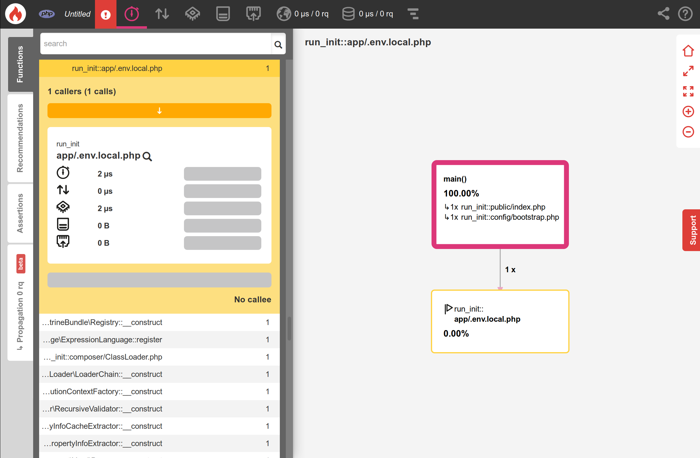

Odkrywanie wewnętrznych mechanizmów Symfony
=============================================

.. index::
    single: Blackfire
    single: Debugging
    single: Internals

Od dłuższego czasu używamy Symfony do stworzenia potężnej aplikacji i większość kodu wykonywanego przez aplikację pochodzi nie od nas, ale z Symfony. Kilkaset linii kodu kontra tysiące linii kodu.

Lubię rozumieć, jak rzeczy działają od środka. Zawsze fascynowały mnie narzędzia, które pomagają zrozumieć, jak coś działa. Pierwsze użycie debuggera lub wykorzystanie po raz pierwszy funkcji ``ptrace`` to dla mnie magiczne wspomnienia.

Chcesz lepiej zrozumieć, jak działa Symfony? Czas zgłębić mechanizmy, jakich Symfony używa, aby Twoja aplikacja robiła to, co robi. Zamiast opisywać z teoretycznej perspektywy, jak Symfony radzi sobie z żądaniem HTTP – co byłoby dość nudne – wykorzystamy narzędzie Blackfire, aby uzyskać pewne wizualne reprezentacje i skorzystać z nich do przedstawienia bardziej zaawansowanych problemów.

Zrozumienie wewnętrznych mechanizmów Symfony przy użyciu Blackfire
---------------------------------------------------------------------

Już wiesz, że wszystkie żądania HTTP są obsługiwane przez jeden punkt wejścia: plik ``public/index.php``. Ale co dalej? Jak kontrolery są wywoływane?

Sprofilujmy produkcyjną, angielską wersję strony głównej przy użyciu Blackfire poprzez wtyczkę Blackfire do przeglądarki:

.. code-block:: terminal
    :class: ignore

    $ symfony remote:open

Albo bezpośrednio w wierszu poleceń:

.. code-block:: terminal
    :class: ignore

    $ blackfire curl `symfony cloud:env:url --pipe --primary`en/

Po przejściu do widoku "Oś czasu" w profilu, znajdziesz widok podobny do poniższego:

.. figure:: images/blackfire-homepage-prod.png
    :alt: /
    :align: center
    :figclass: with-browser

Najedź na kolorowe paski na osi czasu, aby uzyskać więcej informacji na temat każdego wywołania; poznasz lepiej działanie Symfony:

* Głównym punktem wejścia jest ``public/index.php``;

* Metoda ``Kernel::handle()`` obsługuje żądanie;

* Wywołuje ``HttpKernel``, który emituje pewne zdarzenia;

* Pierwszym zdarzeniem jest ``RequestEvent``;

* Metoda ``ControllerResolver::getController()`` jest wywoływana aby określić, który kontroler powinien być wywoływany dla przychodzącego adresu URL;

* Metoda ``ControllerResolver::getArguments()`` jest wywoływana aby określić, które argumenty mają być przekazane do kontrolera (wywoływany jest konwerter parametrów);

* W następnie wywoływanej metodzie ``ConferenceController::index()`` wykonywana jest większość naszego kodu;

* Metoda ``ConferenceRepository::findAll()`` pobiera wszystkie konferencje z bazy danych (zwróć uwagę na połączenie z bazą danych za pośrednictwem ``PDO::__construct()``);

* Metoda ``Twig\Environment::render()`` renderuje szablon;

* Zdarzenia ``ResponseEvent`` oraz ``FinishRequestEvent`` są wywoływane, ale wygląda na to, że żaden nasłuchiwacz zdarzeń (ang. event listener) nie jest zarejestrowany, ponieważ zdarzenia wykonują się naprawdę szybko.

Oś czasu to świetny sposób na zrozumienie, jak działa kod; jest to bardzo przydatne, kiedy otrzymujesz projekt rozwijany przez kogoś innego.

Teraz sprofiluj tę samą stronę z maszyny lokalnej w środowisku deweloperskim:

.. code-block:: terminal
    :class: ignore

    $ blackfire curl `symfony var:export SYMFONY_PROJECT_DEFAULT_ROUTE_URL`en/

Otwórz profil. Powinno nastąpić przekierowanie do widoku grafu połączeń, a ponieważ żądanie było naprawdę szybkie, oś czasu będzie prawie pusta:

.. figure:: images/blackfire-homepage-cached-dev.png
    :alt: /
    :align: center
    :figclass: with-browser

Rozumiesz, co się dzieje? Pamięć podręczna HTTP (ang. HTTP cache) jest włączona i przez to profilujemy warstwę pamięci podręcznej Symfony. Ponieważ strona znajduje się w pamięci podręcznej, ``HttpCache\Store::restoreResponse()`` otrzymuje odpowiedź HTTP z pamięci podręcznej i kontroler nigdy nie jest wywoływany.

Wyłącz warstwę pamięci podręcznej w ``public/index.php`` tak jak w poprzednim etapie i spróbuj ponownie. Od razu widać, że profil wygląda zupełnie inaczej:

.. figure:: images/blackfire-homepage-dev.png
    :alt: /
    :align: center
    :figclass: with-browser

Główne różnice są następujące:

* Zdarzenie ``TerminateEvent``, które nie było widoczne w środowisku produkcyjnym, zajmuje duży procent czasu wykonania; możemy dostrzec, że jest to zdarzenie odpowiedzialne za przechowywanie danych profilera Symfony zebranych podczas żądania;

* W wywołaniu ``ConferenceController::index()``, zwróć uwagę na ``SubRequestHandler::handle()``, metodę, która renderuje ESI (dlatego mamy dwa wywołania ``Profiler::saveProfile()``, jedno dla głównego żądania i jedno dla ESI).

Przejdź do osi czasu, aby dowiedzieć się więcej; przejdź do widoku grafu połączeń, aby zobaczyć różne reprezentacje tych samych danych.

Jak właśnie odkryliśmy, kod wykonywany w środowisku deweloperskim i produkcyjnym jest zupełnie inny. Środowisko programistyczne jest wolniejsze, ponieważ profiler Symfony próbuje zebrać wiele danych, aby ułatwić debugowanie. Dlatego też należy zawsze stosować profilowanie w środowisku produkcyjnym, nawet lokalnie.

W ramach ciekawych eksperymentów: sprofiluj stronę błędu, stronę ``/`` (która jest przekierowaniem) lub zasób API. Każdy profil powie Ci trochę więcej o tym, jak działa Symfony, jakie klasy/metody są wywoływane, co ma większy koszt wykonania a co niższy.

Używanie dodatku Blackfire Debug
---------------------------------

.. index::
    single: Blackfire;Debug Addon

Domyślnie Blackfire usuwa wszystkie wywołania metod, które nie są wystarczająco znaczące, aby uniknąć ładowania zbyt dużej ilości danych i pokazywania dużych wykresów. W przypadku używania Blackfire jako narzędzia do debugowania, lepiej jest zachować wszystkie wywołania używając dodatku debug.

W wierszu poleceń, użyj flagi ``--debug``:

.. code-block:: terminal
    :class: ignore

    $ blackfire --debug curl `symfony var:export SYMFONY_PROJECT_DEFAULT_ROUTE_URL`en/
    $ blackfire --debug curl `symfony cloud:env:url --pipe --primary`en/

.. index::
    single: .env.local.prod

W środowisku produkcyjnym, zobaczysz na przykład ładowanie pliku o nazwie ``.env.local.php``:

.. index::
    single: Composer;Optimizations
    single: Composer;Autoloader
    single: Autoloader

Skąd to się wzięło? Platform.sh wykonuje pewne optymalizacje podczas wdrażania aplikacji Symfony, np. optymalizując autoloader Composer (``--optimize-autoloader --apcu-autoloader --classmap-authoritative``) oraz zmienne środowiskowe zdefiniowane w pliku ``.env`` (aby uniknąć przetwarzania pliku dla każdego żądania) poprzez wygenerowanie pliku ``.env.local.php``:

.. code-block:: terminal
    :class: ignore

    $ symfony run composer dump-env prod

Blackfire jest bardzo potężnym narzędziem, które pomaga zrozumieć ,w jaki sposób kod jest wykonywany przez PHP. Poprawa wydajności jest tylko jednym ze sposobów wykorzystania profilera.

Używanie debuggera krokowego z Xdebug
--------------------------------------

.. index::
    single: Xdebug
    single: Debugger

Osie czasu i grafy wywołań w Blackfire pozwalają pokazać, który plik/funkcja/metoda jest wykonywana przez interpreter PHP, celem większego zrozumienia kodu źródłowego projektu.

Kolejnym sposobem na podążanie za wykonywanym kodem jest **debugger krokowy**, jak np. `Xdebug`_. Debugger krokowy pozwala na interaktywny spacer po kodzie PHP, żeby zweryfikować przepływ kodu oraz sprawdzić struktury danych. Jest to bardzo przydatne podczas debugowania niespodziewanych zachowań i zastępuje popularną technikę "var_dump()/exit()".

Na początek, zainstaluj rozszerzenie PHP ``xdebug``. Sprawdź czy jest zainstalowane za pomocą poniższej komendy:

.. code-block:: terminal

    $ symfony php -v

W odpowiedzi znajdziesz informacje o Xdebug:

.. code-block:: text
    :emphasize-lines: 5
    :class: ignore

    PHP 8.0.1 (cli) (built: Jan 13 2021 08:22:35) ( NTS )
    Copyright (c) The PHP Group
    Zend Engine v4.0.1, Copyright (c) Zend Technologies
        with Zend OPcache v8.0.1, Copyright (c), by Zend Technologies
        with Xdebug v3.0.2, Copyright (c) 2002-2021, by Derick Rethans
        with blackfire v1.49.0~linux-x64-non_zts80, https://blackfire.io, by Blackfire

Możesz także sprawdzić, czy Xdebug jest zainstalowany dla PHP-FPM, poprzez przejście do przeglądarki i kliknięcie w link "View phpinfo()", który pojawi się po najechaniu na logo Symfony w pasku debugowania:

.. figure:: screenshots/phpinfo.png
    :alt: /
    :align: center
    :figclass: with-browser

Teraz, włącz tryb ``debug`` w Xdebug:

.. code-block:: ini
    :caption: php.ini
    :class: ignore

    [xdebug]
    xdebug.mode=debug
    xdebug.start_with_request=yes

Domyślnie, Xdebug wysyła dane do portu 9003 twojego lokalnego hosta.

Wyzwalanie Xdebug może zostać zrealizowane na wiele sposobów, jednak najłatwiejsze będzie korzystanie z Xdebug z twojego IDE. W tym rozdziale, użyjemy Visual Studio Code do zademonstrowania jak to działa. Zainstaluj `PHP Debug`_ rozszerzenie poprzez uruchomienie funkcji "Quick Open" (``Ctrl+P``), następnie wklej poniższą komendę i wciśnij enter:

.. code-block:: text
    :class: ignore

    ext install felixfbecker.php-debug

Utwórz następujący plik konfiguracyjny:

.. code-block:: json
    :caption: .vscode/launch.json
    :emphasize-lines: 8,16
    :class: ignore

    {
        "version": "0.2.0",
        "configurations": [
            {
                "name": "Listen for XDebug",
                "type": "php",
                "request": "launch",
                "port": 9003
            },
            {
                "name": "Launch currently open script",
                "type": "php",
                "request": "launch",
                "program": "${file}",
                "cwd": "${fileDirname}",
                "port": 9003
            }
        ]
    }

Będąc w Visual Studio Code w twoim katalogu projektu, przejdź do debuggera i kliknij na zielony przycisk z napisem "Listen for Xdebug":

.. figure:: images/vs-xdebug-run.png
    :align: center

Jeśli przejdziesz do przeglądarki i odświeżysz stronę, IDE automatycznie się otworzy, sygnalizując, że sesja debugowania jest gotowa. Domyślnie, wszystko jest punktem przerwania (ang. breakpoint), więc wykonywanie kodu zatrzyma się na pierwszej instrukcji. Od tej pory to, w jaki sposób przeglądasz kod - poprzez analizę zmiennych, przechodzenie przez kolejne linijki kodu, czy wchodzenie i analizowanie kodu konkretnych funkcji, zależy wyłącznie od Ciebie.

Podczas debugowania, możesz odznaczyć punkt przerwania "Everything" i samemu dokładnie ustawić te punkty w twoim kodzie.

Jeśli debuggery krokowe są dla ciebie nowością, przeczytaj ten `świetny poradnik dla Visual Studio Code`_, który wszystko wizualnie wyjaśnia.

.. sidebar:: Idąc dalej

    * `Dokumentacja debuggera krokowego Xdebug`_;

    * `Debugowanie z Visual Studio Code`_.

.. _`Xdebug`: https://xdebug.org
.. _`PHP Debug`: https://marketplace.visualstudio.com/items?itemName=felixfbecker.php-debug
.. _`Dokumentacja debuggera krokowego Xdebug`: https://xdebug.org/docs/step_debug
.. _`świetny poradnik dla Visual Studio Code`: https://code.visualstudio.com/Docs/editor/debugging
.. _`Debugowanie z Visual Studio Code`: https://code.visualstudio.com/Docs/editor/debugging
