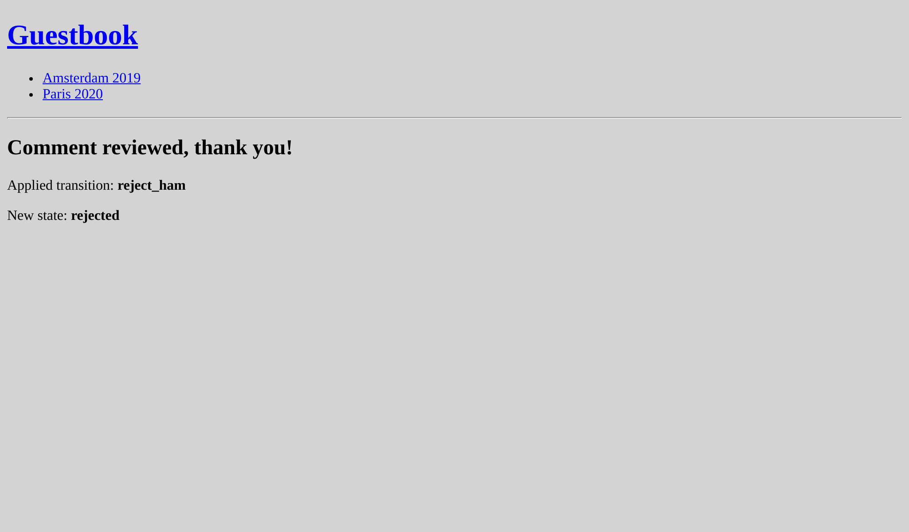

Отправка электронной почты администраторам
=================================================================================

.. index::
    single: Components;Mailer
    single: Mailer
    single: Emails

Для качественной обратной связи, необходимо модерировать все комментарии. Если комментарий находится в состоянии ``ham`` или ``potential_spam``, администратору следует отправить *электронное письмо* с двумя ссылками: для одобрения и для отклонения комментария.

Установка адреса электронной почты для администратора
-----------------------------------------------------------------------------------------------------

Параметр контейнера подойдёт для хранения электронной почты администратора. В демонстрационных целях поместим значение в переменную окружения (в реальном проекте так обычно не делается). Определим параметр контейнера ``bind`` для простоты внедрения адреса электронной почты администратора в нужные сервисы:

.. code-block:: diff
    :caption: patch_file

    --- a/config/services.yaml
    +++ b/config/services.yaml
    @@ -4,6 +4,7 @@
     # Put parameters here that don't need to change on each machine where the app is deployed
     # https://symfony.com/doc/current/best_practices.html#use-parameters-for-application-configuration
     parameters:
    +    default_admin_email: admin@example.com

     services:
         # default configuration for services in *this* file
    @@ -13,6 +14,7 @@ services:
             bind:
                 string $photoDir: "%kernel.project_dir%/public/uploads/photos"
                 string $akismetKey: "%env(AKISMET_KEY)%"
    +            string $adminEmail: "%env(string:default:default_admin_email:ADMIN_EMAIL)%"

         # makes classes in src/ available to be used as services
         # this creates a service per class whose id is the fully-qualified class name

Переменная окружения может быть "обработана" перед использованием. Здесь мы используем процессор ``default``, чтобы получить значение параметра ``default_admin_email``, если переменная окружения ``ADMIN_EMAIL`` не существует.

Отправка уведомления по электронной почте
------------------------------------------------------------------------------

Чтобы отправить электронное письмо, вы можете выбирать между несколькими абстракциями класса ``Email``: от ``Message`` (самый низкий уровень) до ``NotificationEmail`` (самый высокий уровень). Чаще всего, конечно, вы будете использовать класс ``Email``, но для внутренних писем предпочтительнее использовать класс ``NotificationEmail``.

В обработчике сообщений давайте заменим логику автоматической проверки:

.. code-block:: diff
    :caption: patch_file

    --- a/src/MessageHandler/CommentMessageHandler.php
    +++ b/src/MessageHandler/CommentMessageHandler.php
    @@ -7,6 +7,8 @@ use App\Repository\CommentRepository;
     use App\SpamChecker;
     use Doctrine\ORM\EntityManagerInterface;
     use Psr\Log\LoggerInterface;
    +use Symfony\Bridge\Twig\Mime\NotificationEmail;
    +use Symfony\Component\Mailer\MailerInterface;
     use Symfony\Component\Messenger\Handler\MessageHandlerInterface;
     use Symfony\Component\Messenger\MessageBusInterface;
     use Symfony\Component\Workflow\WorkflowInterface;
    @@ -18,15 +20,19 @@ class CommentMessageHandler implements MessageHandlerInterface
         private $commentRepository;
         private $bus;
         private $workflow;
    +    private $mailer;
    +    private $adminEmail;
         private $logger;

    -    public function __construct(EntityManagerInterface $entityManager, SpamChecker $spamChecker, CommentRepository $commentRepository, MessageBusInterface $bus, WorkflowInterface $commentStateMachine, LoggerInterface $logger = null)
    +    public function __construct(EntityManagerInterface $entityManager, SpamChecker $spamChecker, CommentRepository $commentRepository, MessageBusInterface $bus, WorkflowInterface $commentStateMachine, MailerInterface $mailer, string $adminEmail, LoggerInterface $logger = null)
         {
             $this->entityManager = $entityManager;
             $this->spamChecker = $spamChecker;
             $this->commentRepository = $commentRepository;
             $this->bus = $bus;
             $this->workflow = $commentStateMachine;
    +        $this->mailer = $mailer;
    +        $this->adminEmail = $adminEmail;
             $this->logger = $logger;
         }

    @@ -51,8 +57,13 @@ class CommentMessageHandler implements MessageHandlerInterface

                 $this->bus->dispatch($message);
             } elseif ($this->workflow->can($comment, 'publish') || $this->workflow->can($comment, 'publish_ham')) {
    -            $this->workflow->apply($comment, $this->workflow->can($comment, 'publish') ? 'publish' : 'publish_ham');
    -            $this->entityManager->flush();
    +            $this->mailer->send((new NotificationEmail())
    +                ->subject('New comment posted')
    +                ->htmlTemplate('emails/comment_notification.html.twig')
    +                ->from($this->adminEmail)
    +                ->to($this->adminEmail)
    +                ->context(['comment' => $comment])
    +            );
             } elseif ($this->logger) {
                 $this->logger->debug('Dropping comment message', ['comment' => $comment->getId(), 'state' => $comment->getState()]);
             }

``MailerInterface`` является основной точкой входа и позволяет отправлять электронную почту с помощью метода ``send()``.

Чтобы отправить электронное письмо, нам нужен отправитель (заголовок ``From``/``Sender``). Вместо того, чтобы устанавливать его явно в экземпляре Email, определите его глобально:

.. code-block:: diff
    :caption: patch_file

    --- a/config/packages/mailer.yaml
    +++ b/config/packages/mailer.yaml
    @@ -1,3 +1,5 @@
     framework:
         mailer:
             dsn: '%env(MAILER_DSN)%'
    +        envelope:
    +            sender: "%env(string:default:default_admin_email:ADMIN_EMAIL)%"

Расширение шаблона электронной почты для уведомлений
---------------------------------------------------------------------------------------------------

.. index::
    single: Twig;extends
    single: Twig;block
    single: Twig;url

Шаблон электронной почты для уведомлений наследуется от стандартного шаблона уведомлений в Symfony:

.. code-block:: html+twig
    :caption: templates/emails/comment_notification.html.twig

    

    
        Author: {{ comment.author }} 
        Email: {{ comment.email }} 
        State: {{ comment.state }} 

        

            {{ comment.text }}
        

    

    
        <spacer size="16"></spacer>
        <button href="{{ url('review_comment', { id: comment.id }) }}">Accept</button>
        <button href="{{ url('review_comment', { id: comment.id, reject: true }) }}">Reject</button>
    

Шаблон переопределяет несколько блоков, чтобы изменить текст письма и добавить ссылки для одобрения или отклонения комментария. Любой некорректный параметр для маршрута добавляется в качестве параметра строки запроса (адрес для отклонения комментария будет выглядеть так: ``/admin/comment/review/42?reject=true``).

Шаблон по умолчанию ``NotificationEmail`` использует `Inky`_ вместо HTML для описания разметки электронных писем. Этот шаблонизатор помогает создавать адаптивные электронные письма, совместимые со всеми популярными почтовыми клиентами.

Для максимальной совместимости с программами для чтения электронной почты, базовый макет уведомлений уже по умолчанию использует встроенные стили (с помощью пакета CSS inliner).

Эти две возможности являются частью дополнительных расширений Twig, которые необходимо установить:

.. code-block:: terminal

    $ symfony composer req "twig/cssinliner-extra:^3" "twig/inky-extra:^3"

Создание абсолютных URL-адресов с помощью команды Symfony
-------------------------------------------------------------------------------------------------

.. index::
    single: Twig;Link
    single: Link

В электронных письмах абсолютные адреса (со схемой и хостом) создавайте с помощью ``url()`` вместо ``path()``.

Электронное письмо отправляется из обработчика сообщений в контексте консоли. Создание абсолютных адресов из браузера проще, поскольку мы знаем схему и домен текущей страницы. Это не относится к консоли.

Явно определите доменное имя и схему:

.. code-block:: diff
    :caption: patch_file

    --- a/config/services.yaml
    +++ b/config/services.yaml
    @@ -5,6 +5,11 @@
     # https://symfony.com/doc/current/best_practices.html#use-parameters-for-application-configuration
     parameters:
         default_admin_email: admin@example.com
    +    default_domain: '127.0.0.1'
    +    default_scheme: 'http'
    +
    +    router.request_context.host: '%env(default:default_domain:SYMFONY_DEFAULT_ROUTE_HOST)%'
    +    router.request_context.scheme: '%env(default:default_scheme:SYMFONY_DEFAULT_ROUTE_SCHEME)%'

     services:
         # default configuration for services in *this* file

Переменные окружения ``SYMFONY_DEFAULT_ROUTE_HOST`` и ``SYMFONY_DEFAULT_ROUTE_PORT`` автоматически устанавливаются локально при использовании CLI-команды ``symfony`` и определяются на основе конфигурации в Platform.sh.

Подключение маршрута к контроллеру
-----------------------------------------------------------------

Маршрут ``review_comment`` пока не существует, давайте создадим административный контроллер для его обработки:

.. code-block:: php
    :caption: src/Controller/AdminController.php

    namespace App\Controller;

    use App\Entity\Comment;
    use App\Message\CommentMessage;
    use Doctrine\ORM\EntityManagerInterface;
    use Symfony\Bundle\FrameworkBundle\Controller\AbstractController;
    use Symfony\Component\HttpFoundation\Request;
    use Symfony\Component\HttpFoundation\Response;
    use Symfony\Component\Messenger\MessageBusInterface;
    use Symfony\Component\Routing\Annotation\Route;
    use Symfony\Component\Workflow\Registry;
    use Twig\Environment;

    class AdminController extends AbstractController
    {
        private $twig;
        private $entityManager;
        private $bus;

        public function __construct(Environment $twig, EntityManagerInterface $entityManager, MessageBusInterface $bus)
        {
            $this->twig = $twig;
            $this->entityManager = $entityManager;
            $this->bus = $bus;
        }

        #[Route('/admin/comment/review/{id}', name: 'review_comment')]
        public function reviewComment(Request $request, Comment $comment, Registry $registry): Response
        {
            $accepted = !$request->query->get('reject');

            $machine = $registry->get($comment);
            if ($machine->can($comment, 'publish')) {
                $transition = $accepted ? 'publish' : 'reject';
            } elseif ($machine->can($comment, 'publish_ham')) {
                $transition = $accepted ? 'publish_ham' : 'reject_ham';
            } else {
                return new Response('Comment already reviewed or not in the right state.');
            }

            $machine->apply($comment, $transition);
            $this->entityManager->flush();

            if ($accepted) {
                $this->bus->dispatch(new CommentMessage($comment->getId()));
            }

            return new Response($this->twig->render('admin/review.html.twig', [
                'transition' => $transition,
                'comment' => $comment,
            ]));
        }
    }

Адрес проверки комментария начинается с ``/admin/``, чтобы защитить его с помощью файрвола, определённого на предыдущем шаге. Администратор должен пройти аутентификацию для доступа к этому ресурсу.

Вместо создания экземпляра ``Response`` мы использовали короткий метод ``render()`` из базового класса контроллера ``AbstractController``.

.. index::
    single: Twig;extends
    single: Twig;block

Когда проверка комментария проведена, короткое сообщение поблагодарит администратора за хорошую работу:

.. code-block:: html+twig
    :caption: templates/admin/review.html.twig

    

    
        <h2>Comment reviewed, thank you!</h2>

        
Applied transition: <strong>{{ transition }}</strong>

        
New state: <strong>{{ comment.state }}</strong>

    

Использование перехватчика почты
--------------------------------------------------------------

.. index::
    single: Docker;Mail Catcher

Вместо того, чтобы использовать "настоящий" SMTP-сервер или сторонний провайдер для отправки электронной почты, давайте применим перехватчик почты. Он представляет собой SMTP-сервер, который не занимается доставкой электронной почты, а показывает её в веб-интерфейсе. К счастью, Symfony уже настроил автоматически перехватчик почты для нас:

.. code-block:: yaml
    :caption: docker-compose.override.yml
    :class: ignore

    services:
    ###> symfony/mailer ###
      mailer:
        image: schickling/mailcatcher
        ports: [1025, 1080]
    ###< symfony/mailer ###

Доступ к почтовому веб-сервису
--------------------------------------------------------

.. index::
    single: Symfony CLI;open:local:webmail

Вы можете открыть почтовый веб-сервис из терминала:

.. code-block:: terminal
    :class: ignore

    $ symfony open:local:webmail

Или сделать это из панели отладки:

.. figure:: screenshots/webmail-wdt.png
    :alt: /
    :align: center
    :figclass: with-browser

Оставив комментарий, вы сможете посмотреть электронное письмо в почтовом приложении:

.. figure:: screenshots/webmail.png
    :alt: /
    :align: center
    :figclass: with-browser

Нажмите на заголовок электронного письма в почтовом клиенте и одобрите или отклоните комментарий по своему усмотрению:

Проверьте логи с помощью команды ``server:log``, если нет видимого результата.

Работа с долго выполняющимися скриптами
--------------------------------------------------------------------------

Для начала нужно пояснить особенности работы долго выполняющихся скриптов. В отличие от модели PHP, используемой для HTTP, где каждый запрос начинается с чистого состояния, потребитель сообщений работает непрерывно в фоновом режиме. Каждая обработка сообщения наследует текущее состояние, включая кеш памяти. Чтобы избежать каких-либо проблем с Doctrine, его менеджеры сущностей автоматически очищаются после обработки каждого сообщения. Учитывайте это при разработке собственных сервисов.

Асинхронная отправка электронной почты
-------------------------------------------------------------------------

Отправка электронной почты в обработчике сообщений может занять некоторое время. Может даже выбросить исключение. В этом случае сообщение будет отправлено повторно. Но вместо того, чтобы повторять обработку сообщения комментария снова, лучше попробовать ещё раз только отправить электронное письмо.

Мы уже знаем, как это сделать: отправить сообщение электронной почты на шину.

Процесс ``MailerInterface`` берёт на себя всю сложную работу: если шина существует, он посылает на неё сообщения электронной почты, а не отправляет их. Никаких изменений кода не требуются.

Шина уже отправляет электронное письмо асинхронно в соответствии с конфигурацией Messenger по умолчанию:

.. code-block:: yaml
    :caption: config/packages/messenger.yaml
    :emphasize-lines: 4
    :class: ignore

    framework:
        messenger:
            routing:
                Symfony\Component\Mailer\Messenger\SendEmailMessage: async
                Symfony\Component\Notifier\Message\ChatMessage: async
                Symfony\Component\Notifier\Message\SmsMessage: async

                # Route your messages to the transports
                App\Message\CommentMessage: async

Даже если мы используем один и тот же брокер для доставки сообщений комментариев и электронной почты, это со временем может измениться. Например, вы можете решить использовать другую систему обмена сообщениями, чтобы управлять сообщениями с различными приоритетами. Использование других брокеров также позволяет вам использовать разные рабочие машины, обрабатывающие разные виды сообщений. Функциональность компонента Messenger очень гибкая и настраиваемая в соответствии с вашими потребностями.

Тестирование электронной почты
----------------------------------------------------------

Есть множество способов протестировать электронную почту.

Вы можете написать модульные тесты, если создадите класс для каждого электронного письма (например, путем наследования ``Email`` или ``TemplatedEmail``).

Однако чаще всего вам предстоит писать функциональные тесты, которые проверяют, что определённые действия запускают отправку электронных писем, и, возможно, проверяют само содержимое динамических писем.

В Symfony есть проверки, которые облегчают написание подобных тестов. Вот небольшой пример для демонстрации возможностей:

.. code-block:: php
    :class: ignore

    public function testMailerAssertions()
    {
        $client = static::createClient();
        $client->request('GET', '/');

        $this->assertEmailCount(1);
        $event = $this->getMailerEvent(0);
        $this->assertEmailIsQueued($event);

        $email = $this->getMailerMessage(0);
        $this->assertEmailHeaderSame($email, 'To', 'fabien@example.com');
        $this->assertEmailTextBodyContains($email, 'Bar');
        $this->assertEmailAttachmentCount($email, 1);
    }

Эти проверки работают, когда электронная почта отправляется синхронно или асинхронно.

Отправка электронной почты в Platform.sh
-----------------------------------------------------------------

.. index::
    single: Platform.sh;Emails
    single: Platform.sh;Mailer
    single: Platform.sh;SMTP
    single: Emails

Для Platform.sh нет специальной конфигурации. Все учётные записи имеют аккаунт на сервисе Sendgrid, который автоматически используется для отправки электронных писем.

.. index::
    single: Symfony CLI;cloud:env:info

.. note::

    Из соображений безопасности электронные письма по умолчанию отправляются *только* из ветки ``master``. Включите SMTP явно на остальных ветках, если вы знаете, что делаете:

    .. code-block:: terminal

        $ symfony cloud:env:info enable_smtp on

.. sidebar:: Двигаемся дальше

    * `Обучающий видеокурс по Mailer на SymfonyCasts`_;

    * `Документация по шаблонизатору Inky`_;

    * `Процессоры переменных окружения`_;

    * `Документация по Mailer на сайте Symfony`_;

    * `Документация по настройке электронной почты в Platform.sh`_.

.. _`Inky`: https://get.foundation/emails/docs/inky.html
.. _`Обучающий видеокурс по Mailer на SymfonyCasts`: https://symfonycasts.com/screencast/mailer
.. _`Документация по шаблонизатору Inky`: https://get.foundation/emails/docs/inky.html
.. _`Процессоры переменных окружения`: https://symfony.com/doc/current/configuration/env_var_processors.html
.. _`Документация по Mailer на сайте Symfony`: https://symfony.com/doc/current/mailer.html
.. _`Документация по настройке электронной почты в Platform.sh`: https://symfony.com/doc/current/cloud/services/emails.html
