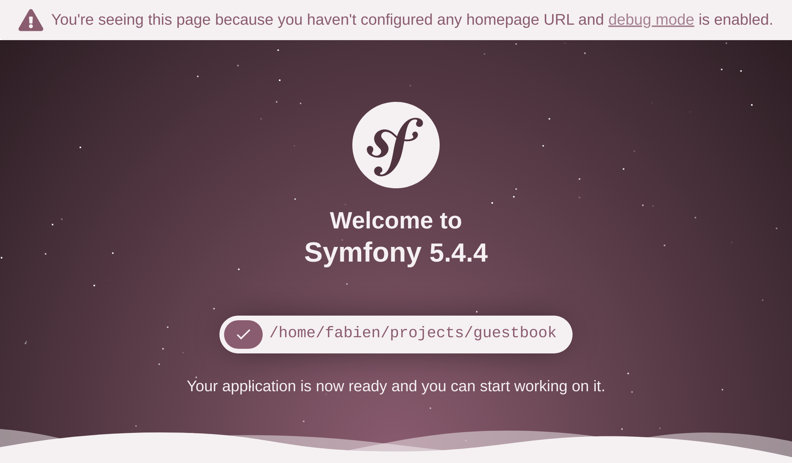

Od zera do produkcji
====================

Lubię działać szybko. Chcę, żeby nasz mały projekt był gotowy jak najszybciej. Teraz. Na produkcji. Ponieważ jeszcze niczego nie opracowaliśmy, zaczniemy od uruchomienia ładnej i prostej strony "W budowie". Spodoba Ci się to!

Spędź trochę czasu wyszukując idealny, staromodny i animowany GIF "W budowie" w Internecie. Ja zamierzam użyć `tego`_:

.. image:: images/under-construction.gif
    :align: center

Mówiłem Ci, że będzie fajnie.

Inicjalizacja projektu
----------------------

Stwórz nowy projekt Symfony za pomocą narzędzia ``symfony`` CLI, które wcześniej wspólnie zainstalowaliśmy:

.. code-block:: terminal

    $ symfony new guestbook --version=6.0 --php=8.1 --webapp --docker --cloud
    $ cd guestbook

Ta komenda opakowuje (ang. wrap) narzędzie ``Composer``, które ułatwia tworzenie projektów Symfony. Wykorzystuje `szkielet projektu`_, który zawiera minimalną liczbę zależności - komponenty Symfony, które są potrzebne w prawie każdym projekcie: narzędzie konsolowe i abstrakcję HTTP potrzebną do tworzenia aplikacji internetowych.

Ponieważ tworzymy w pełni funkcjonalną aplikację internetową, dodaliśmy kilka opcji, które ułatwią nam życie:

* ``--webapp``: Domyślnie tworzona jest aplikacja z możliwie najmniejszą liczbą zależności. W przypadku większości projektów webowych zaleca się użycie pakietu ``webapp``. Zawiera znaczną część pakietów potrzebnych do "współczesnych" aplikacji internetowych. Pakiet ``webapp`` dodaje wiele pakietów Symfony, w tym Symfony Messenger i obsługę PostgreSQL za pośrednictwem Doctrine.

* ``--docker``: Na komputerze lokalnym użyjemy Dockera do zarządzania usługami takimi, jak PostgreSQL. Ta opcja uruchamia wsparcie dla Dockera, dzięki czemu Symfony automatycznie doda usługi Dockera w oparciu o wymagane pakiety (na przykład usługa PostgreSQL podczas dodawania ORM lub mail catcher podczas dodawania Symfony Mailer).

* ``--cloud``: Jeśli chcesz wdrożyć swój projekt na Platform.sh, ta opcja automatycznie generuje potrzebną konfigurację Platform.sh. Wykorzystanie Platform.sh jest najprostszym i preferowanym sposobem wdrażania środowisk testowych, wstępnych i produkcyjnych projektu Symfony w chmurze.

Jeśli spojrzysz na repozytorium GitHub szkieletu, zauważysz, że jest prawie puste. Zawiera tylko plik ``composer.json``, ale katalog ``guestbook`` jest pełen plików. Jak to w ogóle możliwe? Odpowiedź znajduje się w pakiecie ``symfony/flex``. Symfony Flex jest wtyczką narzędzia Composer, która podpina się do procesu instalacji. Kiedy wykryje pakiet, na który ma *przepis* (ang. recipe), wykonuje go.

Kluczowym elementem Symfony Recipe jest plik manifestu, który zawiera operacje pozwalające automatycznie zarejestrować pakiet w aplikacji Symfony. Nie musisz czytać pliku README, aby zainstalować pakiet przy pomocy Symfony. Automatyzacja jest kluczową cechą Symfony.

Jako że Git jest zainstalowany na naszej maszynie, polecenie ``symfony new`` stworzyło dla nas również repozytorium Git i dokonało pierwszego zatwierdzenia (ang. commit).

Przyjrzyj się strukturze katalogów:

.. code-block:: text
    :class: ignore

    ├── bin/
    ├── composer.json
    ├── composer.lock
    ├── config/
    ├── public/
    ├── src/
    ├── symfony.lock
    ├── var/
    └── vendor/

Katalog ``bin/`` zawiera kluczowy program CLI: ``console``. Będziesz z niego korzystać przez cały czas.

Katalog ``config/`` składa się z zestawu domyślnych plików konfiguracyjnych. Jeden plik na pakiet. Będziesz je modyfikować w niewielkim stopniu - ufanie domyślnym ustawieniom jest prawie zawsze dobrym pomysłem.

Katalog ``public/`` jest katalogiem publicznym, a skrypt ``index.php`` jest głównym punktem wejścia dla wszystkich dynamicznych zasobów HTTP.

Katalog ``src/`` zawiera cały kod, który napiszesz; tam spędzisz większość czasu. Domyślnie wszystkie klasy PHP w tym katalogu korzystają z przestrzeni nazw ``App``. To jest Twój dom. Twój kod. Logika Twojej domeny. Symfony ma tam bardzo mało do powiedzenia.

Katalog ``var/`` zawiera pamięć podręczną, logi i pliki generowane podczas uruchamiania aplikacji. Możesz zostawić je w spokoju. Jest to jedyny katalog, który musi mieć prawa zapisu na produkcji.

Katalog ``vendor/`` zawiera wszystkie pakiety zainstalowane przez narzędzie Composer, włącznie z samym Symfony. To nasza tajna broń, by być bardziej produktywnym. Nie wymyślajmy koła na nowo. Będziesz korzystał z istniejących bibliotek, aby wykonać żmudną pracę. Nie ruszaj tego katalogu - zarządza nim Composer.

To wszystko, co musisz na razie wiedzieć.

Tworzenie zasobów publicznych
------------------------------

Wszystko wewnątrz katalogu ``public/`` jest dostępne przez przeglądarkę. Na przykład, jeśli przeniesiesz animowany plik GIF (nazwijmy go ``under-construction.gif``) do nowego katalogu ``public/images/``, będzie on dostępny pod adresem URL: ``https://localhost/images/under-construction.gif``.

Pobierz mój obrazek GIF tutaj:

.. code-block:: terminal

    $ mkdir public/images/
    $ php -r "copy('http://clipartmag.com/images/website-under-construction-image-6.gif', 'public/images/under-construction.gif');"

Uruchomienie lokalnego serwera WWW
----------------------------------

.. index::
    single: Symfony CLI;server:start

``symfony`` CLI jest dostarczany z serwerem WWW, który jest zoptymalizowany pod kątem pracy programistycznej. Nie zaskoczę Cię mówiąc, że współpracuje dobrze z Symfony. Nigdy jednak nie używaj go w środowisku produkcyjnym.

Z katalogu projektu, uruchom serwer WWW w tle (flaga ``-d``):

.. code-block:: terminal

    $ symfony server:start -d

Serwer rozpoczął pracę na pierwszym dostępnym porcie, zaczynając od 8000. Jako skrót, otwórz stronę internetową w przeglądarce z CLI:

.. code-block:: terminal
    :class: ignore

    $ symfony open:local

Teraz, Twoja ulubiona przeglądarka powinna otworzyć nową kartę, na której wyświetla się coś podobnego do poniższego rysunku:

.. tip::

    Aby rozwiązywać problemy, uruchom komendę ``symfony server:log``; śledzi ona logi z serwera WWW, PHP i Twojej aplikacji.

Przejdź do ``/images/under-construction.gif``. Czy wygląda w ten sposób?

.. index::
    single: Git;add
    single: Git;commit

Dobrze? Zatwierdźmy więc (ang. commit) naszą pracę:

.. code-block:: terminal
    :class: ignore

    $ git add public/images
    $ git commit -m'Add the under construction image'

Dodawanie favicony
------------------

Aby uniknąć bycia "spamowanym" przez błędy HTTP 404 w logach z powodu brakującej favicony wymaganej przez przeglądarki, dodajmy jedną teraz:

.. code-block:: terminal

    $ php -r "copy('https://symfony.com/favicon.ico', 'public/favicon.ico');"
    $ git add public/
    $ git commit -m'Add a favicon'

Przygotowanie do wdrożenia dla środowiska produkcyjnego
---------------------------------------------------------

.. index::
    single: Platform.sh;Initialization

A co z wdrożeniem naszej pracy w środowisku produkcyjnym? Wiem, że nie mamy jeszcze nawet odpowiedniej strony HTML, aby powitać naszych gości, ale możliwość zobaczenia małego obrazka "w budowie" na serwerze produkcyjnym byłaby wielkim krokiem naprzód. I znasz motto: "*Wdrażaj wcześnie i często*".

Możesz umieścić tę aplikację na hostingu dowolnego dostawcy wspierającego PHP... co oznacza prawie wszystkich dostępnych dostawców usług hostingowych. Sprawdź jednak kilka rzeczy: chcemy mieć najnowszą wersję PHP i możliwość hostowania usług takich jak baza danych, kolejka itp.

Ja wybrałem `Platform.sh`_. Dostarcza nam wszystkiego, czego potrzebujemy, i pomaga finansować rozwój Symfony.

.. index::
    single: Symfony CLI;project:init

Ponieważ użyliśmy opcji ``--cloud`` podczas tworzenia projektu, Platform.sh został już zainicjowany z kilkoma wymaganymi plikami, a mianowicie: ``.platform/services.yaml``, ``. platform/routes.yaml`` i ``.platform.app.yaml``.

Idziemy na produkcję
---------------------

.. index::
    single: Symfony CLI;cloud:project:create
    single: Symfony CLI;cloud:deploy

Wdrażamy?

Stwórz nowy projekt zdalny Platform.sh:

.. code-block:: terminal

    $ symfony cloud:project:create --title="Guestbook" --plan=development

To polecenie wykonuje szereg operacji:

* Uwierzytelnia Cię przy jego pierwszym uruchomieniu, używając danych do logowania serwisu Platform.sh.

* Tworzy nowy projekt na Platform.sh. Hosting pierwszego projektu, który stworzysz na platformie Platform.sh jest *bezpłatny* przez pierwsze 30 dni.

Zatem wdrażajmy:

.. code-block:: terminal

    $ symfony cloud:deploy

Kod jest wdrażany przez wysyłanie zmian (ang. push) do repozytorium Git. Po wykonaniu polecenia zostanie zwrócona nazwa domeny, którą możesz wykorzystać, aby uzyskać dostęp do wdrożonego projektu.

.. index::
    single: Symfony CLI;cloud:url

Sprawdź, czy wszystko poszło dobrze:

.. code-block:: terminal
    :class: ignore

    $ symfony cloud:url -1

Powinna pojawić się strona błędu 404, ale przejście pod adres: ``/images/under-construction.gif`` powinno pokazać, co do tej pory zrobiliśmy.

Zauważ, że nie otrzymujesz pięknej, domyślnej strony Symfony na Platform.sh. Dlaczego? Wkrótce dowiesz się, że Symfony obsługuje kilka środowisk i Platform.sh automatycznie wdrożył kod w środowisku produkcyjnym.

.. index::
    single: Symfony CLI;cloud:project:delete

.. tip::

    Jeśli chcesz usunąć projekt na Platform.sh, użyj polecenia ``cloud:project:delete``.

.. sidebar:: Idąc dalej

    * Repozytoria dla `oficjalnych przepisów Symfony`_ i dla `przepisów przekazanych przez społeczność`_, gdzie możesz zgłosić swoje własne przepisy;

    * `Lokalny serwer WWW Symfony`_;

    * `Dokumentacja Platform.sh`_.

.. _`tego`: http://clipartmag.com/images/website-under-construction-image-6.gif
.. _`szkielet projektu`: https://github.com/symfony/skeleton
.. _`Platform.sh`: https://platform.sh
.. _`oficjalnych przepisów Symfony`: https://github.com/symfony/recipes
.. _`przepisów przekazanych przez społeczność`: https://github.com/symfony/recipes-contrib
.. _`Lokalny serwer WWW Symfony`: https://symfony.com/doc/current/setup/symfony_server.html
.. _`Dokumentacja Platform.sh`: https://symfony.com/doc/cloud
