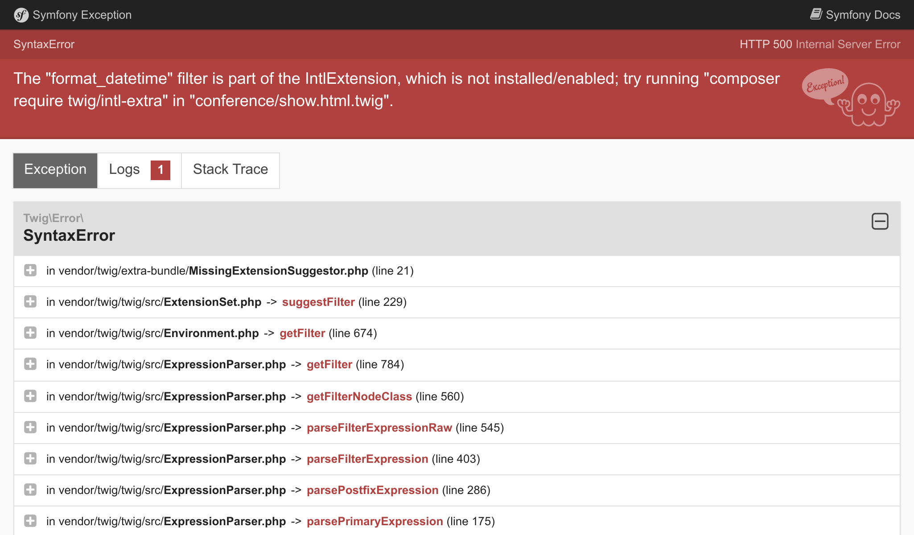
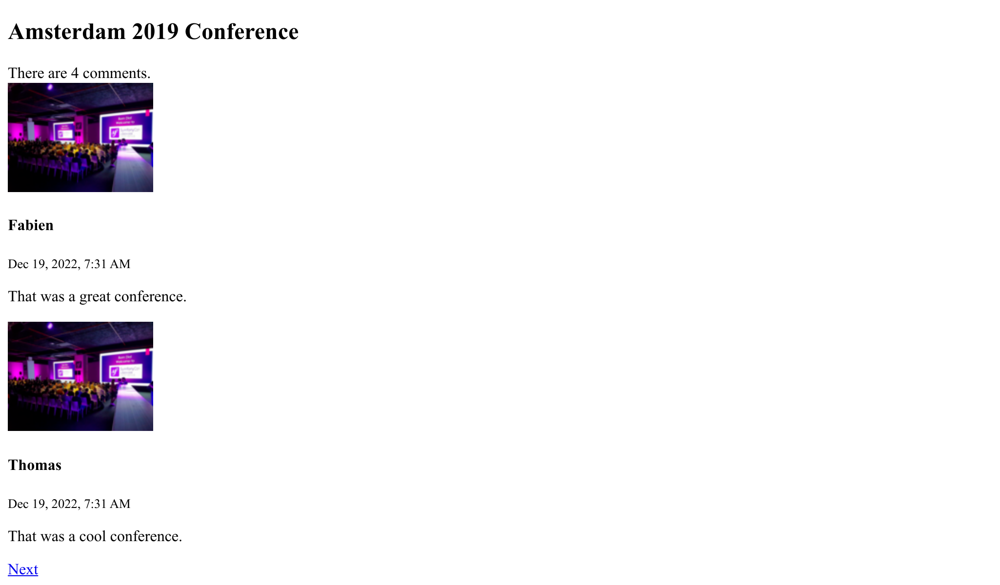

Die Benutzeroberfläche erstellen
=================================

.. index::
    single: Twig
    single: Templates

Es ist nun alles vorhanden, um die erste Version des User Interfaces der Website zu erstellen. Wir werden es nicht schön machen, sondern vorerst nur funktionsfähig.

Erinnerst Du dich an die Anpassung, die wir im Controller für das Easter egg durchführen mussten um Sicherheitsprobleme zu vermeiden? Aus diesem Grund werden wir für unsere Templates nicht PHP verwenden. Stattdessen verwenden wir Twig. `Twig`_ übernimmt nicht nur die sichere Ausgabe (Output escaping) für uns, es bringt auch eine Menge netter Features mit, die wir nutzen werden, wie z. B. die Vererbung von Templates.

Twig für Templates verwenden
-----------------------------

.. index::
    single: Twig;Layout
    single: Twig;block

Alle Seiten der Website haben das gleiche *Layout*. Bei der Installation von Twig wurde automatisch ein ``templates/``-Verzeichnis erstellt und auch ein Beispiel-Layout in ``base.html.twig``.

.. code-block:: html+twig
    :caption: templates/base.html.twig
    :class: ignore

    <!DOCTYPE html>
    <html>
        <head>
            <meta charset="UTF-8">
            <title>Welcome!</title>
            <link rel="icon" href="data:image/svg+xml,<svg xmlns=%22http://www.w3.org/2000/svg%22 viewBox=%220 0 128 128%22><text y=%221.2em%22 font-size=%2296%22>⚫️</text></svg>">
            {# Run `composer require symfony/webpack-encore-bundle` to start using Symfony UX #}
            
                {{ encore_entry_link_tags('app') }}
            

            
                {{ encore_entry_script_tags('app') }}
            
        </head>
        <body>
            
        </body>
    </html>

Ein Layout kann ``block``-Elemente definieren, an denen *untergeordnete Templates*, die das Layout *erweitern*, ihren Inhalt hinzufügen.

.. index::
    single: Twig;extends
    single: Twig;for

Erstellen wir ein Template für die Homepage des Projekts in ``templates/conference/index.html.twig``:

.. code-block:: html+twig
    :caption: templates/conference/index.html.twig

    

    Conference Guestbook

    
        <h2>Give your feedback!</h2>

        
            <h4>{{ conference }}</h4>
        
    

Das Template *erweitert* ``base.html.twig`` und definiert die Blöcke ``title`` und ``body`` neu.

.. index::
    single: Twig;Syntax

Die ````-Notation in einem Template enthalten Anweisungen zu *Aktionen* und *Struktur*.

Die ``{{ }}``-Notation wird verwendet, um etwas *auszugeben*. ``{{ conference }}`` zeigt die Darstellung der Konferenz an (Ergebnis des Aufrufs ``__toString`` des ``Conference``-Objekts).

Twig im Controller nutzen
-------------------------

Aktualisiere den Controller, um das Twig-Template zu rendern:

.. code-block:: diff
    :caption: patch_file

    --- a/src/Controller/ConferenceController.php
    +++ b/src/Controller/ConferenceController.php
    @@ -2,22 +2,19 @@

     namespace App\Controller;

    +use App\Repository\ConferenceRepository;
     use Symfony\Bundle\FrameworkBundle\Controller\AbstractController;
     use Symfony\Component\HttpFoundation\Response;
     use Symfony\Component\Routing\Annotation\Route;
    +use Twig\Environment;

     class ConferenceController extends AbstractController
     {
         #[Route('/', name: 'homepage')]
    -    public function index(): Response
    +    public function index(Environment $twig, ConferenceRepository $conferenceRepository): Response
         {
    -        return new Response(<<<EOF
    -            <html>
    -                <body>
    -                    
    -                </body>
    -            </html>
    -            EOF
    -        );
    +        return new Response($twig->render('conference/index.html.twig', [
    +            'conferences' => $conferenceRepository->findAll(),
    +        ]));
         }
     }

Hier passiert eine Menge.

Um ein Template rendern zu können, benötigen wir das Twig-``Environment``-Objekt (den Haupteintrittspunkt des Twig). Beachte, dass wir nach der Twig-Instanz fragen, indem wir sie in der Controllermethode typenabhängig einfügen (Type-Hinting). Symfony ist intelligent genug, um zu wissen, wie man das richtige Objekt injiziert.

Wir benötigen auch das Konferenz-Repository, um alle Konferenzen aus der Datenbank zu erhalten.

Im Controller-Code rendert die ``render()``-Methode das Template und übergibt ein Array von Variablen an das Template. Wir übergeben die Liste der ``Conference``-Objekte als ``conferences``-Variable.

Ein Controller ist eine Standard-PHP-Klasse. Wir müssen die ``AbstractController``-Klasse nicht einmal erweitern, wenn wir unsere Dependencies explizit verwenden möchten. Du könntest daher die Vererbung von ``AbstractController`` entfernen (aber tu es nicht, da wir die schönen Abkürzungen, die der ``AbstractController`` bietet, in zukünftigen Schritten verwenden werden).

Die Seite für eine Konferenz erstellen
---------------------------------------

Jede Konferenz sollte eine eigene Seite haben, auf der die Kommentare angezeigt werden. Das Hinzufügen einer neuen Seite besteht aus der Erstellung eines Controllers, der Definition einer Route für diesen und der Erstellung des zugehörigen Templates.

Füge eine ``show()``-Methode in ``src/Controller/ConferenceController.php`` hinzu:

.. code-block:: diff
    :caption: patch_file

    --- a/src/Controller/ConferenceController.php
    +++ b/src/Controller/ConferenceController.php
    @@ -2,6 +2,8 @@

     namespace App\Controller;

    +use App\Entity\Conference;
    +use App\Repository\CommentRepository;
     use App\Repository\ConferenceRepository;
     use Symfony\Bundle\FrameworkBundle\Controller\AbstractController;
     use Symfony\Component\HttpFoundation\Response;
    @@ -17,4 +19,13 @@ class ConferenceController extends AbstractController
                 'conferences' => $conferenceRepository->findAll(),
             ]));
         }
    +
    +    #[Route('/conference/{id}', name: 'conference')]
    +    public function show(Environment $twig, Conference $conference, CommentRepository $commentRepository): Response
    +    {
    +        return new Response($twig->render('conference/show.html.twig', [
    +            'conference' => $conference,
    +            'comments' => $commentRepository->findBy(['conference' => $conference], ['createdAt' => 'DESC']),
    +        ]));
    +    }
     }

Diese Methode hat ein besonderes Verhalten, das wir noch nicht gesehen haben. Wir bitten darum, dass eine ``Conference``-Instanz in die Methode injiziert wird. Aber es kann viele davon in der Datenbank geben. Symfony ist in der Lage, die ``{id}`` aus dem Request-Pfad  zu nutzen (``id`` ist der  Primärschlüssel der ``conference``-Tabelle).

Das Abrufen der Kommentare zur Konferenz kann über die ``findBy()``-Methode erfolgen, deren erstes Argument ein Abfragekriterium ist.

.. index::
    single: Twig;extends
    single: Twig;block
    single: Twig;for
    single: Twig;if
    single: Twig;else
    single: Twig;asset
    single: Twig;format_datetime
    single: Twig;length

Der letzte Schritt ist die Erstellung der Datei ``templates/conference/show.html.twig``:

.. code-block:: html+twig
    :caption: templates/conference/show.html.twig

    

    Conference Guestbook - {{ conference }}

    
        <h2>{{ conference }} Conference</h2>

        
            
                
                    
                

                <h4>{{ comment.author }}</h4>
                <small>
                    {{ comment.createdAt|format_datetime('medium', 'short') }}
                </small>

                
{{ comment.text }}

            
        
            
No comments have been posted yet for this conference.

        
    

In diesem Template verwenden wir die ``|``-Notation, um Twig *Filter* aufzurufen. Ein Filter transformiert einen Wert. ``comments|length`` liefert die Anzahl der Kommentare und ``comment.createdAt|format_datetime('medium', 'short')`` formatiert das Datum in einer für den Menschen lesbaren Darstellung.

Versuche, die "erste" Konferenz über ``/conference/1`` zu erreichen und beachte den folgenden Fehler:

Der Fehler kommt vom ``format_datetime``-Filter, der nicht Teil der Twig-Kernfunktionalität ist. Die Fehlermeldung gibt Dir einen Hinweis darauf, welches Paket installiert werden sollte, um das Problem zu beheben:

.. code-block:: terminal

    $ symfony composer req "twig/intl-extra:^3"

Jetzt funktioniert die Seite einwandfrei.

Seiten untereinander verlinken
------------------------------

.. index::
    single: Twig;Link
    single: Link

Der allerletzte Schritt, um unsere erste Version der Benutzeroberfläche fertigzustellen, ist die Verknüpfung der Konferenzseiten von der Homepage aus:

.. code-block:: diff
    :caption: patch_file

    --- a/templates/conference/index.html.twig
    +++ b/templates/conference/index.html.twig
    @@ -7,5 +7,8 @@

         
             <h4>{{ conference }}</h4>
    +        

    +            <a href="/conference/{{ conference.id }}">View</a>
    +        

         
     

Jedoch ist die direkte, feste Nutzung eines Pfades aus mehreren Gründen eine schlechte Idee. Der Hauptgrund dafür ist folgender: Wenn Du den Pfad änderst (z. B. von ``/conference/{id}`` nach ``/conferences/{id}``), müssen alle Links manuell aktualisiert werden.

.. index::
    single: Twig;path

Verwende stattdessen die Twig-*Funktion* ``path()`` und den *Namen der Route*:

.. code-block:: diff
    :caption: patch_file

    --- a/templates/conference/index.html.twig
    +++ b/templates/conference/index.html.twig
    @@ -8,7 +8,7 @@
         
             <h4>{{ conference }}</h4>
             

    -            <a href="/conference/{{ conference.id }}">View</a>
    +            <a href="{{ path('conference', { id: conference.id }) }}">View</a>
             

         
     

Die ``path()``-Funktion generiert den Pfad zu einer Seite anhand ihres Routennamens. Die Werte der Routenparameter werden als Twig Map übergeben.

Seitenzahlen bei den Kommentaren (Pagination)
---------------------------------------------

.. index::
    single: Doctrine;Paginator
    single: Paginator

Mit Tausenden von Teilnehmern können wir viele Kommentare erwarten. Wenn wir sie alle auf einer einzigen Seite anzeigen, wird diese sehr schnell wachsen.

Erstelle eine ``getCommentPaginator()``-Methode im Comment-Repository, die einen Comment-*Paginator* basierend auf einer Konferenz und einem Offset (nach dem gestartet wird) zurückgibt:

.. code-block:: diff
    :caption: patch_file

    --- a/src/Repository/CommentRepository.php
    +++ b/src/Repository/CommentRepository.php
    @@ -3,8 +3,10 @@
     namespace App\Repository;

     use App\Entity\Comment;
    +use App\Entity\Conference;
     use Doctrine\Bundle\DoctrineBundle\Repository\ServiceEntityRepository;
     use Doctrine\Persistence\ManagerRegistry;
    +use Doctrine\ORM\Tools\Pagination\Paginator;

     /**
      * @extends ServiceEntityRepository<Comment>
    @@ -16,11 +18,27 @@ use Doctrine\Persistence\ManagerRegistry;
      */
     class CommentRepository extends ServiceEntityRepository
     {
    +    public const PAGINATOR_PER_PAGE = 2;
    +
         public function __construct(ManagerRegistry $registry)
         {
             parent::__construct($registry, Comment::class);
         }

    +    public function getCommentPaginator(Conference $conference, int $offset): Paginator
    +    {
    +        $query = $this->createQueryBuilder('c')
    +            ->andWhere('c.conference = :conference')
    +            ->setParameter('conference', $conference)
    +            ->orderBy('c.createdAt', 'DESC')
    +            ->setMaxResults(self::PAGINATOR_PER_PAGE)
    +            ->setFirstResult($offset)
    +            ->getQuery()
    +        ;
    +
    +        return new Paginator($query);
    +    }
    +
         public function save(Comment $entity, bool $flush = false): void
         {
             $this->getEntityManager()->persist($entity);

Wir haben die maximale Anzahl der Kommentare pro Seite auf 2 festgelegt, um das Testen zu erleichtern.

Um die Seitenzahlen im Template zu verwalten, übergebe Twig den Doctrine Paginator anstelle der Doctrine Collection:

.. code-block:: diff
    :caption: patch_file

    --- a/src/Controller/ConferenceController.php
    +++ b/src/Controller/ConferenceController.php
    @@ -6,6 +6,7 @@ use App\Entity\Conference;
     use App\Repository\CommentRepository;
     use App\Repository\ConferenceRepository;
     use Symfony\Bundle\FrameworkBundle\Controller\AbstractController;
    +use Symfony\Component\HttpFoundation\Request;
     use Symfony\Component\HttpFoundation\Response;
     use Symfony\Component\Routing\Annotation\Route;
     use Twig\Environment;
    @@ -21,11 +22,16 @@ class ConferenceController extends AbstractController
         }

         #[Route('/conference/{id}', name: 'conference')]
    -    public function show(Environment $twig, Conference $conference, CommentRepository $commentRepository): Response
    +    public function show(Request $request, Environment $twig, Conference $conference, CommentRepository $commentRepository): Response
         {
    +        $offset = max(0, $request->query->getInt('offset', 0));
    +        $paginator = $commentRepository->getCommentPaginator($conference, $offset);
    +
             return new Response($twig->render('conference/show.html.twig', [
                 'conference' => $conference,
    -            'comments' => $commentRepository->findBy(['conference' => $conference], ['createdAt' => 'DESC']),
    +            'comments' => $paginator,
    +            'previous' => $offset - CommentRepository::PAGINATOR_PER_PAGE,
    +            'next' => min(count($paginator), $offset + CommentRepository::PAGINATOR_PER_PAGE),
             ]));
         }
     }

Der Controller bekommt ``offset`` aus dem Request-Query-String (``$request->query``) als Ganzzahl (``getInt()``) und setzt es standardmäßig auf 0, wenn dieser Parameter nicht verfügbar ist.

Die ``zurück``- und ``weiter``-Offsets werden basierend auf allen Informationen, die wir vom Paginator haben, berechnet.

.. index::
    single: Twig;if

Aktualisiere nun das Template, um Links zur nächsten und vorherigen Seite hinzuzufügen:

.. code-block:: diff
    :caption: patch_file

    --- a/templates/conference/show.html.twig
    +++ b/templates/conference/show.html.twig
    @@ -6,6 +6,8 @@
         <h2>{{ conference }} Conference</h2>

         
    +        
There are {{ comments|length }} comments.

    +
             
                 
                     
    @@ -18,6 +20,13 @@

                 
{{ comment.text }}

             
    +
    +        
    +            <a href="{{ path('conference', { id: conference.id, offset: previous }) }}">Previous</a>
    +        
    +        
    +            <a href="{{ path('conference', { id: conference.id, offset: next }) }}">Next</a>
    +        
         
             
No comments have been posted yet for this conference.

         

Du solltest nun in der Lage sein, über die Links "Zurück" und "Weiter" durch die Kommentare zu navigieren:

.. figure:: screenshots/pagination-previous.png
    :alt: /conference/1?offset=2
    :align: center
    :figclass: with-browser

Refactoring des Controllers
---------------------------

Du hast vielleicht bemerkt, dass beide Methoden in ``ConferenceController`` eine Twig-Environment als Argument erwarten. Anstatt es in jede Methode zu injizieren, setzen wir eine ``render()`` Hilfs-Methode ein, die durch die Parent-Klasse bereitgestellt wird:

.. code-block:: diff
    :caption: patch_file

    --- a/src/Controller/ConferenceController.php
    +++ b/src/Controller/ConferenceController.php
    @@ -9,29 +9,28 @@ use Symfony\Bundle\FrameworkBundle\Controller\AbstractController;
     use Symfony\Component\HttpFoundation\Request;
     use Symfony\Component\HttpFoundation\Response;
     use Symfony\Component\Routing\Annotation\Route;
    -use Twig\Environment;

     class ConferenceController extends AbstractController
     {
         #[Route('/', name: 'homepage')]
    -    public function index(Environment $twig, ConferenceRepository $conferenceRepository): Response
    +    public function index(ConferenceRepository $conferenceRepository): Response
         {
    -        return new Response($twig->render('conference/index.html.twig', [
    +        return $this->render('conference/index.html.twig', [
                 'conferences' => $conferenceRepository->findAll(),
    -        ]));
    +        ]);
         }

         #[Route('/conference/{id}', name: 'conference')]
    -    public function show(Request $request, Environment $twig, Conference $conference, CommentRepository $commentRepository): Response
    +    public function show(Request $request, Conference $conference, CommentRepository $commentRepository): Response
         {
             $offset = max(0, $request->query->getInt('offset', 0));
             $paginator = $commentRepository->getCommentPaginator($conference, $offset);

    -        return new Response($twig->render('conference/show.html.twig', [
    +        return $this->render('conference/show.html.twig', [
                 'conference' => $conference,
                 'comments' => $paginator,
                 'previous' => $offset - CommentRepository::PAGINATOR_PER_PAGE,
                 'next' => min(count($paginator), $offset + CommentRepository::PAGINATOR_PER_PAGE),
    -        ]));
    +        ]);
         }
     }

.. sidebar:: Weiterführendes

    * `Twig-Dokumentation`_;

    * `Erstellen und Verwenden von Templates`_ in Symfony-Anwendungen;

    * `SymfonyCasts Twig Tutorial;`_;

    * `Twig-Funktionen und -Filter, welche nur in Symfony verfügbar sind`_;

    * Der `AbstractController Basis-Controller`_.

.. _`Twig`: https://twig.symfony.com/
.. _`Twig-Dokumentation`: https://twig.symfony.com/doc/3.x/
.. _`Erstellen und Verwenden von Templates`: https://symfony.com/doc/current/templates.html
.. _`SymfonyCasts Twig Tutorial;`: https://symfonycasts.com/screencast/symfony/twig-recipe
.. _`Twig-Funktionen und -Filter, welche nur in Symfony verfügbar sind`: https://symfony.com/doc/current/reference/twig_reference.html
.. _`AbstractController Basis-Controller`: https://symfony.com/doc/current/controller.html#the-base-controller-classes-services
