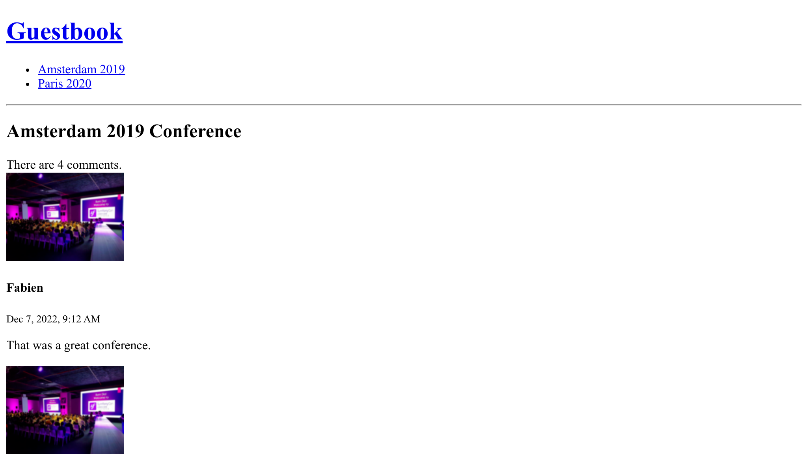

Tester
======

.. index::
    single: PHPUnit

Comme nous commençons à ajouter de plus en plus de fonctionnalités dans l'application, c'est probablement le bon moment pour parler des tests.

*Fun fact* : j'ai trouvé un bogue en écrivant les tests de ce chapitre.

Symfony s'appuie sur PHPUnit pour les tests unitaires. Installons-le :

.. code-block:: terminal

    $ symfony composer req phpunit --dev

Écrire des tests unitaires
---------------------------

.. index::
    single: Test;Unit Tests
    single: Unit Tests
    single: Command;make:test

``SpamChecker`` est la première classe pour laquelle nous allons écrire des tests. Générez un test unitaire :

.. code-block:: terminal

    $ symfony console make:test TestCase SpamCheckerTest

Tester le SpamChecker est un défi car nous ne voulons certainement pas utiliser l'API Akismet. Nous allons *mocker* l'API.

.. index::
    single: Mock

Écrivons un premier test pour le cas où l'API renverrai une erreur :

.. code-block:: diff
    :caption: patch_file

    --- a/tests/SpamCheckerTest.php
    +++ b/tests/SpamCheckerTest.php
    @@ -2,12 +2,26 @@

     namespace App\Tests;

    +use App\Entity\Comment;
    +use App\SpamChecker;
     use PHPUnit\Framework\TestCase;
    +use Symfony\Component\HttpClient\MockHttpClient;
    +use Symfony\Component\HttpClient\Response\MockResponse;
    +use Symfony\Contracts\HttpClient\ResponseInterface;

     class SpamCheckerTest extends TestCase
     {
    -    public function testSomething(): void
    +    public function testSpamScoreWithInvalidRequest(): void
         {
    -        $this->assertTrue(true);
    +        $comment = new Comment();
    +        $comment->setCreatedAtValue();
    +        $context = [];
    +
    +        $client = new MockHttpClient([new MockResponse('invalid', ['response_headers' => ['x-akismet-debug-help: Invalid key']])]);
    +        $checker = new SpamChecker($client, 'abcde');
    +
    +        $this->expectException(\RuntimeException::class);
    +        $this->expectExceptionMessage('Unable to check for spam: invalid (Invalid key).');
    +        $checker->getSpamScore($comment, $context);
         }
     }

La classe ``MockHttpClient`` permet de simuler n'importe quel serveur HTTP. Elle prend un tableau d'instances ``MockResponse`` contenant le corps et les en-têtes de réponse attendus.

Ensuite, nous appelons la méthode ``getSpamScore()`` et vérifions qu'une exception est levée via la méthode``expectException()`` de PHPUnit.

Lancez les tests pour vérifier qu'ils passent :

.. code-block:: terminal

    $ symfony php bin/phpunit

.. index::
    single: PHPUnit;Data Provider
    single: Data Provider
    single: Attributes;@dataProvider

Ajoutons des tests pour les cas qui fonctionnent :

.. code-block:: diff
    :caption: patch_file

    --- a/tests/SpamCheckerTest.php
    +++ b/tests/SpamCheckerTest.php
    @@ -24,4 +24,32 @@ class SpamCheckerTest extends TestCase
             $this->expectExceptionMessage('Unable to check for spam: invalid (Invalid key).');
             $checker->getSpamScore($comment, $context);
         }
    +
    +    /**
    +     * @dataProvider provideComments
    +     */
    +    public function testSpamScore(int $expectedScore, ResponseInterface $response, Comment $comment, array $context)
    +    {
    +        $client = new MockHttpClient([$response]);
    +        $checker = new SpamChecker($client, 'abcde');
    +
    +        $score = $checker->getSpamScore($comment, $context);
    +        $this->assertSame($expectedScore, $score);
    +    }
    +
    +    public static function provideComments(): iterable
    +    {
    +        $comment = new Comment();
    +        $comment->setCreatedAtValue();
    +        $context = [];
    +
    +        $response = new MockResponse('', ['response_headers' => ['x-akismet-pro-tip: discard']]);
    +        yield 'blatant_spam' => [2, $response, $comment, $context];
    +
    +        $response = new MockResponse('true');
    +        yield 'spam' => [1, $response, $comment, $context];
    +
    +        $response = new MockResponse('false');
    +        yield 'ham' => [0, $response, $comment, $context];
    +    }
     }

Les *data providers* de PHPUnit nous permettent de réutiliser la même logique de test pour plusieurs scénarios.

Écrire des tests fonctionnels pour les contrôleurs
----------------------------------------------------

.. index::
    single: Test;Functional Tests
    single: Functional Tests
    single: Components;Browser Kit
    single: Browser Kit

Tester les contrôleurs est un peu différent de tester une classe PHP "ordinaire" car nous voulons les exécuter dans le contexte d'une requête HTTP.

Créez un test fonctionnel pour le contrôleur Conference :

.. code-block:: php
    :caption: tests/Controller/ConferenceControllerTest.php

    namespace App\Tests\Controller;

    use Symfony\Bundle\FrameworkBundle\Test\WebTestCase;

    class ConferenceControllerTest extends WebTestCase
    {
        public function testIndex()
        {
            $client = static::createClient();
            $client->request('GET', '/');

            $this->assertResponseIsSuccessful();
            $this->assertSelectorTextContains('h2', 'Give your feedback');
        }
    }

Utiliser ``Symfony\Bundle\FrameworkBundle\Test\WebTestCase`` à la place de ``PHPUnit\Framework\TestCase`` comme classe de base pour nos tests nous fournit une abstraction bien pratique pour les tests fonctionnels.

La variable ``$client`` simule un navigateur. Au lieu de faire des appels HTTP au serveur, il appelle directement l'application Symfony. Cette stratégie présente plusieurs avantages : elle est beaucoup plus rapide que les allers-retours entre le client et le serveur, mais elle permet aussi aux tests d'analyser l'état des services après chaque requête HTTP.

Ce premier test vérifie que la page d'accueil renvoie une réponse HTTP 200.

Des assertions telles que ``assertResponseIsSuccessful`` sont ajoutées à PHPUnit pour faciliter votre travail. Plusieurs assertions de ce type sont définies par Symfony.

.. tip::

    Nous avons utilisé ``/`` pour l'URL au lieu de la générer avec le routeur. C'est volontaire, car tester les URLs telles qu'elles seront déployées fait partie de ce que nous voulons tester. Si vous la modifiez, les tests vont échouer pour vous rappeler que vous devriez probablement rediriger l'ancienne URL vers la nouvelle, pour être gentil avec les moteurs de recherche et les sites web qui renvoient vers le vôtre.

Configurer l'environnement de test
----------------------------------

.. index::
    single: Symfony Environments

Par défaut, les tests PHPUnit sont exécutés dans l'environnement Symfony ``test`` tel qu'il est défini dans le fichier de configuration de PHPUnit :

.. code-block:: xml
    :caption: phpunit.xml.dist
    :emphasize-lines: 4
    :class: ignore

    <phpunit>
        <php>
            <ini name="error_reporting" value="-1" />
            <server name="APP_ENV" value="test" force="true" />
            <server name="SHELL_VERBOSITY" value="-1" />
            <server name="SYMFONY_PHPUNIT_REMOVE" value="" />
            <server name="SYMFONY_PHPUNIT_VERSION" value="8.5" />
            ...

.. index:: Command;secrets:set

Pour faire fonctionner les tests, nous devons définir la clé secrète ``AKISMET_KEY`` pour cet environnement ``test`` :

.. code-block:: terminal
    :class: answers(AKISMET_KEY_VALUE)

    $ symfony console secrets:set AKISMET_KEY --env=test

Utiliser une base de données de test
-------------------------------------

.. index::
    single: Test;Database
    single: Functional Tests,Database

Comme nous l'avons déjà vu, la commande Symfony définit automatiquement la variable d'environnement ``DATABASE_URL`` . Quand ``APP_ENV`` vaut ``test``, comme c'est le cas lors de l'exécution de PHPUnit, cela change le nom de la base de données de ``app`` en ``app_test`` pour que les tests utilisent leur propre base de données :

.. code-block:: yaml
    :class: ignore
    :emphasize-lines: 5
    :caption: config/packages/doctrine.yaml

    when@test:
        doctrine:
            dbal:
                # "TEST_TOKEN" is typically set by ParaTest
                dbname_suffix: '_test%env(default::TEST_TOKEN)%'

Cela est très important car nous aurons besoin d'un jeu de données stable pour exécuter nos tests et nous ne voulons certainement pas écraser celui stocké dans la base de développement.

Avant de pouvoir lancer les tests, nous devons "initialiser" la base de données ``test`` (créez la base de données et jouez les migrations) :

.. code-block:: terminal

    $ symfony console doctrine:database:create --env=test
    $ symfony console doctrine:migrations:migrate -n --env=test

.. note::

    On Linux and similiar OSes, you can use ``APP_ENV=test`` instead of
    ``--env=test``:

    .. code-block:: terminal
        :class: ignore

        $ APP_ENV=test symfony console doctrine:database:create

Si vous lancez les tests maintenant, PHPUnit n'interagira plus avec votre base de données de développement. Pour lancer les nouveaux tests uniquement, passez le chemin de leur classe en argument :

.. code-block:: terminal

    $ symfony php bin/phpunit tests/Controller/ConferenceControllerTest.php

.. tip::

    Lorsqu'un test échoue, il peut être utile d'analyser l'objet Response. Accédez-y grâce à ``$client->getResponse()`` et faites un ``echo`` pour voir à quoi il ressemble.

Définir des *fixtures* (données de test)
------------------------------------------

.. index::
    single: Doctrine;Fixtures
    single: Fixtures

Pour pouvoir tester la liste des commentaires, la pagination et la soumission du formulaire, nous devons remplir la base de données avec quelques données. Nous voulons également que les données soient identiques entre les cycles de tests pour qu'ils réussissent. Les fixtures sont exactement ce dont nous avons besoin.

Installez le composant Doctrine Fixtures :

.. code-block:: terminal

    $ symfony composer req orm-fixtures --dev

Un nouveau répertoire ``src/DataFixtures/`` a été créé lors de l'installation, avec une classe d'exemple prête à être personnalisée. Ajoutez deux conférences et un commentaire pour le moment :

.. code-block:: diff
    :caption: patch_file

    --- a/src/DataFixtures/AppFixtures.php
    +++ b/src/DataFixtures/AppFixtures.php
    @@ -2,6 +2,8 @@

     namespace App\DataFixtures;

    +use App\Entity\Comment;
    +use App\Entity\Conference;
     use Doctrine\Bundle\FixturesBundle\Fixture;
     use Doctrine\Persistence\ObjectManager;

    @@ -9,8 +11,24 @@ class AppFixtures extends Fixture
     {
         public function load(ObjectManager $manager): void
         {
    -        // $product = new Product();
    -        // $manager->persist($product);
    +        $amsterdam = new Conference();
    +        $amsterdam->setCity('Amsterdam');
    +        $amsterdam->setYear('2019');
    +        $amsterdam->setIsInternational(true);
    +        $manager->persist($amsterdam);
    +
    +        $paris = new Conference();
    +        $paris->setCity('Paris');
    +        $paris->setYear('2020');
    +        $paris->setIsInternational(false);
    +        $manager->persist($paris);
    +
    +        $comment1 = new Comment();
    +        $comment1->setConference($amsterdam);
    +        $comment1->setAuthor('Fabien');
    +        $comment1->setEmail('fabien@example.com');
    +        $comment1->setText('This was a great conference.');
    +        $manager->persist($comment1);

             $manager->flush();
         }

Lorsque nous chargerons les données de test, toutes les données présentes seront supprimées, y compris celles de l'admin. Pour éviter cela, modifions les fixtures :

.. code-block:: diff

    --- a/src/DataFixtures/AppFixtures.php
    +++ b/src/DataFixtures/AppFixtures.php
    @@ -2,13 +2,20 @@

     namespace App\DataFixtures;

    +use App\Entity\Admin;
     use App\Entity\Comment;
     use App\Entity\Conference;
     use Doctrine\Bundle\FixturesBundle\Fixture;
     use Doctrine\Persistence\ObjectManager;
    +use Symfony\Component\PasswordHasher\Hasher\PasswordHasherFactoryInterface;

     class AppFixtures extends Fixture
     {
    +    public function __construct(
    +        private PasswordHasherFactoryInterface $passwordHasherFactory,
    +    ) {
    +    }
    +
         public function load(ObjectManager $manager): void
         {
             $amsterdam = new Conference();
    @@ -30,6 +37,12 @@ class AppFixtures extends Fixture
             $comment1->setText('This was a great conference.');
             $manager->persist($comment1);

    +        $admin = new Admin();
    +        $admin->setRoles(['ROLE_ADMIN']);
    +        $admin->setUsername('admin');
    +        $admin->setPassword($this->passwordHasherFactory->getPasswordHasher(Admin::class)->hash('admin'));
    +        $manager->persist($admin);
    +
             $manager->flush();
         }
     }

.. index::
    single: Command;debug:autowiring
    single: Debug;Container
    single: Container;Debug

.. tip::

    Si vous ne vous souvenez pas quel service vous devez utiliser pour une tâche donnée, utilisez le ``debug:autowiring`` avec un mot-clé :

    .. code-block:: terminal

        $ symfony console debug:autowiring hasher

Charger des données de test
----------------------------

.. index:: ! Command;doctrine:fixtures:load

Chargez les données de test pour l'environnement/la base de données de ``test`` :

.. code-block:: terminal
    :class: answers(y)

    $ symfony console doctrine:fixtures:load --env=test

Parcourir un site web avec des tests fonctionnels
-------------------------------------------------

.. index::
    single: Components;CssSelector
    single: Components;DomCrawler
    single: Test;Crawling
    single: Crawling

Comme nous l'avons vu, le client HTTP utilisé dans les tests simule un navigateur, afin que nous puissions parcourir le site comme si nous utilisions un navigateur.

Ajoutez un nouveau test qui clique sur une page de conférence depuis la page d'accueil :

.. code-block:: diff
    :caption: patch_file

    --- a/tests/Controller/ConferenceControllerTest.php
    +++ b/tests/Controller/ConferenceControllerTest.php
    @@ -14,4 +14,19 @@ class ConferenceControllerTest extends WebTestCase
             $this->assertResponseIsSuccessful();
             $this->assertSelectorTextContains('h2', 'Give your feedback');
         }
    +
    +    public function testConferencePage()
    +    {
    +        $client = static::createClient();
    +        $crawler = $client->request('GET', '/');
    +
    +        $this->assertCount(2, $crawler->filter('h4'));
    +
    +        $client->clickLink('View');
    +
    +        $this->assertPageTitleContains('Amsterdam');
    +        $this->assertResponseIsSuccessful();
    +        $this->assertSelectorTextContains('h2', 'Amsterdam 2019');
    +        $this->assertSelectorExists('div:contains("There are 1 comments")');
    +    }
     }

Décrivons ce qu’il se passe dans ce test :

* Comme pour le premier test, nous allons sur la page d'accueil ;

* La méthode ``request()`` retourne une instance de ``Crawler`` qui aide à trouver des éléments sur la page (comme des liens, des formulaires, ou tout ce que vous pouvez atteindre avec des sélecteurs CSS ou XPath) ;

* Grâce à un sélecteur CSS, nous testons que nous avons bien deux conférences listées sur la page d'accueil ;

* On clique ensuite sur le lien "View" (comme il n'est pas possible de cliquer sur plus d'un lien à la fois, Symfony choisit automatiquement le premier qu'il trouve) ;

* Nous vérifions le titre de la page, la réponse et le ``<h2>`` de la page pour être sûr d'être sur la bonne page (nous aurions aussi pu vérifier la route correspondante) ;

* Enfin, nous vérifions qu'il y a 1 commentaire sur la page. ``div:contains()`` n'est pas un sélecteur CSS valide, mais Symfony a quelques ajouts intéressants, empruntés à jQuery.

Au lieu de cliquer sur le texte (i.e. ``View``), nous aurions également pu sélectionner le lien grâce à un sélecteur CSS :

.. code-block:: php
    :class: ignore

    $client->click($crawler->filter('h4 + p a')->link());

Vérifiez que le nouveau test passe :

.. code-block:: terminal

    $ symfony php bin/phpunit tests/Controller/ConferenceControllerTest.php

Soumettre un formulaire dans un test fonctionnel
------------------------------------------------

Voulez-vous passer au niveau supérieur ? Essayez d'ajouter un nouveau commentaire avec une photo sur une conférence, à partir d'un test, en simulant une soumission de formulaire. Cela semble ambitieux, n'est-ce pas ? Regardez le code nécessaire : pas plus compliqué que ce que nous avons déjà écrit :

.. code-block:: diff
    :caption: patch_file

    --- a/tests/Controller/ConferenceControllerTest.php
    +++ b/tests/Controller/ConferenceControllerTest.php
    @@ -29,4 +29,19 @@ class ConferenceControllerTest extends WebTestCase
             $this->assertSelectorTextContains('h2', 'Amsterdam 2019');
             $this->assertSelectorExists('div:contains("There are 1 comments")');
         }
    +
    +    public function testCommentSubmission()
    +    {
    +        $client = static::createClient();
    +        $client->request('GET', '/conference/amsterdam-2019');
    +        $client->submitForm('Submit', [
    +            'comment_form[author]' => 'Fabien',
    +            'comment_form[text]' => 'Some feedback from an automated functional test',
    +            'comment_form[email]' => 'me@automat.ed',
    +            'comment_form[photo]' => dirname(__DIR__, 2).'/public/images/under-construction.gif',
    +        ]);
    +        $this->assertResponseRedirects();
    +        $client->followRedirect();
    +        $this->assertSelectorExists('div:contains("There are 2 comments")');
    +    }
     }

Pour soumettre un formulaire via ``submitForm()``, recherchez les noms de champs grâce aux outils de développement du navigateur ou via l'onglet Form du Symfony Profiler. Notez la réutilisation pratique de l'image en construction !

Relancez les tests pour vérifier que tout est bon :

.. code-block:: terminal

    $ symfony php bin/phpunit tests/Controller/ConferenceControllerTest.php

Si vous voulez vérifier le résultat dans un navigateur, arrêtez le serveur web et relancer le pour l'environnement ``test`` :

.. code-block:: terminal
    :class: ignore

    $ symfony server:stop
    $ APP_ENV=test symfony server:start -d

Recharger les données de test
------------------------------

.. index::
    single: Command;doctrine:fixtures:load

Si vous effectuez les tests une deuxième fois, ils devraient échouer. Comme il y a maintenant plus de commentaires dans la base de données, l'assertion qui vérifie le nombre de commentaires est erronée. Nous devons réinitialiser l'état de la base de données entre chaque exécution, en rechargeant les données de test avant chacune d'elles :

.. code-block:: terminal
    :class: answers(y)

    $ symfony console doctrine:fixtures:load --env=test
    $ symfony php bin/phpunit tests/Controller/ConferenceControllerTest.php

Automatiser votre workflow avec un Makefile
-------------------------------------------

.. index::
    single: Makefile

Il est assez pénible d'avoir à se souvenir d'une séquence de commandes pour exécuter les tests. Cela devrait au moins être documenté, même si cette documentation ne devrait être consultée qu'en dernier recours. Et si on automatisait plutôt les opérations récurrentes ? Cela servirait aussi de documentation rapidement accessible aux autres, et rendrait le développement plus facile et plus productif.

.. index::
    single: Command;doctrine:fixtures:load

L'utilisation d'un ``Makefile`` est une façon d'automatiser les commandes :

.. code-block:: makefile
    :caption: Makefile

    SHELL := /bin/bash

    tests:
    	symfony console doctrine:database:drop --force --env=test || true
    	symfony console doctrine:database:create --env=test
    	symfony console doctrine:migrations:migrate -n --env=test
    	symfony console doctrine:fixtures:load -n --env=test
    	symfony php bin/phpunit $(MAKECMDGOALS)
    .PHONY: tests

.. warning::

    Dans une règle Makefile, l'indentation **doit** être une seule tabulation et non des espaces.

Notez l'option ``-n`` sur la commande Doctrine ; c'est une option standard sur les commandes Symfony qui les rend non interactives.

Chaque fois que vous voulez exécuter les tests, utilisez ``make tests`` :

.. code-block:: terminal

    $ make tests

Réinitialiser la base de données après chaque test
-----------------------------------------------------

.. index::
    single: PHPUnit;Performance

Réinitialiser la base de données après chaque test c'est bien, mais avoir des tests vraiment indépendants c'est encore mieux. Nous ne voulons pas qu'un test s'appuie sur les résultats des précédents. Le changement de l'ordre des tests ne devrait pas changer le résultat. Comme nous allons le découvrir maintenant, ce n'est pas le cas pour le moment.

Déplacez le test ``testConferencePage`` après ``testCommentSubmission`` :

.. code-block:: diff
    :caption: patch_file

    --- a/tests/Controller/ConferenceControllerTest.php
    +++ b/tests/Controller/ConferenceControllerTest.php
    @@ -15,21 +15,6 @@ class ConferenceControllerTest extends WebTestCase
             $this->assertSelectorTextContains('h2', 'Give your feedback');
         }

    -    public function testConferencePage()
    -    {
    -        $client = static::createClient();
    -        $crawler = $client->request('GET', '/');
    -
    -        $this->assertCount(2, $crawler->filter('h4'));
    -
    -        $client->clickLink('View');
    -
    -        $this->assertPageTitleContains('Amsterdam');
    -        $this->assertResponseIsSuccessful();
    -        $this->assertSelectorTextContains('h2', 'Amsterdam 2019');
    -        $this->assertSelectorExists('div:contains("There are 1 comments")');
    -    }
    -
         public function testCommentSubmission()
         {
             $client = static::createClient();
    @@ -44,4 +29,19 @@ class ConferenceControllerTest extends WebTestCase
             $client->followRedirect();
             $this->assertSelectorExists('div:contains("There are 2 comments")');
         }
    +
    +    public function testConferencePage()
    +    {
    +        $client = static::createClient();
    +        $crawler = $client->request('GET', '/');
    +
    +        $this->assertCount(2, $crawler->filter('h4'));
    +
    +        $client->clickLink('View');
    +
    +        $this->assertPageTitleContains('Amsterdam');
    +        $this->assertResponseIsSuccessful();
    +        $this->assertSelectorTextContains('h2', 'Amsterdam 2019');
    +        $this->assertSelectorExists('div:contains("There are 1 comments")');
    +    }
     }

Les tests échouent maintenant.

.. index::
    single: Doctrine;TestBundle

Pour réinitialiser la base de données entre les tests, installez DoctrineTestBundle :

.. code-block:: terminal
    :class: hide

    $ symfony composer config extra.symfony.allow-contrib true

.. code-block:: terminal

    $ symfony composer req "dama/doctrine-test-bundle:^7" --dev

Vous devrez confirmer l'application de la recette (car il ne s'agit pas d'un bundle "officiellement" supporté) :

.. code-block:: text
    :class: ignore

    Symfony operations: 1 recipe (a5c79a9ff21bc3ae26d9bb25f1262ed7)
      -  WARNING  dama/doctrine-test-bundle (>=4.0): From github.com/symfony/recipes-contrib:master
        The recipe for this package comes from the "contrib" repository, which is open to community contributions.
        Review the recipe at https://github.com/symfony/recipes-contrib/tree/master/dama/doctrine-test-bundle/4.0

        Do you want to execute this recipe?
        [y] Yes
        [n] No
        [a] Yes for all packages, only for the current installation session
        [p] Yes permanently, never ask again for this project
        (defaults to n): p

Et voilà. Toute modification apportée pendant les tests est automatiquement annulée à la fin de chaque test.

Les tests devraient passer à nouveau :

.. code-block:: terminal

    $ make tests

Utiliser un vrai navigateur pour les tests fonctionnels
-------------------------------------------------------

.. index::
    single: Test;Panther
    single: Panther

Les tests fonctionnels utilisent un navigateur spécial qui appelle directement la couche Symfony. Mais vous pouvez aussi utiliser un vrai navigateur et la vraie couche HTTP grâce à Symfony Panther :

.. code-block:: terminal

    $ symfony composer req panther --dev

Vous pouvez ensuite écrire des tests qui utilisent un vrai navigateur Google Chrome avec les modifications suivantes :

.. code-block:: diff
    :class: ignore

    --- a/tests/Controller/ConferenceControllerTest.php
    +++ b/tests/Controller/ConferenceControllerTest.php
    @@ -2,13 +2,13 @@

     namespace App\Tests\Controller;

    -use Symfony\Bundle\FrameworkBundle\Test\WebTestCase;
    +use Symfony\Component\Panther\PantherTestCase;

    -class ConferenceControllerTest extends WebTestCase
    +class ConferenceControllerTest extends PantherTestCase
     {
         public function testIndex()
         {
    -        $client = static::createClient();
    +        $client = static::createPantherClient(['external_base_uri' => rtrim($_SERVER['SYMFONY_PROJECT_DEFAULT_ROUTE_URL'], '/')]);
             $client->request('GET', '/');

             $this->assertResponseIsSuccessful();

La variable d'environnement ``SYMFONY_PROJECT_DEFAULT_ROUTE_URL`` contient l'URL du serveur web local.

Choisir le bon type de test
---------------------------

.. index::
    single: Command;make:test

Nous avons créé trois type de tests jusqu'à maintenant. Bien que nous n'ayons utilisé le bundle maker que pour générer des tests unitaires, nous aurions tout aussi bien pu l'utiliser pour générer les classes des autres tests :

.. code-block:: terminal
    :class: ignore

    $ symfony console make:test WebTestCase Controller\\ConferenceController

    $ symfony console make:test PantherTestCase Controller\\ConferenceController

Le bundle maker supporte la génération des types de tests suivants en fonction de la manière dont vous voulez tester votre application :

* ``TestCase``: Tests PHPUnit basiques ;

* ``KernelTestCase`` : Tests basiques ayant accès aux services Symfony ;

* ``WebTestCase`` : Pour exécuter des scénarios à la manière d'un navigateur, mais sans exécution du code JavaScript ;

* ``ApiTestCase`` : Pour jouer des scénarios orientés API ;

* ``PantherTestCase`` : Pour jouer des scénarios e2e, en utilisant un vrai navigateur ou client HTTP et un vrai serveur web.

Exécuter des tests fonctionnels de boîte noire avec Blackfire
---------------------------------------------------------------

Une autre façon d'effectuer des tests fonctionnels est d'utiliser le `lecteur Blackfire`_. En plus de ce que vous pouvez faire avec les tests fonctionnels, il peut également effectuer des tests de performance.

Lisez l'étape :doc:`Performance <29-performance>`" pour en savoir plus.

.. sidebar:: Aller plus loin

    * `Liste des assertions définies par Symfony`_ pour les tests fonctionnels ;

    * `Documentation de PHPUnit`_ ;

    * La `bibliothèque Faker`_ pour générer des données réalistes dans les fixtures ;

    * La `documentation du composant CssSelector`_ ;

    * La bibliothèque `Symfony Panther`_ pour les tests de navigateurs et le parcours de site web dans les applications Symfony ;

    * La `documentation de Make/Makefile`_.

.. _`lecteur Blackfire`: https://blackfire.io/player
.. _`Liste des assertions définies par Symfony`: https://symfony.com/doc/current/testing/functional_tests_assertions.html
.. _`Documentation de PHPUnit`: https://phpunit.de/documentation.html
.. _`bibliothèque Faker`: https://github.com/FakerPHP/Faker
.. _`documentation du composant CssSelector`: https://symfony.com/doc/current/components/css_selector.html
.. _`Symfony Panther`: https://github.com/symfony/panther
.. _`documentation de Make/Makefile`: https://www.gnu.org/software/make/manual/make.html
