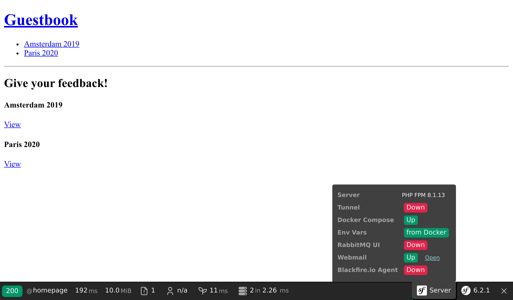
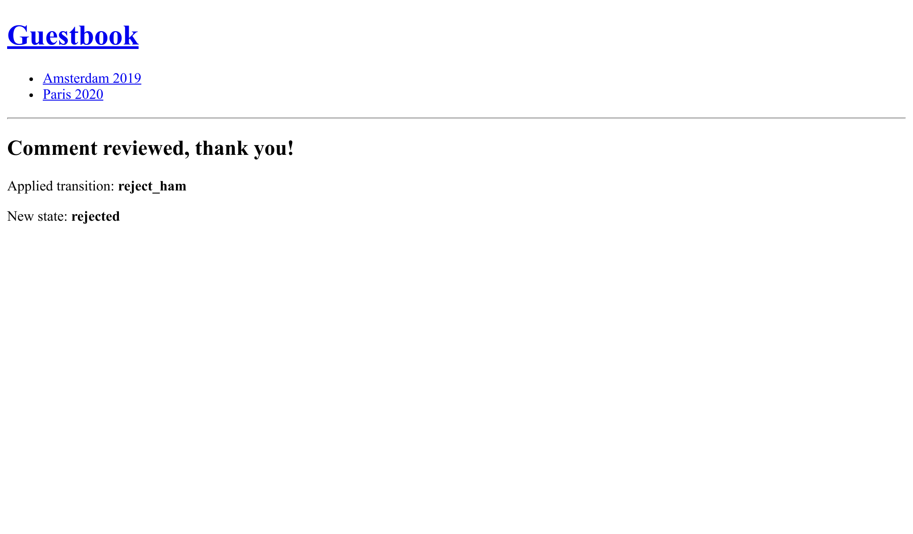

Envoyer des emails aux admins
=============================

.. index::
    single: Components;Mailer
    single: Mailer
    single: Emails

Pour s'assurer que les commentaires soient de bonne qualité, l'admin doit tous les modérer. Lorsqu'un commentaire est dans l'état ``ham`` ou ``potential_spam``, un *email* doit lui être envoyé avec deux liens : un pour l'accepter et un autre pour le rejeter.

Définir un email pour l'admin
------------------------------

Pour stocker l'email de l'admin, utilisez un paramètre de conteneur. Pour l'exemple, nous autorisons également son paramétrage grâce à une variable d'environnement (ce qui ne devrait pas être nécessaire dans la "vraie vie") :

.. code-block:: diff
    :caption: patch_file

    --- a/config/services.yaml
    +++ b/config/services.yaml
    @@ -5,6 +5,8 @@
     # https://symfony.com/doc/current/best_practices.html#use-parameters-for-application-configuration
     parameters:
         photo_dir: "%kernel.project_dir%/public/uploads/photos"
    +    default_admin_email: admin@example.com
    +    admin_email: "%env(string:default:default_admin_email:ADMIN_EMAIL)%"

     services:
         # default configuration for services in *this* file

Une variable d'environnement peut être "traitée" avant d'être utilisée. Ici, nous utilisons le processeur ``default`` afin d'utiliser la valeur du paramètre ``default_admin_email`` si la variable d'environnement ``ADMIN_EMAIL`` n'existe pas.

Envoyer une notification par email
----------------------------------

Pour envoyer un email, vous pouvez choisir entre plusieurs abstractions de classes d'``Email`` : depuis ``Message``, celle de plus bas niveau, à ``NotificationEmail``, celle de niveau le plus élevé. Vous utiliserez probablement la classe ``Email`` le plus souvent, mais ``NotificationEmail`` est le choix parfait pour les emails internes.

Dans le gestionnaire de messages, remplaçons la logique d'auto-validation :

.. code-block:: diff
    :caption: patch_file

    --- a/src/MessageHandler/CommentMessageHandler.php
    +++ b/src/MessageHandler/CommentMessageHandler.php
    @@ -7,6 +7,9 @@ use App\Repository\CommentRepository;
     use App\SpamChecker;
     use Doctrine\ORM\EntityManagerInterface;
     use Psr\Log\LoggerInterface;
    +use Symfony\Bridge\Twig\Mime\NotificationEmail;
    +use Symfony\Component\DependencyInjection\Attribute\Autowire;
    +use Symfony\Component\Mailer\MailerInterface;
     use Symfony\Component\Messenger\Attribute\AsMessageHandler;
     use Symfony\Component\Messenger\MessageBusInterface;
     use Symfony\Component\Workflow\WorkflowInterface;
    @@ -20,6 +23,8 @@ class CommentMessageHandler
             private CommentRepository $commentRepository,
             private MessageBusInterface $bus,
             private WorkflowInterface $commentStateMachine,
    +        private MailerInterface $mailer,
    +        #[Autowire('%admin_email%')] private string $adminEmail,
             private ?LoggerInterface $logger = null,
         ) {
         }
    @@ -42,8 +47,13 @@ class CommentMessageHandler
                 $this->entityManager->flush();
                 $this->bus->dispatch($message);
             } elseif ($this->commentStateMachine->can($comment, 'publish') || $this->commentStateMachine->can($comment, 'publish_ham')) {
    -            $this->commentStateMachine->apply($comment, $this->commentStateMachine->can($comment, 'publish') ? 'publish' : 'publish_ham');
    -            $this->entityManager->flush();
    +            $this->mailer->send((new NotificationEmail())
    +                ->subject('New comment posted')
    +                ->htmlTemplate('emails/comment_notification.html.twig')
    +                ->from($this->adminEmail)
    +                ->to($this->adminEmail)
    +                ->context(['comment' => $comment])
    +            );
             } elseif ($this->logger) {
                 $this->logger->debug('Dropping comment message', ['comment' => $comment->getId(), 'state' => $comment->getState()]);
             }

L'interface ``MailerInterface`` est le point d'entrée principal et permet d'envoyer des emails avec ``send()``.

Pour envoyer un email, nous avons besoin d'un expéditeur (l'en-tête   ``From``/``Sender``). Au lieu de le définir explicitement sur l'instance Email, définissez-le globalement :

.. code-block:: diff
    :caption: patch_file

    --- a/config/packages/mailer.yaml
    +++ b/config/packages/mailer.yaml
    @@ -1,3 +1,5 @@
     framework:
         mailer:
             dsn: '%env(MAILER_DSN)%'
    +        envelope:
    +            sender: "%admin_email%"

Hériter du template d'email de notification
--------------------------------------------

.. index::
    single: Twig;extends
    single: Twig;block
    single: Twig;url

Le template d'email de notification hérite du template d'email de notification par défaut fourni avec Symfony :

.. code-block:: html+twig
    :caption: templates/emails/comment_notification.html.twig

    

    
        Author: {{ comment.author }} 
        Email: {{ comment.email }} 
        State: {{ comment.state }} 

        

            {{ comment.text }}
        

    

    
        <spacer size="16"></spacer>
        <button href="{{ url('review_comment', { id: comment.id }) }}">Accept</button>
        <button href="{{ url('review_comment', { id: comment.id, reject: true }) }}">Reject</button>
    

Le template remplace quelques blocs pour personnaliser le message de l'email et pour ajouter des liens permettant à l'admin d'accepter ou de rejeter un commentaire. Tout argument de routage qui n'est pas un paramètre de routage valide est ajouté comme paramètre de l'URL (l'URL de rejet ressemble à ``/admin/comment/review/42?reject=true``).

Le template par défaut ``NotificationEmail`` utilise `Inky`_ au lieu de HTML pour générer les emails. Il permet de créer des emails responsives compatibles avec tous les clients de messagerie courants.

Pour une compatibilité maximale avec les clients de messagerie, la mise en page de base de la notification convertit les feuilles de style externes en CSS en ligne (via le package CSS inliner).

Ces deux fonctions font partie d'extensions Twig optionnelles qui doivent être installées :

.. code-block:: terminal

    $ symfony composer req "twig/cssinliner-extra:^3" "twig/inky-extra:^3"

Générer des URLs absolues dans une commande
---------------------------------------------

.. index::
    single: Twig;Link
    single: Link

Dans les emails, générez les URLs avec ``url()`` au lieu de ``path()`` puisque vous avez besoin qu'elles soient absolues (avec le schéma et l'hôte).

L'email est envoyé par le gestionnaire de message, dans un contexte console. Générer des URLs absolues dans un contexte web est plus facile car nous connaissons le schéma et le domaine de la page courante. Ce n'est pas le cas dans un contexte console.

Définissez le nom de domaine et le schéma à utiliser explicitement :

.. code-block:: diff
    :caption: patch_file

    --- a/config/services.yaml
    +++ b/config/services.yaml
    @@ -7,6 +7,8 @@ parameters:
         photo_dir: "%kernel.project_dir%/public/uploads/photos"
         default_admin_email: admin@example.com
         admin_email: "%env(string:default:default_admin_email:ADMIN_EMAIL)%"
    +    default_base_url: 'http://127.0.0.1'
    +    router.request_context.base_url: '%env(default:default_base_url:SYMFONY_DEFAULT_ROUTE_URL)%'

     services:
         # default configuration for services in *this* file

La variable d'environnement ``SYMFONY_DEFAULT_ROUTE_URL`` est automatiquement définie localement lors de l'utilisation de la commande ``symfony`` et déterminées en fonction de la configuration sur Platform.sh.

Lier une route à un contrôleur
--------------------------------

La route ``review_comment`` n'existe pas encore. Créons un contrôleur admin pour la gérer :

.. code-block:: php
    :caption: src/Controller/AdminController.php

    namespace App\Controller;

    use App\Entity\Comment;
    use App\Message\CommentMessage;
    use Doctrine\ORM\EntityManagerInterface;
    use Symfony\Bundle\FrameworkBundle\Controller\AbstractController;
    use Symfony\Component\HttpFoundation\Request;
    use Symfony\Component\HttpFoundation\Response;
    use Symfony\Component\Messenger\MessageBusInterface;
    use Symfony\Component\Routing\Annotation\Route;
    use Symfony\Component\Workflow\WorkflowInterface;
    use Twig\Environment;

    class AdminController extends AbstractController
    {
        public function __construct(
            private Environment $twig,
            private EntityManagerInterface $entityManager,
            private MessageBusInterface $bus,
        ) {
        }

        #[Route('/admin/comment/review/{id}', name: 'review_comment')]
        public function reviewComment(Request $request, Comment $comment, WorkflowInterface $commentStateMachine): Response
        {
            $accepted = !$request->query->get('reject');

            if ($commentStateMachine->can($comment, 'publish')) {
                $transition = $accepted ? 'publish' : 'reject';
            } elseif ($commentStateMachine->can($comment, 'publish_ham')) {
                $transition = $accepted ? 'publish_ham' : 'reject_ham';
            } else {
                return new Response('Comment already reviewed or not in the right state.');
            }

            $commentStateMachine->apply($comment, $transition);
            $this->entityManager->flush();

            if ($accepted) {
                $this->bus->dispatch(new CommentMessage($comment->getId()));
            }

            return new Response($this->twig->render('admin/review.html.twig', [
                'transition' => $transition,
                'comment' => $comment,
            ]));
        }
    }

L'URL permettant la validation du commentaire commence par ``/admin/``, afin qu'elle soit protégée par le pare-feu défini lors d'une étape précédente. L'admin doit se connecter pour accéder à cette ressource.

Au lieu de créer une instance de ``Response``, nous avons utilisé une méthode plus courte, fournie par la classe de base ``AbstractController``.

.. index::
    single: Twig;extends
    single: Twig;block

Une fois la validation terminée, un court template remercie l'admin pour son dur labeur :

.. code-block:: html+twig
    :caption: templates/admin/review.html.twig

    

    
        <h2>Comment reviewed, thank you!</h2>

        
Applied transition: <strong>{{ transition }}</strong>

        
New state: <strong>{{ comment.state }}</strong>

    

Utiliser un *mail catcher*
--------------------------

.. index::
    single: Docker;Mail Catcher

Au lieu d'utiliser un "vrai" serveur SMTP ou un fournisseur tiers pour envoyer des emails, utilisons un mail catcher. Un mail catcher fournit un serveur SMTP qui n'envoie pas vraiment les emails, mais les rend disponibles via une interface web. Heureusement, Symfony a déjà configuré ce mail catcher automatiquement pour nous :

.. code-block:: yaml
    :caption: docker-compose.override.yml
    :class: ignore

    services:
    ###> symfony/mailer ###
      mailer:
        image: schickling/mailcatcher
        ports: [1025, 1080]
    ###< symfony/mailer ###

Accéder au webmail
-------------------

.. index::
    single: Symfony CLI;open:local:webmail

Vous pouvez ouvrir le webmail depuis un terminal :

.. code-block:: terminal
    :class: ignore

    $ symfony open:local:webmail

Ou à partir de la web debug toolbar :

Soumettez un commentaire, vous devriez recevoir un email dans l'interface du webmail :

.. figure:: screenshots/webmail.png
    :alt: /
    :align: center
    :figclass: with-browser

Cliquez sur le titre de l'email dans l'interface, puis acceptez ou rejetez le commentaire comme bon vous semble :

Vérifiez les logs avec ``server:log`` si cela ne fonctionne pas comme prévu.

Gérer des scripts de longue durée
-----------------------------------

Le fait d'avoir des scripts de longue durée s'accompagne de comportements dont vous devez être conscient. Contrairement au modèle PHP utilisé pour les requêtes HTTP où chaque requête commence avec un nouvel état, le consumer du message s'exécute continuellement en arrière-plan. Chaque traitement d'un message hérite de l'état actuel, y compris le cache mémoire. Pour éviter tout problème avec Doctrine, ses entity managers sont automatiquement nettoyés après le traitement d'un message. Vous devriez vérifier si vos propres services doivent faire de même ou non.

Envoyer des emails en mode asynchrone
-------------------------------------

L'email envoyé dans le gestionnaire de message peut prendre un certain temps avant d'être envoyé. Il pourrait même générer une exception. Dans le cas où une exception serait levée lors du traitement d'un message, celui-ci sera réessayé. Mais au lieu d'essayer à nouveau de consommer le message de commentaire, il serait préférable de renvoyer l'email.

Nous savons déjà comment faire : envoyer l'email dans le bus.

Une instance de ``MailerInterface`` fait le gros du travail : lorsqu'un bus est défini, elle lui passe les emails au lieu de les envoyer directement. Aucun changement n'est nécessaire dans votre code.

Le bus envoie déjà les mails de manière asynchrone puisqu'il s'agit de la configuration par défaut du composant Messenger :

.. code-block:: yaml
    :caption: config/packages/messenger.yaml
    :emphasize-lines: 4
    :class: ignore

    framework:
        messenger:
            routing:
                Symfony\Component\Mailer\Messenger\SendEmailMessage: async
                Symfony\Component\Notifier\Message\ChatMessage: async
                Symfony\Component\Notifier\Message\SmsMessage: async

                # Route your messages to the transports
                App\Message\CommentMessage: async

Même si nous utilisons le même transport pour les commentaires et les emails, cela n'est pas obligatoirement le cas. Vous pouvez décider d'utiliser un autre transport pour gérer différentes priorités de messages par exemple. L'utilisation de différents transports vous donne également la possibilité d'avoir différents serveurs pour gérer les différents types de messages. C'est flexible, et cela vous donne la liberté de choisir.

Tester les emails
-----------------

Il y a plusieurs façons de tester les emails.

Vous pouvez écrire des tests unitaires si vous écrivez une classe par email (en héritant d'``Email`` ou de ``TemplatedEmail`` par exemple).

Cependant, les tests les plus courants que vous allez écrire sont des tests fonctionnels qui vérifient que certaines actions déclenchent un email, et probablement des tests sur le contenu des emails s'ils sont dynamiques.

Symfony est fourni avec des assertions qui facilitent de tels tests. Voici un exemple démontrant ses possibilités :

.. code-block:: php
    :class: ignore

    public function testMailerAssertions()
    {
        $client = static::createClient();
        $client->request('GET', '/');

        $this->assertEmailCount(1);
        $event = $this->getMailerEvent(0);
        $this->assertEmailIsQueued($event);

        $email = $this->getMailerMessage(0);
        $this->assertEmailHeaderSame($email, 'To', 'fabien@example.com');
        $this->assertEmailTextBodyContains($email, 'Bar');
        $this->assertEmailAttachmentCount($email, 1);
    }

Ces assertions fonctionnent lorsque les emails sont envoyés de façon synchrone ou asynchrone.

Envoyer des emails sur Platform.sh
----------------------------------

.. index::
    single: Platform.sh;Emails
    single: Platform.sh;Mailer
    single: Platform.sh;SMTP
    single: Emails

Il n'y a pas de configuration spécifique pour Platform.sh. Tous les comptes sont fournis avec un compte SendGrid qui est automatiquement utilisé pour envoyer les emails.

.. index::
    single: Symfony CLI;cloud:env:info

.. note::

    Par mesure de sécurité, les emails sont *uniquement* envoyés depuis la branche ``master`` par défaut. Activez SMTP explicitement sur les branches non-``master`` si vous êtes surs ce que vous faites :

    .. code-block:: terminal

        $ symfony cloud:env:info enable_smtp on

.. sidebar:: Aller plus loin

    * `Tutoriel SymfonyCasts sur Mailer`_ ;

    * La `documentation sur le langage de templating Inky`_ ;

    * Les `processeurs de variables d'environnement`_ ;

    * La `documentation du Mailer de Symfony`_ ;

    * La `documentation de Platform.sh sur les emails`_.

.. _`Inky`: https://get.foundation/emails/docs/inky.html
.. _`Tutoriel SymfonyCasts sur Mailer`: https://symfonycasts.com/screencast/mailer
.. _`documentation sur le langage de templating Inky`: https://get.foundation/emails/docs/inky.html
.. _`processeurs de variables d'environnement`: https://symfony.com/doc/current/configuration/env_var_processors.html
.. _`documentation du Mailer de Symfony`: https://symfony.com/doc/current/mailer.html
.. _`documentation de Platform.sh sur les emails`: https://symfony.com/doc/current/cloud/services/emails.html
