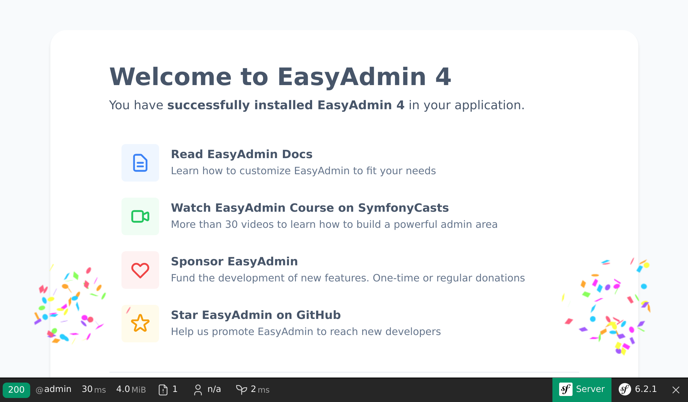

Configurer une interface d'administration
=========================================

.. index::
    single: EasyAdmin
    single: Admin
    single: Backend

L'ajout des prochaines conférences à la base de données est le travail des admins du projet. Une *interface d'administration* est une section protégée du site web où les *admins du projet* peuvent gérer les données du site web, modérer les commentaires, et plus encore.

Comment pouvons-nous le créer aussi rapidement ? En utilisant un *bundle* capable de générer une interface d'administration basée sur la structure du projet. EasyAdmin convient parfaitement.

Installer des dépendances supplémentaires
-------------------------------------------

Même si le package ``webapp`` a ajouté automatiquement de nombreux packages utiles, pour des fonctionnalités plus spécifiques, nous devons ajouter d'autres dépendances ? Avec Composer. En plus des paquets « standards » de Composer, nous travaillerons avec deux types de paquets « spéciaux » :

* *Composants Symfony* : Paquets qui implémentent les fonctionnalités de base et les abstractions de bas niveau dont la plupart des applications ont besoin (routage, console, client HTTP, mailer, cache, etc.) ;

* *Bundles Symfony* : Paquets qui ajoutent des fonctionnalités de haut niveau ou fournissent des intégrations avec des bibliothèques tierces (les bundles sont principalement créés par la communauté).

Ajoutez EasyAdmin comme dépendance du projet :

.. code-block:: terminal

    $ symfony composer req "admin:^4"

``admin`` est un alias pour le paquet ``easycorp/easyadmin-bundle``.

Les *alias* ne sont pas une fonctionnalité interne à Composer, mais un concept fourni par Symfony pour vous faciliter la vie. Les alias sont des raccourcis pour les paquets populaires de Composer. Vous voulez un ORM pour votre application ? Demandez ``orm``. Vous voulez développer une API ? Demandez ``api``. Ces alias font référence à un ou plusieurs paquets normaux de Composer. Ce sont des choix arbitraires faits par l’équipe principale de Symfony.

Un autre détail intéressant est que vous pouvez toujours omettre le symfony du nom des paquets. Demandez ``cache`` au lieu de ``symfony/cache``.

.. tip::

    Vous souvenez-vous que nous avons mentionné un plugin Composer nommé ``symfony/flex`` ? Les alias sont l’une de ses fonctionnalités.

Configurer EasyAdmin
--------------------

EasyAdmin crée automatiquement une section d'administration pour votre application basée sur des contrôleurs spécifiques.

Pour débuter avec EasyAdmin, commençons par générer un "tableau de bord d'administration" qui sera le point d'entrée principal pour gérer les données du site.

.. code-block:: terminal
    :class: answers(DashboardController||src/Controller/Admin/)

    $ symfony console make:admin:dashboard

Accepter les réponses par défaut crée le contrôleur suivant :

.. code-block:: php
    :caption: src/Controller/Admin/DashboardController.php
    :class: ignore

    namespace App\Controller\Admin;

    use EasyCorp\Bundle\EasyAdminBundle\Config\Dashboard;
    use EasyCorp\Bundle\EasyAdminBundle\Config\MenuItem;
    use EasyCorp\Bundle\EasyAdminBundle\Controller\AbstractDashboardController;
    use Symfony\Component\HttpFoundation\Response;
    use Symfony\Component\Routing\Annotation\Route;

    class DashboardController extends AbstractDashboardController
    {
        /**
         * @Route("/admin", name="admin")
         */
        public function index(): Response
        {
            return parent::index();
        }

        public function configureDashboard(): Dashboard
        {
            return Dashboard::new()
                ->setTitle('Guestbook');
        }

        public function configureMenuItems(): iterable
        {
            yield MenuItem::linktoDashboard('Dashboard', 'fa fa-home');
            // yield MenuItem::linkToCrud('The Label', 'icon class', EntityClass::class);
        }
    }

Par convention, les contrôleurs d'administration sont stockés dans leur propre espace de nom ``App\Controller\Admin``.

Accédez à l'interface d'administration générée grâce à l'URL ``/admin`` telle que configurée par la méthode ``index()`` (vous pouvez modifier l'URL comme bon vous semble) :

Boom ! Nous avons une belle interface d'administration, prête à être adaptée à nos besoins.

.. index::
    single: CRUD

L'étape suivante consiste à créer des contrôleurs pour gérer les conférences et les commentaires.

Dans le contrôleur du tableau de bord, vous avez peut-être remarqué la méthode ``configureMenuItems()`` qui contient un commentaire à propos de l'ajout de liens aux "CRUDs". "CRUD" est un acronyme pour "Create, Read, Update and Delete", les quatre opérations de base que vous allez effectuer sur une entité. C'est exactement ce que nous voulons que notre page d'administration fasse pour nous. EasyAdmin facilite encore plus les choses en prenant en charge les fonctionnalités de filtre et de recherche.

Générons un CRUD pour les conférences :

.. code-block:: terminal
    :class: answers(1||src/Controller/Admin/||App\\Controller\\Admin)

    $ symfony console make:admin:crud

Sélectionnez ``1`` pour créer une interface d'administration pour les conférences et utiliser les valeurs par défaut pour les autres questions. Le fichier suivant devrait être généré :

.. code-block:: php
    :caption: src/Controller/Admin/ConferenceCrudController.php
    :class: ignore

    namespace App\Controller\Admin;

    use App\Entity\Conference;
    use EasyCorp\Bundle\EasyAdminBundle\Controller\AbstractCrudController;

    class ConferenceCrudController extends AbstractCrudController
    {
        public static function getEntityFqcn(): string
        {
            return Conference::class;
        }

        /*
        public function configureFields(string $pageName): iterable
        {
            return [
                IdField::new('id'),
                TextField::new('title'),
                TextEditorField::new('description'),
            ];
        }
        */
    }

Faites la même chose pour les commentaires :

.. code-block:: terminal
    :class: answers(0||src/Controller/Admin/||App\\Controller\\Admin)

    $ symfony console make:admin:crud

La dernière étape consiste à relier les CRUDs d'administration des conférences et des commentaires au tableau de bord :

.. code-block:: diff
    :caption: patch_file

    --- a/src/Controller/Admin/DashboardController.php
    +++ b/src/Controller/Admin/DashboardController.php
    @@ -2,6 +2,8 @@

     namespace App\Controller\Admin;

    +use App\Entity\Comment;
    +use App\Entity\Conference;
     use EasyCorp\Bundle\EasyAdminBundle\Config\Dashboard;
     use EasyCorp\Bundle\EasyAdminBundle\Config\MenuItem;
     use EasyCorp\Bundle\EasyAdminBundle\Controller\AbstractDashboardController;
    @@ -40,7 +42,8 @@ class DashboardController extends AbstractDashboardController

         public function configureMenuItems(): iterable
         {
    -        yield MenuItem::linkToDashboard('Dashboard', 'fa fa-home');
    -        // yield MenuItem::linkToCrud('The Label', 'fas fa-list', EntityClass::class);
    +        yield MenuItem::linktoRoute('Back to the website', 'fas fa-home', 'homepage');
    +        yield MenuItem::linkToCrud('Conferences', 'fas fa-map-marker-alt', Conference::class);
    +        yield MenuItem::linkToCrud('Comments', 'fas fa-comments', Comment::class);
         }
     }

Nous avons surchargé la méthode ``configureMenuItems()`` pour ajouter les éléments de menu avec les icônes adéquates pour les conférences et les commentaires, et pour ajouter un lien de retour vers la page d'accueil du site.

EasyAdmin expose une API pour faciliter les liaisons avec les CRUDs des entités via la méthode ``MenuItem::linkToRoute()``.

Le tableau de bord principal est vide pour le moment. C'est ici que vous pouvez afficher certaines statistiques, ou n'importe quelle information pertinente. Comme nous n'avons rien d'important à y afficher, redirigeons cette page vers la liste des conférences :

.. code-block:: diff
    :caption: patch_file

    --- a/src/Controller/Admin/DashboardController.php
    +++ b/src/Controller/Admin/DashboardController.php
    @@ -7,6 +7,7 @@ use App\Entity\Conference;
     use EasyCorp\Bundle\EasyAdminBundle\Config\Dashboard;
     use EasyCorp\Bundle\EasyAdminBundle\Config\MenuItem;
     use EasyCorp\Bundle\EasyAdminBundle\Controller\AbstractDashboardController;
    +use EasyCorp\Bundle\EasyAdminBundle\Router\AdminUrlGenerator;
     use Symfony\Component\HttpFoundation\Response;
     use Symfony\Component\Routing\Annotation\Route;

    @@ -15,7 +16,10 @@ class DashboardController extends AbstractDashboardController
         #[Route('/admin', name: 'admin')]
         public function index(): Response
         {
    -        return parent::index();
    +        $routeBuilder = $this->container->get(AdminUrlGenerator::class);
    +        $url = $routeBuilder->setController(ConferenceCrudController::class)->generateUrl();
    +
    +        return $this->redirect($url);

             // Option 1. You can make your dashboard redirect to some common page of your backend
             //

Quand nous affichons les relations entre les entités (la conférence liée à un commentaire), EasyAdmin essaie d'utiliser la représentation textuelle de la conférence. Par défaut, il s'appuie sur une convention qui utilise le nom de l'entité et la clé primaire (par exemple ``Conference #1``) si l'entité ne définit pas la méthode "magique" ``__toString()``. Pour rendre l'affichage plus parlant, ajoutez cette méthode sur la classe ``Conference`` :

.. code-block:: diff
    :caption: patch_file

    --- a/src/Entity/Conference.php
    +++ b/src/Entity/Conference.php
    @@ -32,6 +32,11 @@ class Conference
             $this->comments = new ArrayCollection();
         }

    +    public function __toString(): string
    +    {
    +        return $this->city.' '.$this->year;
    +    }
    +
         public function getId(): ?int
         {
             return $this->id;

Faites de même pour la classe ``Comment`` :

.. code-block:: diff
    :caption: patch_file

    --- a/src/Entity/Comment.php
    +++ b/src/Entity/Comment.php
    @@ -33,6 +33,11 @@ class Comment
         #[ORM\Column(length: 255, nullable: true)]
         private ?string $photoFilename = null;

    +    public function __toString(): string
    +    {
    +        return (string) $this->getEmail();
    +    }
    +
         public function getId(): ?int
         {
             return $this->id;

Vous pouvez maintenant ajouter/modifier/supprimer des conférences directement depuis l'interface d'administration. Jouez avec et ajoutez au moins une conférence.

.. figure:: screenshots/easy-admin.png
    :alt: /admin
    :align: center
    :figclass: with-browser

Ajoutez quelques commentaires sans photos. Réglez la date manuellement pour l'instant ; nous remplirons la colonne ``createdAt`` automatiquement dans une étape ultérieure.

.. figure:: screenshots/easy-admin-comments.png
    :alt: /admin?crudAction=index&crudId=2bfa220&menuIndex=2&submenuIndex=-1
    :align: center
    :figclass: with-browser

Personnaliser EasyAdmin
-----------------------

L'interface d'administration par défaut fonctionne bien, mais elle peut être personnalisée de plusieurs façons pour améliorer son utilisation. Faisons quelques changements simples pour montrer quelques possibilités :

.. code-block:: diff
    :caption: patch_file

    --- a/src/Controller/Admin/CommentCrudController.php
    +++ b/src/Controller/Admin/CommentCrudController.php
    @@ -3,7 +3,15 @@
     namespace App\Controller\Admin;

     use App\Entity\Comment;
    +use EasyCorp\Bundle\EasyAdminBundle\Config\Crud;
    +use EasyCorp\Bundle\EasyAdminBundle\Config\Filters;
     use EasyCorp\Bundle\EasyAdminBundle\Controller\AbstractCrudController;
    +use EasyCorp\Bundle\EasyAdminBundle\Field\AssociationField;
    +use EasyCorp\Bundle\EasyAdminBundle\Field\DateTimeField;
    +use EasyCorp\Bundle\EasyAdminBundle\Field\EmailField;
    +use EasyCorp\Bundle\EasyAdminBundle\Field\TextareaField;
    +use EasyCorp\Bundle\EasyAdminBundle\Field\TextField;
    +use EasyCorp\Bundle\EasyAdminBundle\Filter\EntityFilter;

     class CommentCrudController extends AbstractCrudController
     {
    @@ -12,14 +20,44 @@ class CommentCrudController extends AbstractCrudController
             return Comment::class;
         }

    -    /*
    +    public function configureCrud(Crud $crud): Crud
    +    {
    +        return $crud
    +            ->setEntityLabelInSingular('Conference Comment')
    +            ->setEntityLabelInPlural('Conference Comments')
    +            ->setSearchFields(['author', 'text', 'email'])
    +            ->setDefaultSort(['createdAt' => 'DESC'])
    +        ;
    +    }
    +
    +    public function configureFilters(Filters $filters): Filters
    +    {
    +        return $filters
    +            ->add(EntityFilter::new('conference'))
    +        ;
    +    }
    +
         public function configureFields(string $pageName): iterable
         {
    -        return [
    -            IdField::new('id'),
    -            TextField::new('title'),
    -            TextEditorField::new('description'),
    -        ];
    +        yield AssociationField::new('conference');
    +        yield TextField::new('author');
    +        yield EmailField::new('email');
    +        yield TextareaField::new('text')
    +            ->hideOnIndex()
    +        ;
    +        yield TextField::new('photoFilename')
    +            ->onlyOnIndex()
    +        ;
    +
    +        $createdAt = DateTimeField::new('createdAt')->setFormTypeOptions([
    +            'html5' => true,
    +            'years' => range(date('Y'), date('Y') + 5),
    +            'widget' => 'single_text',
    +        ]);
    +        if (Crud::PAGE_EDIT === $pageName) {
    +            yield $createdAt->setFormTypeOption('disabled', true);
    +        } else {
    +            yield $createdAt;
    +        }
         }
    -    */
     }

Pour personnaliser la section ``Commentaire``, lister les champs de manière explicite dans la méthode ``configureFields()`` nous permet de les ordonner comme nous le souhaitons. Certains champs bénéficient d'une configuration supplémentaire, comme masquer le champ texte sur la page d'index.

Les méthodes ``configureFilters()`` définissent quels filtres apparaissent au dessus du champ de recherche.

.. figure:: screenshots/easy-admin-filter.png
    :alt: /admin?crudAction=index&crudId=2bfa220&menuIndex=2&submenuIndex=-1
    :align: center
    :figclass: with-browser

Ces personnalisations ne sont qu'une petite introduction aux possibilités offertes par EasyAdmin.

Jouez avec l'interface d'administration, filtrez les commentaires par conférence, ou recherchez des commentaires par email par exemple. Le seul problème, c'est que n'importe qui peut accéder à cette interface. Ne vous inquiétez pas, nous la sécuriserons dans une prochaine étape.

.. code-block:: terminal
    :class: hide

    $ symfony run psql -c "TRUNCATE conference RESTART IDENTITY CASCADE"

.. sidebar:: Aller plus loin

    * `Documentation d'EasyAdmin`_ ;

    * `Configuration de référence du framework Symfony`_.

    * `Les méthodes magiques PHP`_.

.. _`Documentation d'EasyAdmin`: https://symfony.com/bundles/EasyAdminBundle/4.x/index.html
.. _`Configuration de référence du framework Symfony`: https://symfony.com/doc/current/reference/configuration/framework.html
.. _`Les méthodes magiques PHP`: https://www.php.net/manual/en/language.oop5.magic.php
