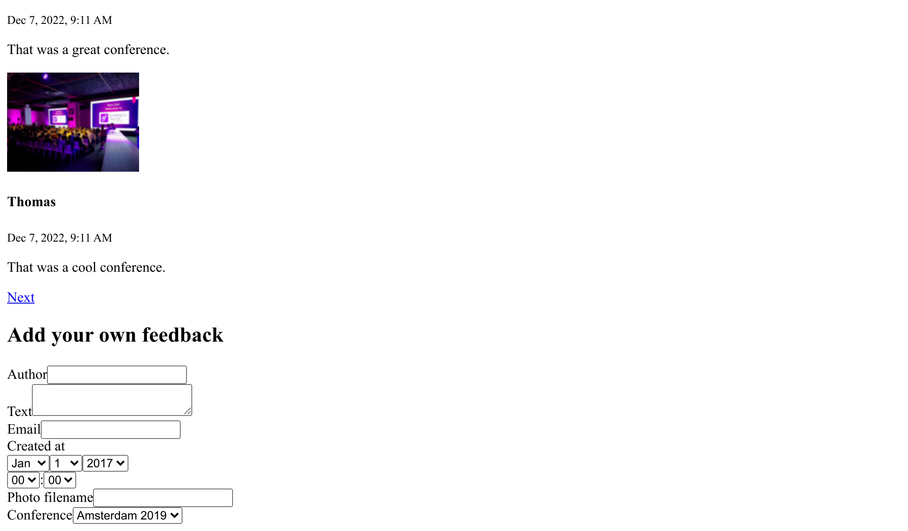
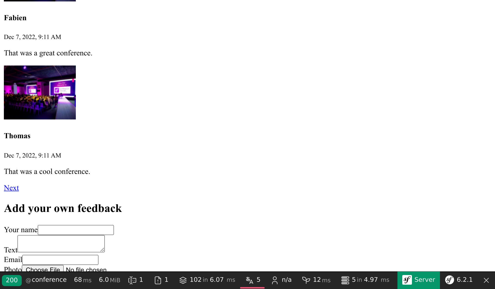
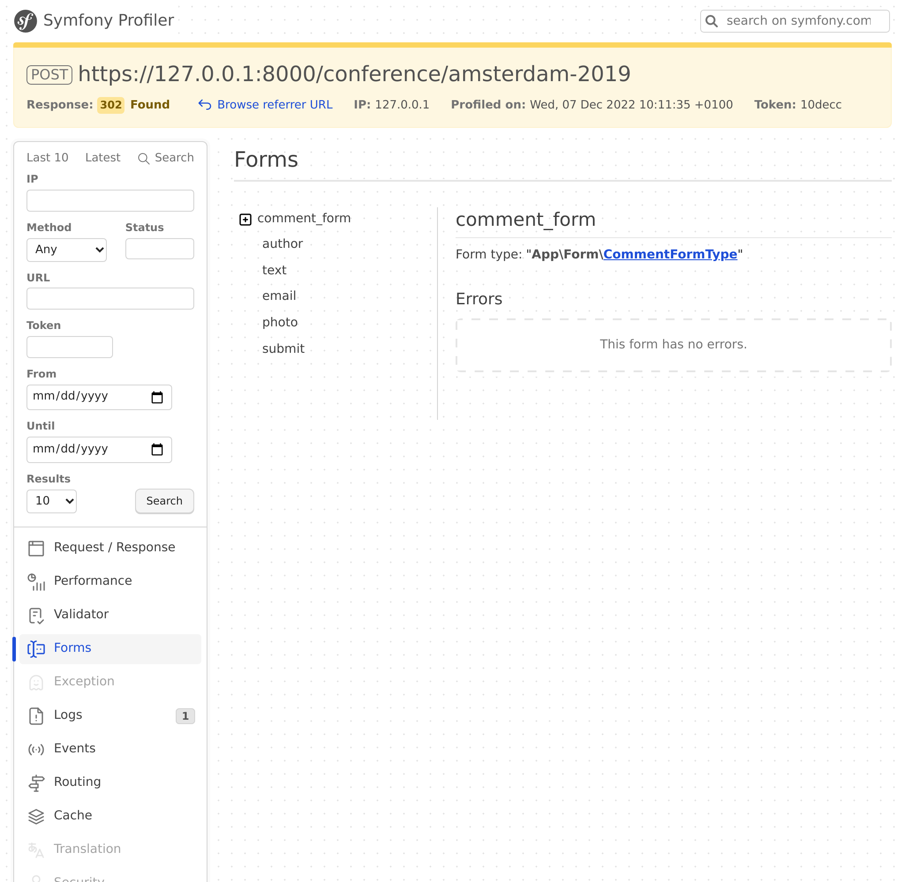

Accettare feedback con i form
=============================

.. index::
    single: Components;Form
    single: Form

È arrivato il momento di permettere ai nostri partecipanti di lasciare un'opinione sulla conferenza. Potranno contribuire con i loro commenti attraverso un *form HTML*.

Generare un form type
---------------------

.. index::
    single: Command;make:form

Usare MakerBundle per generare una classe form:

.. code-block:: terminal

    $ symfony console make:form CommentFormType Comment

.. code-block:: text
    :class: ignore
    :emphasize-lines: 1

     created: src/Form/CommentFormType.php

      Success!

     Next: Add fields to your form and start using it.
     Find the documentation at https://symfony.com/doc/current/forms.html

La classe ``App\Form\CommentFormType`` definisce un form per l'entity ``App\Entity\Comment``:

.. code-block:: php
    :caption: src/Form/CommentFormType.php
    :class: ignore

    namespace App\Form;

    use App\Entity\Comment;
    use Symfony\Component\Form\AbstractType;
    use Symfony\Component\Form\FormBuilderInterface;
    use Symfony\Component\OptionsResolver\OptionsResolver;

    class CommentFormType extends AbstractType
    {
        public function buildForm(FormBuilderInterface $builder, array $options)
        {
            $builder
                ->add('author')
                ->add('text')
                ->add('email')
                ->add('createdAt')
                ->add('photoFilename')
                ->add('conference')
            ;
        }

        public function configureOptions(OptionsResolver $resolver)
        {
            $resolver->setDefaults([
                'data_class' => Comment::class,
            ]);
        }
    }

Un `form type`_ descrive i *campi del form* legati a un modello. Esegue la conversione tra dati inviati e proprietà della classe del modello. Per impostazione predefinita, Symfony usa i metadati dell'entity ``Comment``, come i metadati di Doctrine, per indovinare la configurazione di ogni campo. Per esempio, il campo ``text`` verrà visualizzato come ``textarea`` durante il render, poiché usa una colonna più grande nel database.

Mostrare un form
----------------

Per mostrare il form all'utente, creare il form nel controller e passarlo al template:

.. code-block:: diff
    :caption: patch_file
    :emphasize-lines: 19,29

    --- a/src/Controller/ConferenceController.php
    +++ b/src/Controller/ConferenceController.php
    @@ -2,7 +2,9 @@

     namespace App\Controller;

    +use App\Entity\Comment;
     use App\Entity\Conference;
    +use App\Form\CommentFormType;
     use App\Repository\CommentRepository;
     use App\Repository\ConferenceRepository;
     use Symfony\Bundle\FrameworkBundle\Controller\AbstractController;
    @@ -23,6 +25,9 @@ class ConferenceController extends AbstractController
         #[Route('/conference/{slug}', name: 'conference')]
         public function show(Request $request, Conference $conference, CommentRepository $commentRepository): Response
         {
    +        $comment = new Comment();
    +        $form = $this->createForm(CommentFormType::class, $comment);
    +
             $offset = max(0, $request->query->getInt('offset', 0));
             $paginator = $commentRepository->getCommentPaginator($conference, $offset);

    @@ -31,6 +36,7 @@ class ConferenceController extends AbstractController
                 'comments' => $paginator,
                 'previous' => $offset - CommentRepository::PAGINATOR_PER_PAGE,
                 'next' => min(count($paginator), $offset + CommentRepository::PAGINATOR_PER_PAGE),
    +            'comment_form' => $form,
             ]);
         }
     }

Non dovreste mai istanziare direttamente il form type. Piuttosto, utilizzate il metodo ``createForm()``. Questo metodo fa parte di ``AbstractController`` e facilita la creazione dei form.

.. index::
    single: Twig;form

Quando si passa un form a un template, utilizzare il metodo ``createView()`` per convertire i dati in un formato adatto ai template stessi.

Si può mostrare un form all'interno di un template tramite la funzione ``form`` di Twig:

.. code-block:: diff
    :caption: patch_file
    :emphasize-lines: 10

    --- a/templates/conference/show.html.twig
    +++ b/templates/conference/show.html.twig
    @@ -30,4 +30,8 @@
         
             
No comments have been posted yet for this conference.

         
    +
    +    <h2>Add your own feedback</h2>
    +
    +    {{ form(comment_form) }}
     

Quando si aggiorna una pagina della conferenza nel browser, si noti che ogni campo del form mostra il widget HTML corretto (il tipo di dato viene derivato dal modello):

La funzione ``form()`` genera il form HTML in base alle informazioni definite nel form type. Aggiunge ``enctype=multipart/form-data`` al tag ``<form>`` se è incluso un campo di input per il caricamento di file. Inoltre, in caso di errori, si occupa di visualizzarne i relativi messaggi. Tutto può essere personalizzato sovrascrivendo i template predefiniti, ma non ne avremo bisogno per questo progetto.

Personalizzare un Form Type
---------------------------

Anche se i campi del form sono configurati in base alla loro controparte del modello, è possibile personalizzare la configurazione predefinita direttamente nella classe del form type:

.. code-block:: diff
    :caption: patch_file

    --- a/src/Form/CommentFormType.php
    +++ b/src/Form/CommentFormType.php
    @@ -4,20 +4,31 @@ namespace App\Form;

     use App\Entity\Comment;
     use Symfony\Component\Form\AbstractType;
    +use Symfony\Component\Form\Extension\Core\Type\EmailType;
    +use Symfony\Component\Form\Extension\Core\Type\FileType;
    +use Symfony\Component\Form\Extension\Core\Type\SubmitType;
     use Symfony\Component\Form\FormBuilderInterface;
     use Symfony\Component\OptionsResolver\OptionsResolver;
    +use Symfony\Component\Validator\Constraints\Image;

     class CommentFormType extends AbstractType
     {
         public function buildForm(FormBuilderInterface $builder, array $options): void
         {
             $builder
    -            ->add('author')
    +            ->add('author', null, [
    +                'label' => 'Your name',
    +            ])
                 ->add('text')
    -            ->add('email')
    -            ->add('createdAt')
    -            ->add('photoFilename')
    -            ->add('conference')
    +            ->add('email', EmailType::class)
    +            ->add('photo', FileType::class, [
    +                'required' => false,
    +                'mapped' => false,
    +                'constraints' => [
    +                    new Image(['maxSize' => '1024k'])
    +                ],
    +            ])
    +            ->add('submit', SubmitType::class)
             ;
         }

Da notare che abbiamo aggiunto un pulsante di invio (che ci permette di continuare ad usare l'espressione semplice ``{{ form(comment_form) }}`` nel template).

Non tutti i campi possono essere configurati automaticamente, come ad esempio ``photoFilename``. L'entity ``Comment`` ha bisogno di salvare il nome del file della foto, ma il form deve occuparsi del caricamento del file stesso. Per gestire questo caso, abbiamo aggiunto un campo chiamato ``photo``, con proprietà ``mapped`` falsa: non sarà mappato su nessuna proprietà di ``Comment``. Lo gestiremo manualmente per implementare alcune logiche specifiche (come la memorizzazione della foto caricata sul disco).

Come esempio di personalizzazione, abbiamo modificato l'etichetta predefinita per alcuni campi.

Convalidare i modelli
---------------------

Il Form Type configura il rendering del form (tramite alcune validazioni HTML5). Ecco qui il codice HTML generato:

.. code-block:: html
    :class: ignore

    <form name="comment_form" method="post" enctype="multipart/form-data">
        

            

                <label for="comment_form_author" class="required">Your name</label>
                <input type="text" id="comment_form_author" name="comment_form[author]" required="required" maxlength="255" />
            

            

                <label for="comment_form_text" class="required">Text</label>
                <textarea id="comment_form_text" name="comment_form[text]" required="required"></textarea>
            

            

                <label for="comment_form_email" class="required">Email</label>
                <input type="email" id="comment_form_email" name="comment_form[email]" required="required" />
            

            

                <label for="comment_form_photo">Photo</label>
                <input type="file" id="comment_form_photo" name="comment_form[photo]" />
            

            

                <button type="submit" id="comment_form_submit" name="comment_form[submit]">Submit</button>
            

            <input type="hidden" id="comment_form__token" name="comment_form[_token]" value="DwqsEanxc48jofxsqbGBVLQBqlVJ_Tg4u9-BL1Hjgac" />
        

    </form>

Il form usa il campo ``email`` per l'e-mail di commento e rende la maggior parte dei campi ``required``. Si noti che il form contiene anche un campo ``_token`` nascosto per proteggere dagli `attacchi CSRF`_.

Ma se l'invio del form aggira la validazione HTML (utilizzando un client HTTP che non applica queste regole di validazione, come cURL), dei dati non validi potrebbero arrivare al server.

Dobbiamo aggiungere anche alcuni vincoli di validazione al modello dati di ``Comment``:

.. code-block:: diff
    :caption: patch_file

    --- a/src/Entity/Comment.php
    +++ b/src/Entity/Comment.php
    @@ -5,6 +5,7 @@ namespace App\Entity;
     use App\Repository\CommentRepository;
     use Doctrine\DBAL\Types\Types;
     use Doctrine\ORM\Mapping as ORM;
    +use Symfony\Component\Validator\Constraints as Assert;

     #[ORM\Entity(repositoryClass: CommentRepository::class)]
     #[ORM\HasLifecycleCallbacks]
    @@ -16,12 +17,16 @@ class Comment
         private ?int $id = null;

         #[ORM\Column(length: 255)]
    +    #[Assert\NotBlank]
         private ?string $author = null;

         #[ORM\Column(type: Types::TEXT)]
    +    #[Assert\NotBlank]
         private ?string $text = null;

         #[ORM\Column(length: 255)]
    +    #[Assert\NotBlank]
    +    #[Assert\Email]
         private ?string $email = null;

         #[ORM\Column]

Gestire un form
---------------

Il codice che abbiamo scritto finora è sufficiente per visualizzare il form.

Ora dovremmo gestire l'invio del form e il salvataggio delle sue informazioni nel database tramite il controller:

.. code-block:: diff
    :caption: patch_file

    --- a/src/Controller/ConferenceController.php
    +++ b/src/Controller/ConferenceController.php
    @@ -7,6 +7,7 @@ use App\Entity\Conference;
     use App\Form\CommentFormType;
     use App\Repository\CommentRepository;
     use App\Repository\ConferenceRepository;
    +use Doctrine\ORM\EntityManagerInterface;
     use Symfony\Bundle\FrameworkBundle\Controller\AbstractController;
     use Symfony\Component\HttpFoundation\Request;
     use Symfony\Component\HttpFoundation\Response;
    @@ -14,6 +15,11 @@ use Symfony\Component\Routing\Annotation\Route;

     class ConferenceController extends AbstractController
     {
    +    public function __construct(
    +        private EntityManagerInterface $entityManager,
    +    ) {
    +    }
    +
         #[Route('/', name: 'homepage')]
         public function index(ConferenceRepository $conferenceRepository): Response
         {
    @@ -27,6 +33,15 @@ class ConferenceController extends AbstractController
         {
             $comment = new Comment();
             $form = $this->createForm(CommentFormType::class, $comment);
    +        $form->handleRequest($request);
    +        if ($form->isSubmitted() && $form->isValid()) {
    +            $comment->setConference($conference);
    +
    +            $this->entityManager->persist($comment);
    +            $this->entityManager->flush();
    +
    +            return $this->redirectToRoute('conference', ['slug' => $conference->getSlug()]);
    +        }

             $offset = max(0, $request->query->getInt('offset', 0));
             $paginator = $commentRepository->getCommentPaginator($conference, $offset);

All'invio del form, l'oggetto ``Comment`` viene aggiornato in base ai dati inviati.

La conferenza deve essere la stessa dell'URL (l'abbiamo rimossa dal form).

Se il form non è valido, viene mostrata la pagina, ma ora il form conterrà i valori inviati e i messaggi di errore in modo che possano essere mostrati all'utente.

Proviamo il form. Dovrebbe funzionare bene e i dati dovrebbero essere memorizzati nel database (controllare nel pannello amministrativo). Ma c'è un problema: le foto. Non funzionano perché non le abbiamo ancora gestite nel controller.

Caricare file
-------------

Le foto che vogliamo caricare devono essere salvate sul disco locale, in un luogo accessibile dal frontend, in modo da poterle mostrare nella pagina della conferenza. Le memorizzeremo nella cartella ``public/uploads/photos``.

.. index::
    single: Attribute;Autowire
    single: Autowire

Poiché non vogliamo scrivere il percorso della directory direttamente nel codice, abbiamo bisogno di un modo per poterlo memorizzare globalmente nella configurazione. Il Container di Symfony è in grado di memorizzare anche *parametri*  oltre che servizi. I parametri sono valori scalari utilizzabili per configurare i servizi:

.. code-block:: diff
    :caption: patch_file

    --- a/config/services.yaml
    +++ b/config/services.yaml
    @@ -4,6 +4,7 @@
     # Put parameters here that don't need to change on each machine where the app is deployed
     # https://symfony.com/doc/current/best_practices.html#use-parameters-for-application-configuration
     parameters:
    +    photo_dir: "%kernel.project_dir%/public/uploads/photos"

     services:
         # default configuration for services in *this* file

Abbiamo già visto come i servizi sono iniettati automaticamente negli argomenti del costruttore. Per i parametri del container, possiamo iniettarli esplicitamente attraverso l'attributo ``Autowire``.

Ora sappiamo tutto ciò che ci serve per implementare la logica richiesta al fine di memorizzare il file caricato nella sua destinazione finale:

.. code-block:: diff
    :caption: patch_file

    --- a/src/Controller/ConferenceController.php
    +++ b/src/Controller/ConferenceController.php
    @@ -9,6 +9,8 @@ use App\Repository\CommentRepository;
     use App\Repository\ConferenceRepository;
     use Doctrine\ORM\EntityManagerInterface;
     use Symfony\Bundle\FrameworkBundle\Controller\AbstractController;
    +use Symfony\Component\DependencyInjection\Attribute\Autowire;
    +use Symfony\Component\HttpFoundation\File\Exception\FileException;
     use Symfony\Component\HttpFoundation\Request;
     use Symfony\Component\HttpFoundation\Response;
     use Symfony\Component\Routing\Annotation\Route;
    @@ -29,13 +31,26 @@ class ConferenceController extends AbstractController
         }

         #[Route('/conference/{slug}', name: 'conference')]
    -    public function show(Request $request, Conference $conference, CommentRepository $commentRepository): Response
    -    {
    +    public function show(
    +        Request $request,
    +        Conference $conference,
    +        CommentRepository $commentRepository,
    +        #[Autowire('%photo_dir%')] string $photoDir,
    +    ): Response {
             $comment = new Comment();
             $form = $this->createForm(CommentFormType::class, $comment);
             $form->handleRequest($request);
             if ($form->isSubmitted() && $form->isValid()) {
                 $comment->setConference($conference);
    +            if ($photo = $form['photo']->getData()) {
    +                $filename = bin2hex(random_bytes(6)).'.'.$photo->guessExtension();
    +                try {
    +                    $photo->move($photoDir, $filename);
    +                } catch (FileException $e) {
    +                    // unable to upload the photo, give up
    +                }
    +                $comment->setPhotoFilename($filename);
    +            }

                 $this->entityManager->persist($comment);
                 $this->entityManager->flush();

Per gestire il caricamento delle foto, creiamo un nome casuale per il file. Poi, spostiamo il file caricato nella sua posizione finale (la cartella delle foto). Infine, salviamo il nome del file nell'oggetto Comment.

Provate a caricare un file PDF invece di una foto. Dovreste vedere i messaggi di errore in azione. L'aspetto è piuttosto brutto al momento, ma non preoccupatevi: tutto diventerà bello in pochi passi, quando lavoreremo al design del sito. Per i form, cambieremo una linea di configurazione per applicare lo stile a tutti gli elementi.

Risolvere gli errori sui form
-----------------------------

Quando un form viene inviato e qualcosa non funziona correttamente, usare il pannello "Form" del Profiler. Fornisce informazioni sul form, su tutte le sue opzioni, sui dati inviati e su come vengono convertiti internamente. Se il form contiene degli errori, saranno elencati anche questi ultimi.

Il flusso tipico di lavoro dei form si svolge in questo modo:

* Il form viene mostrato su una pagina;

* L'utente invia il form tramite una richiesta POST;

* Il server reindirizza l'utente ad un'altra pagina o alla stessa pagina.

Ma come si può accedere al profiler per una richiesta di invio di successo? Poiché la pagina viene immediatamente reindirizzata, non vedremo mai la barra degli strumenti di debug per la richiesta POST. Nessun problema: nella pagina reindirizzata, passare sopra la parte verde "200" a sinistra. Dovreste vedere il redirect "302" con un link al profilo (tra parentesi).

.. figure:: screenshots/form-wdt.png
    :alt: /conference/amsterdam-2019
    :align: center
    :figclass: with-browser

Clicchiamolo per accedere al profilo della richiesta POST e andiamo al pannello "Form":

.. code-block:: terminal
    :class: hide

    $ rm -rf var/cache

Visualizzare le foto caricate nel pannello amministrativo
---------------------------------------------------------

Il pannello amministrativo sta visualizzando il nome del file della foto, ma noi vogliamo vedere la foto vera e propria:

.. code-block:: diff
    :caption: patch_file

    --- a/src/Controller/Admin/CommentCrudController.php
    +++ b/src/Controller/Admin/CommentCrudController.php
    @@ -9,6 +9,7 @@ use EasyCorp\Bundle\EasyAdminBundle\Controller\AbstractCrudController;
     use EasyCorp\Bundle\EasyAdminBundle\Field\AssociationField;
     use EasyCorp\Bundle\EasyAdminBundle\Field\DateTimeField;
     use EasyCorp\Bundle\EasyAdminBundle\Field\EmailField;
    +use EasyCorp\Bundle\EasyAdminBundle\Field\ImageField;
     use EasyCorp\Bundle\EasyAdminBundle\Field\TextareaField;
     use EasyCorp\Bundle\EasyAdminBundle\Field\TextField;
     use EasyCorp\Bundle\EasyAdminBundle\Filter\EntityFilter;
    @@ -45,7 +46,9 @@ class CommentCrudController extends AbstractCrudController
             yield TextareaField::new('text')
                 ->hideOnIndex()
             ;
    -        yield TextField::new('photoFilename')
    +        yield ImageField::new('photoFilename')
    +            ->setBasePath('/uploads/photos')
    +            ->setLabel('Photo')
                 ->onlyOnIndex()
             ;

Escludere da Git le foto caricate
---------------------------------

Non fare ancora commit! Non vogliamo memorizzare le immagini caricate nel repository git. Aggiungete la cartella ``/public/uploads`` al file ``.gitignore``:

.. code-block:: diff
    :caption: patch_file

    --- a/.gitignore
    +++ b/.gitignore
    @@ -1,3 +1,4 @@
    +/public/uploads

     ###> symfony/framework-bundle ###
     /.env.local

Salvare i file caricati sui server di produzione
------------------------------------------------

L'ultimo passo è quello di salvare i file caricati sui server di produzione. Perché dovremmo fare qualcosa di speciale? Perché la maggior parte delle piattaforme cloud moderne utilizzano container di sola lettura per vari motivi. Platform.sh non fa eccezione.

Non tutto è di sola lettura in un progetto Symfony. Cerchiamo di generare più cache possibile quando si costruisce il container (durante la fase di warmup della cache), ma Symfony deve comunque essere in grado di scrivere da qualche parte la cache dell'utente, i log, le sessioni (se memorizzate su filesystem) e altro ancora.

Guardando in ``.platform.app.yaml``, si può vedere che c'è già un *mount* scrivibile per la cartella ``var/``. La cartella ``var/`` è l'unica cartella in cui Symfony scrive (cache, log, ...).

Creiamo un nuovo mount per le foto caricate:

.. code-block:: diff
    :caption: patch_file

    --- a/.platform.app.yaml
    +++ b/.platform.app.yaml
    @@ -35,6 +35,7 @@ web:

     mounts:
         "/var": { source: local, source_path: var }
    +    "/public/uploads": { source: local, source_path: uploads }
         

     relationships:

Ora si può eseguire il deploy del codice e le foto saranno memorizzate nella cartella ``public/uploads/``, come nella nostra versione locale.

.. sidebar:: Andare oltre

    * `Guida ai Form su SymfonyCasts`_;

    * Come `personalizzare il rendering dei form di Symfony in HTML`_;

    * `Validazione dei form di Symfony`_;

    * `Riferimento ai Form Type di Symfony`_;

    * La `documentazione di FlysystemBundle`_, che fornisce l'integrazione con vari provider in cloud, come AWS S3, Azure e Google Cloud Storage;

    * `Parametri di configurazione di Symfony`_.

    * `Constraint di validazione di Symfony`_;

    * `Cheat Sheet di Symfony Form`_.

.. _`attacchi CSRF`: https://owasp.org/www-community/attacks/csrf
.. _`form type`: https://symfony.com/doc/current/forms.html#form-types
.. _`Guida ai Form su SymfonyCasts`: https://symfonycasts.com/screencast/symfony-forms
.. _`personalizzare il rendering dei form di Symfony in HTML`: https://symfony.com/doc/current/form/form_customization.html
.. _`Validazione dei form di Symfony`: https://symfony.com/doc/current/forms.html#validating-forms
.. _`Riferimento ai Form Type di Symfony`: https://symfony.com/doc/current/reference/forms/types.html
.. _`documentazione di FlysystemBundle`: https://github.com/thephpleague/flysystem-bundle/blob/master/docs/1-getting-started.md
.. _`Parametri di configurazione di Symfony`: https://symfony.com/doc/current/configuration.html#configuration-parameters
.. _`Constraint di validazione di Symfony`: https://symfony.com/doc/current/validation.html#basic-constraints
.. _`Cheat Sheet di Symfony Form`: https://github.com/andreia/symfony-cheat-sheets/blob/master/Symfony2/how_symfony2_forms_works_en.pdf
