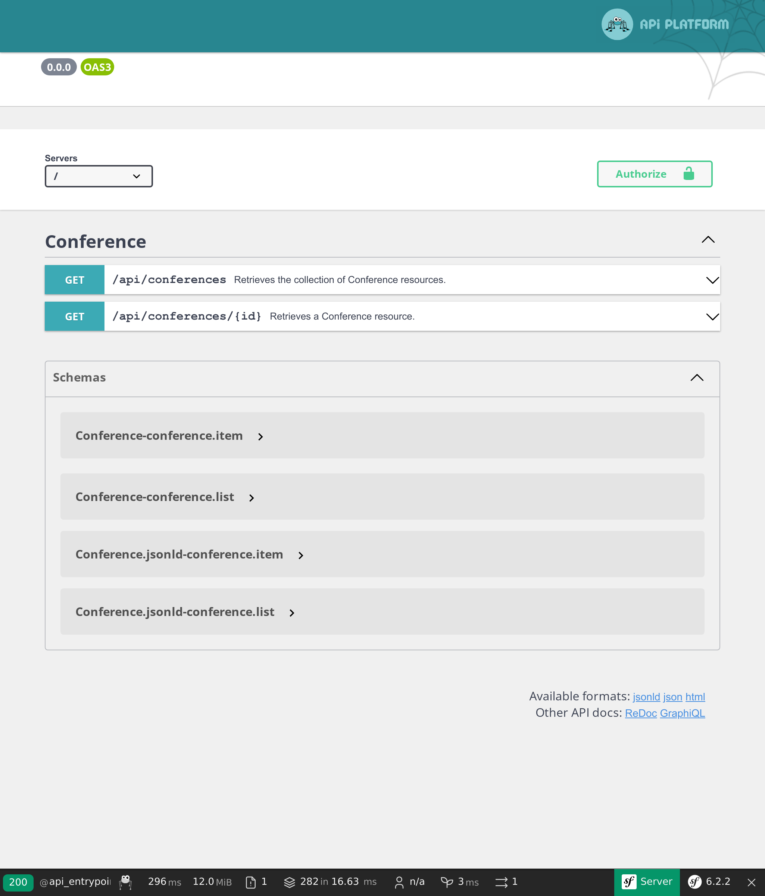

Esporre un'API con API Platform
===============================

.. index::
    single: API
    single: HTTP API
    single: API Platform

Abbiamo terminato l'implementazione del sito Guestbook. Per consentire una migliore fruizione dei dati, che ne dite di esporre delle API? Un'API potrebbe essere utilizzata da un'applicazione mobile per visualizzare tutte le conferenze, i loro commenti e magari lasciare che i partecipanti inviino commenti.

In questa fase, implementeremo un'API di sola lettura.

Installazione di API Platform
-----------------------------

Esporre un'API scrivendo del codice è possibile, ma se vogliamo usare gli standard è preferibile usare una soluzione che si occupi del lavoro sporco. Una soluzione come API Platform:

.. code-block:: terminal

    $ symfony composer req api

Esposizione di un'API per le conferenze
---------------------------------------

.. index::
    single: Attributes;ApiResource
    single: Attributes;Groups

Qualche attributo sulla classe Conference è tutto ciò di cui abbiamo bisogno per configurare l'API:

.. code-block:: diff
    :caption: patch_file

    --- a/src/Entity/Conference.php
    +++ b/src/Entity/Conference.php
    @@ -2,35 +2,52 @@

     namespace App\Entity;

    +use ApiPlatform\Metadata\ApiResource;
    +use ApiPlatform\Metadata\Get;
    +use ApiPlatform\Metadata\GetCollection;
     use App\Repository\ConferenceRepository;
     use Doctrine\Common\Collections\ArrayCollection;
     use Doctrine\Common\Collections\Collection;
     use Doctrine\ORM\Mapping as ORM;
     use Symfony\Bridge\Doctrine\Validator\Constraints\UniqueEntity;
    +use Symfony\Component\Serializer\Annotation\Groups;
     use Symfony\Component\String\Slugger\SluggerInterface;

     #[ORM\Entity(repositoryClass: ConferenceRepository::class)]
     #[UniqueEntity('slug')]
    +#[ApiResource(
    +    operations: [
    +        new Get(normalizationContext: ['groups' => 'conference:item']),
    +        new GetCollection(normalizationContext: ['groups' => 'conference:list'])
    +    ],
    +    order: ['year' => 'DESC', 'city' => 'ASC'],
    +    paginationEnabled: false,
    +)]
     class Conference
     {
         #[ORM\Id]
         #[ORM\GeneratedValue]
         #[ORM\Column]
    +    #[Groups(['conference:list', 'conference:item'])]
         private ?int $id = null;

         #[ORM\Column(length: 255)]
    +    #[Groups(['conference:list', 'conference:item'])]
         private ?string $city = null;

         #[ORM\Column(length: 4)]
    +    #[Groups(['conference:list', 'conference:item'])]
         private ?string $year = null;

         #[ORM\Column]
    +    #[Groups(['conference:list', 'conference:item'])]
         private ?bool $isInternational = null;

         #[ORM\OneToMany(mappedBy: 'conference', targetEntity: Comment::class, orphanRemoval: true)]
         private Collection $comments;

         #[ORM\Column(length: 255, unique: true)]
    +    #[Groups(['conference:list', 'conference:item'])]
         private ?string $slug = null;

         public function __construct()

L'attributo principale ``ApiResource`` configura l'API per le conferenze. Nella fattispecie, limita le operazioni possibili alla sola ``get`` e configura varie cose, quali ad esempio i campi da visualizzare e come ordinare le conferenze.

Per impostazione predefinita, il punto di ingresso principale per l'API è ``/api`` grazie alla configurazione in ``config/routes/api_platform.yaml``,  aggiunta dalla ricetta del pacchetto.

Un'interfaccia web permette di interagire con le API:

Usiamola per testare le varie possibilità:

.. figure:: screenshots/api-conferences.png
    :alt: /api
    :align: center
    :figclass: with-browser

Immaginate il tempo che ci vorrebbe per fare tutto questo da zero!

Esposizione di un'API per i commenti
------------------------------------

.. index::
    single: Attributes;ApiResource
    single: Attributes;ApiFilter
    single: Attributes;Groups

Facciamo lo stesso per i commenti:

.. code-block:: diff
    :caption: patch_file

    --- a/src/Entity/Comment.php
    +++ b/src/Entity/Comment.php
    @@ -2,41 +2,63 @@

     namespace App\Entity;

    +use ApiPlatform\Doctrine\Orm\Filter\SearchFilter;
    +use ApiPlatform\Metadata\ApiFilter;
    +use ApiPlatform\Metadata\ApiResource;
    +use ApiPlatform\Metadata\Get;
    +use ApiPlatform\Metadata\GetCollection;
     use App\Repository\CommentRepository;
     use Doctrine\DBAL\Types\Types;
     use Doctrine\ORM\Mapping as ORM;
    +use Symfony\Component\Serializer\Annotation\Groups;
     use Symfony\Component\Validator\Constraints as Assert;

     #[ORM\Entity(repositoryClass: CommentRepository::class)]
     #[ORM\HasLifecycleCallbacks]
    +#[ApiResource(
    +    operations: [
    +        new Get(normalizationContext: ['groups' => 'comment:item']),
    +        new GetCollection(normalizationContext: ['groups' => 'comment:list'])
    +    ],
    +    order: ['createdAt' => 'DESC'],
    +    paginationEnabled: false,
    +)]
    +#[ApiFilter(SearchFilter::class, properties: ['conference' => 'exact'])]
     class Comment
     {
         #[ORM\Id]
         #[ORM\GeneratedValue]
         #[ORM\Column]
    +    #[Groups(['comment:list', 'comment:item'])]
         private ?int $id = null;

         #[ORM\Column(length: 255)]
         #[Assert\NotBlank]
    +    #[Groups(['comment:list', 'comment:item'])]
         private ?string $author = null;

         #[ORM\Column(type: Types::TEXT)]
         #[Assert\NotBlank]
    +    #[Groups(['comment:list', 'comment:item'])]
         private ?string $text = null;

         #[ORM\Column(length: 255)]
         #[Assert\NotBlank]
         #[Assert\Email]
    +    #[Groups(['comment:list', 'comment:item'])]
         private ?string $email = null;

         #[ORM\Column]
    +    #[Groups(['comment:list', 'comment:item'])]
         private ?\DateTimeImmutable $createdAt = null;

         #[ORM\ManyToOne(inversedBy: 'comments')]
         #[ORM\JoinColumn(nullable: false)]
    +    #[Groups(['comment:list', 'comment:item'])]
         private ?Conference $conference = null;

         #[ORM\Column(length: 255, nullable: true)]
    +    #[Groups(['comment:list', 'comment:item'])]
         private ?string $photoFilename = null;

         #[ORM\Column(length: 255, options: ['default' => 'submitted'])]

Lo stesso tipo di attributi sono usati per configurare la classe.

Limitare i commenti esposti dall'API
------------------------------------

Per impostazione predefinita, API Platform espone tutte le voci del database. Ma per i commenti, solo quelli pubblicati dovrebbero essere parte dell'API.

Se occorre limitare gli elementi restituiti dall'API, bisogna creare un servizio che implementi ``QueryCollectionExtensionInterface`` per gestire la query usata da Doctrine per reperire le collezioni. In alternativa, si può implementare ``QueryItemExtensionInterface`` per controllare gli elementi:

.. code-block:: php
    :caption: src/Api/FilterPublishedCommentQueryExtension.php
    :emphasize-lines: 14-16,21-23

    namespace App\Api;

    use ApiPlatform\Doctrine\Orm\Extension\QueryCollectionExtensionInterface;
    use ApiPlatform\Doctrine\Orm\Extension\QueryItemExtensionInterface;
    use ApiPlatform\Doctrine\Orm\Util\QueryNameGeneratorInterface;
    use ApiPlatform\Metadata\Operation;
    use App\Entity\Comment;
    use Doctrine\ORM\QueryBuilder;

    class FilterPublishedCommentQueryExtension implements QueryCollectionExtensionInterface, QueryItemExtensionInterface
    {
        public function applyToCollection(QueryBuilder $queryBuilder, QueryNameGeneratorInterface $queryNameGenerator, string $resourceClass, Operation $operation = null, array $context = []): void
        {
            if (Comment::class === $resourceClass) {
                $queryBuilder->andWhere(sprintf("%s.state = 'published'", $queryBuilder->getRootAliases()[0]));
            }
        }

        public function applyToItem(QueryBuilder $queryBuilder, QueryNameGeneratorInterface $queryNameGenerator, string $resourceClass, array $identifiers, Operation $operation = null, array $context = []): void
        {
            if (Comment::class === $resourceClass) {
                $queryBuilder->andWhere(sprintf("%s.state = 'published'", $queryBuilder->getRootAliases()[0]));
            }
        }
    }

La classe di estensione della query applica la sua logica solo per la risorsa ``Comment`` e modifica il query builder di Doctrine per considerare solo i commenti nello stato ``published``.

Configurare CORS
----------------

.. index::
    single: CORS
    single: Cross-Origin Resource Sharing

Per impostazione predefinita, le policy di sicurezza dei moderni client HTTP non consentono la chiamata dell'API da un dominio diverso. NelmioCorsBundle, installato come parte di ``composer req api``, invia gli header Cross-Origin Resource Sharing in base alla variabile d'ambiente ``CORS_ALLOW_ORIGIN``.

Per impostazione predefinita, il suo valore, definito in ``.env``, permette richieste HTTP da ``localhost`` e ``127.0.0.1`` su qualsiasi porta. Questo è esattamente ciò che ci serve, perché nel prossimo passo creeremo una SPA che avrà un suo server web, che richiamerà l'API.

.. sidebar:: Andare oltre

    * `Tutorial API Platform su SymfonyCasts`_;

    * Per abilitare il supporto di GraphQL, eseguire ``composer require webonyx/graphql-php``, quindi visitare l'indirizzo ``/api/graphql``.

.. _`Tutorial API Platform su SymfonyCasts`: https://symfonycasts.com/screencast/api-platform
