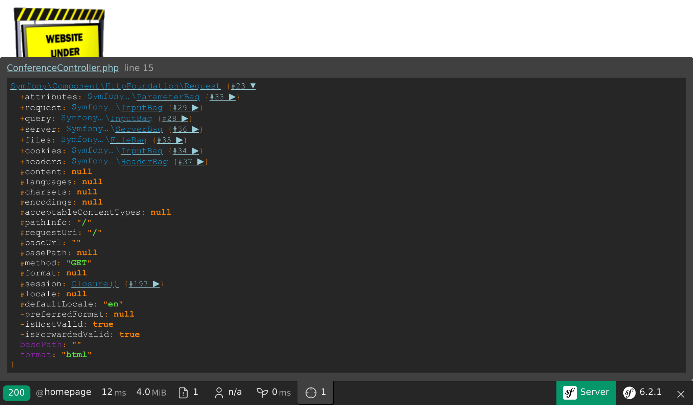

La creazione di un controller
=============================

.. index::
    single: Controller
    single: Routing;Route

Il nostro progetto del guestbook è già attivo sui server di produzione, ma abbiamo imbrogliato un po'. Il progetto non ha ancora nessuna pagina. L'homepage risulta essere una noiosa pagina di errore 404. Sistemiamo le cose.

Quando arriva una richiesta HTTP come per la homepage (``http://localhost:8000/``), Symfony cerca di trovare una *rotta* che corrisponda al *percorso della richiesta* (``/`` in questo caso). Una *rotta* è il collegamento tra il percorso della richiesta e una funzione *callable di PHP* che crea la *risposta* HTTP per quella richiesta.

Queste funzioni "callable" sono chiamate "controller". In Symfony, la maggior parte dei controller è implementata come classe PHP. Possiamo creare una classe di questo tipo in modo manuale ma, siccome ci piace andare veloci, vediamo come Symfony ci può aiutare.

Essere pigri con MakerBundle
----------------------------

.. index::
    single: Components;Maker Bundle
    single: Maker Bundle

Per generare dei controller senza sforzo, possiamo usare il pacchetto ``symfony/maker-bundle``, il quale è stato installato come parte del pacchetto ``webapp``.

MakerBundle ci aiuta a generare un sacco di classi diverse. Lo useremo molto spesso in questo libro. Ogni "generatore" è definito in un comando e tutti i comandi fanno parte del namespace dei comandi ``make``.

.. index::
    single: Command;list

Il comando ``list`` della console di Symfony elenca tutti i comandi disponibili sotto un dato namespace; possiamo usarlo per scoprire tutti i generatori forniti da MakerBundle:

.. code-block:: terminal
    :class: ignore

    $ symfony console list make

Scegliere un formato per la configurazione
------------------------------------------

Prima di creare il primo controller del progetto, dobbiamo decidere quali formati di configurazione vogliamo utilizzare. Symfony supporta nativamente YAML, XML, PHP e `Attributi PHP`.

Per la *configurazione relativa ai pacchetti*, *YAML* è la scelta migliore. Questo è il formato utilizzato per la cartella ``config/``. Spesso, quando si installa un nuovo pacchetto, la ricetta del pacchetto stesso aggiungerà un nuovo file con estensione ``.yaml`` a questa cartella.

Per la *configurazione relativa al codice PHP*, gli *attributi* sono una scelta migliore poiché sono definite nel codice stesso. Prendiamo in esame questo esempio: quando una richiesta arriva all'applicazione, la configurazione deve dire a Symfony quale specifico controller (una classe PHP) dovrà gestirla. Se utilizzassimo un formato di configurazione tra YAML, XML e PHP, due file sarebbero coinvolti (il file di configurazione e il file del controller PHP). Utilizzando gli attributi, la configurazione sarà inclusa direttamente nella classe del controller.

Come fare a sapere il nome del pacchetto che ci serve installare per una determinata funzionalità? Il più delle volte non c'è bisogno di saperlo, infatti Symfony ci dirà il nome del pacchetto da installare attraverso dei messaggi d'errore. Lanciare il comando ``symfony console make:message`` senza aver installato il pacchetto ``messenger``, per esempio, avrebbe sollevato un'eccezione contenente un suggerimento riguardo a cosa installare.

Generare un controller
----------------------

.. index::
    single: Command;make:controller

Creiamo il nostro primo *controller* tramite il comando ``make:controller``:

.. code-block:: terminal

    $ symfony console make:controller ConferenceController

.. index::
    single: Components;Routing
    single: Attributes;Route

Il comando crea una classe ``ConferenceController`` nella cartella ``src/Controller/``. La classe generata sarà composta da codice predefinito e pronto per essere messo a punto:

.. code-block:: php
    :caption: src/Controller/ConferenceController.php
    :class: ignore
    :emphasize-lines: 9

    namespace App\Controller;

    use Symfony\Bundle\FrameworkBundle\Controller\AbstractController;
    use Symfony\Component\HttpFoundation\Response;
    use Symfony\Component\Routing\Annotation\Route;

    class ConferenceController extends AbstractController
    {
        #[Route('/conference', name: 'conference')]
        public function index(): Response
        {
            return $this->render('conference/index.html.twig', [
                'controller_name' => 'ConferenceController',
            ]);
        }
    }

L'attributo ``#[Route('/conference', name: 'conference')]`` è ciò che rende il metodo ``index()`` un controller (la configurazione è assieme al codice che configura).

Quando si visita ``/conference`` nel browser, il controller viene eseguito e una risposta viene restituita.

Modifichiamo la rotta per farla corrispondere alla homepage:

.. code-block:: diff
    :caption: patch_file
    :emphasize-lines: 7

    --- a/src/Controller/ConferenceController.php
    +++ b/src/Controller/ConferenceController.php
    @@ -8,7 +8,7 @@ use Symfony\Component\Routing\Annotation\Route;

     class ConferenceController extends AbstractController
     {
    -    #[Route('/conference', name: 'app_conference')]
    +    #[Route('/', name: 'homepage')]
         public function index(): Response
         {
             return $this->render('conference/index.html.twig', [

Il parametro ``name`` della rotta sarà utile qualora volessimo fare riferimento alla homepage all'interno del codice. Invece di scrivere direttamente il percorso ``/`` potremo utilizzare il nome della rotta.

Al posto della pagina predefinita, restituiamo una semplice pagina HTML:

.. code-block:: diff
    :caption: patch_file
    :emphasize-lines: 18

    --- a/src/Controller/ConferenceController.php
    +++ b/src/Controller/ConferenceController.php
    @@ -11,8 +11,13 @@ class ConferenceController extends AbstractController
         #[Route('/', name: 'homepage')]
         public function index(): Response
         {
    -        return $this->render('conference/index.html.twig', [
    -            'controller_name' => 'ConferenceController',
    -        ]);
    +        return new Response(<<<EOF
    +            <html>
    +                <body>
    +                    
    +                </body>
    +            </html>
    +            EOF
    +        );
         }
     }

Aggiorniamo il browser:

La responsabilità principale di un controller è quella di restituire una ``Response`` HTTP per la richiesta.

Siccome la rimanente parte del capitolo riguarda codice che non vorremo memorizzare, facciamo commit dei cambiamenti ora:

.. code-block:: terminal
    :class: ignore

    $ git add .
    $ git commit -m'Add the index controller'

.. _easter-egg:

Aggiunta di un "easter egg"
---------------------------

Per dimostrare come una risposta possa sfruttare le informazioni provenienti dalla richiesta, aggiungiamo un piccolo `easter egg`_ (contenuto nascosto). Ogni volta che la homepage contiene una query string come ``?hello=Fabien``, aggiungiamo del testo per salutare la persona:

.. code-block:: diff
    :emphasize-lines: 18

    --- a/src/Controller/ConferenceController.php
    +++ b/src/Controller/ConferenceController.php
    @@ -3,17 +3,24 @@
     namespace App\Controller;

     use Symfony\Bundle\FrameworkBundle\Controller\AbstractController;
    +use Symfony\Component\HttpFoundation\Request;
     use Symfony\Component\HttpFoundation\Response;
     use Symfony\Component\Routing\Annotation\Route;

     class ConferenceController extends AbstractController
     {
         #[Route('/', name: 'homepage')]
    -    public function index(): Response
    +    public function index(Request $request): Response
         {
    +        $greet = '';
    +        if ($name = $request->query->get('hello')) {
    +            $greet = sprintf('<h1>Hello %s!</h1>', htmlspecialchars($name));
    +        }
    +
             return new Response(<<<EOF
                 <html>
                     <body>
    +                    $greet
                         
                     </body>
                 </html>

Symfony espone i dati della richiesta attraverso un oggetto ``Request``. Quando Symfony rileva un parametro del controller con questo tipo, passa automaticamente la richiesta attraverso questo oggetto: possiamo utilizzarlo per ottenere l'elemento ``name`` dalla query string e aggiungere un ``<h1>`` al titolo della pagina.

Proviamo a visitare in un browser il percorso ``/`` e poi ``/?hello=Fabien`` per vedere la differenza.

.. note::

    Nota: la chiamata a ``htmlspecialchars()`` serve per evitare problemi di XSS (cross-site scripting). Questa cosa sarà fatta in modo automatico quando utilizzeremo un sistema appropriato per i template.

Avremmo anche potuto rendere il nome parte dell'URL:

.. code-block:: diff

    --- a/src/Controller/ConferenceController.php
    +++ b/src/Controller/ConferenceController.php
    @@ -9,11 +9,11 @@ use Symfony\Component\Routing\Annotation\Route;

     class ConferenceController extends AbstractController
     {
    -    #[Route('/', name: 'homepage')]
    -    public function index(Request $request): Response
    +    #[Route('/hello/{name}', name: 'homepage')]
    +    public function index(string $name = ''): Response
         {
             $greet = '';
    -        if ($name = $request->query->get('hello')) {
    +        if ($name) {
                 $greet = sprintf('<h1>Hello %s!</h1>', htmlspecialchars($name));
             }

La parte ``{name}`` della rotta è un *parametro di rotta* dinamico: funziona come segnaposto. Possiamo dunque visitare ``/hello`` e poi ``/hello/Fabien`` attraverso il browser per ottenere lo stesso risultato di prima. Possiamo inoltre ottenere il *valore* del parametro ``{{name}}`` aggiungendo una variabile al controller con lo stesso *nome* (quindi, ``$name``).

Annulliamo le modifiche che abbiamo appena fatto:

.. code-block:: terminal

    $ git checkout src/Controller/ConferenceController.php

.. code-block:: terminal
    :class: hide

    $ git reset HEAD src/Controller/ConferenceController.php
    $ git checkout src/Controller/ConferenceController.php

Variabili di debug
------------------

.. index::
    single: Components;VarDumper
    single: VarDumper
    single: dump

La funzione ``dump()`` di Symfony è un ottimo aiuto per il debug. È sempre disponibile e ci consente di eseguire il dump di variabili complesse in una forma bella e interattiva.

Cambiamo momentaneamente il file ``src/Controller/ConferenceController.php`` per eseguire il dump dell'oggetto Request:

.. code-block:: diff
    :emphasize-lines: 17

    --- a/src/Controller/ConferenceController.php
    +++ b/src/Controller/ConferenceController.php
    @@ -3,14 +3,17 @@
     namespace App\Controller;

     use Symfony\Bundle\FrameworkBundle\Controller\AbstractController;
    +use Symfony\Component\HttpFoundation\Request;
     use Symfony\Component\HttpFoundation\Response;
     use Symfony\Component\Routing\Annotation\Route;

     class ConferenceController extends AbstractController
     {
         #[Route('/', name: 'homepage')]
    -    public function index(): Response
    +    public function index(Request $request): Response
         {
    +        dump($request);
    +
             return new Response(<<<EOF
                 <html>
                     <body>

Quando ricarichiamo la pagina sarà possibile notare la nuova icona "target" nella barra degli strumenti; ci consentirà di inspezionare il dump. È possibile cliccare su di essa per accedere a una pagina dove la navigazione sarà più semplice:

.. index::
    single: Git;checkout

Annulliamo le modifiche che abbiamo appena fatto:

.. code-block:: terminal

    $ git checkout src/Controller/ConferenceController.php

.. code-block:: terminal
    :class: hide

    $ git reset HEAD src/Controller/ConferenceController.php
    $ git checkout src/Controller/ConferenceController.php

.. sidebar:: Andare oltre

    * Il sistema di `rotte`_ di Symfony;

    * `Tutorial su rotte, controller e pagine in SymfonyCasts`_;

    * `Attributi PHP`_:

    * Il componente `HttpFoundation`_;

    * Attacchi di sicurezza `XSS (Cross-Site Scripting)`_;

    * Il `Cheat Sheet del componente delle rotte di Symfony`_.

.. _`easter egg`: https://en.wikipedia.org/wiki/Easter_egg_(media)#In_computing
.. _`rotte`: https://symfony.com/doc/current/routing.html
.. _`Tutorial su rotte, controller e pagine in SymfonyCasts`: https://symfonycasts.com/screencast/symfony/route-controller
.. _`Attributi PHP`: https://www.php.net/attributes
.. _`HttpFoundation`: https://symfony.com/doc/current/components/http_foundation.html
.. _`XSS (Cross-Site Scripting)`: https://owasp.org/www-community/attacks/xss/
.. _`Cheat Sheet del componente delle rotte di Symfony`: https://github.com/andreia/symfony-cheat-sheets/blob/master/Symfony4/routing_en_part1.pdf
