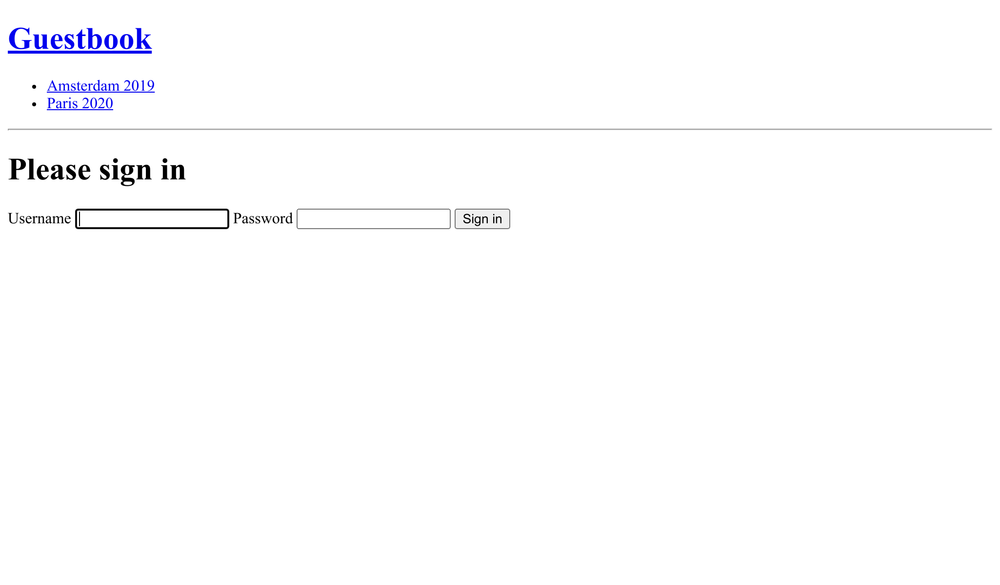
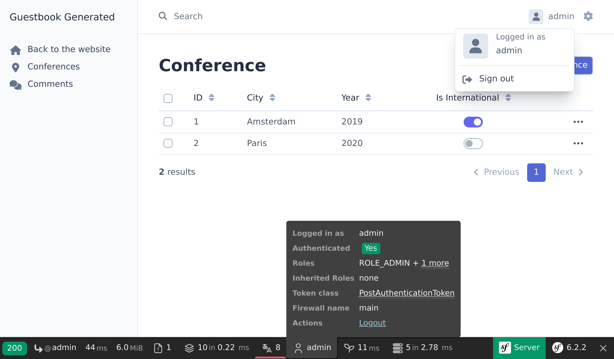

De admin backend beveiligen
===========================

.. index::
    single: Components;Security
    single: Security

De admin backend interface mag alleen toegankelijk zijn voor vertrouwde mensen. Het beveiligen van dit gedeelte van de website kan worden gedaan met behulp van de Symfony Security component.

Een User-entity definiëren
---------------------------

Ook al zullen de deelnemers niet in staat zijn om hun eigen accounts aan te maken op de website, we gaan een volledig functioneel authenticatiesysteem voor de admin creëren. We hebben dus maar één gebruiker, de websitebeheerder.

De eerste stap is het definiëren van een ``User``-entity. Om verwarring te voorkomen noemen we dit ``Admin``.

Om de ``Admin``-entity te integreren met het Symfony Security authenticatiesysteem, moet deze aan een aantal specifieke vereisten voldoen. Het heeft bijvoorbeeld een ``password``-property nodig.

.. index::
    single: Command;make:user

Gebruik het speciale ``make:user`` commando in plaats van het voorheen gebruikte ``make:entity``, om de ``Admin``-entity te creëren:

.. code-block:: terminal
    :class: answers(yes||username||yes)

    $ symfony console make:user Admin

Geef antwoord op de interactieve vragen: we willen Doctrine gebruiken om de admins op te slaan ( ``yes`` ), we gebruiken ``username`` voor de unieke weergavenaam van admins, en elke gebruiker zal een wachtwoord hebben ( ``yes`` ).

De gegenereerde class bevat methoden als ``getRoles()`` , ``eraseCredentials()`` en enkele andere die nodig zijn voor het Symfony authenticatiesysteem.

Als je meer properties aan de ``Admin`` gebruiker wil toevoegen, gebruik dan ``make:entity``.

Naast het genereren van de ``Admin``-entity, heeft het commando ook de securityconfiguratie bijgewerkt om de entity te koppelen met het authenticatiesysteem:

.. code-block:: diff
    :class: ignore
    :emphasize-lines: 11,12,20

    --- a/config/packages/security.yaml
    +++ b/config/packages/security.yaml
    @@ -5,14 +5,18 @@ security:
             Symfony\Component\Security\Core\User\PasswordAuthenticatedUserInterface: 'auto'
         # https://symfony.com/doc/current/security.html#loading-the-user-the-user-provider
         providers:
    -        users_in_memory: { memory: null }
    +        # used to reload user from session & other features (e.g. switch_user)
    +        app_user_provider:
    +            entity:
    +                class: App\Entity\Admin
    +                property: username
         firewalls:
             dev:
                 pattern: ^/(_(profiler|wdt)|css|images|js)/
                 security: false
             main:
                 lazy: true
    -            provider: users_in_memory
    +            provider: app_user_provider

                 # activate different ways to authenticate
                 # https://symfony.com/doc/current/security.html#the-firewall

We laten Symfony automatisch het best mogelijke algoritme gebruiken voor het hashen van wachtwoorden (dat in de loop der tijd kan evolueren).

We genereren een migratie en migreren de database:

.. code-block:: terminal

    $ symfony console make:migration
    $ symfony console doctrine:migrations:migrate -n

Het genereren van een wachtwoord voor de admin-gebruiker
--------------------------------------------------------

.. index::
    single: Security;Password Hashes

We zullen geen eigen systeem ontwikkelen voor het aanmaken van admin accounts. We hebben namelijk altijd maar één admin. De login wordt dan ``admin`` en we moeten het wachtwoord hashen.

.. index::
    single: Command;security:hash-password

Selecteer ``App\Entity\Admin``, kies vervolgens wat je wil gebruiken als wachtwoord en voer het volgende commando uit om de hash van het wachtwoord te genereren:

.. code-block:: terminal
    :class: answers(0||admin)

    $ symfony console security:hash-password

.. code-block:: text
    :class: ignore
    :emphasize-lines: 11

    Symfony Password Hash Utility
    =============================

     Type in your password to be hashed:
     >

     ------------------ ---------------------------------------------------------------------------------------------------
      Key                Value
     ------------------ ---------------------------------------------------------------------------------------------------
      Hasher used        Symfony\Component\PasswordHasher\Hasher\MigratingPasswordHasher
      Password hash      $argon2id$v=19$m=65536,t=4,p=1$BQG+jovPcunctc30xG5PxQ$TiGbx451NKdo+g9vLtfkMy4KjASKSOcnNxjij4gTX1s
     ------------------ ---------------------------------------------------------------------------------------------------

     ! [NOTE] Self-salting hasher used: the hasher generated its own built-in salt.

     [OK] Password hashing succeeded

Een admin aanmaken
------------------

.. index::
    single: Symfony CLI;run psql

Voeg de admin gebruiker toe via een SQL statement:

.. code-block:: terminal

    $ symfony run psql -c "INSERT INTO admin (id, username, roles, password) \
      VALUES (nextval('admin_id_seq'), 'admin', '[\"ROLE_ADMIN\"]', \
      '\$argon2id\$v=19\$m=65536,t=4,p=1\$BQG+jovPcunctc30xG5PxQ\$TiGbx451NKdo+g9vLtfkMy4KjASKSOcnNxjij4gTX1s')"

Let op de escaping van het ``$`` teken in de wachtwoordkolom; escape deze allemaal!

De beveiligingsauthenticatie configureren
-----------------------------------------

.. index::
    single: Command;make:auth
    single: Security;Authenticator
    single: Security;Form Login
    single: Login
    single: Logout

Nu we een admin gebruiker hebben, kunnen we de admin backend beveiligen. Symfony ondersteunt verschillende authenticatiestrategieën. We kiezen voor de populaire klassieker *formulier authenticatie systeem*.

Draai ``make:auth`` om de beveiligingsconfiguratie bij te werken, een login template te genereren en een *authenticator* te maken:

.. code-block:: terminal
    :class: answers(1||AppAuthenticator||SecurityController||yes)

    $ symfony console make:auth

Selecteer ``1`` om een inlogformulier-authenticator te genereren, noem de authenticator class ``AppAuthenticator``, de controller ``SecurityController`` en genereer een ``/logout`` URL ( ``yes`` ).

Het commando heeft de securityconfiguratie bijgewerkt om de gegenereerde classes te koppelen:

.. code-block:: diff
    :class: ignore
    :emphasize-lines: 9

    --- a/config/packages/security.yaml
    +++ b/config/packages/security.yaml
    @@ -17,6 +17,11 @@ security:
             main:
                 lazy: true
                 provider: app_user_provider
    +            custom_authenticator: App\Security\AppAuthenticator
    +            logout:
    +                path: app_logout
    +                # where to redirect after logout
    +                # target: app_any_route

                 # activate different ways to authenticate
                 # https://symfony.com/doc/current/security.html#the-firewall

Zoals voorgesteld door het commando, moeten we de route in de ``onAuthenticationSuccess()`` methode aanpassen om de gebruiker om te leiden wanneer hij zich succesvol aanmeldt:

.. code-block:: diff

    --- a/src/Security/AppAuthenticator.php
    +++ b/src/Security/AppAuthenticator.php
    @@ -46,9 +46,7 @@ class AppAuthenticator extends AbstractLoginFormAuthenticator
                 return new RedirectResponse($targetPath);
             }

    -        // For example:
    -        // return new RedirectResponse($this->urlGenerator->generate('some_route'));
    -        throw new \Exception('TODO: provide a valid redirect inside '.__FILE__);
    +        return new RedirectResponse($this->urlGenerator->generate('admin'));
         }

         protected function getLoginUrl(Request $request): string

.. index::
    single: Command;debug:router
    single: Routing;Debug
    single: Debug;Routing

.. tip::

    Hoe onthoud ik dat de EasyAdmin route ``admin`` is (zoals geconfigureerd in ``App\Controller\Admin\DashboardController``)? Dat hoeft niet. Je kan het in dit bestand terugzien maar je kan ook het volgende commando uitvoeren, dat de associatie tussen routenamen en paden weergeeft:

    .. code-block:: terminal

        $ symfony console debug:router

Toegangscontrole-regels voor autorisatie toevoegen
--------------------------------------------------

.. index::
    single: Security;Authorization
    single: Security;Access Control

Een securitysysteem bestaat uit twee delen: *authenticatie* en *autorisatie*. Bij het creëren van de admin-gebruiker hebben we deze de ``ROLE_ADMIN`` rol gegeven. We zullen de ``/admin`` beperken tot gebruikers die deze rol hebben door een regel toe te voegen aan ``access_control``:

.. code-block:: diff
    :emphasize-lines: 8

    --- a/config/packages/security.yaml
    +++ b/config/packages/security.yaml
    @@ -31,7 +31,7 @@ security:
         # Easy way to control access for large sections of your site
         # Note: Only the *first* access control that matches will be used
         access_control:
    -        # - { path: ^/admin, roles: ROLE_ADMIN }
    +        - { path: ^/admin, roles: ROLE_ADMIN }
             # - { path: ^/profile, roles: ROLE_USER }

     when@test:

De ``access_control`` regels beperken de toegang door middel van reguliere expressies. Als je een URL probeert te benaderen die begint met ``/admin`` zal het beveiligingssysteem de ``ROLE_ADMIN`` rol verwachten van de ingelogde gebruiker.

Authenticatie via het inlogformulier
------------------------------------

Als je toegang probeert te krijgen tot de backend van de admin, zal je nu doorgestuurd worden naar de inlogpagina. Daar zal gevraagd worden om een login en een wachtwoord in te voeren:

Log in met ``admin`` met het niet-gecodeerde wachtwoord dat je eerder hebt gekozen. Als je mijn SQL commando precies gekopieerd hebt, is het wachtwoord ``admin``.

EasyAdmin herkent automatisch het Symfony authenticatiesysteem:

Klik op de "Uitloggen" link. Klaar! Je hebt een volledig beveiligde backend admin.

.. index::
    single: Command;make:registration-form

.. note::

    Als je een authenticatiesysteem met alle toeters en bellen wil maken, kijk dan eens naar het ``make:registration-form`` commando.

.. sidebar:: Verder gaan

    * De `Symfony Security documentatie`_;

    * `SymfonyCasts Security tutorial`_;

    * `Hoe bouw je een inlogformulier`_ in Symfony applicaties;

    * De `Symfony Security Cheat Sheet`_.

.. _`Symfony Security documentatie`: https://symfony.com/doc/current/security.html
.. _`SymfonyCasts Security tutorial`: https://symfonycasts.com/screencast/symfony-security
.. _`Hoe bouw je een inlogformulier`: https://symfony.com/doc/current/security/form_login_setup.html
.. _`Symfony Security Cheat Sheet`: https://github.com/andreia/symfony-cheat-sheets/blob/master/Symfony4/security_en_44.pdf
