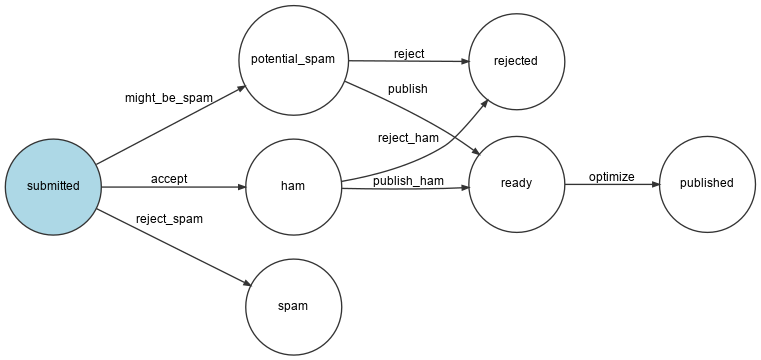

Formaat van afbeeldingen wijzigen
=================================

Op het ontwerp van de conferentiepagina's zijn de foto's beperkt tot een maximale grootte van 200 bij 150 pixels. Hoe optimaliseren en verkleinen we afbeeldingen als het geüploade origineel groter is dan de limieten?

Dat is een taak die perfect toegevoegd kan worden aan de comment workflow, waarschijnlijk vlak nadat de reactie gevalideerd is en vlak voordat deze gepubliceerd wordt.

Laten we een nieuwe ``ready`` state en een ``optimize`` transitie toevoegen:

.. code-block:: diff
    :caption: patch_file

    --- a/config/packages/workflow.yaml
    +++ b/config/packages/workflow.yaml
    @@ -16,6 +16,7 @@ framework:
                     - potential_spam
                     - spam
                     - rejected
    +                - ready
                     - published
                 transitions:
                     accept:
    @@ -29,13 +30,16 @@ framework:
                         to:   spam
                     publish:
                         from: potential_spam
    -                    to:   published
    +                    to:   ready
                     reject:
                         from: potential_spam
                         to:   rejected
                     publish_ham:
                         from: ham
    -                    to:   published
    +                    to:   ready
                     reject_ham:
                         from: ham
                         to:   rejected
    +                optimize:
    +                    from: ready
    +                    to:   published

.. index::
    single: Command;workflow:dump

Genereer een visuele weergave van de nieuwe workflowconfiguratie om te valideren dat deze beschrijft wat we willen:

.. code-block:: terminal
    :class: ignore

    $ symfony console workflow:dump comment | dot -Tpng -o workflow.png

Afbeeldingen optimaliseren met Imagine
--------------------------------------

.. index::
    single: Imagine

Optimalisatie van afbeeldingen wordt uitgevoerd door `GD`_ (controleer of de GD-extensie in je lokale PHP-installatie is ingeschakeld) en `Imagine`_:

.. code-block:: terminal

    $ symfony composer req "imagine/imagine:^1.2"

De grootte van een afbeelding kan aangepast worden via de volgende service class:

.. code-block:: php
    :caption: src/ImageOptimizer.php

    namespace App;

    use Imagine\Gd\Imagine;
    use Imagine\Image\Box;

    class ImageOptimizer
    {
        private const MAX_WIDTH = 200;
        private const MAX_HEIGHT = 150;

        private $imagine;

        public function __construct()
        {
            $this->imagine = new Imagine();
        }

        public function resize(string $filename): void
        {
            list($iwidth, $iheight) = getimagesize($filename);
            $ratio = $iwidth / $iheight;
            $width = self::MAX_WIDTH;
            $height = self::MAX_HEIGHT;
            if ($width / $height > $ratio) {
                $width = $height * $ratio;
            } else {
                $height = $width / $ratio;
            }

            $photo = $this->imagine->open($filename);
            $photo->resize(new Box($width, $height))->save($filename);
        }
    }

Na het optimaliseren van de foto, slaan we het nieuwe bestand op in plaats van het originele bestand. Misschien wil je het originele beeld wel ergens bewaren.

Een nieuwe stap in de workflow toevoegen
----------------------------------------

Wijzig de workflow om de nieuwe state af te handelen:

.. code-block:: diff
    :caption: patch_file

    --- a/src/MessageHandler/CommentMessageHandler.php
    +++ b/src/MessageHandler/CommentMessageHandler.php
    @@ -2,6 +2,7 @@

     namespace App\MessageHandler;

    +use App\ImageOptimizer;
     use App\Message\CommentMessage;
     use App\Repository\CommentRepository;
     use App\SpamChecker;
    @@ -25,6 +26,8 @@ class CommentMessageHandler
             private WorkflowInterface $commentStateMachine,
             private MailerInterface $mailer,
             #[Autowire('%admin_email%')] private string $adminEmail,
    +        private ImageOptimizer $imageOptimizer,
    +        #[Autowire('%photo_dir%')] private string $photoDir,
             private ?LoggerInterface $logger = null,
         ) {
         }
    @@ -54,6 +57,12 @@ class CommentMessageHandler
                     ->to($this->adminEmail)
                     ->context(['comment' => $comment])
                 );
    +        } elseif ($this->commentStateMachine->can($comment, 'optimize')) {
    +            if ($comment->getPhotoFilename()) {
    +                $this->imageOptimizer->resize($this->photoDir.'/'.$comment->getPhotoFilename());
    +            }
    +            $this->commentStateMachine->apply($comment, 'optimize');
    +            $this->entityManager->flush();
             } elseif ($this->logger) {
                 $this->logger->debug('Dropping comment message', ['comment' => $comment->getId(), 'state' => $comment->getState()]);
             }

Merk op dat ``$photoDir`` automatisch wordt geïnjecteerd omdat we in een vorige stap een container *parameter* hebben gedefinieerd voor deze variabelenaam:

.. code-block:: yaml
    :caption: config/services.yaml
    :class: ignore

    parameters:
        photo_dir: "%kernel.project_dir%/public/uploads/photos"

Opslaan van geüploade gegevens in productie
--------------------------------------------

.. index::
    single: Platform.sh;File Service

We hebben al een speciale lezen-schrijven directory gedefinieerd voor geüploade bestanden in ``.platform.app.yaml``, maar de mount is lokaal. Als we willen dat de webcontainer en de message consumer toegang krijgen tot dezelfde mount, moeten we een *file service* toevoegen:

.. code-block:: diff
    :caption: patch_file

    --- a/.platform/services.yaml
    +++ b/.platform/services.yaml
    @@ -11,3 +11,7 @@ varnish:
             vcl: !include
                 type: string
                 path: config.vcl
    +
    +files:
    +    type: network-storage:2.0
    +    disk: 256

Gebruik het als foto-upload-directory:

.. code-block:: diff
    :caption: patch_file

    --- a/.platform.app.yaml
    +++ b/.platform.app.yaml
    @@ -35,7 +35,7 @@ web:

     mounts:
         "/var": { source: local, source_path: var }
    -    "/public/uploads": { source: local, source_path: uploads }
    +    "/public/uploads": { source: service, service: files, source_path: uploads }
         

     relationships:

Dit zou voldoende moeten zijn om de functie in productie te laten werken.

.. _`GD`: https://libgd.github.io/
.. _`Imagine`: https://github.com/avalanche123/Imagine
