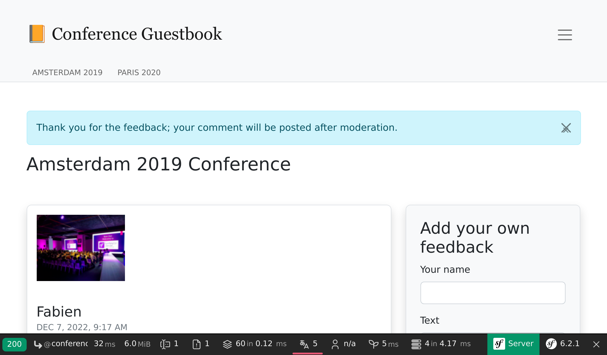

Notificeren via verschillende kanalen
=====================================

De gastenboekapplicatie verzamelt feedback over de conferenties. Maar we zijn niet goed in het geven van feedback aan onze gebruikers.

Aangezien reacties gemodereerd worden zullen gebruikers waarschijnlijk niet begrijpen waarom hun reacties niet direct gepubliceerd worden. Ze zullen zelfs het formulier opnieuw invullen, omdat ze denken dat er een technisch probleem was. Feedback geven na het toevoegen van een reactie zou geweldig zijn.

Ook moeten we ze waarschijnlijk op de hoogte stellen wanneer hun reactie is gepubliceerd. Aangezien we om hun e-mailadres vragen, kunnen we dat maar beter gebruiken.

Er zijn vele manieren om gebruikers op de hoogte te houden. E-mail is het eerste medium waar je misschien aan denkt, maar notificaties in de webapplicatie is een andere mogelijkheid. Het is zelfs mogelijk om SMS-berichten te versturen, een bericht op Slack of Telegram te posten. Er zijn legio mogelijkheden.

.. index::
    single: Components;Notifier
    single: Notifier

Het Symfony Notifier component implementeert vele notificatiestrategiën.

Webapplicatie-notificaties versturen in de browser
--------------------------------------------------

.. index::
    single: Flash Messages

Als een eerste stap, zullen we gebruikers na hun inzending direct in de browser informeren over dat reacties gemodereerd worden.

.. code-block:: diff
    :caption: patch_file

    --- a/src/Controller/ConferenceController.php
    +++ b/src/Controller/ConferenceController.php
    @@ -15,6 +15,8 @@ use Symfony\Component\HttpFoundation\File\Exception\FileException;
     use Symfony\Component\HttpFoundation\Request;
     use Symfony\Component\HttpFoundation\Response;
     use Symfony\Component\Messenger\MessageBusInterface;
    +use Symfony\Component\Notifier\Notification\Notification;
    +use Symfony\Component\Notifier\NotifierInterface;
     use Symfony\Component\Routing\Annotation\Route;

     class ConferenceController extends AbstractController
    @@ -46,6 +48,7 @@ class ConferenceController extends AbstractController
             Request $request,
             Conference $conference,
             CommentRepository $commentRepository,
    +        NotifierInterface $notifier,
             #[Autowire('%photo_dir%')] string $photoDir,
         ): Response {
             $comment = new Comment();
    @@ -74,9 +77,15 @@ class ConferenceController extends AbstractController
                 ];
                 $this->bus->dispatch(new CommentMessage($comment->getId(), $context));

    +            $notifier->send(new Notification('Thank you for the feedback; your comment will be posted after moderation.', ['browser']));
    +
                 return $this->redirectToRoute('conference', ['slug' => $conference->getSlug()]);
             }

    +        if ($form->isSubmitted()) {
    +            $notifier->send(new Notification('Can you check your submission? There are some problems with it.', ['browser']));
    +        }
    +
             $offset = max(0, $request->query->getInt('offset', 0));
             $paginator = $commentRepository->getCommentPaginator($conference, $offset);

De notifier *stuurt* een *notificatie* naar de *ontvangers* via een *kanaal*.

Een notificatie heeft een onderwerp, een optionele inhoud en een belang.

Een notificatie kan verzonden worden via één of meer kanalen, afhankelijk van zijn belang. Je kunt urgente notificaties versturen middels SMS en reguliere bijvoorbeeld via e-mail.

Voor browsermeldingen hebben we geen ontvangers.

.. index::
    single: Twig;for

De browsernotificatie maakt gebruik van *flash messages* via de *notification* sectie. We moeten ze laten zien door de conferentie-template bij te werken:

.. code-block:: diff
    :caption: patch_file

    --- a/templates/conference/show.html.twig
    +++ b/templates/conference/show.html.twig
    @@ -3,6 +3,13 @@
     Conference Guestbook - {{ conference }}

     
    +    
    +        

    +            {{ message }}
    +            <button type="button" class="btn-close" data-bs-dismiss="alert" aria-label="Close">&times;</button>
    +        

    +    
    +
         <h2 class="mb-5">
             {{ conference }} Conference
         </h2>

De gebruikers worden nu op de hoogte gebracht dat hun inzending wordt gemodereerd:

Als een extra bonus hebben we, als er een fout in het formulier zit, een mooie notificatie aan de bovenkant van de website:

.. figure:: screenshots/form-error-notification.png
    :alt: /conference/amsterdam-2019
    :align: center
    :figclass: with-browser

.. tip::

    Flash-berichten gebruiken het *HTTP-sessiesysteem* als opslagmedium. Het gevolg hiervan is dat de HTTP-cache wordt uitgeschakeld, omdat het sessiesysteem gestart moet worden om te controleren op berichten.

    Dit is de reden waarom we de flash-messages-snippet hebben toegevoegd aan de ``show.html.twig`` template en niet aan de base, omdat we dan HTTP-cache voor de homepage kwijt zouden raken.

Admins notificeren via e-mail
-----------------------------

In plaats van een e-mail te sturen via de ``MailerInterface``, om de admin op de hoogte te stellen van het feit dat er zojuist een reactie is geplaatst, kun je overschakelen naar het Notifier-component in de message handler:

.. code-block:: diff
    :caption: patch_file

    --- a/src/MessageHandler/CommentMessageHandler.php
    +++ b/src/MessageHandler/CommentMessageHandler.php
    @@ -4,15 +4,15 @@ namespace App\MessageHandler;

     use App\ImageOptimizer;
     use App\Message\CommentMessage;
    +use App\Notification\CommentReviewNotification;
     use App\Repository\CommentRepository;
     use App\SpamChecker;
     use Doctrine\ORM\EntityManagerInterface;
     use Psr\Log\LoggerInterface;
    -use Symfony\Bridge\Twig\Mime\NotificationEmail;
     use Symfony\Component\DependencyInjection\Attribute\Autowire;
    -use Symfony\Component\Mailer\MailerInterface;
     use Symfony\Component\Messenger\Attribute\AsMessageHandler;
     use Symfony\Component\Messenger\MessageBusInterface;
    +use Symfony\Component\Notifier\NotifierInterface;
     use Symfony\Component\Workflow\WorkflowInterface;

     #[AsMessageHandler]
    @@ -24,8 +24,7 @@ class CommentMessageHandler
             private CommentRepository $commentRepository,
             private MessageBusInterface $bus,
             private WorkflowInterface $commentStateMachine,
    -        private MailerInterface $mailer,
    -        #[Autowire('%admin_email%')] private string $adminEmail,
    +        private NotifierInterface $notifier,
             private ImageOptimizer $imageOptimizer,
             #[Autowire('%photo_dir%')] private string $photoDir,
             private ?LoggerInterface $logger = null,
    @@ -50,13 +49,7 @@ class CommentMessageHandler
                 $this->entityManager->flush();
                 $this->bus->dispatch($message);
             } elseif ($this->commentStateMachine->can($comment, 'publish') || $this->commentStateMachine->can($comment, 'publish_ham')) {
    -            $this->mailer->send((new NotificationEmail())
    -                ->subject('New comment posted')
    -                ->htmlTemplate('emails/comment_notification.html.twig')
    -                ->from($this->adminEmail)
    -                ->to($this->adminEmail)
    -                ->context(['comment' => $comment])
    -            );
    +            $this->notifier->send(new CommentReviewNotification($comment), ...$this->notifier->getAdminRecipients());
             } elseif ($this->commentStateMachine->can($comment, 'optimize')) {
                 if ($comment->getPhotoFilename()) {
                     $this->imageOptimizer->resize($this->photoDir.'/'.$comment->getPhotoFilename());

De ``getAdminRecipients()`` method retourneert de admin-ontvangers zoals geconfigureerd in de notifier; werk dit nu bij om jouw eigen e-mailadres toe te voegen:

.. code-block:: diff
    :caption: patch_file

    --- a/config/packages/notifier.yaml
    +++ b/config/packages/notifier.yaml
    @@ -13,4 +13,4 @@ framework:
                 medium: ['email']
                 low: ['email']
             admin_recipients:
    -            - { email: admin@example.com }
    +            - { email: "%env(string:default:default_admin_email:ADMIN_EMAIL)%" }

Maak nu de ``CommentReviewNotification`` class:

.. code-block:: php
    :caption: src/Notification/CommentReviewNotification.php

    namespace App\Notification;

    use App\Entity\Comment;
    use Symfony\Component\Notifier\Message\EmailMessage;
    use Symfony\Component\Notifier\Notification\EmailNotificationInterface;
    use Symfony\Component\Notifier\Notification\Notification;
    use Symfony\Component\Notifier\Recipient\EmailRecipientInterface;

    class CommentReviewNotification extends Notification implements EmailNotificationInterface
    {
        public function __construct(
            private Comment $comment,
        ) {
            parent::__construct('New comment posted');
        }

        public function asEmailMessage(EmailRecipientInterface $recipient, string $transport = null): ?EmailMessage
        {
            $message = EmailMessage::fromNotification($this, $recipient, $transport);
            $message->getMessage()
                ->htmlTemplate('emails/comment_notification.html.twig')
                ->context(['comment' => $this->comment])
            ;

            return $message;
        }
    }

De ``asEmailMessage()`` method van de ``EmailNotificationInterface`` is optioneel, maar je kunt de e-mail ermee aanpassen.

Een voordeel van het gebruik van de Notifier in plaats van direct de mailer is dat het de melding loskoppelt van het "kanaal" dat daarvoor wordt gebruikt. Zoals je kunt zien, zegt niets expliciet dat de notificatie per e-mail moet worden verzonden.

In plaats daarvan wordt het kanaal geconfigureerd in ``config/packages/notifier.yaml`` afhankelijk van het *belang* van de melding (standaard ``low``):

.. code-block:: yaml
    :caption: config/packages/notifier.yaml
    :class: ignore

    framework:
    notifier:
        channel_policy:
            # use chat/slack, chat/telegram, sms/twilio or sms/nexmo
            urgent: ['email']
            high: ['email']
            medium: ['email']
            low: ['email']

We hebben gesproken over de ``browser`` en de ``e-mail`` kanalen. Laten we eens kijken naar chiquere varianten.

Chatten met administrators
--------------------------

.. index::
    single: Slack

Laten we eerlijk zijn, we wachten allemaal op positieve feedback. Of in ieder geval constructieve feedback. Als iemand een reactie plaatst met woorden als "great" (super goed) of "awesome" (geweldig), dan willen we die misschien sneller accepteren dan de anderen.

Voor dergelijke berichten willen we een waarschuwing krijgen via een instant-messaging-systeem zoals Slack of Telegram, naast de reguliere e-mail.

.. index::
    single: Components;Notifier
    single: Notifier

Installeer Slack ondersteuning voor de Symfony Notifier:

.. code-block:: terminal

    $ symfony composer req slack-notifier

Om te beginnen, bouw je de Slack DSN op met een Slack access token en de Slack channel identifier waar je berichten naartoe wilt sturen: ``slack://ACCESS_TOKEN@default?channel=CHANNEL``.

.. index::
    single: Command;secrets:set

Omdat de access token gevoelig is, kun je de Slack DSN in de secret store bewaren:

.. code-block:: terminal
    :class: answers(slack://ACCESS_TOKEN@default?channel=CHANNEL)

    $ symfony console secrets:set SLACK_DSN

Doe hetzelfde voor productie:

.. code-block:: terminal
    :class: answers(slack://ACCESS_TOKEN@default?channel=CHANNEL)

    $ symfony console secrets:set SLACK_DSN --env=prod

Activeer de chatter Slack support:

.. code-block:: diff
    :caption: patch_file

    --- a/config/packages/notifier.yaml
    +++ b/config/packages/notifier.yaml
    @@ -1,7 +1,7 @@
     framework:
         notifier:
    -        #chatter_transports:
    -        #    slack: '%env(SLACK_DSN)%'
    +        chatter_transports:
    +            slack: '%env(SLACK_DSN)%'
             #    telegram: '%env(TELEGRAM_DSN)%'
             #texter_transports:
             #    twilio: '%env(TWILIO_DSN)%'

Werk de Notification class bij om berichten te routeren, afhankelijk van de tekst in de reactie (met een eenvoudige reguliere expressie):

.. code-block:: diff
    :caption: patch_file

    --- a/src/Notification/CommentReviewNotification.php
    +++ b/src/Notification/CommentReviewNotification.php
    @@ -7,6 +7,7 @@ use Symfony\Component\Notifier\Message\EmailMessage;
     use Symfony\Component\Notifier\Notification\EmailNotificationInterface;
     use Symfony\Component\Notifier\Notification\Notification;
     use Symfony\Component\Notifier\Recipient\EmailRecipientInterface;
    +use Symfony\Component\Notifier\Recipient\RecipientInterface;

     class CommentReviewNotification extends Notification implements EmailNotificationInterface
     {
    @@ -26,4 +27,15 @@ class CommentReviewNotification extends Notification implements EmailNotificatio

             return $message;
         }
    +
    +    public function getChannels(RecipientInterface $recipient): array
    +    {
    +        if (preg_match('{\b(great|awesome)\b}i', $this->comment->getText())) {
    +            return ['email', 'chat/slack'];
    +        }
    +
    +        $this->importance(Notification::IMPORTANCE_LOW);
    +
    +        return ['email'];
    +    }
     }

We hebben ook het belang van "gewone" reacties veranderd, omdat dit het ontwerp van de e-mail enigszins aangepast.

En klaar! Plaats een reactie met "awesome" (geweldig) in de tekst, je zou nu een bericht op Slack moeten ontvangen.

Net zoals voor e-mail kun je de ``ChatNotificationInterface`` implementeren om de standaard rendering van het Slack bericht te overschrijven:

.. code-block:: diff
    :caption: patch_file

    --- a/src/Notification/CommentReviewNotification.php
    +++ b/src/Notification/CommentReviewNotification.php
    @@ -3,13 +3,18 @@
     namespace App\Notification;

     use App\Entity\Comment;
    +use Symfony\Component\Notifier\Bridge\Slack\Block\SlackDividerBlock;
    +use Symfony\Component\Notifier\Bridge\Slack\Block\SlackSectionBlock;
    +use Symfony\Component\Notifier\Bridge\Slack\SlackOptions;
    +use Symfony\Component\Notifier\Message\ChatMessage;
     use Symfony\Component\Notifier\Message\EmailMessage;
    +use Symfony\Component\Notifier\Notification\ChatNotificationInterface;
     use Symfony\Component\Notifier\Notification\EmailNotificationInterface;
     use Symfony\Component\Notifier\Notification\Notification;
     use Symfony\Component\Notifier\Recipient\EmailRecipientInterface;
     use Symfony\Component\Notifier\Recipient\RecipientInterface;

    -class CommentReviewNotification extends Notification implements EmailNotificationInterface
    +class CommentReviewNotification extends Notification implements EmailNotificationInterface, ChatNotificationInterface
     {
         public function __construct(
             private Comment $comment,
    @@ -28,6 +33,28 @@ class CommentReviewNotification extends Notification implements EmailNotificatio
             return $message;
         }

    +    public function asChatMessage(RecipientInterface $recipient, string $transport = null): ?ChatMessage
    +    {
    +        if ('slack' !== $transport) {
    +            return null;
    +        }
    +
    +        $message = ChatMessage::fromNotification($this, $recipient, $transport);
    +        $message->subject($this->getSubject());
    +        $message->options((new SlackOptions())
    +            ->iconEmoji('tada')
    +            ->iconUrl('https://guestbook.example.com')
    +            ->username('Guestbook')
    +            ->block((new SlackSectionBlock())->text($this->getSubject()))
    +            ->block(new SlackDividerBlock())
    +            ->block((new SlackSectionBlock())
    +                ->text(sprintf('%s (%s) says: %s', $this->comment->getAuthor(), $this->comment->getEmail(), $this->comment->getText()))
    +            )
    +        );
    +
    +        return $message;
    +    }
    +
         public function getChannels(RecipientInterface $recipient): array
         {
             if (preg_match('{\b(great|awesome)\b}i', $this->comment->getText())) {

Het is beter zo, maar laten we nog een stap verder gaan. Zou het niet geweldig zijn om een reactie rechtstreeks via Slack te kunnen accepteren of afwijzen?

Wijzig de notificatie om de review-URL te accepteren en voeg twee knoppen toe aan het Slack-bericht:

.. code-block:: diff
    :caption: patch_file

    --- a/src/Notification/CommentReviewNotification.php
    +++ b/src/Notification/CommentReviewNotification.php
    @@ -3,6 +3,7 @@
     namespace App\Notification;

     use App\Entity\Comment;
    +use Symfony\Component\Notifier\Bridge\Slack\Block\SlackActionsBlock;
     use Symfony\Component\Notifier\Bridge\Slack\Block\SlackDividerBlock;
     use Symfony\Component\Notifier\Bridge\Slack\Block\SlackSectionBlock;
     use Symfony\Component\Notifier\Bridge\Slack\SlackOptions;
    @@ -18,6 +19,7 @@ class CommentReviewNotification extends Notification implements EmailNotificatio
     {
         public function __construct(
             private Comment $comment,
    +        private string $reviewUrl,
         ) {
             parent::__construct('New comment posted');
         }
    @@ -50,6 +52,10 @@ class CommentReviewNotification extends Notification implements EmailNotificatio
                 ->block((new SlackSectionBlock())
                     ->text(sprintf('%s (%s) says: %s', $this->comment->getAuthor(), $this->comment->getEmail(), $this->comment->getText()))
                 )
    +            ->block((new SlackActionsBlock())
    +                ->button('Accept', $this->reviewUrl, 'primary')
    +                ->button('Reject', $this->reviewUrl.'?reject=1', 'danger')
    +            )
             );

             return $message;

Het is nu een kwestie van wijzigingen in omgekeerde volgorde te doorlopen. Werk eerst de message handler bij om de review-URL door te geven:

.. code-block:: diff
    :caption: patch_file

    --- a/src/MessageHandler/CommentMessageHandler.php
    +++ b/src/MessageHandler/CommentMessageHandler.php
    @@ -49,7 +49,8 @@ class CommentMessageHandler
                 $this->entityManager->flush();
                 $this->bus->dispatch($message);
             } elseif ($this->commentStateMachine->can($comment, 'publish') || $this->commentStateMachine->can($comment, 'publish_ham')) {
    -            $this->notifier->send(new CommentReviewNotification($comment), ...$this->notifier->getAdminRecipients());
    +            $notification = new CommentReviewNotification($comment, $message->getReviewUrl());
    +            $this->notifier->send($notification, ...$this->notifier->getAdminRecipients());
             } elseif ($this->commentStateMachine->can($comment, 'optimize')) {
                 if ($comment->getPhotoFilename()) {
                     $this->imageOptimizer->resize($this->photoDir.'/'.$comment->getPhotoFilename());

Zoals je kunt zien moet de review-URL onderdeel zijn van het bericht, laten we dat nu toevoegen:

.. code-block:: diff
    :caption: patch_file

    --- a/src/Message/CommentMessage.php
    +++ b/src/Message/CommentMessage.php
    @@ -6,10 +6,16 @@ class CommentMessage
     {
         public function __construct(
             private int $id,
    +        private string $reviewUrl,
             private array $context = [],
         ) {
         }

    +    public function getReviewUrl(): string
    +    {
    +        return $this->reviewUrl;
    +    }
    +
         public function getId(): int
         {
             return $this->id;

Werk tot slot de controllers bij om de review-URL te genereren en geef deze door in de comment message constructor:

.. code-block:: diff
    :caption: patch_file

    --- a/src/Controller/AdminController.php
    +++ b/src/Controller/AdminController.php
    @@ -12,6 +12,7 @@ use Symfony\Component\HttpKernel\HttpCache\StoreInterface;
     use Symfony\Component\HttpKernel\KernelInterface;
     use Symfony\Component\Messenger\MessageBusInterface;
     use Symfony\Component\Routing\Annotation\Route;
    +use Symfony\Component\Routing\Generator\UrlGeneratorInterface;
     use Symfony\Component\Workflow\WorkflowInterface;
     use Twig\Environment;

    @@ -42,7 +43,8 @@ class AdminController extends AbstractController
             $this->entityManager->flush();

             if ($accepted) {
    -            $this->bus->dispatch(new CommentMessage($comment->getId()));
    +            $reviewUrl = $this->generateUrl('review_comment', ['id' => $comment->getId()], UrlGeneratorInterface::ABSOLUTE_URL);
    +            $this->bus->dispatch(new CommentMessage($comment->getId(), $reviewUrl));
             }

             return new Response($this->twig->render('admin/review.html.twig', [
    --- a/src/Controller/ConferenceController.php
    +++ b/src/Controller/ConferenceController.php
    @@ -18,6 +18,7 @@ use Symfony\Component\Messenger\MessageBusInterface;
     use Symfony\Component\Notifier\Notification\Notification;
     use Symfony\Component\Notifier\NotifierInterface;
     use Symfony\Component\Routing\Annotation\Route;
    +use Symfony\Component\Routing\Generator\UrlGeneratorInterface;

     class ConferenceController extends AbstractController
     {
    @@ -75,7 +76,8 @@ class ConferenceController extends AbstractController
                     'referrer' => $request->headers->get('referer'),
                     'permalink' => $request->getUri(),
                 ];
    -            $this->bus->dispatch(new CommentMessage($comment->getId(), $context));
    +            $reviewUrl = $this->generateUrl('review_comment', ['id' => $comment->getId()], UrlGeneratorInterface::ABSOLUTE_URL);
    +            $this->bus->dispatch(new CommentMessage($comment->getId(), $reviewUrl, $context));

                 $notifier->send(new Notification('Thank you for the feedback; your comment will be posted after moderation.', ['browser']));

Code ontkoppelen betekent dat je veranderingen op meerdere plaatsen moet aanbrengen, maar het maakt het gemakkelijker om te testen, te beredeneren en te hergebruiken.

Probeer het nog eens, het bericht zou nu goed moeten zijn:

.. image:: images/slack-message.png
    :align: center

Over de hele lijn asynchroon gaan
---------------------------------

Notificaties worden, net zoals emails, standaard asynchroon verstuurd:

.. code-block:: yaml
    :caption: config/packages/messenger.yaml
    :emphasize-lines: 5,6
    :class: ignore

    framework:
        messenger:
            routing:
                Symfony\Component\Mailer\Messenger\SendEmailMessage: async
                Symfony\Component\Notifier\Message\ChatMessage: async
                Symfony\Component\Notifier\Message\SmsMessage: async

                # Route your messages to the transports
                App\Message\CommentMessage: async

Als we we asynchrone berichten uit moeten schakelen, hebben we een klein probleem. Voor elke reactie ontvangen we een e-mail en een Slack bericht. Als het Slack bericht niet afgeleverd kan worden (verkeerd channel id, verkeerd token, ...), dan zal het messenger-bericht drie maal opnieuw geprobeerd worden voordat deze verwijderd wordt. Maar omdat de e-mail als eerste wordt verzonden, zullen we 3 e-mails ontvangen en geen Slack berichten.

Zodra alles asynchroon is, worden berichten onafhankelijk. SMS-berichten zijn reeds als asynchroon geconfigureerd voor het geval je ook op de hoogte gebracht wil worden op jouw telefoon.

Gebruikers per e-mail op de hoogte brengen
------------------------------------------

De laatste taak is om gebruikers op de hoogte te stellen wanneer hun reactie is goedgekeurd. Wat dacht je ervan om dat zelf te implementeren?

.. sidebar:: Verder gaan

    * `Symfony flash messages`_.

.. _`Symfony flash messages`: https://symfony.com/doc/current/controller.html#flash-messages
