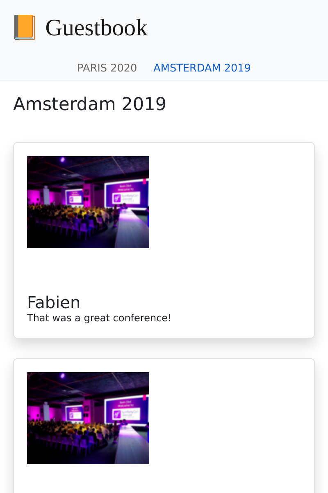

Een SPA bouwen
==============

.. index::
    single: SPA
    single: Mobile

De meeste reacties zullen tijdens de conferentie worden gepost. Sommige mensen zullen daar geen laptop bij zich hebben, maar waarschijnlijk wel een smartphone. Laten we een mobiele app maken om snel de reacties van een conferentie te kunnen checken.

Een manier om zo'n mobiele applicatie te maken is het bouwen van een Javascript Single Page Application (SPA). Een SPA draait lokaal, kan lokale opslag gebruiken, kan een externe HTTP-API aanroepen en kan service workers gebruiken om een bijna native ervaring te creëren.

De applicatie creëren
----------------------

Om de mobiele applicatie te creëren, gaan we `Preact`_ en **Symfony Encore** gebruiken. **Preact** is een kleine en efficiënte basis die zeer geschikt is voor de Gastenboek-SPA.

Om de website en de SPA consistent te maken, gaan we de Sass-stylesheets van de website hergebruiken voor de mobiele applicatie.

Maak de SPA-applicatie aan onder de ``spa``-map en kopieer de stylesheets van de website:

.. code-block:: terminal

    $ mkdir -p spa/src spa/public spa/assets/styles
    $ cp assets/styles/*.scss spa/assets/styles/
    $ cd spa

.. note::

    We hebben een ``public``-map aangemaakt omdat we voornamelijk via een browser met de SPA zullen communiceren. We hadden het ``build`` kunnen noemen als we alleen een mobiele applicatie zouden bouwen.

Voeg alvast een ``.gitignore`` bestand toe:

.. code-block:: text
    :caption: .gitignore

    /node_modules/
    /public/
    /npm-debug.log
    # used later by Cordova
    /app/

Maak het ``package.json``-bestand aan (het Javascript-equivalent van het ``composer.json``-bestand):

.. code-block:: terminal

    $ npm init -y

Voeg nu wat vereiste dependencies toe:

.. code-block:: terminal

    $ npm install @symfony/webpack-encore @babel/core @babel/preset-env babel-preset-preact preact html-webpack-plugin bootstrap

De laatste configuratiestap is het maken van de Webpack Encore-configuratie:

.. code-block:: javascript
    :caption: webpack.config.js
    :emphasize-lines: 8,11

    const Encore = require('@symfony/webpack-encore');
    const HtmlWebpackPlugin = require('html-webpack-plugin');

    Encore
        .setOutputPath('public/')
        .setPublicPath('/')
        .cleanupOutputBeforeBuild()
        .addEntry('app', './src/app.js')
        .enablePreactPreset()
        .enableSingleRuntimeChunk()
        .addPlugin(new HtmlWebpackPlugin({ template: 'src/index.ejs', alwaysWriteToDisk: true }))
    ;

    module.exports = Encore.getWebpackConfig();

De basistemplate van de SPA aanmaken
------------------------------------

Tijd om de initiële template te maken waarin Preact de applicatie zal renderen:

.. code-block:: html
    :caption: src/index.ejs
    :emphasize-lines: 12

    <!DOCTYPE html>
    <html>
    <head>
        <meta http-equiv="Content-Type" content="text/html; charset=utf-8" />
        <meta http-equiv="X-UA-Compatible" content="IE=edge" />
        <meta name="msapplication-tap-highlight" content="no" />
        <meta name="viewport" content="user-scalable=no, initial-scale=1, maximum-scale=1, minimum-scale=1, width=device-width" />

        <title>Conference Guestbook application</title>
    </head>
    <body>
        

    </body>
    </html>

De ``
``-tag is waar de toepassing wordt weergegeven door JavaScript. Hier is de eerste versie van de code die de "Hello World"-weergave weergeeft:

.. code-block:: text
    :caption: src/app.js
    :emphasize-lines: 3,11

    import {h, render} from 'preact';

    function App() {
        return (
            

                Hello world!
            

        )
    }

    render(<App />, document.getElementById('app'));

De laatste regel registreert de ``App()``-functie op het ``#app``-element van de HTML-pagina.

Nu is alles klaar!

Een SPA uitvoeren in de browser
-------------------------------

.. index::
    single: Symfony CLI;server:start
    single: Symfony CLI;server:stop

Omdat deze applicatie onafhankelijk is van de hoofdwebsite, moeten we een andere webserver draaien:

.. code-block:: terminal
    :class: hide

    $ symfony server:stop

.. code-block:: terminal

    $ symfony server:start -d --passthru=index.html

De ``--passthru``-vlag vertelt de webserver om alle HTTP-requests door te geven aan het ``public/index.html``-bestand ( ``public/`` is de standaard root-map van de webserver). Deze pagina wordt beheerd door de Preact-toepassing en die laat de pagina gerenderd worden via de browsergeschiedenis.

Voer ``npm`` uit om de CSS- **en de JavaScript-bestanden** te compileren:

.. code-block:: terminal

    $ ./node_modules/.bin/encore dev

Open de SPA in een browser:

.. code-block:: terminal
    :class: ignore

    $ symfony open:local

En kijk eens naar onze "hello world"-SPA:

Een router toevoegen om states te beheren
-----------------------------------------

De SPA is momenteel niet in staat om verschillende pagina's te verwerken. Om meerdere pagina's te implementeren hebben we een router nodig, zoals voor Symfony. We gaan gebruik maken van de **preact-router**. Het neemt een URL als invoer en koppelt met een Preact component om weer te geven.

Installeer de preact-router:

.. code-block:: terminal

    $ npm install preact-router

Maak een pagina aan voor de homepage (een *Preact component* ):

.. code-block:: text
    :caption: src/pages/home.js

    import {h} from 'preact';

    export default function Home() {
        return (
            
Home

        );
    };

En nog een voor de conferentiepagina:

.. code-block:: text
    :caption: src/pages/conference.js

    import {h} from 'preact';

    export default function Conference() {
        return (
            
Conference

        );
    };

Vervang de "Hello World" ``div`` door de ``Router`` component:

.. code-block:: diff
    :caption: patch_file
    :emphasize-lines: 15,17,20-23

    --- a/src/app.js
    +++ b/src/app.js
    @@ -1,9 +1,22 @@
     import {h, render} from 'preact';
    +import {Router, Link} from 'preact-router';
    +
    +import Home from './pages/home';
    +import Conference from './pages/conference';

     function App() {
         return (
             

    -            Hello world!
    +            <header>
    +                <Link href="/">Home</Link>
    +                 
    +                <Link href="/conference/amsterdam2019">Amsterdam 2019</Link>
    +            </header>
    +
    +            <Router>
    +                <Home path="/" />
    +                <Conference path="/conference/:slug" />
    +            </Router>
             

         )
     }

Bouw de applicatie opnieuw:

.. code-block:: terminal

    $ ./node_modules/.bin/encore dev

Als je de applicatie in de browser vernieuwt, kan je op de "Home" en conferentie links klikken. Merk op dat de browser-URL en de terug/vooruit-knoppen van jouw browser werken zoals je dat zou verwachten.

De SPA van styling voorzien
---------------------------

Zoals bij de website, gaan we de Sass loader toevoegen:

.. code-block:: terminal

    $ npm install node-sass sass-loader

Activeer de Sass loader in Webpack en voeg een verwijzing naar de stylesheet toe:

.. code-block:: diff
    :caption: patch_file

    --- a/src/app.js
    +++ b/src/app.js
    @@ -1,3 +1,5 @@
    +import '../assets/styles/app.scss';
    +
     import {h, render} from 'preact';
     import {Router, Link} from 'preact-router';

    --- a/webpack.config.js
    +++ b/webpack.config.js
    @@ -7,6 +7,7 @@ Encore
         .cleanupOutputBeforeBuild()
         .addEntry('app', './src/app.js')
         .enablePreactPreset()
    +    .enableSassLoader()
         .enableSingleRuntimeChunk()
         .addPlugin(new HtmlWebpackPlugin({ template: 'src/index.ejs', alwaysWriteToDisk: true }))
     ;

We kunnen de applicatie nu bijwerken om de stylesheets te gebruiken:

.. code-block:: diff
    :caption: patch_file

    --- a/src/app.js
    +++ b/src/app.js
    @@ -9,10 +9,20 @@ import Conference from './pages/conference';
     function App() {
         return (
             

    -            <header>
    -                <Link href="/">Home</Link>
    -                 
    -                <Link href="/conference/amsterdam2019">Amsterdam 2019</Link>
    +            <header className="header">
    +                <nav className="navbar navbar-light bg-light">
    +                    

    +                        <Link className="navbar-brand mr-4 pr-2" href="/">
    +                            &#128217; Guestbook
    +                        </Link>
    +                    

    +                </nav>
    +
    +                <nav className="bg-light border-bottom text-center">
    +                    <Link className="nav-conference" href="/conference/amsterdam2019">
    +                        Amsterdam 2019
    +                    </Link>
    +                </nav>
                 </header>

                 <Router>

Bouw de applicatie opnieuw:

.. code-block:: terminal

    $ ./node_modules/.bin/encore dev

Je kan nu genieten van een SPA die van styling voorzien is:

.. figure:: screenshots/spa-home.png
    :alt: /
    :align: center
    :figclass: with-browser spa

Gegevens uit de API halen
-------------------------

De Preact applicatiestructuur is nu klaar: Preact router behandelt de pagina states - inclusief de conference slug placeholder - en de belangrijkste stylesheet van de toepassing wordt gebruikt om de SPA van styling te voorzien.

Om de SPA dynamisch te maken, moeten we gegevens via de API ophalen met HTTP-calls.

Configureer Webpack om de API-endpoint-omgevingsvariabele beschikbaar te maken:

.. code-block:: diff
    :caption: patch_file

    --- a/webpack.config.js
    +++ b/webpack.config.js
    @@ -1,3 +1,4 @@
    +const webpack = require('webpack');
     const Encore = require('@symfony/webpack-encore');
     const HtmlWebpackPlugin = require('html-webpack-plugin');

    @@ -10,6 +11,9 @@ Encore
         .enableSassLoader()
         .enableSingleRuntimeChunk()
         .addPlugin(new HtmlWebpackPlugin({ template: 'src/index.ejs', alwaysWriteToDisk: true }))
    +    .addPlugin(new webpack.DefinePlugin({
    +        'ENV_API_ENDPOINT': JSON.stringify(process.env.API_ENDPOINT),
    +    }))
     ;

     module.exports = Encore.getWebpackConfig();

De ``API_ENDPOINT``-omgevingsvariabele moet verwijzen naar de webserver van de website waar het API-endpoint ``/api`` staat. We zullen dit binnenkort beter configureren wanneer we ``npm`` draaien.

Maak een ``api.js`` bestand aan dat het ophalen van gegevens uit de API verzorgt:

.. code-block:: text
    :caption: src/api/api.js

    function fetchCollection(path) {
        return fetch(ENV_API_ENDPOINT + path).then(resp => resp.json()).then(json => json['hydra:member']);
    }

    export function findConferences() {
        return fetchCollection('api/conferences');
    }

    export function findComments(conference) {
        return fetchCollection('api/comments?conference='+conference.id);
    }

Je kan nu de header- en home componenten aanpassen:

.. code-block:: diff
    :caption: patch_file

    --- a/src/app.js
    +++ b/src/app.js
    @@ -2,11 +2,23 @@ import '../assets/styles/app.scss';

     import {h, render} from 'preact';
     import {Router, Link} from 'preact-router';
    +import {useState, useEffect} from 'preact/hooks';

    +import {findConferences} from './api/api';
     import Home from './pages/home';
     import Conference from './pages/conference';

     function App() {
    +    const [conferences, setConferences] = useState(null);
    +
    +    useEffect(() => {
    +        findConferences().then((conferences) => setConferences(conferences));
    +    }, []);
    +
    +    if (conferences === null) {
    +        return 
Loading...
;
    +    }
    +
         return (
             

                 <header className="header">
    @@ -19,15 +31,17 @@ function App() {
                     </nav>

                     <nav className="bg-light border-bottom text-center">
    -                    <Link className="nav-conference" href="/conference/amsterdam2019">
    -                        Amsterdam 2019
    -                    </Link>
    +                    {conferences.map((conference) => (
    +                        <Link className="nav-conference" href={'/conference/'+conference.slug}>
    +                            {conference.city} {conference.year}
    +                        </Link>
    +                    ))}
                     </nav>
                 </header>

                 <Router>
    -                <Home path="/" />
    -                <Conference path="/conference/:slug" />
    +                <Home path="/" conferences={conferences} />
    +                <Conference path="/conference/:slug" conferences={conferences} />
                 </Router>
             

         )
    --- a/src/pages/home.js
    +++ b/src/pages/home.js
    @@ -1,7 +1,28 @@
     import {h} from 'preact';
    +import {Link} from 'preact-router';
    +
    +export default function Home({conferences}) {
    +    if (!conferences) {
    +        return 
No conferences yet
;
    +    }

    -export default function Home() {
         return (
    -        
Home

    +        

    +            {conferences.map((conference)=> (
    +                

    +                    

    +                        

    +                            <h4 className="font-weight-light">
    +                                {conference.city} {conference.year}
    +                            </h4>
    +                        

    +
    +                        <Link className="btn btn-sm btn-primary stretched-link" href={'/conference/'+conference.slug}>
    +                            View
    +                        </Link>
    +                    

    +                

    +            ))}
    +        

         );
    -};
    +}

Eindelijk geeft Preact Router de "slug" placeholder netjes door aan het Conference component. Gebruik deze om de juiste conferentie en bijhorende reacties te tonen, wederom met behulp van de API; en pas de rendering aan om de API-gegevens te gebruiken:

.. code-block:: diff
    :caption: patch_file

    --- a/src/pages/conference.js
    +++ b/src/pages/conference.js
    @@ -1,7 +1,48 @@
     import {h} from 'preact';
    +import {findComments} from '../api/api';
    +import {useState, useEffect} from 'preact/hooks';
    +
    +function Comment({comments}) {
    +    if (comments !== null && comments.length === 0) {
    +        return 
No comments yet
;
    +    }
    +
    +    if (!comments) {
    +        return 
Loading...
;
    +    }
    +
    +    return (
    +        

    +            {comments.map(comment => (
    +                

    +                    

    +                        {!comment.photoFilename ? '' : (
    +                            <a href={ENV_API_ENDPOINT+'uploads/photos/'+comment.photoFilename} target="_blank">
    +                                
    +                            </a>
    +                        )}
    +                    

    +
    +                    <h5 className="font-weight-light mt-3 mb-0">{comment.author}</h5>
    +                    
{comment.text}

    +                

    +            ))}
    +        

    +    );
    +}
    +
    +export default function Conference({conferences, slug}) {
    +    const conference = conferences.find(conference => conference.slug === slug);
    +    const [comments, setComments] = useState(null);
    +
    +    useEffect(() => {
    +        findComments(conference).then(comments => setComments(comments));
    +    }, [slug]);

    -export default function Conference() {
         return (
    -        
Conference

    +        

    +            <h4>{conference.city} {conference.year}</h4>
    +            <Comment comments={comments} />
    +        

         );
    -};
    +}

De SPA moet de URL naar onze API weten via de ``API_ENDPOINT``-omgevingsvariabele. Stel deze in op de URL van de API-webserver (die in de ``..`` directory wordt uitgevoerd):

.. code-block:: terminal

    $ API_ENDPOINT=`symfony var:export SYMFONY_PROJECT_DEFAULT_ROUTE_URL --dir=..` ./node_modules/.bin/encore dev

Je kunt dit nu ook op de achtergrond laten lopen:

.. code-block:: terminal

    $ API_ENDPOINT=`symfony var:export SYMFONY_PROJECT_DEFAULT_ROUTE_URL --dir=..` symfony run -d --watch=webpack.config.js ./node_modules/.bin/encore dev --watch

En de toepassing in de browser zou nu goed moeten werken:

.. figure:: screenshots/spa-home-final.png
    :alt: /
    :align: center
    :figclass: with-browser spa

Wow! We hebben nu een volledig functionele SPA, met router en echte data. We zouden de Preact app verder kunnen organiseren als we dat willen, maar het werkt nu al geweldig.

De SPA naar productie deployen
------------------------------

.. index::
    single: Platform.sh;Multi-Applications

Platform.sh maakt het mogelijk om meerdere applicaties per project te deployen. Het toevoegen van een andere toepassing kan gedaan worden door een ``.platform.app.yaml`` bestand aan te maken in een subdirectory. Maak er een aan onder de ``spa/`` directory met de naam ``spa``:

.. code-block:: yaml
    :caption: .platform.app.yaml
    :emphasize-lines: 1

    name: spa

    type: nodejs:18

    size: S

    build:
        flavor: none

    web:
        commands:
            start: sleep
        locations:
            "/":
                root: "public"
                index:
                    - "index.html"
                scripts: false
                expires: 10m

    hooks:
        build: |
            set -x -e

            curl -fs https://get.symfony.com/cloud/configurator | bash

            NODE_VERSION=18 node-build

.. index::
    single: Platform.sh;Routes

Bewerk het ``.platform/routes.yaml`` bestand om het ``spa.`` subdomein te routeren naar de ``spa`` applicatie die is opgeslagen in de hoofdmap van het project:

.. code-block:: terminal

    $ cd ../

.. code-block:: diff
    :caption: patch_file
    :emphasize-lines: 4,5

    --- a/.platform/routes.yaml
    +++ b/.platform/routes.yaml
    @@ -1,2 +1,5 @@
     "https://{all}/": { type: upstream, upstream: "varnish:http", cache: { enabled: false } }
     "http://{all}/": { type: redirect, to: "https://{all}/" }
    +
    +"https://spa.{all}/": { type: upstream, upstream: "spa:http" }
    +"http://spa.{all}/": { type: redirect, to: "https://spa.{all}/" }

CORS configureren voor de SPA
-----------------------------

.. index::
    single: CORS
    single: Cross-Origin Resource Sharing

Als je de code nu deployed, zal deze niet werken omdat een browser het API-verzoek zal blokkeren. We moeten de SPA expliciet toegang geven tot de API. Gebruik de huidige domeinnaam die aan de applicatie gekoppeld is:

.. code-block:: terminal

    $ symfony cloud:env:url --pipe --primary

Definieer de ``CORS_ALLOW_ORIGIN`` omgevingsvariabele net zo:

.. code-block:: terminal

    $ symfony cloud:variable:create --sensitive=1 --level=project -y --name=env:CORS_ALLOW_ORIGIN --value="^`symfony cloud:env:url --pipe --primary | sed 's#/$##' | sed 's#https://#https://spa.#'`$"

Als jouw domein gelijk is aan ``https://master-5szvwec-hzhac461b3a6o.eu-5.platformsh.site/``, zullen de ``sed`` calls deze omzetten naar ``https://spa.master-5szvwec-hzhac461b3a6o.eu-5.platformsh.site``.

We moeten ook de ``API_ENDPOINT`` omgevingsvariabele instellen:

.. code-block:: terminal

    $ symfony cloud:variable:create --sensitive=1 --level=project -y --name=env:API_ENDPOINT --value=`symfony cloud:env:url --pipe --primary`

Commit en deploy:

.. code-block:: terminal
    :class: ignore

    $ git add .
    $ git commit -a -m'Add the SPA application'
    $ symfony cloud:deploy

Bezoek de SPA in een browser door de applicatie als een parameter mee te geven:

.. code-block:: terminal
    :class: ignore

    $ symfony cloud:url -1 --app=spa

Cordova gebruiken voor het bouwen van een smartphone-applicatie
---------------------------------------------------------------

.. index::
    single: SPA;Cordova
    single: Apache Cordova
    single: Cordova

**Apache Cordova** is een tool die cross-platform smartphone-toepassingen bouwt. En goed nieuws, het kan gebruik maken van de SPA die we zojuist hebben gecreëerd.

Laten we dit installeren:

.. code-block:: terminal

    $ cd spa
    $ npm install cordova

.. note::

    Je moet ook de Android SDK installeren. Deze sectie vermeldt alleen Android, maar Cordova werkt met alle mobiele platforms, inclusief iOS.

Maak de mapstructuur van de toepassing aan:

.. code-block:: terminal
    :class: answers(n)

    $ ./node_modules/.bin/cordova create app

En genereer de Android-applicatie:

.. code-block:: terminal
    :class: ignore

    $ cd app
    $ ~/.npm/bin/cordova platform add android
    $ cd ..

Dat is alles wat je nodig hebt. Je kan nu de productiebestanden bouwen en deze naar Cordova verplaatsen:

.. code-block:: terminal

    $ API_ENDPOINT=`symfony var:export SYMFONY_PROJECT_DEFAULT_ROUTE_URL --dir=..` ./node_modules/.bin/encore production
    $ rm -rf app/www
    $ mkdir -p app/www
    $ cp -R public/ app/www

Start de applicatie op een smartphone of emulator:

.. code-block:: terminal
    :class: ignore

    $ ./node_modules/.bin/cordova run android

.. sidebar:: Verder gaan

    * `De officiële Preact website`_;

    * `De officiële Cordova website`_.

.. _`Preact`: https://preactjs.com/
.. _`De officiële Preact website`: https://preactjs.com/
.. _`De officiële Cordova website`: https://cordova.apache.org/
