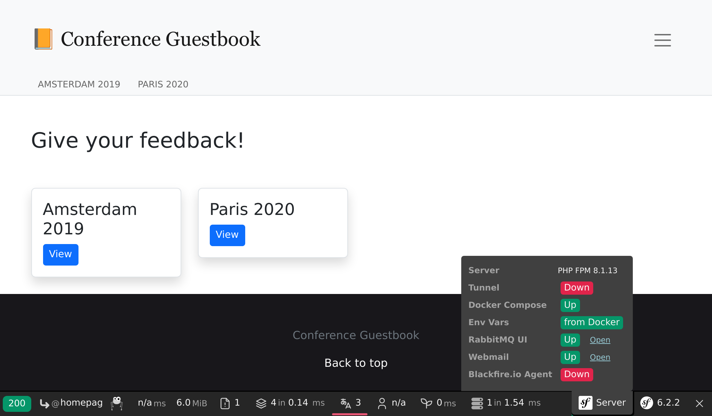

RabbitMQ gebruiken als een message-broker
=========================================

.. index::
    single: RabbitMQ

RabbitMQ is een zeer populaire message broker die je kunt gebruiken als alternatief voor PostgreSQL.

Overschakelen van PostgreSQL naar RabbitMQ
------------------------------------------

Om RabbitMQ te gebruiken in plaats van PostgreSQL als message-broker:

.. code-block:: diff
    :caption: patch_file

    --- a/config/packages/messenger.yaml
    +++ b/config/packages/messenger.yaml
    @@ -5,10 +5,7 @@ framework:
             transports:
                 # https://symfony.com/doc/current/messenger.html#transport-configuration
                 async:
    -                dsn: '%env(MESSENGER_TRANSPORT_DSN)%'
    -                options:
    -                    use_notify: true
    -                    check_delayed_interval: 60000
    +                dsn: '%env(RABBITMQ_URL)%'
                     retry_strategy:
                         max_retries: 3
                         multiplier: 2

We moeten ook RabbitMQ ondersteuning toevoegen voor Messenger:

.. code-block:: terminal

    $ symfony composer req amqp-messenger

RabbitMQ toevoegen aan de Docker Stack
--------------------------------------

.. index::
    single: Docker;RabbitMQ

Zoals je misschien al geraden hebt, moeten we ook RabbitMQ toevoegen aan de Docker Compose stack:

.. code-block:: diff
    :caption: patch_file

    --- a/docker-compose.yml
    +++ b/docker-compose.yml
    @@ -19,6 +19,10 @@ services:
         image: redis:5-alpine
         ports: [6379]

    +  rabbitmq:
    +    image: rabbitmq:3-management
    +    ports: [5672, 15672]
    +
     volumes:
     ###> doctrine/doctrine-bundle ###
       db-data:

Docker services herstarten
--------------------------

Om Docker Compose te dwingen rekening te houden met de RabbitMQ-container, stop je de containers en start je ze opnieuw:

.. code-block:: terminal

    $ docker-compose stop
    $ docker-compose up -d

.. code-block:: terminal
    :class: hide

    $ sleep 10

Het verkennen van de RabbitMQ web-beheerinterface
-------------------------------------------------

.. index::
    single: Symfony CLI;open:local:rabbitmq

Als je wachtrijen wil zien en berichten door RabbitMQ wil zien vloeien, open dan de web-beheerinterface:

.. code-block:: terminal
    :class: ignore

    $ symfony open:local:rabbitmq

Of via de online debug toolbar:

Gebruik ``guest``/``guest`` om in te loggen op de RabbitMQ-beheerinterface:

.. figure:: screenshots/rabbitmq-management.png
    :alt: /
    :align: center
    :figclass: with-browser

RabbitMQ deployen
-----------------

.. index::
    single: Platform.sh;RabbitMQ
    single: RabbitMQ

RabbitMQ toevoegen aan de productieservers kan, door deze toe te voegen aan de lijst met services:

.. code-block:: diff
    :caption: patch_file

    --- a/.platform/services.yaml
    +++ b/.platform/services.yaml
    @@ -18,3 +18,8 @@ files:

     rediscache:
         type: redis:5.0
    +
    +queue:
    +    type: rabbitmq:3.7
    +    disk: 1024
    +    size: S

Verwijs ernaar in de web container configuratie en schakel de ``amqp`` PHP-extensie in:

.. code-block:: diff
    :caption: patch_file

    --- a/.platform.app.yaml
    +++ b/.platform.app.yaml
    @@ -8,6 +8,7 @@ dependencies:

     runtime:
         extensions:
    +        - amqp
             - apcu
             - blackfire
             - ctype
    @@ -42,6 +43,7 @@ mounts:
     relationships:
         database: "database:postgresql"
         redis: "rediscache:redis"
    +    rabbitmq: "queue:rabbitmq"
         
     hooks:
         build: |

.. index::
    single: Platform.sh;Tunnel
    single: Symfony CLI;cloud:tunnel:open
    single: Symfony CLI;cloud:tunnel:close
    single: Symfony CLI;open:remote:rabbitmq

Wanneer de RabbitMQ-service in een project is geïnstalleerd, kan je de web beheerinterface openen door eerst de tunnel te openen:

.. code-block:: terminal
    :class: ignore

    $ symfony cloud:tunnel:open
    $ symfony open:remote:rabbitmq

    # when done
    $ symfony cloud:tunnel:close

.. sidebar:: Verder gaan

    * `RabbitMQ documentatie`_.

.. _`RabbitMQ documentatie`: https://www.rabbitmq.com/documentation.html
