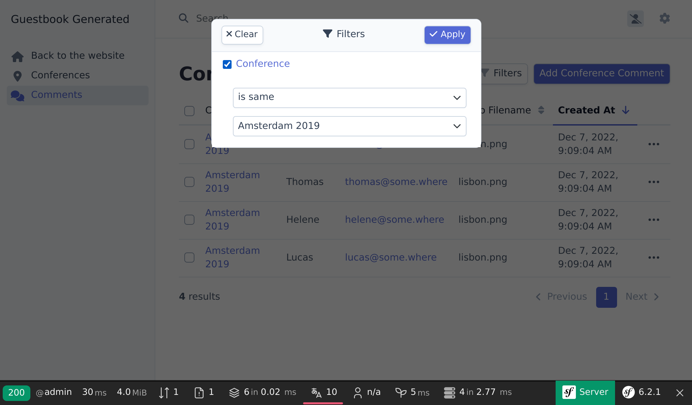

Een admin-backend opzetten
==========================

.. index::
    single: EasyAdmin
    single: Admin
    single: Backend

Het toevoegen van aankomende conferenties aan de database is de taak van de projectbeheerders. Een *admin-backend* is een beschermd deel van de website waar *projectbeheerders* de gegevens van de website kunnen beheren, feedback kunnen modereren, en meer.

Hoe kunnen we dit snel creëren? Door gebruik te maken van een bundle die in staat is om een admin-backend te genereren op basis van het model van het project. EasyAdmin past perfect in dit plaatje.

Meer Afhankelijkheden Installeren
---------------------------------

Ondanks dat de ``webapp`` package automatisch vele handige packages heeft toegevoegd, zullen we zelf nog afhankelijkheden moeten toevoegen om gebruik te kunnen maken van een aantal specifieke features. Hoe we extra afhankelijkheden toevoegen? Via Composer. Naast de "gewone" Composer packages zullen we werken met twee "speciale" soorten packages:

* *Symfony Componenten*: Packages die op een laag niveau kerntaken en abstracties toevoegen die de meeste applicaties nodig hebben (routing, console, HTTP client, mailer, cache, ...);

* *Symfony Bundels*: Packages die op een hoog niveau features of integraties met externe libraries toevoegen (bundels zijn meestal bijgedragen door de community).

Voeg EasyAdmin toe als projectdependency:

.. code-block:: terminal

    $ symfony composer req "admin:^4"

``admin`` is een alias voor de ``easycorp/easyadmin-bundle`` package.

*Aliases* zijn geen feature van Composer, maar een concept dat door Symfony toegevoegd is om je het leven eenvoudiger te maken. Aliases geven je sneller toegang tot populaire Composer packages. Wil je een ORM voor je applicatie? Vereis dan ``orm``. Wil je een API ontwikkelen? Vereis dan ``api``. Deze aliases worden automatisch vertaald naar één of meerdere gewone Composer packages. Het zijn wel eigen keuzes die gemaakt werden door het Symfony core team.

Een andere mooie feature is dat je altijd de ``symfony`` vendor kan weglaten. Vereis ``cache`` in plaats van ``symfony/cache``.

.. tip::

    Heb je onthouden dat we het over een Composer plugin genaamd ``symfony/flex`` hebben gehad? Aliases is één van de features van deze plugin.

EasyAdmin configureren
----------------------

EasyAdmin genereert automatisch een op specifieke controllers gebaseerd admin-gedeelte voor je applicatie.

Laten we om met EasyAdmin te starten een "web admin dashboard" genereren. Dit dashboard zal het beginpunt zijn om de website-gegevens te beheren:

.. code-block:: terminal
    :class: answers(DashboardController||src/Controller/Admin/)

    $ symfony console make:admin:dashboard

Als je de standaard antwoorden accepteert, zal de volgende controller worden aangemaakt:

.. code-block:: php
    :caption: src/Controller/Admin/DashboardController.php
    :class: ignore

    namespace App\Controller\Admin;

    use EasyCorp\Bundle\EasyAdminBundle\Config\Dashboard;
    use EasyCorp\Bundle\EasyAdminBundle\Config\MenuItem;
    use EasyCorp\Bundle\EasyAdminBundle\Controller\AbstractDashboardController;
    use Symfony\Component\HttpFoundation\Response;
    use Symfony\Component\Routing\Annotation\Route;

    class DashboardController extends AbstractDashboardController
    {
        /**
         * @Route("/admin", name="admin")
         */
        public function index(): Response
        {
            return parent::index();
        }

        public function configureDashboard(): Dashboard
        {
            return Dashboard::new()
                ->setTitle('Guestbook');
        }

        public function configureMenuItems(): iterable
        {
            yield MenuItem::linkToDashboard('Dashboard', 'fa fa-home');
            // yield MenuItem::linkToCrud('The Label', 'icon class', EntityClass::class);
        }
    }

Volgens conventie worden alle admin-controllers opgeslagen binnen hun eigen ``App\Controller\Admin`` namespace.

Ga naar de gegenereerde admin-backend op ``/admin``, zoals geconfigureerd bij de ``index()`` methode. Je kunt eventueel de URL aanpassen:

.. figure:: screenshots/easy-admin-empty.png
    :alt: /admin
    :align: center
    :figclass: with-browser

Boem! We hebben een mooie admin-interface, klaar om aangepast te worden naar onze wensen.

.. index::
    single: CRUD

De volgende stap is het genereren van controllers om conferenties en reacties te beheren.

Wellicht heb je de ``configureMenuItems()`` methode in de dashboard-controller gezien. Deze methode heeft documentatie over het toevoegen van "CRUD" links. **CRUD** is een afkorting voor "Create, Read, Update, en Delete" (Toevoegen, Lezen, Bijwerken en Verwijderen). Dat is precies wat we willen dat onze admin doet. EasyAdmin voegt daarnaast zoek- en filtermogelijkheden toe.

Laten we een CRUD genereren voor conferenties:

.. code-block:: terminal
    :class: answers(1||src/Controller/Admin/||App\\Controller\\Admin)

    $ symfony console make:admin:crud

Selecteer ``1`` om een admin-interface voor conferenties te genereren en gebruik de standaard antwoorden voor de overige vragen. Het volgende bestand zou nu gegenereerd moeten worden:

.. code-block:: php
    :caption: src/Controller/Admin/ConferenceCrudController.php
    :class: ignore

    namespace App\Controller\Admin;

    use App\Entity\Conference;
    use EasyCorp\Bundle\EasyAdminBundle\Controller\AbstractCrudController;

    class ConferenceCrudController extends AbstractCrudController
    {
        public static function getEntityFqcn(): string
        {
            return Conference::class;
        }

        /*
        public function configureFields(string $pageName): iterable
        {
            return [
                IdField::new('id'),
                TextField::new('title'),
                TextEditorField::new('description'),
            ];
        }
        */
    }

Doe hetzelfde voor reacties:

.. code-block:: terminal
    :class: answers(0||src/Controller/Admin/||App\\Controller\\Admin)

    $ symfony console make:admin:crud

De laatste stap is om links naar de conferentie- en reactie-admin CRUDs toe te voegen aan het dashboard:

.. code-block:: diff
    :caption: patch_file

    --- a/src/Controller/Admin/DashboardController.php
    +++ b/src/Controller/Admin/DashboardController.php
    @@ -2,6 +2,8 @@

     namespace App\Controller\Admin;

    +use App\Entity\Comment;
    +use App\Entity\Conference;
     use EasyCorp\Bundle\EasyAdminBundle\Config\Dashboard;
     use EasyCorp\Bundle\EasyAdminBundle\Config\MenuItem;
     use EasyCorp\Bundle\EasyAdminBundle\Controller\AbstractDashboardController;
    @@ -40,7 +42,8 @@ class DashboardController extends AbstractDashboardController

         public function configureMenuItems(): iterable
         {
    -        yield MenuItem::linkToDashboard('Dashboard', 'fa fa-home');
    -        // yield MenuItem::linkToCrud('The Label', 'fas fa-list', EntityClass::class);
    +        yield MenuItem::linktoRoute('Back to the website', 'fas fa-home', 'homepage');
    +        yield MenuItem::linkToCrud('Conferences', 'fas fa-map-marker-alt', Conference::class);
    +        yield MenuItem::linkToCrud('Comments', 'fas fa-comments', Comment::class);
         }
     }

We hebben de ``configureMenuItems()`` methode overschreven om menu-items met relevante iconen voor conferenties en reacties toe te voegen en om een link terug naar de homepage toe te voegen.

EasyAdmin heeft een API om het linken naar entity CRUDs makkelijker te maken middels de ``MenuItem::linkToRoute()`` methode.

De dashboard-pagina is op dit moment nog leeg. Hier zou je statistieken of andere relevante informatie kunnen tonen. Omdat we op dit moment nog geen informatie te tonen hebben, gaan we redirecten naar de conferentie lijst:

.. code-block:: diff
    :caption: patch_file

    --- a/src/Controller/Admin/DashboardController.php
    +++ b/src/Controller/Admin/DashboardController.php
    @@ -7,6 +7,7 @@ use App\Entity\Conference;
     use EasyCorp\Bundle\EasyAdminBundle\Config\Dashboard;
     use EasyCorp\Bundle\EasyAdminBundle\Config\MenuItem;
     use EasyCorp\Bundle\EasyAdminBundle\Controller\AbstractDashboardController;
    +use EasyCorp\Bundle\EasyAdminBundle\Router\AdminUrlGenerator;
     use Symfony\Component\HttpFoundation\Response;
     use Symfony\Component\Routing\Annotation\Route;

    @@ -15,7 +16,10 @@ class DashboardController extends AbstractDashboardController
         #[Route('/admin', name: 'admin')]
         public function index(): Response
         {
    -        return parent::index();
    +        $routeBuilder = $this->container->get(AdminUrlGenerator::class);
    +        $url = $routeBuilder->setController(ConferenceCrudController::class)->generateUrl();
    +
    +        return $this->redirect($url);

             // Option 1. You can make your dashboard redirect to some common page of your backend
             //

Bij het weergeven van relaties tussen entities (de conferentie die aan een reactie is gelinkt) zal EasyAdmin proberen om een tekstuele weergave van de conferentie te gebruiken. Standaard wordt de class-naam plus de primary key gebruikt (bijvoorbeeld ``Conference #1``), tenzij de entity een "magische" ``__toString()`` methode heeft. Om de weergave duidelijker te maken, voeg deze methode toe aan de ``Conference`` class:

.. code-block:: diff
    :caption: patch_file

    --- a/src/Entity/Conference.php
    +++ b/src/Entity/Conference.php
    @@ -32,6 +32,11 @@ class Conference
             $this->comments = new ArrayCollection();
         }

    +    public function __toString(): string
    +    {
    +        return $this->city.' '.$this->year;
    +    }
    +
         public function getId(): ?int
         {
             return $this->id;

Je kan nu rechtstreeks vanuit de admin-backend conferenties toevoegen, wijzigen en verwijderen. Speel ermee en voeg ten minste één conferentie toe.

.. figure:: screenshots/easy-admin.png
    :alt: /admin
    :align: center
    :figclass: with-browser

Voeg een aantal reacties zonder foto's toe. Stel de datum voorlopig handmatig in; we vullen de ``createdAt`` kolom in een later stadium automatisch in.

.. figure:: screenshots/easy-admin-comments.png
    :alt: /admin?crudAction=index&crudId=2bfa220&menuIndex=2&submenuIndex=-1
    :align: center
    :figclass: with-browser

EasyAdmin aanpassen
-------------------

De standaard admin-backend werkt goed, maar kan op vele manieren worden aangepast om de gebruikerservaring te verbeteren. Laten we enkele eenvoudige aanpassingen doen om enkele mogelijkheden te demonstreren:

.. code-block:: diff
    :caption: patch_file

    --- a/src/Controller/Admin/CommentCrudController.php
    +++ b/src/Controller/Admin/CommentCrudController.php
    @@ -3,7 +3,15 @@
     namespace App\Controller\Admin;

     use App\Entity\Comment;
    +use EasyCorp\Bundle\EasyAdminBundle\Config\Crud;
    +use EasyCorp\Bundle\EasyAdminBundle\Config\Filters;
     use EasyCorp\Bundle\EasyAdminBundle\Controller\AbstractCrudController;
    +use EasyCorp\Bundle\EasyAdminBundle\Field\AssociationField;
    +use EasyCorp\Bundle\EasyAdminBundle\Field\DateTimeField;
    +use EasyCorp\Bundle\EasyAdminBundle\Field\EmailField;
    +use EasyCorp\Bundle\EasyAdminBundle\Field\TextareaField;
    +use EasyCorp\Bundle\EasyAdminBundle\Field\TextField;
    +use EasyCorp\Bundle\EasyAdminBundle\Filter\EntityFilter;

     class CommentCrudController extends AbstractCrudController
     {
    @@ -12,14 +20,44 @@ class CommentCrudController extends AbstractCrudController
             return Comment::class;
         }

    -    /*
    +    public function configureCrud(Crud $crud): Crud
    +    {
    +        return $crud
    +            ->setEntityLabelInSingular('Conference Comment')
    +            ->setEntityLabelInPlural('Conference Comments')
    +            ->setSearchFields(['author', 'text', 'email'])
    +            ->setDefaultSort(['createdAt' => 'DESC'])
    +        ;
    +    }
    +
    +    public function configureFilters(Filters $filters): Filters
    +    {
    +        return $filters
    +            ->add(EntityFilter::new('conference'))
    +        ;
    +    }
    +
         public function configureFields(string $pageName): iterable
         {
    -        return [
    -            IdField::new('id'),
    -            TextField::new('title'),
    -            TextEditorField::new('description'),
    -        ];
    +        yield AssociationField::new('conference');
    +        yield TextField::new('author');
    +        yield EmailField::new('email');
    +        yield TextareaField::new('text')
    +            ->hideOnIndex()
    +        ;
    +        yield TextField::new('photoFilename')
    +            ->onlyOnIndex()
    +        ;
    +
    +        $createdAt = DateTimeField::new('createdAt')->setFormTypeOptions([
    +            'years' => range(date('Y'), date('Y') + 5),
    +            'widget' => 'single_text',
    +        ]);
    +        if (Crud::PAGE_EDIT === $pageName) {
    +            yield $createdAt->setFormTypeOption('disabled', true);
    +        } else {
    +            yield $createdAt;
    +        }
         }
    -    */
     }

Door de velden expliciet in de ``configureFields()`` methode te zetten, kunnen we deze in onze eigen volgorde plaatsen. Sommige velden kunnen nog verder worden geconfigureerd, bijvoorbeeld door ze te verbergen op de hoofdpagina.

De ``configureFilters()`` methode definiëert welke filters er boven het zoekveld getoond moeten worden.

Deze aanpassingen zijn slechts een kleine introductie van de mogelijkheden van EasyAdmin.

Speel met de admin, filter de reacties per conferentie, of zoek bijvoorbeeld op basis van het e-mailadres naar reacties. Het enige probleem is dat iedereen toegang heeft tot de backend. Maak je geen zorgen, we zullen dit in de volgende stap veilig maken.

.. code-block:: terminal
    :class: hide

    $ symfony run psql -c "TRUNCATE conference RESTART IDENTITY CASCADE"

.. sidebar:: Verder gaan

    * `EasyAdmin-documentatie`_;

    * `Configuratiehandleiding voor het Symfony framework`_;

    * `PHP magic methodes`_.

.. _`EasyAdmin-documentatie`: https://symfony.com/bundles/EasyAdminBundle/4.x/index.html
.. _`Configuratiehandleiding voor het Symfony framework`: https://symfony.com/doc/current/reference/configuration/framework.html
.. _`PHP magic methodes`: https://www.php.net/manual/en/language.oop5.magic.php
