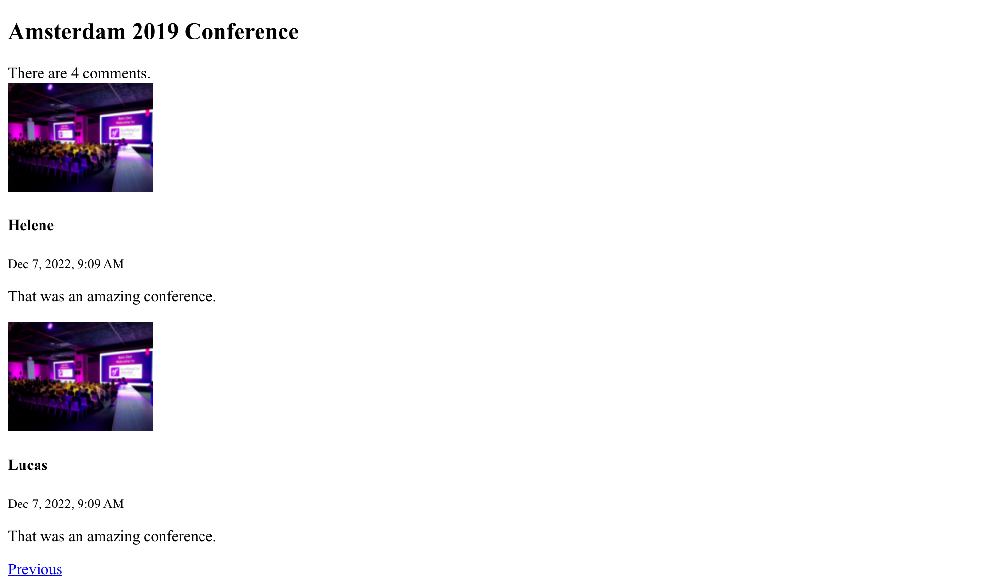

Tworzenie interfejsu użytkownika
=================================

.. index::
    single: Twig
    single: Templates

Wszystko jest teraz na swoim miejscu. Możemy stworzyć pierwszą wersję interfejsu strony. Nie będziemy rozczulać się nad jej wyglądem. Na razie skupmy się na jej działaniu.

Pamiętasz zabieg, którego musieliśmy dokonać w kontrolerze dla easter egga, aby uniknąć problemów z bezpieczeństwem? Z tego powodu nie będziemy używać PHP w naszych szablonach. Zamiast tego użyjemy Twiga. Oprócz obsługi filtrowania wyjścia `Twig`_ wnosi wiele przydatnych funkcji, takich jak dziedziczenie szablonów.

Używanie Twiga do szablonów
-----------------------------

.. index::
    single: Twig;Layout
    single: Twig;block

Wszystkie podstrony w serwisie będą miały ten sam *układ*. Podczas instalacji Twiga, katalog ``templates/`` został utworzony automatycznie, a w nim utworzono również przykładowy układ w pliku ``base.html.twig``.

.. code-block:: html+twig
    :caption: templates/base.html.twig
    :class: ignore

    <!DOCTYPE html>
    <html>
        <head>
            <meta charset="UTF-8">
            <title>Welcome!</title>
            <link rel="icon" href="data:image/svg+xml,<svg xmlns=%22http://www.w3.org/2000/svg%22 viewBox=%220 0 128 128%22><text y=%221.2em%22 font-size=%2296%22>⚫️</text></svg>">
            {# Run `composer require symfony/webpack-encore-bundle` to start using Symfony UX #}
            
                {{ encore_entry_link_tags('app') }}
            

            
                {{ encore_entry_script_tags('app') }}
            
        </head>
        <body>
            
        </body>
    </html>

Układ może definiować elementy nazywane blokami (ang. ``block``). Są to miejsca, które pozwalają na *rozszerzenie* układu, dodając do niego zawartość z *szablonu potomnego*.

.. index::
    single: Twig;extends
    single: Twig;for

Stwórzmy szablon dla strony głównej naszego projektu w pliku ``templates/conference/index.html.twig``:

.. code-block:: html+twig
    :caption: templates/conference/index.html.twig

    

    Conference Guestbook

    
        <h2>Give your feedback!</h2>

        
            <h4>{{ conference }}</h4>
        
    

Szablon *rozszerza* ``base.html.twig`` i nadpisuje bloki ``body`` oraz ``title``.

.. index::
    single: Twig;Syntax

Zapis ```` w szablonie wskazuje *działania* i *strukturę*.

Zapis ``{{ }}`` służy do *wyświetlania* wartości. ``{{ conference }}`` wyświetli reprezentację obiektu (wynik wywołania metody ``__toString`` na obiekcie klasy ``Conference``).

Używanie Twiga w kontrolerze
-----------------------------

Zaktualizuj kontroler, aby wyrenderować szablon Twiga:

.. code-block:: diff
    :caption: patch_file

    --- a/src/Controller/ConferenceController.php
    +++ b/src/Controller/ConferenceController.php
    @@ -2,22 +2,19 @@

     namespace App\Controller;

    +use App\Repository\ConferenceRepository;
     use Symfony\Bundle\FrameworkBundle\Controller\AbstractController;
     use Symfony\Component\HttpFoundation\Response;
     use Symfony\Component\Routing\Annotation\Route;
    +use Twig\Environment;

     class ConferenceController extends AbstractController
     {
         #[Route('/', name: 'homepage')]
    -    public function index(): Response
    +    public function index(Environment $twig, ConferenceRepository $conferenceRepository): Response
         {
    -        return new Response(<<<EOF
    -            <html>
    -                <body>
    -                    
    -                </body>
    -            </html>
    -            EOF
    -        );
    +        return new Response($twig->render('conference/index.html.twig', [
    +            'conferences' => $conferenceRepository->findAll(),
    +        ]));
         }
     }

Sporo się tu dzieje.

Aby móc wyrenderować szablon, potrzebujemy obiektu ``Environment`` z biblioteki Twig (kluczowego elementu tej biblioteki). Zauważ, że odnosimy się do instancji klasy Twig, wskazując ją w metodzie kontrolera. Symfony jest na tyle inteligentny, że wie, jak wstrzyknąć odpowiedni obiekt.

Potrzebujemy również repozytorium konferencji, aby mieć możliwość pobrania wszystkich konferencji z bazy danych.

W kodzie kontrolera mamy metodę ``render()``, która renderuje szablon i przekazuje do niego tablicę zmiennych. Przekazujemy listę obiektów klasy ``Conference`` jako zmienną ``conferences``.

Kontroler jest zwykłą klasą PHP. Nie musi ona nawet dziedziczyć po klasie ``AbstractController``, jeśli nie chcemy mieć zbyt wielu zależności. Możesz usunąć to dziedziczenie (ale nie rób tego, ponieważ w kolejnych krokach skorzystamy z uproszczeń, które daje nam ten zabieg).

Tworzenie strony konferencji
----------------------------

Dla każdej konferencji powinniśmy mieć osobną stronę, na której można wyświetlić listę komentarzy. Dodanie nowej strony sprowadza się do stworzenia kontrolera, zdefiniowania dla niego trasy (ang. route) i utworzenia odpowiedniego szablonu.

Dodaj metodę ``show()`` w ``src/Controller/ConferenceController.php``:

.. code-block:: diff
    :caption: patch_file

    --- a/src/Controller/ConferenceController.php
    +++ b/src/Controller/ConferenceController.php
    @@ -2,6 +2,8 @@

     namespace App\Controller;

    +use App\Entity\Conference;
    +use App\Repository\CommentRepository;
     use App\Repository\ConferenceRepository;
     use Symfony\Bundle\FrameworkBundle\Controller\AbstractController;
     use Symfony\Component\HttpFoundation\Response;
    @@ -17,4 +19,13 @@ class ConferenceController extends AbstractController
                 'conferences' => $conferenceRepository->findAll(),
             ]));
         }
    +
    +    #[Route('/conference/{id}', name: 'conference')]
    +    public function show(Environment $twig, Conference $conference, CommentRepository $commentRepository): Response
    +    {
    +        return new Response($twig->render('conference/show.html.twig', [
    +            'conference' => $conference,
    +            'comments' => $commentRepository->findBy(['conference' => $conference], ['createdAt' => 'DESC']),
    +        ]));
    +    }
     }

Ta metoda zachowuje się w szczególny sposób, z którym jeszcze się nie spotkaliśmy. Prosimy o wstrzyknięcie do niej obiektu klasy ``Conference``. Konferencji w bazie może być wiele, ale Symfony jest w stanie określić, którą z nich chcesz pobrać, na podstawie parametru ``{id}`` podanego w ścieżce żądania (``id`` jest kluczem podstawowym tabeli ``conference`` w bazie danych).

Pobranie komentarzy powiązanych z konferencją można wykonać za pomocą metody ``findBy()``, która przyjmuje kryteria zapytania jako pierwszy argument.

.. index::
    single: Twig;extends
    single: Twig;block
    single: Twig;for
    single: Twig;if
    single: Twig;else
    single: Twig;asset
    single: Twig;format_datetime
    single: Twig;length

Ostatnim krokiem jest utworzenie pliku ``templates/conference/show.html.twig``:

.. code-block:: html+twig
    :caption: templates/conference/show.html.twig

    

    Conference Guestbook - {{ conference }}

    
        <h2>{{ conference }} Conference</h2>

        
            
                
                    
                

                <h4>{{ comment.author }}</h4>
                <small>
                    {{ comment.createdAt|format_datetime('medium', 'short') }}
                </small>

                
{{ comment.text }}

            
        
            
No comments have been posted yet for this conference.

        
    

W tym szablonie używamy zapisu ``|`` do wywoływania *filtrów* Twiga. Filtr zajmuje się przekształcaniem podanej wartości. ``comments|length`` zwraca liczbę komentarzy, a ``comment.createdAt|format_datetime('medium', 'short')`` wyświetla datę w czytelnym dla człowieka formacie.

Próbując dotrzeć do pierwszej konferencji poprzez adres ``/conference/1`` zauważysz następujący błąd:

.. figure:: screenshots/intl-twig-error.png
    :alt: /conference/1
    :align: center
    :figclass: with-browser

Błąd jest efektem wywołania ``format_datetime`` ponieważ ten filtr nie jest częścią Twiga. Komunikat o błędzie wskazuje, który pakiet powinien zostać zainstalowany, aby rozwiązać problem:

.. code-block:: terminal

    $ symfony composer req "twig/intl-extra:^3"

Teraz strona działa poprawnie.

Tworzenie odnośników między stronami
---------------------------------------

.. index::
    single: Twig;Link
    single: Link

Ostatnim krokiem niezbędnym do ukończenia naszej pierwszej wersji interfejsu użytkownika jest stworzenie odnośników na stronie głównej do stron poszczególnych konferencji:

.. code-block:: diff
    :caption: patch_file

    --- a/templates/conference/index.html.twig
    +++ b/templates/conference/index.html.twig
    @@ -7,5 +7,8 @@

         
             <h4>{{ conference }}</h4>
    +        

    +            <a href="/conference/{{ conference.id }}">View</a>
    +        

         
     

Zapisywanie ścieżki na sztywno w kodzie jest nie najlepszym pomysłem z kilku powodów. Najważniejszym z nim jest sytuacja, w której zmieniając ścieżkę (np. z ``/conference/{id}`` na ``/conferences/{id}``),  musimy poprawić ręcznie wszystkie odnośniki.

.. index::
    single: Twig;path

Zamiast wpisywania ścieżki na sztywno w kodzie, użyj wbudowanej *funkcji* Twiga ``path()`` i *nazwy trasy* :

.. code-block:: diff
    :caption: patch_file

    --- a/templates/conference/index.html.twig
    +++ b/templates/conference/index.html.twig
    @@ -8,7 +8,7 @@
         
             <h4>{{ conference }}</h4>
             

    -            <a href="/conference/{{ conference.id }}">View</a>
    +            <a href="{{ path('conference', { id: conference.id }) }}">View</a>
             

         
     

Funkcja ``path()`` tworzy ścieżkę do strony na podstawie nazwy trasy. Wartości parametrów ścieżki są przekazywane jako argumenty Twiga.

Stronicowanie komentarzy
------------------------

.. index::
    single: Doctrine;Paginator
    single: Paginator

Przy tysiącach uczestników możemy spodziewać się wielu komentarzy. Jeśli wyświetlimy je wszystkie na jednej stronie, to będzie ona się wydłużać w zastraszającym tempie.

Stwórz metodę ``getCommentPaginator()`` w repozytorium komentarzy, która zwróci obiekt do stronicowania komentarzy (ang. paginator) na podstawie konferencji i przesunięcia (ang. offset), czyli informacji, od którego komentarza należy zacząć:

.. code-block:: diff
    :caption: patch_file

    --- a/src/Repository/CommentRepository.php
    +++ b/src/Repository/CommentRepository.php
    @@ -3,8 +3,10 @@
     namespace App\Repository;

     use App\Entity\Comment;
    +use App\Entity\Conference;
     use Doctrine\Bundle\DoctrineBundle\Repository\ServiceEntityRepository;
     use Doctrine\Persistence\ManagerRegistry;
    +use Doctrine\ORM\Tools\Pagination\Paginator;

     /**
      * @extends ServiceEntityRepository<Comment>
    @@ -16,11 +18,27 @@ use Doctrine\Persistence\ManagerRegistry;
      */
     class CommentRepository extends ServiceEntityRepository
     {
    +    public const PAGINATOR_PER_PAGE = 2;
    +
         public function __construct(ManagerRegistry $registry)
         {
             parent::__construct($registry, Comment::class);
         }

    +    public function getCommentPaginator(Conference $conference, int $offset): Paginator
    +    {
    +        $query = $this->createQueryBuilder('c')
    +            ->andWhere('c.conference = :conference')
    +            ->setParameter('conference', $conference)
    +            ->orderBy('c.createdAt', 'DESC')
    +            ->setMaxResults(self::PAGINATOR_PER_PAGE)
    +            ->setFirstResult($offset)
    +            ->getQuery()
    +        ;
    +
    +        return new Paginator($query);
    +    }
    +
         public function save(Comment $entity, bool $flush = false): void
         {
             $this->getEntityManager()->persist($entity);

Aby ułatwić testowanie, ustaliliśmy maksymalną liczbę komentarzy na stronę na 2 wpisy.

Aby móc zmieniać stronicowanie w szablonie, zamiast obiektu Doctrine Collection przekaż do Twiga obiekt Doctrine Paginator:

.. code-block:: diff
    :caption: patch_file

    --- a/src/Controller/ConferenceController.php
    +++ b/src/Controller/ConferenceController.php
    @@ -6,6 +6,7 @@ use App\Entity\Conference;
     use App\Repository\CommentRepository;
     use App\Repository\ConferenceRepository;
     use Symfony\Bundle\FrameworkBundle\Controller\AbstractController;
    +use Symfony\Component\HttpFoundation\Request;
     use Symfony\Component\HttpFoundation\Response;
     use Symfony\Component\Routing\Annotation\Route;
     use Twig\Environment;
    @@ -21,11 +22,16 @@ class ConferenceController extends AbstractController
         }

         #[Route('/conference/{id}', name: 'conference')]
    -    public function show(Environment $twig, Conference $conference, CommentRepository $commentRepository): Response
    +    public function show(Request $request, Environment $twig, Conference $conference, CommentRepository $commentRepository): Response
         {
    +        $offset = max(0, $request->query->getInt('offset', 0));
    +        $paginator = $commentRepository->getCommentPaginator($conference, $offset);
    +
             return new Response($twig->render('conference/show.html.twig', [
                 'conference' => $conference,
    -            'comments' => $commentRepository->findBy(['conference' => $conference], ['createdAt' => 'DESC']),
    +            'comments' => $paginator,
    +            'previous' => $offset - CommentRepository::PAGINATOR_PER_PAGE,
    +            'next' => min(count($paginator), $offset + CommentRepository::PAGINATOR_PER_PAGE),
             ]));
         }
     }

Kontroler pobiera parametr ``offset`` z adresu żądania przechowywanego w obiekcie klasy Request (``$request->query``) jako liczbę całkowitą (``getInt()``). Domyślnie jest to 0, jeśli parametr ten nie został podany.

Właściwości ``previous`` i ``next`` (przesunięcie do przodu i do tyłu) są określane na podstawie wszystkich informacji pochodzących z paginatora.

.. index::
    single: Twig;if

Na zakończenie, zaktualizuj szablon dodając odnośniki do następnej i poprzedniej strony:

.. code-block:: diff
    :caption: patch_file

    --- a/templates/conference/show.html.twig
    +++ b/templates/conference/show.html.twig
    @@ -6,6 +6,8 @@
         <h2>{{ conference }} Conference</h2>

         
    +        
There are {{ comments|length }} comments.

    +
             
                 
                     
    @@ -18,6 +20,13 @@

                 
{{ comment.text }}

             
    +
    +        
    +            <a href="{{ path('conference', { id: conference.id, offset: previous }) }}">Previous</a>
    +        
    +        
    +            <a href="{{ path('conference', { id: conference.id, offset: next }) }}">Next</a>
    +        
         
             
No comments have been posted yet for this conference.

         

Teraz możesz poruszać się po komentarzach za pomocą odnośników "Poprzedni" i "Następny":

.. figure:: screenshots/pagination-next.png
    :alt: /conference/1
    :align: center
    :figclass: with-browser

Refaktoryzowanie kontrolera
---------------------------

Być może udało Ci się zauważyć, że obie metody w ``ConferenceController`` jako argument przyjmują obiekt Environment biblioteki Twig. Zamiast wstrzykiwać ten obiekt do każdej z metod osobno, wywołajmy metodę ``render()`` klasy nadrzędnej:

.. code-block:: diff
    :caption: patch_file

    --- a/src/Controller/ConferenceController.php
    +++ b/src/Controller/ConferenceController.php
    @@ -9,29 +9,28 @@ use Symfony\Bundle\FrameworkBundle\Controller\AbstractController;
     use Symfony\Component\HttpFoundation\Request;
     use Symfony\Component\HttpFoundation\Response;
     use Symfony\Component\Routing\Annotation\Route;
    -use Twig\Environment;

     class ConferenceController extends AbstractController
     {
         #[Route('/', name: 'homepage')]
    -    public function index(Environment $twig, ConferenceRepository $conferenceRepository): Response
    +    public function index(ConferenceRepository $conferenceRepository): Response
         {
    -        return new Response($twig->render('conference/index.html.twig', [
    +        return $this->render('conference/index.html.twig', [
                 'conferences' => $conferenceRepository->findAll(),
    -        ]));
    +        ]);
         }

         #[Route('/conference/{id}', name: 'conference')]
    -    public function show(Request $request, Environment $twig, Conference $conference, CommentRepository $commentRepository): Response
    +    public function show(Request $request, Conference $conference, CommentRepository $commentRepository): Response
         {
             $offset = max(0, $request->query->getInt('offset', 0));
             $paginator = $commentRepository->getCommentPaginator($conference, $offset);

    -        return new Response($twig->render('conference/show.html.twig', [
    +        return $this->render('conference/show.html.twig', [
                 'conference' => $conference,
                 'comments' => $paginator,
                 'previous' => $offset - CommentRepository::PAGINATOR_PER_PAGE,
                 'next' => min(count($paginator), $offset + CommentRepository::PAGINATOR_PER_PAGE),
    -        ]));
    +        ]);
         }
     }

.. sidebar:: Idąc dalej

    * `Dokumentacja Twiga`_;

    * `Tworzenie i używanie szablonów`_ w aplikacjach Symfony;

    * `Samouczek Twiga w SymfonyCasts`_;

    * `Funkcje i filtry Twiga dostępne tylko w Symfony`_;

    * `Bazowy kontroler AbstractController`_.

.. _`Twig`: https://twig.symfony.com/
.. _`Dokumentacja Twiga`: https://twig.symfony.com/doc/3.x/
.. _`Tworzenie i używanie szablonów`: https://symfony.com/doc/current/templates.html
.. _`Samouczek Twiga w SymfonyCasts`: https://symfonycasts.com/screencast/symfony/twig-recipe
.. _`Funkcje i filtry Twiga dostępne tylko w Symfony`: https://symfony.com/doc/current/reference/twig_reference.html
.. _`Bazowy kontroler AbstractController`: https://symfony.com/doc/current/controller.html#the-base-controller-classes-services
