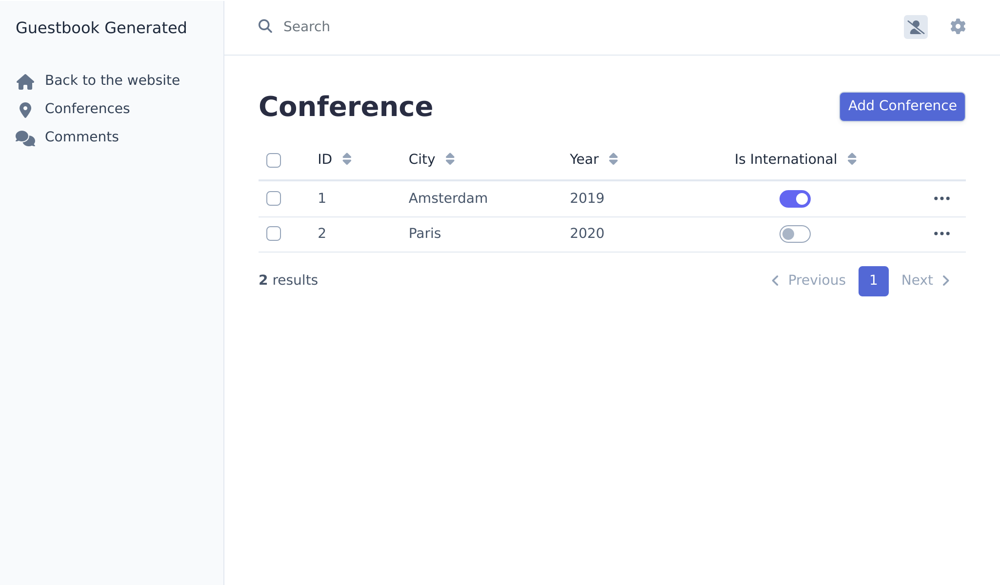
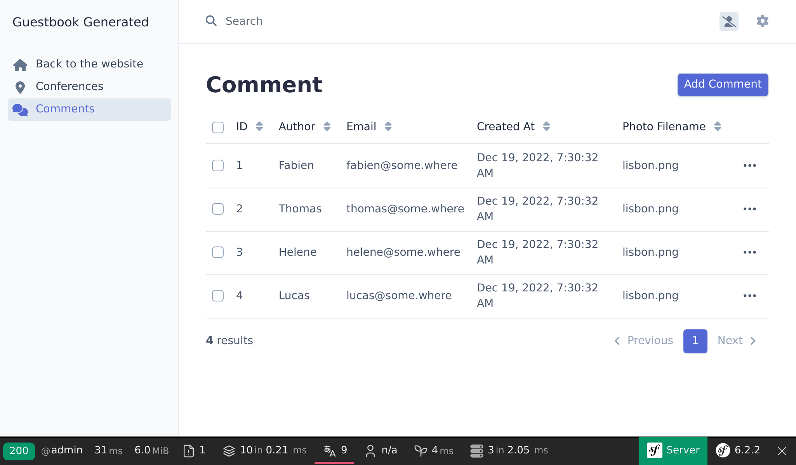

Konfigurowanie panelu administracyjnego
=======================================

.. index::
    single: EasyAdmin
    single: Admin
    single: Backend

Dodawanie nadchodzących konferencji do bazy danych jest zadaniem administratorów i administratorek projektu. *Panel administracyjny* to chroniona część strony internetowej, w której *osoby korzystające z konta administracyjnego* mogą zarządzać danymi strony internetowej, moderować przesłane opinie i wiele innych.

Jak możemy to szybko stworzyć? Za pomocą pakietu, który jest w stanie wygenerować panel administracyjny w oparciu o model projektu. EasyAdmin idealnie się do tego nadaje.

Instalowanie kolejnych zależności
-----------------------------------

Nawet jeśli pakiet ``webapp`` automatycznie dodał wiele przydatnych pakietów, dla niektórych bardziej specyficznych funkcji, musimy dodać więcej zależności. W jaki sposób możemy dodać więcej zależności? Za pomocą Composer. Oprócz „zwykłych” pakietów Composer, będziemy pracować z dwoma „specjalnymi” rodzajami pakietów:

* *Komponenty Symfony*: Pakiety, które implementują podstawowe funkcje i niskopoziomowe abstrakcje, których wymaga większość aplikacji (routing, konsola, klient HTTP, mailer, pamięć podręczna, ...);

* *Bundle Symfony*: Pakiety, które dodają wysokopoziomowe funkcje lub zapewniają integrację z bibliotekami stron trzecich (bundle są w większości dostarczane przez społeczność).

Dodajmy EasyAdmin jako zależność do projektu:

.. code-block:: terminal

    $ symfony composer req "admin:^4"

``admin`` jest aliasem dla pakietu ``easycorp/easyadmin-bundle``.

*Aliasy* nie są funkcją Composer, ale koncepcją dostarczoną przez Symfony, aby ułatwić Ci życie. Aliasy, to skróty do popularnych pakietów Composer. Potrzebujesz ORMa - dołącz „api”. Te aliasy automatycznie rozwiązują zależności dla pojedynczych lub też wielu zwykłych pakietów Composer. Są one ustalone przez główny zespół Symfony.

Inną przydatną funkcją jest możliwość pomijania dostawcy "symfony" dla instalowanego pakietu. Dołącz ``cache`` zamiast ``symfony/cache``.

.. tip::

    Pamiętasz, jak wspomnieliśmy wcześniej o wtyczce Composer ``symfony/flex``? Aliasy to jedna z jej funkcji.

Konfigurowanie EasyAdmin
------------------------

EasyAdmin automatycznie generuje obszar administracyjny dla Twojej aplikacji, na podstawie konkretnych kontrolerów.

Rozpocznijmy naszą pracę z EasyAdmin tworząc "webowy panel administracyjny", który będzie kluczowym miejscem do zarządzania danymi na stronie.

.. code-block:: terminal
    :class: answers(DashboardController||src/Controller/Admin/)

    $ symfony console make:admin:dashboard

Zaakceptowanie domyślnych odpowiedzi powoduje utworzenie następującego kontrolera:

.. code-block:: php
    :caption: src/Controller/Admin/DashboardController.php
    :class: ignore

    namespace App\Controller\Admin;

    use EasyCorp\Bundle\EasyAdminBundle\Config\Dashboard;
    use EasyCorp\Bundle\EasyAdminBundle\Config\MenuItem;
    use EasyCorp\Bundle\EasyAdminBundle\Controller\AbstractDashboardController;
    use Symfony\Component\HttpFoundation\Response;
    use Symfony\Component\Routing\Annotation\Route;

    class DashboardController extends AbstractDashboardController
    {
        /**
         * @Route("/admin", name="admin")
         */
        public function index(): Response
        {
            return parent::index();
        }

        public function configureDashboard(): Dashboard
        {
            return Dashboard::new()
                ->setTitle('Guestbook');
        }

        public function configureMenuItems(): iterable
        {
            yield MenuItem::linkToDashboard('Dashboard', 'fa fa-home');
            // yield MenuItem::linkToCrud('The Label', 'icon class', EntityClass::class);
        }
    }

W ramach przyjętej konwencji, wszystkie kontrolery panelu administracyjnego są przechowywane w przestrzeni nazw ``App\Controller\Admin``.

Wejdź do wygenerowanego panelu administracyjnego odwiedzając ``/admin`` - tak jak ustawiliśmy to w metodzie ``index()``. Możesz zmienić adres URL na jaki tylko chcesz:

.. figure:: screenshots/easy-admin-empty.png
    :alt: /admin
    :align: center
    :figclass: with-browser

Bum! Mamy nieźle wyglądający panel administracyjny, gotowy do dostosowania do naszych potrzeb.

.. index::
    single: CRUD

Następnym krokiem będzie utworzenie kontrolera do zarządzania konferencjami i komentarzami.

W kontrolerze mogłeś zauważyć funkcję ``configureMenuItems()``,  która posiada komentarz na temat dodawania linków do "CRUD"-ów.  **CRUD** to akronim od "Create, Read, Update, and Delete" (utwórz, odczytaj, zaktualizuj, usuń) - czterech podstawowych operacji, które możesz wykonać na każdej encji. Dokładnie tego, czego oczekujemy od panelu administracyjnego do zrobienia za nas. Jednak EasyAdmin daje znacznie więcej, zajmując się także wyszukiwaniem i filtrowaniem.

Wygenerujmy CRUD dla konferencji:

.. code-block:: terminal
    :class: answers(1||src/Controller/Admin/||App\\Controller\\Admin)

    $ symfony console make:admin:crud

Wybierz ``1``, aby utworzyć interfejs administracyjny dla konferencji i użyj domyślnych wartości w pozostałych pytaniach. Następujący plik zostanie wygenerowany:

.. code-block:: php
    :caption: src/Controller/Admin/ConferenceCrudController.php
    :class: ignore

    namespace App\Controller\Admin;

    use App\Entity\Conference;
    use EasyCorp\Bundle\EasyAdminBundle\Controller\AbstractCrudController;

    class ConferenceCrudController extends AbstractCrudController
    {
        public static function getEntityFqcn(): string
        {
            return Conference::class;
        }

        /*
        public function configureFields(string $pageName): iterable
        {
            return [
                IdField::new('id'),
                TextField::new('title'),
                TextEditorField::new('description'),
            ];
        }
        */
    }

Zrób to samo dla komentarzy:

.. code-block:: terminal
    :class: answers(0||src/Controller/Admin/||App\\Controller\\Admin)

    $ symfony console make:admin:crud

Ostatnim krokiem będzie dodanie do panelu interfejsów administracyjnych dla konferencji i komentarzy:

.. code-block:: diff
    :caption: patch_file

    --- a/src/Controller/Admin/DashboardController.php
    +++ b/src/Controller/Admin/DashboardController.php
    @@ -2,6 +2,8 @@

     namespace App\Controller\Admin;

    +use App\Entity\Comment;
    +use App\Entity\Conference;
     use EasyCorp\Bundle\EasyAdminBundle\Config\Dashboard;
     use EasyCorp\Bundle\EasyAdminBundle\Config\MenuItem;
     use EasyCorp\Bundle\EasyAdminBundle\Controller\AbstractDashboardController;
    @@ -40,7 +42,8 @@ class DashboardController extends AbstractDashboardController

         public function configureMenuItems(): iterable
         {
    -        yield MenuItem::linkToDashboard('Dashboard', 'fa fa-home');
    -        // yield MenuItem::linkToCrud('The Label', 'fas fa-list', EntityClass::class);
    +        yield MenuItem::linktoRoute('Back to the website', 'fas fa-home', 'homepage');
    +        yield MenuItem::linkToCrud('Conferences', 'fas fa-map-marker-alt', Conference::class);
    +        yield MenuItem::linkToCrud('Comments', 'fas fa-comments', Comment::class);
         }
     }

Nadpisaliśmy metodę ``configureMenuItems()``, aby dodać do menu pozycje z ikonami odpowiednimi dla konferencji i komentarzy, oraz  linkiem przenoszącym na stronę główną.

EasyAdmin udostępnia API, aby ułatwić linkowanie CRUD-ów za pomocą metody ``MenuItem::linkToRoute()``.

Strona główna panelu administracyjnego jest obecnie pusta. Jest to miejsce, gdzie możesz wyświetlać statystyki, albo inne ważne informacje. Ponieważ nie mamy żadnych ważnych informacji do wyświetlenia, zróbmy przekierowanie na listę konferencji.

.. code-block:: diff
    :caption: patch_file

    --- a/src/Controller/Admin/DashboardController.php
    +++ b/src/Controller/Admin/DashboardController.php
    @@ -7,6 +7,7 @@ use App\Entity\Conference;
     use EasyCorp\Bundle\EasyAdminBundle\Config\Dashboard;
     use EasyCorp\Bundle\EasyAdminBundle\Config\MenuItem;
     use EasyCorp\Bundle\EasyAdminBundle\Controller\AbstractDashboardController;
    +use EasyCorp\Bundle\EasyAdminBundle\Router\AdminUrlGenerator;
     use Symfony\Component\HttpFoundation\Response;
     use Symfony\Component\Routing\Annotation\Route;

    @@ -15,7 +16,10 @@ class DashboardController extends AbstractDashboardController
         #[Route('/admin', name: 'admin')]
         public function index(): Response
         {
    -        return parent::index();
    +        $routeBuilder = $this->container->get(AdminUrlGenerator::class);
    +        $url = $routeBuilder->setController(ConferenceCrudController::class)->generateUrl();
    +
    +        return $this->redirect($url);

             // Option 1. You can make your dashboard redirect to some common page of your backend
             //

Podczas wyświetlania relacji encji (konferencji powiązanej z danym komentarzem), EasyAdmin próbuje wykorzystać tekstową reprezentację konferencji. Jeśli klasa encji nie posiada zdefiniowanej "magicznej metody" ``__toString()``, to domyślna implementacja używa nazwy encji oraz wartości przypisanej do klucza głównego (np. ``Conference #1``). Aby wyświetlana treść zawierała więcej istotnych informacji, dodajmy metodę ``__toString()`` do klasy ``Conference``:

.. code-block:: diff
    :caption: patch_file

    --- a/src/Entity/Conference.php
    +++ b/src/Entity/Conference.php
    @@ -32,6 +32,11 @@ class Conference
             $this->comments = new ArrayCollection();
         }

    +    public function __toString(): string
    +    {
    +        return $this->city.' '.$this->year;
    +    }
    +
         public function getId(): ?int
         {
             return $this->id;

Teraz możesz dodawać/modyfikować/usuwać konferencje bezpośrednio z panelu administracyjnego. Pobaw się nim i dodaj co najmniej jedną konferencję.

Dodaj kilka komentarzy bez zdjęć. Na razie ustaw datę ręcznie; kolumnę ``createdAt`` wypełnimy automatycznie w późniejszym kroku.

Dostosowywanie EasyAdmin
------------------------

Domyślny panel administracyjny działa dobrze, ale można go dostosować na wiele sposobów aby usprawnić jego działanie. Zróbmy kilka prostych zmian w encji ``Comment``, aby zademonstrować niektóre z tych możliwości:

.. code-block:: diff
    :caption: patch_file

    --- a/src/Controller/Admin/CommentCrudController.php
    +++ b/src/Controller/Admin/CommentCrudController.php
    @@ -3,7 +3,15 @@
     namespace App\Controller\Admin;

     use App\Entity\Comment;
    +use EasyCorp\Bundle\EasyAdminBundle\Config\Crud;
    +use EasyCorp\Bundle\EasyAdminBundle\Config\Filters;
     use EasyCorp\Bundle\EasyAdminBundle\Controller\AbstractCrudController;
    +use EasyCorp\Bundle\EasyAdminBundle\Field\AssociationField;
    +use EasyCorp\Bundle\EasyAdminBundle\Field\DateTimeField;
    +use EasyCorp\Bundle\EasyAdminBundle\Field\EmailField;
    +use EasyCorp\Bundle\EasyAdminBundle\Field\TextareaField;
    +use EasyCorp\Bundle\EasyAdminBundle\Field\TextField;
    +use EasyCorp\Bundle\EasyAdminBundle\Filter\EntityFilter;

     class CommentCrudController extends AbstractCrudController
     {
    @@ -12,14 +20,44 @@ class CommentCrudController extends AbstractCrudController
             return Comment::class;
         }

    -    /*
    +    public function configureCrud(Crud $crud): Crud
    +    {
    +        return $crud
    +            ->setEntityLabelInSingular('Conference Comment')
    +            ->setEntityLabelInPlural('Conference Comments')
    +            ->setSearchFields(['author', 'text', 'email'])
    +            ->setDefaultSort(['createdAt' => 'DESC'])
    +        ;
    +    }
    +
    +    public function configureFilters(Filters $filters): Filters
    +    {
    +        return $filters
    +            ->add(EntityFilter::new('conference'))
    +        ;
    +    }
    +
         public function configureFields(string $pageName): iterable
         {
    -        return [
    -            IdField::new('id'),
    -            TextField::new('title'),
    -            TextEditorField::new('description'),
    -        ];
    +        yield AssociationField::new('conference');
    +        yield TextField::new('author');
    +        yield EmailField::new('email');
    +        yield TextareaField::new('text')
    +            ->hideOnIndex()
    +        ;
    +        yield TextField::new('photoFilename')
    +            ->onlyOnIndex()
    +        ;
    +
    +        $createdAt = DateTimeField::new('createdAt')->setFormTypeOptions([
    +            'years' => range(date('Y'), date('Y') + 5),
    +            'widget' => 'single_text',
    +        ]);
    +        if (Crud::PAGE_EDIT === $pageName) {
    +            yield $createdAt->setFormTypeOption('disabled', true);
    +        } else {
    +            yield $createdAt;
    +        }
         }
    -    */
     }

Aby zmodyfikować sekcję ``Comment``,  wskazanie pól bezpośrednio w metodzie ``configureFields()`` pozwala nam na wyświetlenie ich w takiej kolejności, w jakiej byśmy chcieli. Niektóre pola są dalej konfigurowane, na przykład ukrywanie pól tekstowych na stronie z indeksem.

Metoda ``configureFilters()`` pozwala zdefiniować, które filtry powinny być dostępne w wyszukiwarce.

.. figure:: screenshots/easy-admin-filter.png
    :alt: /admin?crudAction=index&crudId=2bfa220&menuIndex=2&submenuIndex=-1
    :align: center
    :figclass: with-browser

Te modyfikacje są tylko małą prezentacją możliwości, jakie daje nam EasyAdmin.

Pobaw się panelem administracyjnym, wyfiltruj komentarze po konferencji lub na przykład wyszukuj je po adresie e-mail. Jedynym problemem jest to, że każdy ma do niego dostęp. Nie martw się, zabezpieczymy go w przyszłości.

.. code-block:: terminal
    :class: hide

    $ symfony run psql -c "TRUNCATE conference RESTART IDENTITY CASCADE"

.. sidebar:: Idąc dalej

    * `Dokumentacja EasyAdmin`_;

    * `Dostępne ustawienia w konfiguracji Symfony`_;

    * `Magiczne metody PHP`_.

.. _`Dokumentacja EasyAdmin`: https://symfony.com/bundles/EasyAdminBundle/4.x/index.html
.. _`Dostępne ustawienia w konfiguracji Symfony`: https://symfony.com/doc/current/reference/configuration/framework.html
.. _`Magiczne metody PHP`: https://www.php.net/manual/en/language.oop5.magic.php
