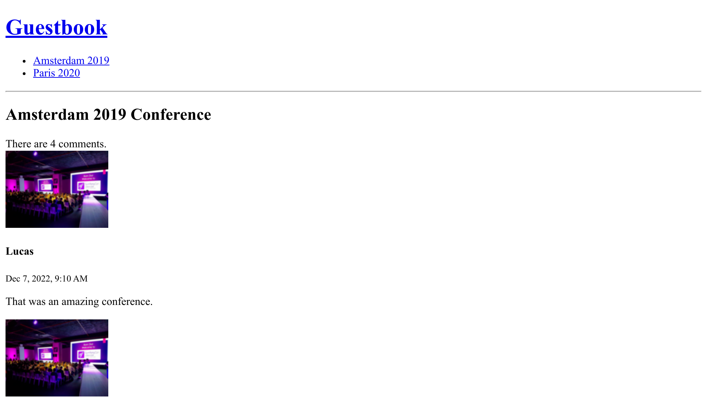

Жизненный цикл объектов Doctrine
=====================================================

Было бы неплохо, если при создании нового комментария значение поля ``createdAt`` автоматически заполнялось текущими датой и временем.

Doctrine может по-разному манипулировать объектами и их свойствами в различных стадиях жизненного цикла (до вставки записи в базу данных, после обновления записи и т.д.).

Определение обратных вызовов событий жизненного цикла
-----------------------------------------------------------------------------------------------------

.. index::
    single: Doctrine;Lifecycle
    single: Attributes;ORM\\Entity
    single: Attributes;ORM\\HasLifecycleCallbacks
    single: Attributes;ORM\\PrePersist

Если логика не требует доступа к сервису и применяется только к одному типу сущности, можно определить обратный вызов в классе сущности:

.. code-block:: diff
    :caption: patch_file

    --- a/src/Entity/Comment.php
    +++ b/src/Entity/Comment.php
    @@ -7,6 +7,7 @@ use Doctrine\DBAL\Types\Types;
     use Doctrine\ORM\Mapping as ORM;

     #[ORM\Entity(repositoryClass: CommentRepository::class)]
    +#[ORM\HasLifecycleCallbacks]
     class Comment
     {
         #[ORM\Id]
    @@ -91,6 +92,12 @@ class Comment
             return $this;
         }

    +    #[ORM\PrePersist]
    +    public function setCreatedAtValue()
    +    {
    +        $this->createdAt = new \DateTimeImmutable();
    +    }
    +
         public function getConference(): ?Conference
         {
             return $this->conference;

*Событие* ``ORM\PrePersist`` срабатывает, когда объект впервые сохранятся в базе данных. В этот момент вызывается метод ``setCreatedAtValue()``, который использует текущие дату и время в качестве значения для свойства ``createdAt``.

Добавление слагов для конференций
---------------------------------------------------------------

Сейчас URL-адреса конференций вроде ``/conference/1`` не очень понятны. Более того, они раскрывают детали реализации приложения (значение первичного ключа ``1`` доступно пользователю).

Почему бы не использовать URL-адреса вида ``/conference/paris-2020``? Они выглядят намного лучше и красивее. Фрагмент адреса ``paris-2020`` — это *слаг* (человеко-понятная часть URL-адреса) конференции.

.. index::
    single: Command;make:entity

Добавьте новое свойство ``slug`` в класс конференции (строка длиной до 255 символов, которая не может быть пустой):

.. code-block:: terminal
    :class: answers(slug||string||255||no)

    $ symfony console make:entity Conference

.. index::
    single: Command;make:migration

Создайте файл миграции, чтобы добавить новый столбец:

.. code-block:: terminal

    $ symfony console make:migration

.. index::
    single: Command;doctrine:migrations:migrate

А затем выполните новую миграцию:

.. code-block:: terminal
    :class: ignore

    $ symfony console doctrine:migrations:migrate

Увидели ошибку? Это было ожидаемо, потому что мы указали, что свойство ``slug`` не должно быть пустым (содержать значение ``null``). Но во время миграции существующие в базе данных записи конференций будут перезаписаны значениями ``null``. Давайте исправим это, поменяв логику процесса миграции:

.. code-block:: diff
    :caption: patch_file

    --- a/migrations/Version00000000000000.php
    +++ b/migrations/Version00000000000000.php
    @@ -20,7 +20,9 @@ final class Version00000000000000 extends AbstractMigration
         public function up(Schema $schema): void
         {
             // this up() migration is auto-generated, please modify it to your needs
    -        $this->addSql('ALTER TABLE conference ADD slug VARCHAR(255) NOT NULL');
    +        $this->addSql('ALTER TABLE conference ADD slug VARCHAR(255)');
    +        $this->addSql("UPDATE conference SET slug=CONCAT(LOWER(city), '-', year)");
    +        $this->addSql('ALTER TABLE conference ALTER COLUMN slug SET NOT NULL');
         }

         public function down(Schema $schema): void

Мы применили некоторую хитрость: сначала добавляем столбец слага с возможностью иметь значение по умолчанию —``null``, далее создаём слаг для существующих записей (то есть заполняем новый столбец значениями, отличными от ``null``), а затем изменяем столбец слага так, чтобы он он не позволял хранить значение ``null``.

.. note::

    В реальном проекте использование выражения ``CONCAT(LOWER(city), '-', year)`` может быть недостаточным. В таком случае понадобится использовать "настоящий" сервис для генерации слага (слагер).

.. index::
    single: Command;doctrine:migrations:migrate

Теперь миграция должна пройти без ошибок:

.. code-block:: terminal
    :class: answers(y)

    $ symfony console doctrine:migrations:migrate

.. index::
    single: Attributes;ORM\\UniqueEntity
    single: Attributes;ORM\\Column
    single: Components;Validator

Поскольку приложение вскоре будет использовать слаги для поиска каждой конференции, давайте улучшим сущность Conference, чтобы гарантировать уникальность значений слагов в базе данных:

.. code-block:: diff
    :caption: patch_file

    --- a/src/Entity/Conference.php
    +++ b/src/Entity/Conference.php
    @@ -6,8 +6,10 @@ use App\Repository\ConferenceRepository;
     use Doctrine\Common\Collections\ArrayCollection;
     use Doctrine\Common\Collections\Collection;
     use Doctrine\ORM\Mapping as ORM;
    +use Symfony\Bridge\Doctrine\Validator\Constraints\UniqueEntity;

     #[ORM\Entity(repositoryClass: ConferenceRepository::class)]
    +#[UniqueEntity('slug')]
     class Conference
     {
         #[ORM\Id]
    @@ -27,7 +29,7 @@ class Conference
         #[ORM\OneToMany(mappedBy: 'conference', targetEntity: Comment::class, orphanRemoval: true)]
         private Collection $comments;

    -    #[ORM\Column(length: 255)]
    +    #[ORM\Column(type: 'string', length: 255, unique: true)]
         private ?string $slug = null;

         public function __construct()

.. index::
    single: Command;make:migration

Как вы могли догадаться, нам нужно выполнить процедуру миграции:

.. code-block:: terminal

    $ symfony console make:migration

.. index::
    single: Command;doctrine:migrations:migrate

.. code-block:: terminal
    :class: answers(y)

    $ symfony console doctrine:migrations:migrate

Генерация слагов
-------------------------------

.. index::
    single: Components;String
    single: Slug

Во многих языках создать слаг, который хорошо читается в URL-адресе (где должно быть закодировано все, кроме ASCII-символов), не так-то просто. К примеру, как поменять ``é`` на ``e``?

Чтобы не изобретать велосипед, давайте воспользуемся Symfony-компонентом ``String``, который не только облегчает работу со строками, но и содержит *слагер*.

В класс ``Conference`` добавьте метод ``computeSlug()``, который исходя из данных конференции сгенерирует слаг:

.. code-block:: diff
    :caption: patch_file

    --- a/src/Entity/Conference.php
    +++ b/src/Entity/Conference.php
    @@ -7,6 +7,7 @@ use Doctrine\Common\Collections\ArrayCollection;
     use Doctrine\Common\Collections\Collection;
     use Doctrine\ORM\Mapping as ORM;
     use Symfony\Bridge\Doctrine\Validator\Constraints\UniqueEntity;
    +use Symfony\Component\String\Slugger\SluggerInterface;

     #[ORM\Entity(repositoryClass: ConferenceRepository::class)]
     #[UniqueEntity('slug')]
    @@ -47,6 +48,13 @@ class Conference
             return $this->id;
         }

    +    public function computeSlug(SluggerInterface $slugger)
    +    {
    +        if (!$this->slug || '-' === $this->slug) {
    +            $this->slug = (string) $slugger->slug((string) $this)->lower();
    +        }
    +    }
    +
         public function getCity(): ?string
         {
             return $this->city;

Метод ``computeSlug()`` генерирует слаг только в том случае, если значение слага отсутствует, либо указанный слаг имеет специальное значение ``-``. Но зачем оно нужно? Поскольку слаг не может быть пустым, при добавлении конференции в административной панели нам нужно указать некое специальное значение (в нашем случае — ``-``) в соответствующем поле, чтобы сообщить приложению, что оно должно автоматически сгенерировать слаг.

Определение сложных обратных вызовов жизненного цикла
-----------------------------------------------------------------------------------------------------

.. index::
    single: Doctrine;Entity Listener

По аналогии со свойством ``createdAt``, свойство ``slug`` должно автоматически обновляться при каждом изменении конференции путем вызова метода ``computeSlug()``.

Но так как метод зависит от реализации ``SluggerInterface``, мы не можем добавить событие ``prePersist`` так, как делали это раньше (нет способа внедрить слагер).

Вместо этого создайте обработчик сущности Doctrine:

.. code-block:: php
    :caption: src/EntityListener/ConferenceEntityListener.php

    namespace App\EntityListener;

    use App\Entity\Conference;
    use Doctrine\ORM\Event\LifecycleEventArgs;
    use Symfony\Component\String\Slugger\SluggerInterface;

    class ConferenceEntityListener
    {
        public function __construct(
            private SluggerInterface $slugger,
        ) {
        }

        public function prePersist(Conference $conference, LifecycleEventArgs $event)
        {
            $conference->computeSlug($this->slugger);
        }

        public function preUpdate(Conference $conference, LifecycleEventArgs $event)
        {
            $conference->computeSlug($this->slugger);
        }
    }

Обратите внимание, что слаг генерируется как при создании новой конференции (``prePersist()``), так и при её обновлении (``preUpdate()``).

Настройка сервиса в контейнере
---------------------------------------------------------

.. index::
    single: Components;Dependency Injection
    single: Dependency Injection

До сих пор мы не упомянули один из главных компонентов Symfony — контейнер внедрения зависимостей, который управляет *сервисами*: создаёт и внедряет их по мере необходимости.

*Сервис* — это "глобальный" объект с определённой функциональностью (mailer — отправка электронных писем, logger — логирование, slugger — генерация URL-адресов, и т.д.) в отличие от *объектов данных* (к примеру, экземпляров сущности Doctrine).

Вы редко будете работать с контейнером напрямую, поскольку он автоматически внедряет сервисы, когда это вам необходимо: внедрение объектов-сервисов происходит, когда вы указываете типы соответствующих сервисов в качестве аргументов контроллера.

Теперь вы знаете, что обработчик события в предыдущем примере был зарегистрирован через контейнер. Когда класс реализует определённые интерфейсы, контейнер знает, что класс должен быть зарегистрирован соответствующим образом.

Здесь, поскольку наш класс не реализует ни одного интерфейса и не расширяет ни одного базового класса, Symfony не знает, как его автоматически конфигурировать. Вместо этого мы можем использовать атрибут, чтобы указать контейнеру Symfony, как его подключить:

.. code-block:: diff
    :caption: patch_file

    --- a/src/EntityListener/ConferenceEntityListener.php
    +++ b/src/EntityListener/ConferenceEntityListener.php
    @@ -3,9 +3,13 @@
     namespace App\EntityListener;

     use App\Entity\Conference;
    +use Doctrine\Bundle\DoctrineBundle\Attribute\AsEntityListener;
     use Doctrine\ORM\Event\LifecycleEventArgs;
    +use Doctrine\ORM\Events;
     use Symfony\Component\String\Slugger\SluggerInterface;

    +#[AsEntityListener(event: Events::prePersist, entity: Conference::class)]
    +#[AsEntityListener(event: Events::preUpdate, entity: Conference::class)]
     class ConferenceEntityListener
     {
         public function __construct(

.. note::

    Не путайте обработчики событий Doctrine и обработчики событий Symfony. Даже если они очень похожи, они по-разному работают изнутри.

Использование слагов в приложении
---------------------------------------------------------------

Попробуйте добавить несколько конференций в административной панели, либо измените город или год проведения уже созданных конференций; слаг не обновится, только если вы не укажете в его поле специальное значение — ``-``.

.. index::
    single: Twig;for
    single: Twig;if
    single: Twig;path
    single: Attributes;Route

Осталось сделать последнее изменение — заменить в контроллерах и шаблонах параметр маршрутов конференций с ``id`` на ``slug``:

.. code-block:: diff
    :caption: patch_file

    --- a/src/Controller/ConferenceController.php
    +++ b/src/Controller/ConferenceController.php
    @@ -20,7 +20,7 @@ class ConferenceController extends AbstractController
             ]);
         }

    -    #[Route('/conference/{id}', name: 'conference')]
    +    #[Route('/conference/{slug}', name: 'conference')]
         public function show(Request $request, Conference $conference, CommentRepository $commentRepository): Response
         {
             $offset = max(0, $request->query->getInt('offset', 0));
    --- a/templates/base.html.twig
    +++ b/templates/base.html.twig
    @@ -18,7 +18,7 @@
                 <h1><a href="{{ path('homepage') }}">Guestbook</a></h1>
                 <ul>
                 
    -                <li><a href="{{ path('conference', { id: conference.id }) }}">{{ conference }}</a></li>
    +                <li><a href="{{ path('conference', { slug: conference.slug }) }}">{{ conference }}</a></li>
                 
                 </ul>
                 

    --- a/templates/conference/index.html.twig
    +++ b/templates/conference/index.html.twig
    @@ -8,7 +8,7 @@
         
             <h4>{{ conference }}</h4>
             

    -            <a href="{{ path('conference', { id: conference.id }) }}">View</a>
    +            <a href="{{ path('conference', { slug: conference.slug }) }}">View</a>
             

         
     
    --- a/templates/conference/show.html.twig
    +++ b/templates/conference/show.html.twig
    @@ -22,10 +22,10 @@
             

             
    -            <a href="{{ path('conference', { id: conference.id, offset: previous }) }}">Previous</a>
    +            <a href="{{ path('conference', { slug: conference.slug, offset: previous }) }}">Previous</a>
             
             
    -            <a href="{{ path('conference', { id: conference.id, offset: next }) }}">Next</a>
    +            <a href="{{ path('conference', { slug: conference.slug, offset: next }) }}">Next</a>
             
         
             
No comments have been posted yet for this conference.

Теперь можно перейти к странице конференции через её слаг:

.. sidebar:: Двигаемся дальше

    * `Система событий Doctrine`_ (обратные вызовы и обработчики событий жизненного цикла, обработчики сущностей и подписчики жизненного цикла);

    * `Документация компонента String`_;

    * `Сервис-контейнер`_;

    * `Шпаргалка по сервисам Symfony`_.

.. _`Система событий Doctrine`: https://symfony.com/doc/current/doctrine/events.html
.. _`Документация компонента String`: https://symfony.com/doc/current/components/string.html
.. _`Сервис-контейнер`: https://symfony.com/doc/current/service_container.html
.. _`Шпаргалка по сервисам Symfony`: https://github.com/andreia/symfony-cheat-sheets/blob/master/Symfony4/services_en_42.pdf
