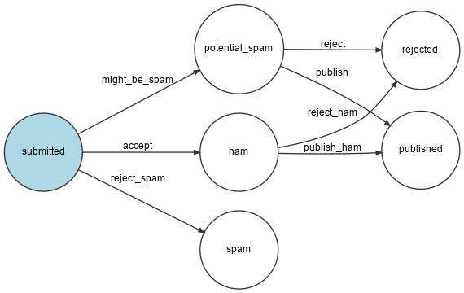

Управление состоянием с помощью Workflow
====================================================================

.. index::
    single: Components;Workflow
    single: Workflow

Наличие какого-либо состояния у модели — довольно обычное явление. Состояние комментария определяет только антиспам-сервис. Но что, если в будущем у вас появятся больше факторов для изменения состояния?

Возможно, вы захотите дать администратору сайта возможность модерировать все комментарии после того, как они будут проверены антиспам-сервисом. Вот как будет выглядеть этот процесс:

* Начинаем с состояния ``submitted``, когда пользователь отправляет комментарий;

* Делегируем антиспам-сервису проанализировать комментарий и переключим его в зависимости от результата в одно из состояний: ``potential_spam``, ``ham`` или ``rejected``;

* Если комментарий не был отклонён (то есть он не спам), ожидаем, пока администратор не решит, достаточно ли комментарий хорош, изменив его состояние на ``published`` или ``rejected``.

Реализация данной логики — не слишком сложная задача. Однако добавление дополнительных правил значительно усложнит эту задачу. Воспользуемся Symfony-компонентом Workflow, чтобы не писать самим логику с нуля:

.. code-block:: terminal

    $ symfony composer req workflow

Определение бизнес-процессов
------------------------------------------------------

Бизнес-процесс комментария можно описать в конфигурационном файле ``config/packages/workflow.yaml``:

.. code-block:: yaml
    :caption: config/packages/workflow.yaml
    :emphasize-lines: 3,4,9,11

    framework:
        workflows:
            comment:
                type: state_machine
                audit_trail:
                    enabled: "%kernel.debug%"
                marking_store:
                    type: 'method'
                    property: 'state'
                supports:
                    - App\Entity\Comment
                initial_marking: submitted
                places:
                    - submitted
                    - ham
                    - potential_spam
                    - spam
                    - rejected
                    - published
                transitions:
                    accept:
                        from: submitted
                        to:   ham
                    might_be_spam:
                        from: submitted
                        to:   potential_spam
                    reject_spam:
                        from: submitted
                        to:   spam
                    publish:
                        from: potential_spam
                        to:   published
                    reject:
                        from: potential_spam
                        to:   rejected
                    publish_ham:
                        from: ham
                        to:   published
                    reject_ham:
                        from: ham
                        to:   rejected

.. index::
    single: Command;workflow:dump

Чтобы убедиться в правильности построения этого бизнес-процесса, давайте отобразим его визуально:

.. code-block:: terminal
    :class: ignore

    $ symfony console workflow:dump comment | dot -Tpng -o workflow.png

.. note::

    Команда ``dot``  является частью утилиты `Graphviz`_.

Использование бизнес-процессов
----------------------------------------------------------

Замените текущую логику в обработчике сообщений на новую с использованием определенного ранее бизнес-процесса:

.. code-block:: diff
    :caption: patch_file

    --- a/src/MessageHandler/CommentMessageHandler.php
    +++ b/src/MessageHandler/CommentMessageHandler.php
    @@ -6,7 +6,10 @@ use App\Message\CommentMessage;
     use App\Repository\CommentRepository;
     use App\SpamChecker;
     use Doctrine\ORM\EntityManagerInterface;
    +use Psr\Log\LoggerInterface;
     use Symfony\Component\Messenger\Attribute\AsMessageHandler;
    +use Symfony\Component\Messenger\MessageBusInterface;
    +use Symfony\Component\Workflow\WorkflowInterface;

     #[AsMessageHandler]
     class CommentMessageHandler
    @@ -15,6 +18,9 @@ class CommentMessageHandler
             private EntityManagerInterface $entityManager,
             private SpamChecker $spamChecker,
             private CommentRepository $commentRepository,
    +        private MessageBusInterface $bus,
    +        private WorkflowInterface $commentStateMachine,
    +        private ?LoggerInterface $logger = null,
         ) {
         }

    @@ -25,12 +31,18 @@ class CommentMessageHandler
                 return;
             }

    -        if (2 === $this->spamChecker->getSpamScore($comment, $message->getContext())) {
    -            $comment->setState('spam');
    -        } else {
    -            $comment->setState('published');
    +        if ($this->commentStateMachine->can($comment, 'accept')) {
    +            $score = $this->spamChecker->getSpamScore($comment, $message->getContext());
    +            $transition = match ($score) {
    +                2 => 'reject_spam',
    +                1 => 'might_be_spam',
    +                default => 'accept',
    +            };
    +            $this->commentStateMachine->apply($comment, $transition);
    +            $this->entityManager->flush();
    +            $this->bus->dispatch($message);
    +        } elseif ($this->logger) {
    +            $this->logger->debug('Dropping comment message', ['comment' => $comment->getId(), 'state' => $comment->getState()]);
             }
    -
    -        $this->entityManager->flush();
         }
     }

Новая логика выглядит следующим образом:

* Если комментарий может перейти в состояние ``accept``, значит проверяем сообщение на спам;

* В зависимости от результата проверки, нужно выбрать подходящий переход;

* Вызываем метод ``apply()``, чтобы обновить состояние для объекта Comment, который в свою очередь вызывает в этом объекте метод ``setState()``;

* Сохраняем данные в базе данных, используя метод ``flush()``;

* Повторно отправляем сообщение на шину, чтобы ещё раз запустить бизнес-процесс комментария для определения следующего перехода.

Так как ещё не реализована возможность проверки сообщения администратором, при следующий обработке сообщения в лог запишется следующее: "Dropping comment message".

Перед тем как начать следующую главу, давайте добавим автоматическую проверку:

.. code-block:: diff
    :caption: patch_file

    --- a/src/MessageHandler/CommentMessageHandler.php
    +++ b/src/MessageHandler/CommentMessageHandler.php
    @@ -41,6 +41,9 @@ class CommentMessageHandler
                 $this->commentStateMachine->apply($comment, $transition);
                 $this->entityManager->flush();
                 $this->bus->dispatch($message);
    +        } elseif ($this->commentStateMachine->can($comment, 'publish') || $this->commentStateMachine->can($comment, 'publish_ham')) {
    +            $this->commentStateMachine->apply($comment, $this->commentStateMachine->can($comment, 'publish') ? 'publish' : 'publish_ham');
    +            $this->entityManager->flush();
             } elseif ($this->logger) {
                 $this->logger->debug('Dropping comment message', ['comment' => $comment->getId(), 'state' => $comment->getState()]);
             }

Выполните команду ``symfony server:log`` и добавьте комментарий к любой конференции, чтобы увидеть в терминале, как один за другим происходят переходы состояний.

Поиск сервисов из контейнера внедрения зависимостей
-------------------------------------------------------------------------------------------------

.. index::
    single: Command;debug:container
    single: Container;Debug
    single: Debug;Container

При использовании внедрения зависимостей мы получаем сервисы из контейнера, указывая имя интерфейса или конкретную реализацию класса. При нескольких реализациях одного и того же интерфейса, Symfony не сможет понять, какая из них вам нужна. В этом случае нужно более точно указать, что именно вы хотите получить.

В предыдущем разделе при внедрении ``WorkflowInterface`` мы как раз столкнулись с такой проблемой.

Как Symfony определяет, какую реализацию общего интерфейса ``WorkflowInterface`` нужно использовать при его внедрении через конструктор? На помощь приходит имя аргумента ``$commentStateMachine``, которое должно состоять из названия бизнес-процесса (``comment``) и его типа (``state_machine``). Если имя аргумента не будет соответствовать данному именованию, вы получите ошибку.

Если вы не можете вспомнить, какое должно быть правильное имя аргумента, то попробуйте воспользоваться командой ``debug:container``. Выполните следующую команду, чтобы получить список сервисов, в имени которых содержится "workflow":

.. code-block:: terminal
    :emphasize-lines: 12
    :class: ignore

    $ symfony console debug:container workflow

     Select one of the following services to display its information:
      [0] console.command.workflow_dump
      [1] workflow.abstract
      [2] workflow.marking_store.method
      [3] workflow.registry
      [4] workflow.security.expression_language
      [5] workflow.twig_extension
      [6] monolog.logger.workflow
      [7] Symfony\Component\Workflow\Registry
      [8] Symfony\Component\Workflow\WorkflowInterface $commentStateMachine
      [9] Psr\Log\LoggerInterface $workflowLogger
     >

Обратите внимание на вариант под номером ``8``, который говорит о том,  что при внедрении интерфейса ``Symfony\Component\Workflow\WorkflowInterface`` нужно использовать имя аргумента ``$commentStateMachine``.

.. note::

    Можно воспользоваться командой ``debug:autowiring`` из предыдущей главы:

    .. code-block:: terminal

        $ symfony console debug:autowiring workflow

.. sidebar:: Двигаемся дальше

    * `Бизнес-процессы и конечные автоматы`_ и что выбрать из них;

    * `Документация по Symfony Workflow`_.

.. _`Graphviz`: https://www.graphviz.org/
.. _`Бизнес-процессы и конечные автоматы`: https://symfony.com/doc/current/workflow/workflow-and-state-machine.html
.. _`Документация по Symfony Workflow`: https://symfony.com/doc/current/workflow.html
