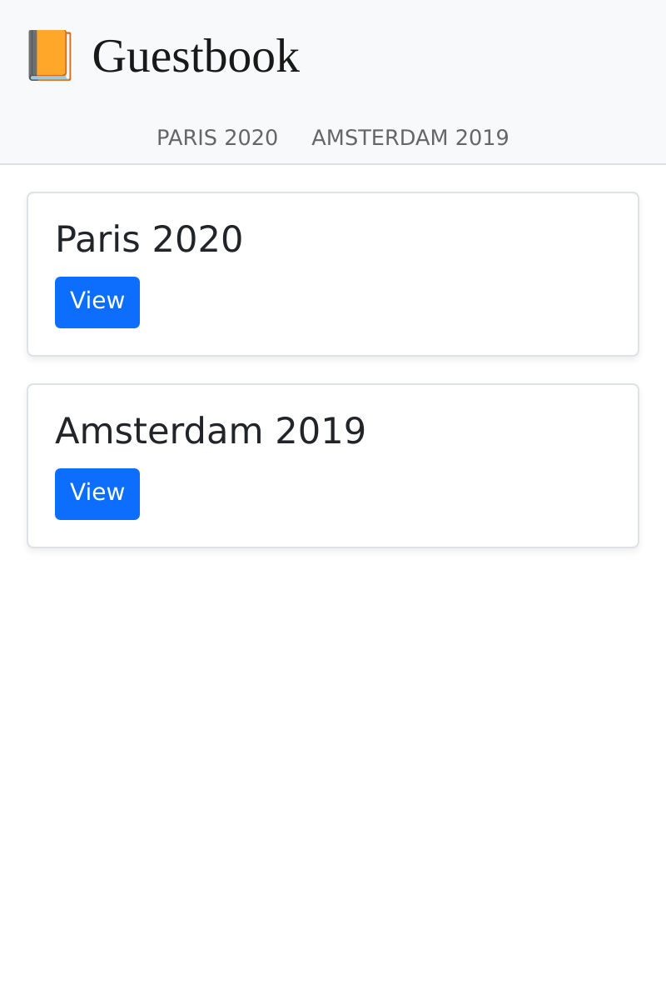

Разработка SPA
========================

.. index::
    single: SPA
    single: Mobile

Большинство комментариев будет отправлено во время конференции, на которую не все принесут с собой ноутбуки. Зато, скорее всего, у них будут смартфоны. Так почему бы не создать мобильное приложение, в котором можно быстро посмотреть комментарии с конференции?

Собрать одностраничное приложение (JavaScript Single Page Application, SPA) — один из способов создать такое мобильное приложение. SPA запускается локально, может использовать локальное хранилище, выполнять HTTP-запросы к сторонним API, а ещё поддерживает сервис-воркеры, которые дают преимущества почти настоящего (нативного) приложения.

Создание приложения
-------------------------------------

Для создания мобильного приложения будем использовать `Preact`_ и **Symfony Encore**. **Preact** — это небольшая и эффективная библиотека, которая хорошо подходит для нашего SPA-приложения гостевой книги.

Чтобы сделать сайт и SPA понятным и предсказуемым, для мобильного приложения мы будем использовать те же таблицы стилей Sass, что и для сайта.

Создайте SPA-приложение в директории ``spa`` и скопируйте туда таблицы стилей:

.. code-block:: terminal

    $ mkdir -p spa/src spa/public spa/assets/styles
    $ cp assets/styles/*.scss spa/assets/styles/
    $ cd spa

.. note::

    Мы создали директорию ``public``, поскольку, как правило, посещать SPA-приложение будем через браузер. Мы бы назвали эту директорию ``build`` в случае, если нам нужно было только мобильное приложение.

Также не забудем про файл ``.gitignore``:

.. code-block:: text
    :caption: .gitignore

    /node_modules/
    /public/
    /npm-debug.log
    # used later by Cordova
    /app/

Сгенерируйте файл ``package.json`` (аналог файла ``composer.json`` для JavaScript):

.. code-block:: terminal

    $ npm init -y

А теперь добавим несколько необходимых зависимостей:

.. code-block:: terminal

    $ npm install @symfony/webpack-encore @babel/core @babel/preset-env babel-preset-preact preact html-webpack-plugin bootstrap

И последнее — сконфигурируем Webpack Encore:

.. code-block:: javascript
    :caption: webpack.config.js
    :emphasize-lines: 8,11

    const Encore = require('@symfony/webpack-encore');
    const HtmlWebpackPlugin = require('html-webpack-plugin');

    Encore
        .setOutputPath('public/')
        .setPublicPath('/')
        .cleanupOutputBeforeBuild()
        .addEntry('app', './src/app.js')
        .enablePreactPreset()
        .enableSingleRuntimeChunk()
        .addPlugin(new HtmlWebpackPlugin({ template: 'src/index.ejs', alwaysWriteToDisk: true }))
    ;

    module.exports = Encore.getWebpackConfig();

Создание основного шаблона для SPA
-------------------------------------------------------------

Пришло время создать главный шаблон, в котором Preact будет рендерить приложение:

.. code-block:: html
    :caption: src/index.ejs
    :emphasize-lines: 12

    <!DOCTYPE html>
    <html>
    <head>
        <meta http-equiv="Content-Type" content="text/html; charset=utf-8" />
        <meta http-equiv="X-UA-Compatible" content="IE=edge" />
        <meta name="msapplication-tap-highlight" content="no" />
        <meta name="viewport" content="user-scalable=no, initial-scale=1, maximum-scale=1, minimum-scale=1, width=device-width" />

        <title>Conference Guestbook application</title>
    </head>
    <body>
        

    </body>
    </html>

В теге ``
`` с помощью JavaScript будет отрендерено приложение. Первоначальная версия только отобразит на экране надпись "Hello World":

.. code-block:: text
    :caption: src/app.js
    :emphasize-lines: 3,11

    import {h, render} from 'preact';

    function App() {
        return (
            

                Hello world!
            

        )
    }

    render(<App />, document.getElementById('app'));

В последней строке мы указываем функцию ``App()`` для рендера в элементе ``#app`` на HTML-странице.

Все готово!

Запуск SPA в браузере
------------------------------------

.. index::
    single: Symfony CLI;server:start
    single: Symfony CLI;server:stop

Поскольку данное приложение работает независимо от основного сайта, нам нужно запустить ещё один веб-сервер:

.. code-block:: terminal
    :class: hide

    $ symfony server:stop

.. code-block:: terminal

    $ symfony server:start -d --passthru=index.html

Флаг ``--passthru`` указывает веб-серверу, что необходимо перенаправлять все HTTP-запросы на файл ``public/index.html`` (``public/`` — корневая директория веб-сервера по умолчанию). Preact инициализирован на этой странице и через API истории браузера он узнает, какую страницу нужно отрендерить.

Для сборки CSS- **и JavaScript-файлов** выполните команду ``npm``:

.. code-block:: terminal

    $ ./node_modules/.bin/encore dev

Откройте SPA в браузере:

.. code-block:: terminal
    :class: ignore

    $ symfony open:local

И посмотрите на надпись "Hello world!", которую вывел SPA:

.. figure:: screenshots/spa.png
    :alt: /
    :align: center
    :figclass: with-browser spa

Добавление маршрутизатора для обработки состояний
----------------------------------------------------------------------------------------------

SPA не может обработать несколько страниц. Чтобы добавить их поддержку нам нужен маршрутизатор, по аналогии как в Symfony. Для этого мы будем использовать **preact-router**. Он принимает URL-адрес и сопоставляет его с Preact-компонентом, что его отрендерить страницу.

Установим preact-router:

.. code-block:: terminal

    $ npm install preact-router

Создадим главную страницу в виде *компонента Preact*:

.. code-block:: text
    :caption: src/pages/home.js

    import {h} from 'preact';

    export default function Home() {
        return (
            
Home

        );
    };

И потом ещё одну страницу для конференций:

.. code-block:: text
    :caption: src/pages/conference.js

    import {h} from 'preact';

    export default function Conference() {
        return (
            
Conference

        );
    };

Замените элемент ``div`` с "Hello World" на компонент ``Router``:

.. code-block:: diff
    :caption: patch_file
    :emphasize-lines: 15,17,20-23

    --- a/src/app.js
    +++ b/src/app.js
    @@ -1,9 +1,22 @@
     import {h, render} from 'preact';
    +import {Router, Link} from 'preact-router';
    +
    +import Home from './pages/home';
    +import Conference from './pages/conference';

     function App() {
         return (
             

    -            Hello world!
    +            <header>
    +                <Link href="/">Home</Link>
    +                 
    +                <Link href="/conference/amsterdam2019">Amsterdam 2019</Link>
    +            </header>
    +
    +            <Router>
    +                <Home path="/" />
    +                <Conference path="/conference/:slug" />
    +            </Router>
             

         )
     }

Пересоберите приложение:

.. code-block:: terminal

    $ ./node_modules/.bin/encore dev

Если вы обновите страницу в браузере, то сможете нажать на ссылки "Home" и конференции. Обратите внимание, что URL-адрес вместе с браузерными кнопками перемещения вперёд и назад работают вполне ожидаемым образом (как и в обычных статичных приложениях).

Стилизация SPA
------------------------

Давайте установим загрузчик Sass на сайт:

.. code-block:: terminal

    $ npm install node-sass sass-loader

Включите загрузчик Sass в Webpack, чтобы можно было импортировать таблицу стилей в коде:

.. code-block:: diff
    :caption: patch_file

    --- a/src/app.js
    +++ b/src/app.js
    @@ -1,3 +1,5 @@
    +import '../assets/styles/app.scss';
    +
     import {h, render} from 'preact';
     import {Router, Link} from 'preact-router';

    --- a/webpack.config.js
    +++ b/webpack.config.js
    @@ -7,6 +7,7 @@ Encore
         .cleanupOutputBeforeBuild()
         .addEntry('app', './src/app.js')
         .enablePreactPreset()
    +    .enableSassLoader()
         .enableSingleRuntimeChunk()
         .addPlugin(new HtmlWebpackPlugin({ template: 'src/index.ejs', alwaysWriteToDisk: true }))
     ;

Теперь в приложении можно подключить стили:

.. code-block:: diff
    :caption: patch_file

    --- a/src/app.js
    +++ b/src/app.js
    @@ -9,10 +9,20 @@ import Conference from './pages/conference';
     function App() {
         return (
             

    -            <header>
    -                <Link href="/">Home</Link>
    -                 
    -                <Link href="/conference/amsterdam2019">Amsterdam 2019</Link>
    +            <header className="header">
    +                <nav className="navbar navbar-light bg-light">
    +                    

    +                        <Link className="navbar-brand mr-4 pr-2" href="/">
    +                            &#128217; Guestbook
    +                        </Link>
    +                    

    +                </nav>
    +
    +                <nav className="bg-light border-bottom text-center">
    +                    <Link className="nav-conference" href="/conference/amsterdam2019">
    +                        Amsterdam 2019
    +                    </Link>
    +                </nav>
                 </header>

                 <Router>

Пересоберите приложение ещё раз:

.. code-block:: terminal

    $ ./node_modules/.bin/encore dev

А сейчас можно насладиться полностью стилизованным SPA:

.. figure:: screenshots/spa-home.png
    :alt: /
    :align: center
    :figclass: with-browser spa

Получение данных при помощи API
-------------------------------------------------------

Итак, структура Preact-приложения закончена: Preact Router управляет отображением страниц, включая обработку динамических URL-адресов каждой конференции. Кроме этого, стили основного приложения используется в SPA.

Чтобы сделать SPA динамическим, получим данные из API, выполнив HTTP-запросы.

С помощью Webpack определим глобальную переменную в приложении с URL-адресом API из соответствующей переменной окружения:

.. code-block:: diff
    :caption: patch_file

    --- a/webpack.config.js
    +++ b/webpack.config.js
    @@ -1,3 +1,4 @@
    +const webpack = require('webpack');
     const Encore = require('@symfony/webpack-encore');
     const HtmlWebpackPlugin = require('html-webpack-plugin');

    @@ -10,6 +11,9 @@ Encore
         .enableSassLoader()
         .enableSingleRuntimeChunk()
         .addPlugin(new HtmlWebpackPlugin({ template: 'src/index.ejs', alwaysWriteToDisk: true }))
    +    .addPlugin(new webpack.DefinePlugin({
    +        'ENV_API_ENDPOINT': JSON.stringify(process.env.API_ENDPOINT),
    +    }))
     ;

     module.exports = Encore.getWebpackConfig();

В переменной окружения ``API_ENDPOINT`` будет храниться адрес точки входа API, который у нас доступен по пути ``/api``. Установим её позже, когда начнём выполнять команду ``npm``.

Создайте файл ``api.js``, в котором будет находится логика получения данных из API:

.. code-block:: text
    :caption: src/api/api.js

    function fetchCollection(path) {
        return fetch(ENV_API_ENDPOINT + path).then(resp => resp.json()).then(json => json['hydra:member']);
    }

    export function findConferences() {
        return fetchCollection('api/conferences');
    }

    export function findComments(conference) {
        return fetchCollection('api/comments?conference='+conference.id);
    }

Теперь воспользуемся API-методами в корневом компоненте и в компоненте главной страницы:

.. code-block:: diff
    :caption: patch_file

    --- a/src/app.js
    +++ b/src/app.js
    @@ -2,11 +2,23 @@ import '../assets/styles/app.scss';

     import {h, render} from 'preact';
     import {Router, Link} from 'preact-router';
    +import {useState, useEffect} from 'preact/hooks';

    +import {findConferences} from './api/api';
     import Home from './pages/home';
     import Conference from './pages/conference';

     function App() {
    +    const [conferences, setConferences] = useState(null);
    +
    +    useEffect(() => {
    +        findConferences().then((conferences) => setConferences(conferences));
    +    }, []);
    +
    +    if (conferences === null) {
    +        return 
Loading...
;
    +    }
    +
         return (
             

                 <header className="header">
    @@ -19,15 +31,17 @@ function App() {
                     </nav>

                     <nav className="bg-light border-bottom text-center">
    -                    <Link className="nav-conference" href="/conference/amsterdam2019">
    -                        Amsterdam 2019
    -                    </Link>
    +                    {conferences.map((conference) => (
    +                        <Link className="nav-conference" href={'/conference/'+conference.slug}>
    +                            {conference.city} {conference.year}
    +                        </Link>
    +                    ))}
                     </nav>
                 </header>

                 <Router>
    -                <Home path="/" />
    -                <Conference path="/conference/:slug" />
    +                <Home path="/" conferences={conferences} />
    +                <Conference path="/conference/:slug" conferences={conferences} />
                 </Router>
             

         )
    --- a/src/pages/home.js
    +++ b/src/pages/home.js
    @@ -1,7 +1,28 @@
     import {h} from 'preact';
    +import {Link} from 'preact-router';
    +
    +export default function Home({conferences}) {
    +    if (!conferences) {
    +        return 
No conferences yet
;
    +    }

    -export default function Home() {
         return (
    -        
Home

    +        

    +            {conferences.map((conference)=> (
    +                

    +                    

    +                        

    +                            <h4 className="font-weight-light">
    +                                {conference.city} {conference.year}
    +                            </h4>
    +                        

    +
    +                        <Link className="btn btn-sm btn-primary stretched-link" href={'/conference/'+conference.slug}>
    +                            View
    +                        </Link>
    +                    

    +                

    +            ))}
    +        

         );
    -};
    +}

Preact Router передает заполнитель "slug" в качестве свойства компоненту Conference. Используйте его для отображения соответствующей конференции и комментариев к ней через всё тот же API; также изменим компонент конференции, чтобы он использовал данные из API:

.. code-block:: diff
    :caption: patch_file

    --- a/src/pages/conference.js
    +++ b/src/pages/conference.js
    @@ -1,7 +1,48 @@
     import {h} from 'preact';
    +import {findComments} from '../api/api';
    +import {useState, useEffect} from 'preact/hooks';
    +
    +function Comment({comments}) {
    +    if (comments !== null && comments.length === 0) {
    +        return 
No comments yet
;
    +    }
    +
    +    if (!comments) {
    +        return 
Loading...
;
    +    }
    +
    +    return (
    +        

    +            {comments.map(comment => (
    +                

    +                    

    +                        {!comment.photoFilename ? '' : (
    +                            <a href={ENV_API_ENDPOINT+'uploads/photos/'+comment.photoFilename} target="_blank">
    +                                
    +                            </a>
    +                        )}
    +                    

    +
    +                    <h5 className="font-weight-light mt-3 mb-0">{comment.author}</h5>
    +                    
{comment.text}

    +                

    +            ))}
    +        

    +    );
    +}
    +
    +export default function Conference({conferences, slug}) {
    +    const conference = conferences.find(conference => conference.slug === slug);
    +    const [comments, setComments] = useState(null);
    +
    +    useEffect(() => {
    +        findComments(conference).then(comments => setComments(comments));
    +    }, [slug]);

    -export default function Conference() {
         return (
    -        
Conference

    +        

    +            <h4>{conference.city} {conference.year}</h4>
    +            <Comment comments={comments} />
    +        

         );
    -};
    +}

Теперь нам нужно задать URL-адрес нашего API, присвоив его переменной окружения ``API_ENDPOINT``. Используйте для этого URL-адрес веб-сервера API (запущен в директории ``..``):

.. code-block:: terminal

    $ API_ENDPOINT=`symfony var:export SYMFONY_PROJECT_DEFAULT_ROUTE_URL --dir=..` ./node_modules/.bin/encore dev

Вы также можете запустить сервер в фоновом режиме:

.. code-block:: terminal

    $ API_ENDPOINT=`symfony var:export SYMFONY_PROJECT_DEFAULT_ROUTE_URL --dir=..` symfony run -d --watch=webpack.config.js ./node_modules/.bin/encore dev --watch

Сейчас приложение в браузере должно работать корректно:

.. figure:: screenshots/spa-conference-final.png
    :alt: /conference/amsterdam-2019
    :align: center
    :figclass: with-browser spa

Вау! Теперь у нас есть полностью рабочее SPA-приложение с маршрутизацией и реалистичными данными. Мы можем и дальше улучшать наше приложение на Preact, но оно уже работает отлично.

Развёртывание SPA в продакшене
------------------------------------------------------

.. index::
    single: Platform.sh;Multi-Applications

Platform.sh позволяет развёртывать несколько приложений в рамках одного проекта. Для добавления другого приложения нужен новый файл ``.platform.app.yaml`` в любой поддиректории. Создайте такой файл в директории ``spa/``:

.. code-block:: yaml
    :caption: .platform.app.yaml
    :emphasize-lines: 1

    name: spa

    type: nodejs:18

    size: S

    build:
        flavor: none

    web:
        commands:
            start: sleep
        locations:
            "/":
                root: "public"
                index:
                    - "index.html"
                scripts: false
                expires: 10m

    hooks:
        build: |
            set -x -e

            curl -fs https://get.symfony.com/cloud/configurator | bash

            NODE_VERSION=18 node-build

.. index::
    single: Platform.sh;Routes

Отредактируйте файл ``.platform/routes.yaml`` так, чтобы перенаправлять запросы с поддомена ``spa.`` в приложение ``spa``, которое находится в корневой директории проекта:

.. code-block:: terminal

    $ cd ../

.. code-block:: diff
    :caption: patch_file
    :emphasize-lines: 4,5

    --- a/.platform/routes.yaml
    +++ b/.platform/routes.yaml
    @@ -1,2 +1,5 @@
     "https://{all}/": { type: upstream, upstream: "varnish:http", cache: { enabled: false } }
     "http://{all}/": { type: redirect, to: "https://{all}/" }
    +
    +"https://spa.{all}/": { type: upstream, upstream: "spa:http" }
    +"http://spa.{all}/": { type: redirect, to: "https://spa.{all}/" }

Настройка CORS для SPA
----------------------------------

.. index::
    single: CORS
    single: Cross-Origin Resource Sharing

Если попробовать сейчас развернуть приложение, то оно не будет работать, потому что браузер не даст выполнить запрос к API. Чтобы этого не было, нам нужно явно разрешить SPA обращаться к API. Для этого сначала нужно узнать текущий домен, на котором развёрнуто ваше приложение:

.. code-block:: terminal

    $ symfony cloud:env:url --pipe --primary

Затем определите переменную окружения ``CORS_ALLOW_ORIGIN``, как показано ниже:

.. code-block:: terminal

    $ symfony cloud:variable:create --sensitive=1 --level=project -y --name=env:CORS_ALLOW_ORIGIN --value="^`symfony cloud:env:url --pipe --primary | sed 's#/$##' | sed 's#https://#https://spa.#'`$"

К примеру, если у вас домен ``https://master-5szvwec-hzhac461b3a6o.eu-5.platformsh.site/``, то после выполнения команды ``sed``,  он преобразуется в ``https://spa.master-5szvwec-hzhac461b3a6o.eu-5.platformsh.site``.

Нам также нужно установить переменную окружения ``API_ENDPOINT``:

.. code-block:: terminal

    $ symfony cloud:variable:create --sensitive=1 --level=project -y --name=env:API_ENDPOINT --value=`symfony cloud:env:url --pipe --primary`

Зафиксируйте изменения и разверните:

.. code-block:: terminal
    :class: ignore

    $ git add .
    $ git commit -a -m'Add the SPA application'
    $ symfony cloud:deploy

Чтобы автоматически открыть в браузере развёрнутое SPA-приложение, выполните следующую команду:

.. code-block:: terminal
    :class: ignore

    $ symfony cloud:url -1 --app=spa

Сборка приложения для смартфона с помощью Cordova
-------------------------------------------------------------------------------------

.. index::
    single: SPA;Cordova
    single: Apache Cordova
    single: Cordova

**Apache Cordova** — это инструмент для создания кроссплатформенных мобильных приложений. Хотя при этом его можно применить с нашим только что созданным SPA.

Давайте установим его:

.. code-block:: terminal

    $ cd spa
    $ npm install cordova

.. note::

    Также необходимо установить Android SDK. В этой книге мы добавим поддержку только для Android, хотя Cordova работает со всеми мобильными платформами, включая iOS.

Создайте структуру директорий для приложения:

.. code-block:: terminal
    :class: answers(n)

    $ ./node_modules/.bin/cordova create app

А теперь сгенерируйте приложение под Android:

.. code-block:: terminal
    :class: ignore

    $ cd app
    $ ~/.npm/bin/cordova platform add android
    $ cd ..

Это всё, что нужно. Теперь вы можете собрать файлы приложения и передать в Cordova:

.. code-block:: terminal

    $ API_ENDPOINT=`symfony var:export SYMFONY_PROJECT_DEFAULT_ROUTE_URL --dir=..` ./node_modules/.bin/encore production
    $ rm -rf app/www
    $ mkdir -p app/www
    $ cp -R public/ app/www

Запустите приложение на вашем смартфоне или эмуляторе:

.. code-block:: terminal
    :class: ignore

    $ ./node_modules/.bin/cordova run android

.. sidebar:: Двигаемся дальше

    * `Официальный сайт Preact`_;

    * `Официальный сайт Cordova`_.

.. _`Preact`: https://preactjs.com/
.. _`Официальный сайт Preact`: https://preactjs.com/
.. _`Официальный сайт Cordova`: https://cordova.apache.org/
