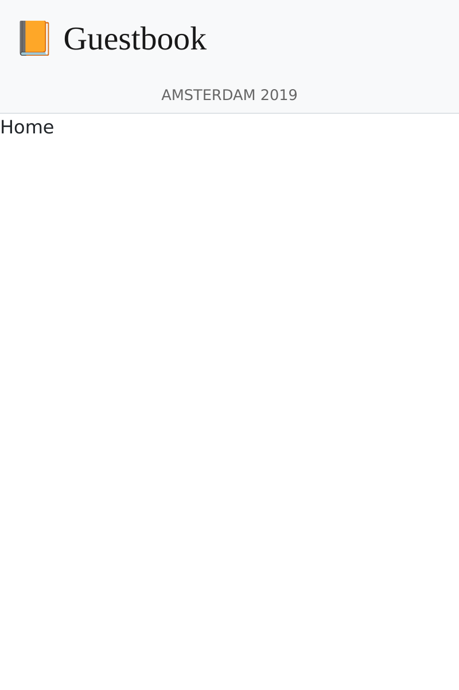

Створення ОЗ
=======================

.. index::
    single: SPA
    single: Mobile

Більшу частину коментарів буде відправлено під час конференції, куди деякі люди не приносять ноутбук. Але у них напевно є смартфон. А як щодо створення мобільного застосунку для швидкої перевірки коментарів конференції?

Одним зі способів створення такого мобільного застосунку є створення односторінкового застосунку Javascript (ОЗ). ОЗ працює локально, може використовувати локальне сховище, може викликати віддалений HTTP API й може використовувати сервіс-воркери, щоб створювати майже нативний застосунок.

Створення застосунку
---------------------------------------

Для створення мобільного застосунку ми будемо використовувати `Preact`_ і **Symfony Encore**. **Preact** — це невелика й ефективна основа, яка добре підходить для ОЗ гостьової книги.

Щоб зробити веб-сайт і ОЗ сумісними, ми збираємося повторно використовувати таблиці стилів Sass веб-сайту для мобільного застосунку.

Створіть застосунок ОЗ у каталозі ``spa`` і скопіюйте таблиці стилів веб-сайту:

.. code-block:: terminal

    $ mkdir -p spa/src spa/public spa/assets/styles
    $ cp assets/styles/*.scss spa/assets/styles/
    $ cd spa

.. note::

    Ми створили каталог ``public``, оскільки, в основному, ми будемо взаємодіяти з ОЗ за допомогою браузера. Ми могли б назвати його ``build``, якби хотіли створити тільки мобільний застосунок.

Для певності додайте файл ``.gitignore``:

.. code-block:: text
    :caption: .gitignore

    /node_modules/
    /public/
    /npm-debug.log
    # used later by Cordova
    /app/

Ініціалізуйте файл ``package.json`` (еквівалент файлу  ``composer.json`` для JavaScript):

.. code-block:: terminal

    $ npm init -y

Тепер додайте деякі необхідні залежності:

.. code-block:: terminal

    $ npm install @symfony/webpack-encore @babel/core @babel/preset-env babel-preset-preact preact html-webpack-plugin bootstrap

Останнім кроком налаштування є створення конфігурації Webpack Encore:

.. code-block:: javascript
    :caption: webpack.config.js
    :emphasize-lines: 8,11

    const Encore = require('@symfony/webpack-encore');
    const HtmlWebpackPlugin = require('html-webpack-plugin');

    Encore
        .setOutputPath('public/')
        .setPublicPath('/')
        .cleanupOutputBeforeBuild()
        .addEntry('app', './src/app.js')
        .enablePreactPreset()
        .enableSingleRuntimeChunk()
        .addPlugin(new HtmlWebpackPlugin({ template: 'src/index.ejs', alwaysWriteToDisk: true }))
    ;

    module.exports = Encore.getWebpackConfig();

Створення основного шаблону ОЗ
---------------------------------------------------------

Час створити початковий шаблон, у якому Preact буде відмальовувати застосунок:

.. code-block:: html
    :caption: src/index.ejs
    :emphasize-lines: 12

    <!DOCTYPE html>
    <html>
    <head>
        <meta http-equiv="Content-Type" content="text/html; charset=utf-8" />
        <meta http-equiv="X-UA-Compatible" content="IE=edge" />
        <meta name="msapplication-tap-highlight" content="no" />
        <meta name="viewport" content="user-scalable=no, initial-scale=1, maximum-scale=1, minimum-scale=1, width=device-width" />

        <title>Conference Guestbook application</title>
    </head>
    <body>
        

    </body>
    </html>

Тег ``
`` — це те місце, де буде відмальовуватися застосунок, за допомогою JavaScript. Ось перша версія коду, що відмальовує представлення "Hello World":

.. code-block:: text
    :caption: src/app.js
    :emphasize-lines: 3,11

    import {h, render} from 'preact';

    function App() {
        return (
            

                Hello world!
            

        )
    }

    render(<App />, document.getElementById('app'));

Останній рядок реєструє функцію ``App()`` для елементу ``#app`` HTML-сторінки.

Тепер все готово!

Запуск ОЗ у браузері
-------------------------------------

.. index::
    single: Symfony CLI;server:start
    single: Symfony CLI;server:stop

Оскільки цей застосунок не залежить від основного веб-сайту, нам потрібно запустити інший веб-сервер:

.. code-block:: terminal
    :class: hide

    $ symfony server:stop

.. code-block:: terminal

    $ symfony server:start -d --passthru=index.html

Прапорець ``--passthru`` вказує веб-серверу, що всі HTTP-запити потрібно передавати до файлу ``public/index.html`` (`public/`` є кореневим каталогом веб-сервера за замовчуванням). Ця сторінка керується застосунком Preact, він отримує сторінку для відмальовування за допомогою історії "браузера".

Щоб скомпілювати файли CSS **і JavaScript**, виконайте команду ``npm``:

.. code-block:: terminal

    $ ./node_modules/.bin/encore dev

Відкрийте ОЗ у браузері:

.. code-block:: terminal
    :class: ignore

    $ symfony open:local

І подивіться на запис hello world у нашому ОЗ:

.. figure:: screenshots/spa.png
    :alt: /
    :align: center
    :figclass: with-browser spa

Додавання маршрутизатора для обробки станів
----------------------------------------------------------------------------------

На цю мить ОЗ не може обробляти кілька сторінок. Щоб реалізувати багатосторінковість, нам потрібен маршрутизатор, як для Symfony. Ми будемо використовувати **preact-router**. Він приймає URL-адресу у якості вхідних даних та зіставляє її з компонентом Preact, щоб відобразити.

Встановіть preact-router:

.. code-block:: terminal

    $ npm install preact-router

Створіть сторінку для головної сторінки (*компонент Preact*):

.. code-block:: text
    :caption: src/pages/home.js

    import {h} from 'preact';

    export default function Home() {
        return (
            
Home

        );
    };

І ще одну для сторінки конференції:

.. code-block:: text
    :caption: src/pages/conference.js

    import {h} from 'preact';

    export default function Conference() {
        return (
            
Conference

        );
    };

Замініть ``div`` з "Hello World" на компонент ``Router``:

.. code-block:: diff
    :caption: patch_file
    :emphasize-lines: 15,17,20-23

    --- a/src/app.js
    +++ b/src/app.js
    @@ -1,9 +1,22 @@
     import {h, render} from 'preact';
    +import {Router, Link} from 'preact-router';
    +
    +import Home from './pages/home';
    +import Conference from './pages/conference';

     function App() {
         return (
             

    -            Hello world!
    +            <header>
    +                <Link href="/">Home</Link>
    +                 
    +                <Link href="/conference/amsterdam2019">Amsterdam 2019</Link>
    +            </header>
    +
    +            <Router>
    +                <Home path="/" />
    +                <Conference path="/conference/:slug" />
    +            </Router>
             

         )
     }

Перезберіть застосунок:

.. code-block:: terminal

    $ ./node_modules/.bin/encore dev

Якщо ви оновите застосунок у браузері, то зможете перейти за посиланням "Home" і посиланнями конференцій. Зверніть увагу, що URL-адреса браузера і кнопки назад/вперед вашого браузера працюють так, як ви цього очікуєте.

Стилізація ОЗ
-------------------------

Що стосується веб-сайту, додаймо завантажувач Sass:

.. code-block:: terminal

    $ npm install node-sass sass-loader

Увімкніть завантажувач Sass у Webpack і додайте посилання на таблицю стилів:

.. code-block:: diff
    :caption: patch_file

    --- a/src/app.js
    +++ b/src/app.js
    @@ -1,3 +1,5 @@
    +import '../assets/styles/app.scss';
    +
     import {h, render} from 'preact';
     import {Router, Link} from 'preact-router';

    --- a/webpack.config.js
    +++ b/webpack.config.js
    @@ -7,6 +7,7 @@ Encore
         .cleanupOutputBeforeBuild()
         .addEntry('app', './src/app.js')
         .enablePreactPreset()
    +    .enableSassLoader()
         .enableSingleRuntimeChunk()
         .addPlugin(new HtmlWebpackPlugin({ template: 'src/index.ejs', alwaysWriteToDisk: true }))
     ;

Тепер ми можемо оновити застосунок, щоб використовувати таблиці стилів:

.. code-block:: diff
    :caption: patch_file

    --- a/src/app.js
    +++ b/src/app.js
    @@ -9,10 +9,20 @@ import Conference from './pages/conference';
     function App() {
         return (
             

    -            <header>
    -                <Link href="/">Home</Link>
    -                 
    -                <Link href="/conference/amsterdam2019">Amsterdam 2019</Link>
    +            <header className="header">
    +                <nav className="navbar navbar-light bg-light">
    +                    

    +                        <Link className="navbar-brand mr-4 pr-2" href="/">
    +                            &#128217; Guestbook
    +                        </Link>
    +                    

    +                </nav>
    +
    +                <nav className="bg-light border-bottom text-center">
    +                    <Link className="nav-conference" href="/conference/amsterdam2019">
    +                        Amsterdam 2019
    +                    </Link>
    +                </nav>
                 </header>

                 <Router>

Перезберіть застосунок ще раз:

.. code-block:: terminal

    $ ./node_modules/.bin/encore dev

Тепер ви можете насолодитися повністю стилізованим ОЗ:

Отримання даних з API
------------------------------------

Тепер структура застосунку Preact завершена: Preact Router обробляє стани сторінки, включаючи заповнювач "slug" конференції, а основна таблиця стилів застосунку використовується для стилізації ОЗ.

Щоб зробити ОЗ динамічним, нам потрібно отримати дані з API за допомогою HTTP-запитів.

Налаштуйте Webpack, щоб визначити змінну середовища URL-адреси API:

.. code-block:: diff
    :caption: patch_file

    --- a/webpack.config.js
    +++ b/webpack.config.js
    @@ -1,3 +1,4 @@
    +const webpack = require('webpack');
     const Encore = require('@symfony/webpack-encore');
     const HtmlWebpackPlugin = require('html-webpack-plugin');

    @@ -10,6 +11,9 @@ Encore
         .enableSassLoader()
         .enableSingleRuntimeChunk()
         .addPlugin(new HtmlWebpackPlugin({ template: 'src/index.ejs', alwaysWriteToDisk: true }))
    +    .addPlugin(new webpack.DefinePlugin({
    +        'ENV_API_ENDPOINT': JSON.stringify(process.env.API_ENDPOINT),
    +    }))
     ;

     module.exports = Encore.getWebpackConfig();

Змінна середовища ``API_ENDPOINT`` має вказувати на веб-сервер веб-сайту, де у нас є кінцева точка API за посиланням ``/api``. Ми налаштуємо її належним чином, коли незабаром виконаємо команду ``npm``.

Створіть файл ``api.js``, що абстрагує вибірку даних з API:

.. code-block:: text
    :caption: src/api/api.js

    function fetchCollection(path) {
        return fetch(ENV_API_ENDPOINT + path).then(resp => resp.json()).then(json => json['hydra:member']);
    }

    export function findConferences() {
        return fetchCollection('api/conferences');
    }

    export function findComments(conference) {
        return fetchCollection('api/comments?conference='+conference.id);
    }

Тепер ви можете адаптувати компоненти header і home:

.. code-block:: diff
    :caption: patch_file

    --- a/src/app.js
    +++ b/src/app.js
    @@ -2,11 +2,23 @@ import '../assets/styles/app.scss';

     import {h, render} from 'preact';
     import {Router, Link} from 'preact-router';
    +import {useState, useEffect} from 'preact/hooks';

    +import {findConferences} from './api/api';
     import Home from './pages/home';
     import Conference from './pages/conference';

     function App() {
    +    const [conferences, setConferences] = useState(null);
    +
    +    useEffect(() => {
    +        findConferences().then((conferences) => setConferences(conferences));
    +    }, []);
    +
    +    if (conferences === null) {
    +        return 
Loading...
;
    +    }
    +
         return (
             

                 <header className="header">
    @@ -19,15 +31,17 @@ function App() {
                     </nav>

                     <nav className="bg-light border-bottom text-center">
    -                    <Link className="nav-conference" href="/conference/amsterdam2019">
    -                        Amsterdam 2019
    -                    </Link>
    +                    {conferences.map((conference) => (
    +                        <Link className="nav-conference" href={'/conference/'+conference.slug}>
    +                            {conference.city} {conference.year}
    +                        </Link>
    +                    ))}
                     </nav>
                 </header>

                 <Router>
    -                <Home path="/" />
    -                <Conference path="/conference/:slug" />
    +                <Home path="/" conferences={conferences} />
    +                <Conference path="/conference/:slug" conferences={conferences} />
                 </Router>
             

         )
    --- a/src/pages/home.js
    +++ b/src/pages/home.js
    @@ -1,7 +1,28 @@
     import {h} from 'preact';
    +import {Link} from 'preact-router';
    +
    +export default function Home({conferences}) {
    +    if (!conferences) {
    +        return 
No conferences yet
;
    +    }

    -export default function Home() {
         return (
    -        
Home

    +        

    +            {conferences.map((conference)=> (
    +                

    +                    

    +                        

    +                            <h4 className="font-weight-light">
    +                                {conference.city} {conference.year}
    +                            </h4>
    +                        

    +
    +                        <Link className="btn btn-sm btn-primary stretched-link" href={'/conference/'+conference.slug}>
    +                            View
    +                        </Link>
    +                    

    +                

    +            ))}
    +        

         );
    -};
    +}

Нарешті, Preact Router передає заповнювач "slug" до компонента conference як властивість. Використовуйте його, щоб відображати відповідну конференцію та її коментарі, знову використовуючи API; і адаптуйте відмальовування, щоб використовувати дані API:

.. code-block:: diff
    :caption: patch_file

    --- a/src/pages/conference.js
    +++ b/src/pages/conference.js
    @@ -1,7 +1,48 @@
     import {h} from 'preact';
    +import {findComments} from '../api/api';
    +import {useState, useEffect} from 'preact/hooks';
    +
    +function Comment({comments}) {
    +    if (comments !== null && comments.length === 0) {
    +        return 
No comments yet
;
    +    }
    +
    +    if (!comments) {
    +        return 
Loading...
;
    +    }
    +
    +    return (
    +        

    +            {comments.map(comment => (
    +                

    +                    

    +                        {!comment.photoFilename ? '' : (
    +                            <a href={ENV_API_ENDPOINT+'uploads/photos/'+comment.photoFilename} target="_blank">
    +                                
    +                            </a>
    +                        )}
    +                    

    +
    +                    <h5 className="font-weight-light mt-3 mb-0">{comment.author}</h5>
    +                    
{comment.text}

    +                

    +            ))}
    +        

    +    );
    +}
    +
    +export default function Conference({conferences, slug}) {
    +    const conference = conferences.find(conference => conference.slug === slug);
    +    const [comments, setComments] = useState(null);
    +
    +    useEffect(() => {
    +        findComments(conference).then(comments => setComments(comments));
    +    }, [slug]);

    -export default function Conference() {
         return (
    -        
Conference

    +        

    +            <h4>{conference.city} {conference.year}</h4>
    +            <Comment comments={comments} />
    +        

         );
    -};
    +}

Тепер ОЗ має знати URL-адресу нашого API, за допомогою змінної середовища ``API_ENDPOINT``. Встановіть її за допомогою URL-адреси веб-сервера API (що працює в каталозі ``..``):

.. code-block:: terminal

    $ API_ENDPOINT=`symfony var:export SYMFONY_PROJECT_DEFAULT_ROUTE_URL --dir=..` ./node_modules/.bin/encore dev

Тепер ви також можете працювати у фоновому режимі:

.. code-block:: terminal

    $ API_ENDPOINT=`symfony var:export SYMFONY_PROJECT_DEFAULT_ROUTE_URL --dir=..` symfony run -d --watch=webpack.config.js ./node_modules/.bin/encore dev --watch

І застосунок у браузері тепер має працювати належним чином:

.. figure:: screenshots/spa-home-final.png
    :alt: /
    :align: center
    :figclass: with-browser spa

.. figure:: screenshots/spa-conference-final.png
    :alt: /conference/amsterdam-2019
    :align: center
    :figclass: with-browser spa

Оце так! Тепер у нас є повнофункціональний ОЗ із маршрутизатором і реальними даними. Ми могли б і надалі покращувати застосунок Preact, якщо захочемо, але він уже працює відмінно.

Розгортання ОЗ в продакшн
-----------------------------------------------

.. index::
    single: Platform.sh;Multi-Applications

Platform.sh дозволяє розгортати кілька застосунків у межах одного проекту. Додати інший застосунок можна створивши файл ``.platform.app.yaml`` у будь-якому підкаталозі. Створіть його у каталозі ``spa/`` із назвою ``spa``:

.. code-block:: yaml
    :caption: .platform.app.yaml
    :emphasize-lines: 1

    name: spa

    type: nodejs:18

    size: S

    build:
        flavor: none

    web:
        commands:
            start: sleep
        locations:
            "/":
                root: "public"
                index:
                    - "index.html"
                scripts: false
                expires: 10m

    hooks:
        build: |
            set -x -e

            curl -fs https://get.symfony.com/cloud/configurator | bash

            NODE_VERSION=18 node-build

.. index::
    single: Platform.sh;Routes

Відредагуйте файл ``.platform/routes.yaml``, щоб переспрямувати піддомен ``spa.`` у застосунок ``spa``, що зберігається в кореневому каталозі проекту:

.. code-block:: terminal

    $ cd ../

.. code-block:: diff
    :caption: patch_file
    :emphasize-lines: 4,5

    --- a/.platform/routes.yaml
    +++ b/.platform/routes.yaml
    @@ -1,2 +1,5 @@
     "https://{all}/": { type: upstream, upstream: "varnish:http", cache: { enabled: false } }
     "http://{all}/": { type: redirect, to: "https://{all}/" }
    +
    +"https://spa.{all}/": { type: upstream, upstream: "spa:http" }
    +"http://spa.{all}/": { type: redirect, to: "https://spa.{all}/" }

Налаштування CORS для ОЗ
-----------------------------------------

.. index::
    single: CORS
    single: Cross-Origin Resource Sharing

Якщо ви розгорнете код зараз — він не буде працювати, оскільки браузер заблокує запит API. Нам потрібно явно дозволити ОЗ отримувати доступ до API. Отримайте поточне доменне ім'я, що закріплене за вашим застосунком:

.. code-block:: terminal

    $ symfony cloud:env:url --pipe --primary

Визначте змінну середовища ``CORS_ALLOW_ORIGIN`` відповідним чином:

.. code-block:: terminal

    $ symfony cloud:variable:create --sensitive=1 --level=project -y --name=env:CORS_ALLOW_ORIGIN --value="^`symfony cloud:env:url --pipe --primary | sed 's#/$##' | sed 's#https://#https://spa.#'`$"

Якщо ваш домен ``https://master-5szvwec-hzhac461b3a6o.eu-5.platformsh.site/``, виклики ``sed`` перетворять його в ``https://spa.master-5szvwec-hzhac461b3a6o.eu-5.platformsh.site``.

Нам також потрібно встановити змінну середовища ``API_ENDPOINT``:

.. code-block:: terminal

    $ symfony cloud:variable:create --sensitive=1 --level=project -y --name=env:API_ENDPOINT --value=`symfony cloud:env:url --pipe --primary`

Зафіксуйте й розгорніть:

.. code-block:: terminal
    :class: ignore

    $ git add .
    $ git commit -a -m'Add the SPA application'
    $ symfony cloud:deploy

Отримайте доступ до ОЗ у браузері, вказавши застосунок у якості прапорця:

.. code-block:: terminal
    :class: ignore

    $ symfony cloud:url -1 --app=spa

Використання Cordova для створення застосунку для смартфонів
-----------------------------------------------------------------------------------------------------------

.. index::
    single: SPA;Cordova
    single: Apache Cordova
    single: Cordova

**Apache Cordova** — це інструмент, який створює багатоплатформні застосунки для смартфонів. І хороша новина, він може використовувати ОЗ, який ми щойно створили.

Встановімо його:

.. code-block:: terminal

    $ cd spa
    $ npm install cordova

.. note::

    Вам також потрібно встановити Android SDK. У цьому розділі згадується тільки Android, але Cordova працює з усіма мобільними платформами, включаючи iOS.

Створіть структуру каталогів застосунку:

.. code-block:: terminal
    :class: answers(n)

    $ ./node_modules/.bin/cordova create app

І згенеруйте Android застосунок:

.. code-block:: terminal
    :class: ignore

    $ cd app
    $ ~/.npm/bin/cordova platform add android
    $ cd ..

Це все, що вам потрібно. Тепер ви можете створити продакшн файли й перемістити їх у Cordova:

.. code-block:: terminal

    $ API_ENDPOINT=`symfony var:export SYMFONY_PROJECT_DEFAULT_ROUTE_URL --dir=..` ./node_modules/.bin/encore production
    $ rm -rf app/www
    $ mkdir -p app/www
    $ cp -R public/ app/www

Запустіть застосунок на смартфоні або емуляторі:

.. code-block:: terminal
    :class: ignore

    $ ./node_modules/.bin/cordova run android

.. sidebar:: Йдемо далі

    * `Офіційний веб-сайт Preact`_;

    * `Офіційний веб-сайт Cordova`_.

.. _`Preact`: https://preactjs.com/
.. _`Офіційний веб-сайт Preact`: https://preactjs.com/
.. _`Офіційний веб-сайт Cordova`: https://cordova.apache.org/
