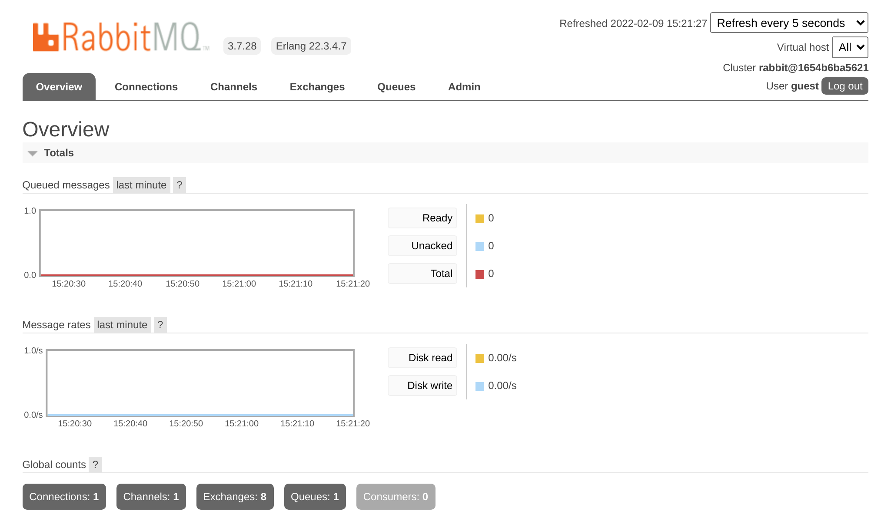

Використання RabbitMQ у якості брокера повідомлень
=======================================================================================

.. index::
    single: RabbitMQ

RabbitMQ є дуже популярним брокером повідомлень, який ви можете використовувати як альтернативу PostgreSQL.

Перехід від PostgreSQL до RabbitMQ
----------------------------------------------

Щоб використовувати RabbitMQ замість PostgreSQL у якості брокера повідомлень:

.. code-block:: diff
    :caption: patch_file

    --- a/config/packages/messenger.yaml
    +++ b/config/packages/messenger.yaml
    @@ -5,10 +5,7 @@ framework:
             transports:
                 # https://symfony.com/doc/current/messenger.html#transport-configuration
                 async:
    -                dsn: '%env(MESSENGER_TRANSPORT_DSN)%'
    -                options:
    -                    use_notify: true
    -                    check_delayed_interval: 60000
    +                dsn: '%env(RABBITMQ_URL)%'
                     retry_strategy:
                         max_retries: 3
                         multiplier: 2

Нам також потрібно додати підтримку RabbitMQ для Messenger:

.. code-block:: terminal

    $ symfony composer req amqp-messenger

Додавання RabbitMQ у стек Docker
----------------------------------------------

.. index::
    single: Docker;RabbitMQ

Як ви могли здогадатися, нам також потрібно додати RabbitMQ у стек Docker Compose:

.. code-block:: diff
    :caption: patch_file

    --- a/docker-compose.yml
    +++ b/docker-compose.yml
    @@ -19,6 +19,10 @@ services:
         image: redis:5-alpine
         ports: [6379]

    +  rabbitmq:
    +    image: rabbitmq:3.7-management
    +    ports: [5672, 15672]
    +
     volumes:
     ###> doctrine/doctrine-bundle ###
       db-data:

Перезавантаження сервісів Docker
--------------------------------------------------------

Щоб змусити Docker Compose взяти до уваги контейнер RabbitMQ, зупиніть контейнери й перезавантажте їх:

.. code-block:: terminal

    $ docker-compose stop
    $ docker-compose up -d

.. code-block:: terminal
    :class: hide

    $ sleep 10

Ознайомлення з веб-інтерфейсом управління RabbitMQ
---------------------------------------------------------------------------------------

.. index::
    single: Symfony CLI;open:local:rabbitmq

Якщо ви хочете побачити черги й повідомлення, які проходять через RabbitMQ, відкрийте його веб-інтерфейс управління:

.. code-block:: terminal
    :class: ignore

    $ symfony open:local:rabbitmq

Або з панелі інструментів веб-налагодження:

.. figure:: screenshots/rabbitmq-wdt.png
    :alt: /
    :align: center
    :figclass: with-browser

Використовуйте ``guest``/``guest``, щоб увійти до інтерфейсу управління RabbitMQ:

Розгортання RabbitMQ
-------------------------------

.. index::
    single: Platform.sh;RabbitMQ
    single: RabbitMQ

Додавання RabbitMQ до продакшн серверів можна здійснити додавши його до списку сервісів:

.. code-block:: diff
    :caption: patch_file

    --- a/.platform/services.yaml
    +++ b/.platform/services.yaml
    @@ -18,3 +18,8 @@ files:

     rediscache:
         type: redis:5.0
    +
    +queue:
    +    type: rabbitmq:3.7
    +    disk: 1024
    +    size: S

Також вкажіть його в конфігурації веб-контейнера й увімкніть розширення PHP ``amqp``:

.. code-block:: diff
    :caption: patch_file

    --- a/.platform.app.yaml
    +++ b/.platform.app.yaml
    @@ -8,6 +8,7 @@ dependencies:

     runtime:
         extensions:
    +        - amqp
             - apcu
             - blackfire
             - ctype
    @@ -42,6 +43,7 @@ mounts:
     relationships:
         database: "database:postgresql"
         redis: "rediscache:redis"
    +    rabbitmq: "queue:rabbitmq"
         
     hooks:
         build: |

.. index::
    single: Platform.sh;Tunnel
    single: Symfony CLI;cloud:tunnel:open
    single: Symfony CLI;cloud:tunnel:close
    single: Symfony CLI;open:remote:rabbitmq

Коли сервіс RabbitMQ встановлено в проекті, ви можете отримати доступ до його веб-інтерфейсу управління, спочатку відкривши тунель:

.. code-block:: terminal
    :class: ignore

    $ symfony cloud:tunnel:open
    $ symfony open:remote:rabbitmq

    # when done
    $ symfony cloud:tunnel:close

.. sidebar:: Йдемо далі

    * `Документація по RabbitMQ`_.

.. _`Документація по RabbitMQ`: https://www.rabbitmq.com/documentation.html
