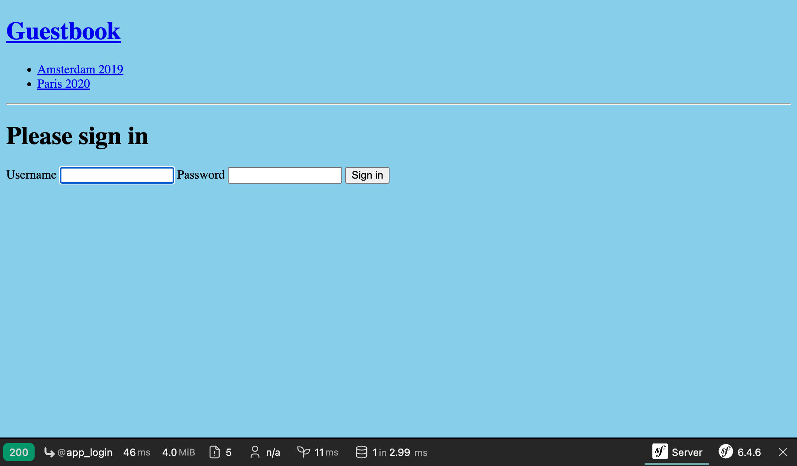

Das Admin-Backend absichern
===========================

.. index::
    single: Components;Security
    single: Security

Die Admin-Backend-Schnittstelle sollte nur für vertrauenswürdige Personen zugänglich sein. Die Sicherung dieses Bereichs der Website kann mit der Symfony Security-Komponente erfolgen.

Eine User Entity definieren
---------------------------

Auch wenn die Teilnehmer*innen nicht in der Lage sein werden, ihre eigenen Konten auf der Website zu erstellen, werden wir ein voll funktionsfähiges Authentifizierungssystem für eine*n Administrator*in einrichten. Wir werden daher nur eine*n einzige*n Benutzer*in haben.

Der erste Schritt ist die Definition einer ``User``-Entity. Um Verwechslungen zu vermeiden, benennen wir sie stattdessen ``Admin``.

Um die ``Admin``-Entity im Authentifizierungssystem von Symfony Security zu integrieren, muss sie einige spezifische Anforderungen erfüllen. Zum Beispiel benötigt sie ein ``password``-Feld.

.. index::
    single: Command;make:user

Verwende den ``make:user``-Befehl anstatt dem üblichen ``make::entity``-Befehl, um die ``Admin``-Entity zu erstellen:

.. code-block:: terminal
    :class: answers(yes||username||yes)

    $ symfony console make:user Admin

Beantworte die interaktiven Fragen: Wir wollen Doctrine verwenden, um die Admins zu speichern (``yes``), verwende ``username`` für den eindeutigen Anzeigenamen von Admins, und jede*r Benutzer*in wird ein Passwort haben (``yes``).

Die generierte Klasse enthält Methoden wie ``getRoles()``, ``eraseCredentials()``, und ein paar andere, die vom Symfony-Authentifizierungssystem benötigt werden.

Falls Du dem*r ``Admin``-Benutzer*in weitere Eigenschaften hinzufügen möchtest, verwende ``make:entity``.

Zusätzlich zum Erzeugen der ``Admin``-Entity aktualisierte der Befehl auch die Sicherheitskonfiguration, um die Entity mit dem Authentifizierungssystem zu verbinden:

.. code-block:: diff
    :class: ignore
    :emphasize-lines: 11,12,20

    --- a/config/packages/security.yaml
    +++ b/config/packages/security.yaml
    @@ -5,14 +5,18 @@ security:
             Symfony\Component\Security\Core\User\PasswordAuthenticatedUserInterface: 'auto'
         # https://symfony.com/doc/current/security.html#loading-the-user-the-user-provider
         providers:
    -        users_in_memory: { memory: null }
    +        # used to reload user from session & other features (e.g. switch_user)
    +        app_user_provider:
    +            entity:
    +                class: App\Entity\Admin
    +                property: username
         firewalls:
             dev:
                 pattern: ^/(_(profiler|wdt)|css|images|js)/
                 security: false
             main:
                 lazy: true
    -            provider: users_in_memory
    +            provider: app_user_provider

                 # activate different ways to authenticate
                 # https://symfony.com/doc/current/security.html#the-firewall

Wir lassen Symfony den besten verfügbaren Algorithmus zum Hashen von Passwörtern auswählen (diese werden sich im Laufe der Zeit weiterentwickeln).

Zeit, eine Migration zu generieren und die Datenbank zu migrieren:

.. code-block:: terminal

    $ symfony console make:migration
    $ symfony console doctrine:migrations:migrate -n

Ein Passwort für die*en Admin-Benutzer*in generieren
-----------------------------------------------------

.. index::
    single: Security;Password Hashes

Wir werden kein spezielles System zur Erstellung von Admin-Konten entwickeln. Auch hier werden wir immer nur einen Admin haben. Das Login wird ``admin`` sein und wir müssen den Passwort-Hash generieren.

.. index::
    single: Command;security:hash-password

Wähle ein beliebiges Passwort und führe den folgenden Befehl aus, um den Passwort-Hash zu generieren:

.. code-block:: terminal
    :class: answers(admin)

    $ symfony console security:hash-password

.. code-block:: text
    :class: ignore
    :emphasize-lines: 11

    Symfony Password Hash Utility
    =============================

     Type in your password to be hashed:
     >

     ------------------ ---------------------------------------------------------------------------------------------------
      Key                Value
     ------------------ ---------------------------------------------------------------------------------------------------
      Hasher used        Symfony\Component\PasswordHasher\Hasher\MigratingPasswordHasher
      Password hash      $argon2id$v=19$m=65536,t=4,p=1$BQG+jovPcunctc30xG5PxQ$TiGbx451NKdo+g9vLtfkMy4KjASKSOcnNxjij4gTX1s
     ------------------ ---------------------------------------------------------------------------------------------------

     ! [NOTE] Self-salting hasher used: the hasher generated its own built-in salt.

     [OK] Password hashing succeeded

Eine*n Administrator*in erstellen
---------------------------------

.. index::
    single: Symfony CLI;run psql

Füge die*en Admin-Benutzer*in über einen SQL-Befehl hinzu:

.. code-block:: terminal

    $ symfony run psql -c "INSERT INTO admin (id, username, roles, password) \
      VALUES (nextval('admin_id_seq'), 'admin', '[\"ROLE_ADMIN\"]', \
      '\$argon2id\$v=19\$m=65536,t=4,p=1\$BQG+jovPcunctc30xG5PxQ\$TiGbx451NKdo+g9vLtfkMy4KjASKSOcnNxjij4gTX1s')"

Siehst Du, wie das ``$``-Zeichen in unserem Wert in der Passwortspalte escaped wurde? Escapen nie vergessen!

Die Sicherheits-Authentifizierung konfigurieren
-----------------------------------------------

.. index::
    single: Command;make:security:form-login
    single: Security;Authenticator
    single: Security;Form Login
    single: Login
    single: Logout

Jetzt, da wir eine*n Admin-Benutzer*in haben, können wir das Admin-Backend absichern. Symfony unterstützt mehrere Authentifizierungsstrategien. Lass uns ein klassisches und verbreitetes *Formular-Authentifizierungssystem* verwenden.

Führe den Befehl ``make:security:form-login`` aus, um die Sicherheitskonfiguration zu aktualisieren, ein Login-Template zu generieren und einen *Authentifikator* zu erstellen.

.. code-block:: terminal
    :class: answers(SecurityController||yes)

    $ symfony console make:security:form-login

Benenne den Controller ``SecurityController`` und generiere eine ``/logout``-URL (``yes``).

Der Befehl hat die Sicherheitskonfiguration aktualisiert, um die generierten Klassen zu verbinden:

.. code-block:: diff
    :class: ignore
    :emphasize-lines: 9

    --- a/config/packages/security.yaml
    +++ b/config/packages/security.yaml
    @@ -15,7 +15,15 @@ security:
                 security: false
             main:
                 lazy: true
    -            provider: users_in_memory
    +            provider: app_user_provider
    +            form_login:
    +                login_path: app_login
    +                check_path: app_login
    +                enable_csrf: true
    +            logout:
    +                path: app_logout
    +                # where to redirect after logout
    +                # target: app_any_route

                 # activate different ways to authenticate
                 # https://symfony.com/doc/current/security.html#the-firewall

.. index::
    single: Command;debug:router
    single: Routing;Debug
    single: Debug;Routing

.. tip::

    Wie merke ich mir, dass die EasyAdmin-Route (wie in ``App\Controller\Admin\DashboardController`` konfiguriert) ``admin`` ist? Gar nicht. Du kannst in die Datei schauen, oder aber auch den folgenden Befehl ausführen, der die Zuordnung zwischen Routennamen und Pfaden anzeigt:

    .. code-block:: terminal

        $ symfony console debug:router

Berechtigungsregeln für die Zugriffskontrolle hinzufügen
----------------------------------------------------------

.. index::
    single: Security;Authorization
    single: Security;Access Control

Ein Sicherheitssystem besteht aus zwei Teilen: *Authentifizierung* und *Autorisierung*. Beim Erstellen des*r Admin-Benutzers*in haben wir ihm*r die ``ROLE_ADMIN``-Rolle gegeben. Wir schränken den ``/admin``-Bereich auf Benutzer*innen mit dieser Rolle ein, indem wir eine Regel zu ``access_control`` hinzufügen:

.. code-block:: diff
    :emphasize-lines: 8

    --- a/config/packages/security.yaml
    +++ b/config/packages/security.yaml
    @@ -34,7 +34,7 @@ security:
         # Easy way to control access for large sections of your site
         # Note: Only the *first* access control that matches will be used
         access_control:
    -        # - { path: ^/admin, roles: ROLE_ADMIN }
    +        - { path: ^/admin, roles: ROLE_ADMIN }
             # - { path: ^/profile, roles: ROLE_USER }

     when@test:

Die ``access_control``-Regeln schränken den Zugriff durch reguläre Ausdrücke ein. Beim Versuch, auf eine URL zuzugreifen, die mit ``/admin`` beginnt, überprüft das Sicherheitssystem, dass die angemeldeten Benutzer*innen die ``ROLE_ADMIN``-Rolle besitzen.

Über das Login-Formular authentifizieren
-----------------------------------------

Wenn Du versuchst, auf das Admin-Backend zuzugreifen, solltest Du nun auf die Login-Seite weitergeleitet und aufgefordert werden, einen Usernamen und ein Passwort einzugeben:

Melde Dich mit ``admin`` und dem Klartext-Passwort an, das Du zuvor als Hash gewählt hast. Wenn Du meinen SQL-Befehl genau kopiert hast, lautet das Passwort ``admin``.

Beachte, dass EasyAdmin das Symfony-Authentifizierungssystem automatisch erkennt:

.. figure:: screenshots/easy-admin-secured.png
    :alt: /admin/
    :align: center
    :figclass: with-browser

Versuche, auf den Link "Abmelden" zu klicken. Und fertig! Ein vollständig gesicherter Backend-Adminbereich.

.. index::
    single: Command;make:registration-form

.. note::

    Wenn Du ein vollwertiges Formular-Authentifizierungssystem erstellen möchtest, wirf einen Blick auf den ``make:registration-form``-Befehl.

.. sidebar:: Weiterführendes

    * Die `Symfony Security Dokumentation`_;

    * `SymfonyCasts Security Tutorial`_;

    * `Wie man ein Login-Formular in Symfony-Anwendungen erstellt`_;

    * Das `Symfony Security Cheat Sheet`_.

.. _`Symfony Security Dokumentation`: https://symfony.com/doc/current/security.html
.. _`SymfonyCasts Security Tutorial`: https://symfonycasts.com/screencast/symfony-security
.. _`Wie man ein Login-Formular in Symfony-Anwendungen erstellt`: https://symfony.com/doc/current/security/form_login_setup.html
.. _`Symfony Security Cheat Sheet`: https://github.com/andreia/symfony-cheat-sheets/blob/master/Symfony4/security_en_44.pdf
