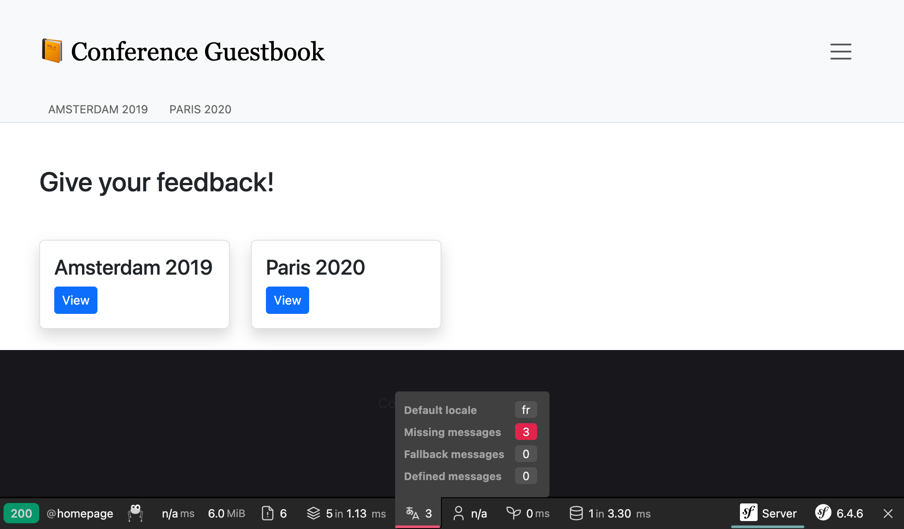
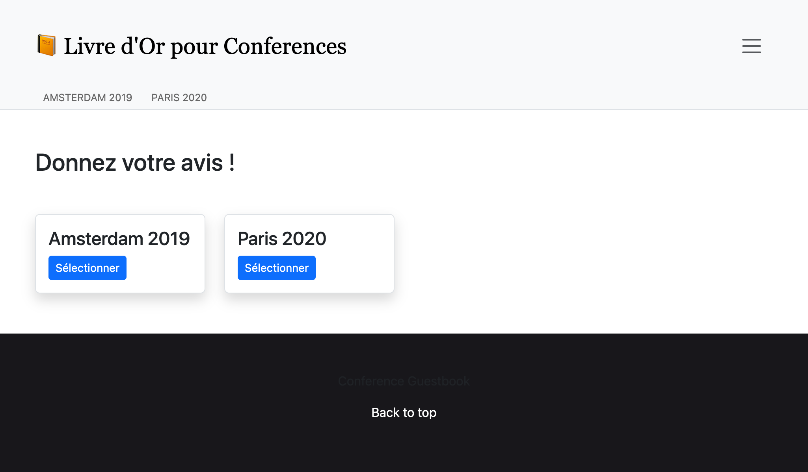

Eine Anwendung lokalisieren
===========================

Mit seinem internationalen Nutzerkreis ist Symfony seit jeher in der Lage, Internationalisierung (i18n) und Lokalisierung (l10n) ohne weiteres zu bewältigen. Bei der Lokalisierung einer Anwendung geht es nicht nur um die Übersetzung der Benutzeroberfläche, sondern auch um Mehrzahlformen, Datums- und Währungsformatierung, URLs und mehr.

URLs internationalisieren
-------------------------

.. index::
    single: Components;Routing
    single: Routing;Locale
    single: Routing;Requirements
    single: Attributes;Route

Der erste Schritt zur Internationalisierung der Website ist die Internationalisierung der URLs. Bei der Übersetzung einer Website sollten die URLs pro Sprache unterschiedlich sein, damit HTTP-Caches problemlos funktionieren (verwende niemals die gleiche URL und speichere die Sprache in der Session).

Nutze den speziellen Routen-Parameter ``_locale``, um die Sprache in Routen zu verwenden:

.. code-block:: diff
    :caption: patch_file
    :emphasize-lines: 8

    --- i/src/Controller/ConferenceController.php
    +++ w/src/Controller/ConferenceController.php
    @@ -27,7 +27,7 @@ final class ConferenceController extends AbstractController
         ) {
         }

    -    #[Route('/', name: 'homepage')]
    +    #[Route('/{_locale}/', name: 'homepage')]
         public function index(ConferenceRepository $conferenceRepository): Response
         {
             return $this->render('conference/index.html.twig', [

Auf der Homepage wird die Sprache nun intern abhängig von der URL gesetzt; z. B. gibt ``$request->getLocale()`` uns ``fr`` zurück, wenn Du ``/fr/`` eintippst.

Da Du den Inhalt wahrscheinlich nicht in allen Sprachen übersetzen kannst, beschränke die zulässigen ``_locale``-Werte auf die Sprachen, die Du unterstützen möchtest:

.. code-block:: diff
    :caption: patch_file
    :emphasize-lines: 8

    --- i/src/Controller/ConferenceController.php
    +++ w/src/Controller/ConferenceController.php
    @@ -27,7 +27,7 @@ final class ConferenceController extends AbstractController
         ) {
         }

    -    #[Route('/{_locale}/', name: 'homepage')]
    +    #[Route('/{_locale<en|fr>}/', name: 'homepage')]
         public function index(ConferenceRepository $conferenceRepository): Response
         {
             return $this->render('conference/index.html.twig', [

Jeder Routen-Parameter kann durch einen regulären Ausdruck innerhalb ``<`` ``>`` eingeschränkt werden. Die ``homepage``-Route passt jetzt nur noch, wenn der Routen-Parameter ``_locale`` ``en`` oder ``fr`` ist. Versuche ``/es/`` einzutippen, Du solltest einen 404-Fehler bekommen, da keine Route passt.

Da wir die gleiche Anforderung in fast allen Routen verwenden werden, verschieben wir sie in einen Container-Parameter:

.. code-block:: diff
    :caption: patch_file

    --- i/config/services.yaml
    +++ w/config/services.yaml
    @@ -9,6 +9,7 @@ parameters:
         admin_email: "%env(string:default:default_admin_email:ADMIN_EMAIL)%"
         default_base_url: 'http://127.0.0.1'
         router.request_context.base_url: '%env(default:default_base_url:SYMFONY_DEFAULT_ROUTE_URL)%'
    +    app.supported_locales: 'en|fr'

     services:
         # default configuration for services in *this* file
    --- i/src/Controller/ConferenceController.php
    +++ w/src/Controller/ConferenceController.php
    @@ -27,7 +27,7 @@ final class ConferenceController extends AbstractController
         ) {
         }

    -    #[Route('/{_locale<en|fr>}/', name: 'homepage')]
    +    #[Route('/{_locale<%app.supported_locales%>}/', name: 'homepage')]
         public function index(ConferenceRepository $conferenceRepository): Response
         {
             return $this->render('conference/index.html.twig', [

Das Hinzufügen einer Sprache kann durch Aktualisieren des ``app.supported_languages``-Parameters erfolgen.

Füge den anderen URLs das gleiche lokale Routenpräfix hinzu:

.. code-block:: diff
    :caption: patch_file

    --- i/src/Controller/ConferenceController.php
    +++ w/src/Controller/ConferenceController.php
    @@ -35,7 +35,7 @@ final class ConferenceController extends AbstractController
             ])->setSharedMaxAge(3600);
         }

    -    #[Route('/conference_header', name: 'conference_header')]
    +    #[Route('/{_locale<%app.supported_locales%>}/conference_header', name: 'conference_header')]
         public function conferenceHeader(ConferenceRepository $conferenceRepository): Response
         {
             return $this->render('conference/header.html.twig', [
    @@ -43,7 +43,7 @@ final class ConferenceController extends AbstractController
             ])->setSharedMaxAge(3600);
         }

    -    #[Route('/conference/{slug}', name: 'conference')]
    +    #[Route('/{_locale<%app.supported_locales%>}/conference/{slug}', name: 'conference')]
         public function show(
             Request $request,
             Conference $conference,

Wir sind fast fertig. Wir haben keine Route mehr, die zu ``/`` passt. Fügen wir sie wieder ein und leiten sie nach ``/en/`` weiter:

.. code-block:: diff
    :caption: patch_file

    --- i/src/Controller/ConferenceController.php
    +++ w/src/Controller/ConferenceController.php
    @@ -27,6 +27,12 @@ final class ConferenceController extends AbstractController
         ) {
         }

    +    #[Route('/')]
    +    public function indexNoLocale(): Response
    +    {
    +        return $this->redirectToRoute('homepage', ['_locale' => 'en']);
    +    }
    +
         #[Route('/{_locale<%app.supported_locales%>}/', name: 'homepage')]
         public function index(ConferenceRepository $conferenceRepository): Response
         {

Da nun alle Hauptrouten einen `_locale``-Parameter haben, sieht man, dass die generierten URLs auf den Seiten automatisch die aktuelle Sprache berücksichtigen.

Einen Sprachwechsler hinzufügen
--------------------------------

.. index::
    single: Twig;path
    single: Twig;Locale

Damit Benutzer*innen von der Standard-Sprache ``en`` zu einer anderen wechseln können, fügen wir einen Sprachwechsler im Header hinzu:

.. code-block:: diff
    :caption: patch_file

    --- i/templates/base.html.twig
    +++ w/templates/base.html.twig
    @@ -34,6 +34,16 @@
                                         Admin
                                     </a>
                                 </li>
    +<li class="nav-item dropdown">
    +    <a class="nav-link dropdown-toggle" href="#" id="dropdown-language" role="button"
    +        data-bs-toggle="dropdown" aria-haspopup="true" aria-expanded="false">
    +        English
    +    </a>
    +    <ul class="dropdown-menu dropdown-menu-right" aria-labelledby="dropdown-language">
    +        <li><a class="dropdown-item" href="{{ path('homepage', {_locale: 'en'}) }}">English</a></li>
    +        <li><a class="dropdown-item" href="{{ path('homepage', {_locale: 'fr'}) }}">Français</a></li>
    +    </ul>
    +</li>
                             </ul>
                         

                     

Um zu einem anderen Sprache zu wechseln, übergeben wir explizit den Routen-Parameter ``_locale`` an die ``path()``-Funktion.

.. index::
    single: Twig;app.request
    single: Twig;locale_name

Aktualisiere das Template, um den aktuellen Sprach-Namen anstelle des fest geschriebenen "English" anzuzeigen:

.. code-block:: diff
    :caption: patch_file

    --- i/templates/base.html.twig
    +++ w/templates/base.html.twig
    @@ -37,7 +37,7 @@
     <li class="nav-item dropdown">
         <a class="nav-link dropdown-toggle" href="#" id="dropdown-language" role="button"
             data-bs-toggle="dropdown" aria-haspopup="true" aria-expanded="false">
    -        English
    +        {{ app.request.locale|locale_name(app.request.locale) }}
         </a>
         <ul class="dropdown-menu dropdown-menu-right" aria-labelledby="dropdown-language">
             <li><a class="dropdown-item" href="{{ path('homepage', {_locale: 'en'}) }}">English</a></li>

``app`` ist eine globale Twig-Variable, die den Zugriff auf den aktuellen Request ermöglicht. Um das Sprachkürzel in ein lesbares Wort zu konvertieren, verwenden wir den Twig-Filter ``locale_name``.

.. index::
    single: Components;String

Abhängig von der Sprache wird der Name der Sprache nicht immer großgeschrieben. Um Sätze richtig groß zu schreiben, benötigen wir einen entsprechenden Filter, der mit Unicode umgehen kann, wie ihn die Symfony String-Komponente und ihre Twig-Implementierung bereitstellen:

.. code-block:: terminal

    $ symfony composer req twig/string-extra

.. index::
    single: Twig;u.title

.. code-block:: diff
    :caption: patch_file

    --- i/templates/base.html.twig
    +++ w/templates/base.html.twig
    @@ -37,7 +37,7 @@
     <li class="nav-item dropdown">
         <a class="nav-link dropdown-toggle" href="#" id="dropdown-language" role="button"
             data-bs-toggle="dropdown" aria-haspopup="true" aria-expanded="false">
    -        {{ app.request.locale|locale_name(app.request.locale) }}
    +        {{ app.request.locale|locale_name(app.request.locale)|u.title }}
         </a>
         <ul class="dropdown-menu dropdown-menu-right" aria-labelledby="dropdown-language">
             <li><a class="dropdown-item" href="{{ path('homepage', {_locale: 'en'}) }}">English</a></li>

Du kannst nun über den Sprachwechsler von Französisch auf Englisch umschalten und die gesamte Oberfläche passt sich schön an:

.. figure:: screenshots/intl-switcher.png
    :alt: /fr/conference/amsterdam-2019
    :align: center
    :figclass: with-browser

Das Interface übersetzen
-------------------------

.. index::
    single: Components;Translation
    single: Translation
    single: Twig;trans

Die Übersetzung jedes einzelnen Satzes auf einer großen Website kann mühsam sein, aber glücklicherweise haben wir nur eine Handvoll Nachrichten (messages) auf unserer Website. Beginnen wir mit allen Sätzen auf der Homepage:

.. code-block:: diff
    :caption: patch_file

    --- i/templates/base.html.twig
    +++ w/templates/base.html.twig
    @@ -20,7 +20,7 @@
                 <nav class="navbar navbar-expand-xl navbar-light bg-light">
                     

                         <a class="navbar-brand me-4 pr-2" href="{{ path('homepage') }}">
    -                        &#128217; Conference Guestbook
    +                        &#128217; {{ 'Conference Guestbook'|trans }}
                         </a>

                         <button class="navbar-toggler border-0" type="button" data-bs-toggle="collapse" data-bs-target="#header-menu" aria-controls="navbarSupportedContent" aria-expanded="false" aria-label="Show/Hide navigation">
    --- i/templates/conference/index.html.twig
    +++ w/templates/conference/index.html.twig
    @@ -4,7 +4,7 @@

     
         <h2 class="mb-5">
    -        Give your feedback!
    +        {{ 'Give your feedback!'|trans }}
         </h2>

         
    @@ -21,7 +21,7 @@

                                 <a href="{{ path('conference', { slug: conference.slug }) }}"
                                    class="btn btn-sm btn-primary stretched-link">
    -                                View
    +                                {{ 'View'|trans }}
                                 </a>
                             

                         

Der Twig-Filter ``trans`` sucht nach einer Übersetzung der gegebenen Eingabe in die aktuelle Sprache. Wenn sie nicht gefunden wird, wird sie auf die *Standard-Sprache* zurückgesetzt, die in ``config/packages/translation.yaml`` konfiguriert ist:

.. code-block:: yaml
    :class: ignore
    :emphasize-lines: 2

    framework:
        default_locale: en
        translator:
            default_path: '%kernel.project_dir%/translations'
            fallbacks:
                - en

Beachte, dass der Translation-"Tab" in der Web-Debug-Toolbar rot geworden ist:

Das sagt uns, dass 3 Nachrichten noch nicht übersetzt sind.

Klicke auf den "Tab", um alle Nachrichten aufzulisten, für die Symfony keine Übersetzung gefunden hat:

.. figure:: screenshots/intl-profiler.png
    :alt: /_profiler/64282d?panel=translation
    :align: center
    :figclass: with-browser

Übersetzungen erstellen
------------------------

Wie Du vielleicht schon in ``config/packages/translation.yaml`` gesehen hast, werden Übersetzungen in einem ``translations/``-Stammverzeichnis gespeichert, das automatisch für uns erstellt wurde.

Verwende den ``translation:extract``-Befehl, anstatt die Übersetzungsdateien manuell zu erstellen:

.. code-block:: terminal

    $ symfony console translation:extract fr --force --domain=messages

Dieser Befehl erzeugt eine Übersetzungsdatei (``--force`` Flag) für die Sprache ``fr`` und die ``messages``-Domäne. Die ``messages``-Domäne enthält alle Anwendungsmeldungen, die nicht von Symfony selbst kommen, wie beispielsweise Validierungs- oder Sicherheitsfehler.

Bearbeite die ``translations/messages+intl-icu.fr.xlf``-Datei und übersetze die Nachrichten auf Französisch. Sprichst Du kein Französisch? Ich kann Dir helfen:

.. code-block:: diff
    :caption: patch_file
    :class: ignore

    --- i/translations/messages+intl-icu.fr.xlf
    +++ w/translations/messages+intl-icu.fr.xlf
    @@ -7,15 +7,15 @@
         <body>
           <trans-unit id="eOy4.6V" resname="Conference Guestbook">
             <source>Conference Guestbook</source>
    -        <target>__Conference Guestbook</target>
    +        <target>Livre d'Or pour Conferences</target>
           </trans-unit>
           <trans-unit id="LNAVleg" resname="Give your feedback!">
             <source>Give your feedback!</source>
    -        <target>__Give your feedback!</target>
    +        <target>Donnez votre avis !</target>
           </trans-unit>
           <trans-unit id="3Mg5pAF" resname="View">
             <source>View</source>
    -        <target>__View</target>
    +        <target>Sélectionner</target>
           </trans-unit>
         </body>
       </file>

.. code-block:: xml
    :caption: translations/messages+intl-icu.fr.xlf
    :class: hide

    <?xml version="1.0" encoding="utf-8"?>
    <xliff xmlns="urn:oasis:names:tc:xliff:document:1.2" version="1.2">
    <file source-language="en" target-language="fr" datatype="plaintext" original="file.ext">
        <header>
        <tool tool-id="symfony" tool-name="Symfony" />
        </header>
        <body>
        <trans-unit id="LNAVleg" resname="Give your feedback!">
            <source>Give your feedback!</source>
            <target>Donnez votre avis !</target>
        </trans-unit>
        <trans-unit id="3Mg5pAF" resname="View">
            <source>View</source>
            <target>Sélectionner</target>
        </trans-unit>
        <trans-unit id="eOy4.6V" resname="Conference Guestbook">
            <source>Conference Guestbook</source>
            <target>Livre d'Or pour Conferences</target>
        </trans-unit>
        </body>
    </file>
    </xliff>

Beachte, dass wir nicht alle Vorlagen übersetzen werden, aber zögere nicht, dies zu tun:

Formulare übersetzen
---------------------

.. index::
    single: Translation;Form
    single: Form;Translation

Form-Labels werden von Symfony automatisch über das Übersetzungssystem angezeigt. Gehe auf eine Konferenzseite und klicke auf den Tab "Translation" in der Web-Debug-Toolbar; Du solltest alle Labels sehen, die übersetzt werden:

.. figure:: screenshots/intl-form-profiler.png
    :alt: /_profiler/64282d?panel=translation
    :align: center
    :figclass: with-browser

Das Datum übersetzen
---------------------

.. index::
    single: Localization
    single: Twig;format_datetime
    single: Twig;format_time
    single: Twig;format_date
    single: Twig;format_currency
    single: Twig;format_number

Wenn Du zu Französisch wechselst und zu einer Konferenz Website gehst, die ein paar Kommentare hat, wirst Du merken dass das Datum eines Kommentares automatisch angepasst wurde. Das funktioniert, weil wir den Twig-Filter ``format_datetime`` benutzen, der die Sprache berücksichtigt (``{{ comment.createdAt|format_datetime('medium', 'short') }}``).

Die Lokalisierung funktioniert für Datum, Zeiten (``format_time``), Währungen (``format_currency``) und Zahlen (``format_number``) im Allgemeinen (Prozent, Dauer, Buchstabieren, ...).

Mehrzahlformen übersetzen
--------------------------

.. index::
    single: Translation;Plurals
    single: Translation;Conditions

Die Verwaltung von Mehrzahlformen in Übersetzungen ist Teil des üblichen Problems, eine Übersetzung basierend auf einer Bedingung auszuwählen.

Auf einer Konferenzseite wird die Anzahl der Kommentare angezeigt: ``There are 2 comments``. Für 1 Kommentar zeigen wir ``There are 1 comments`` an, was falsch ist. Ändere die Vorlage, um den Satz in eine übersetzbare Nachricht zu konvertieren:

.. code-block:: diff
    :caption: patch_file

    --- i/templates/conference/show.html.twig
    +++ w/templates/conference/show.html.twig
    @@ -44,7 +44,7 @@
                             

                         

                     
    -                
There are {{ comments|length }} comments.

    +                
{{ 'nb_of_comments'|trans({count: comments|length}) }}

                     
                         <a href="{{ path('conference', { slug: conference.slug, offset: previous }) }}">Previous</a>
                     

Für diese Nachricht haben wir eine andere Übersetzungsstrategie gewählt. Anstatt die englische Version in der Vorlage zu behalten, haben wir sie durch einen eindeutigen Identifier ersetzt. Diese Strategie funktioniert bei komplexen und großen Textmengen besser.

Aktualisiere die Übersetzungsdatei, indem Du die neue Nachricht hinzufügst:

.. code-block:: diff
    :caption: patch_file

    --- i/translations/messages+intl-icu.fr.xlf
    +++ w/translations/messages+intl-icu.fr.xlf
    @@ -17,6 +17,10 @@
             <source>Conference Guestbook</source>
             <target>Livre d'Or pour Conferences</target>
         </trans-unit>
    +    <trans-unit id="Dg2dPd6" resname="nb_of_comments">
    +        <source>nb_of_comments</source>
    +        <target>{count, plural, =0 {Aucun commentaire.} =1 {1 commentaire.} other {# commentaires.}}</target>
    +    </trans-unit>
         </body>
     </file>
     </xliff>

Wir sind noch nicht fertig, da wir nun die englische Übersetzung zur Verfügung stellen müssen. Erstelle die ``translations/messages+intl-icu.en.xlf``-Datei:

.. code-block:: xml
    :caption: translations/messages+intl-icu.en.xlf
    :emphasize-lines: 10

    <?xml version="1.0" encoding="utf-8"?>
    <xliff xmlns="urn:oasis:names:tc:xliff:document:1.2" version="1.2">
      <file source-language="en" target-language="en" datatype="plaintext" original="file.ext">
        <header>
          <tool tool-id="symfony" tool-name="Symfony" />
        </header>
        <body>
          <trans-unit id="maMQz7W" resname="nb_of_comments">
            <source>nb_of_comments</source>
            <target>{count, plural, =0 {There are no comments.} one {There is one comment.} other {There are # comments.}}</target>
          </trans-unit>
        </body>
      </file>
    </xliff>

Funktionale Tests aktualisieren
-------------------------------

Vergiss nicht, die funktionalen Tests zu aktualisieren, um URLs und Inhaltsänderungen aufzunehmen:

.. code-block:: diff
    :caption: patch_file

    --- i/tests/Controller/ConferenceControllerTest.php
    +++ w/tests/Controller/ConferenceControllerTest.php
    @@ -11,7 +11,7 @@ class ConferenceControllerTest extends WebTestCase
         public function testIndex()
         {
             $client = static::createClient();
    -        $client->request('GET', '/');
    +        $client->request('GET', '/en/');

             $this->assertResponseIsSuccessful();
             $this->assertSelectorTextContains('h2', 'Give your feedback');
    @@ -20,7 +20,7 @@ class ConferenceControllerTest extends WebTestCase
         public function testCommentSubmission()
         {
             $client = static::createClient();
    -        $client->request('GET', '/conference/amsterdam-2019');
    +        $client->request('GET', '/en/conference/amsterdam-2019');
             $client->submitForm('Submit', [
                 'comment[author]' => 'Fabien',
                 'comment[text]' => 'Some feedback from an automated functional test',
    @@ -41,7 +41,7 @@ class ConferenceControllerTest extends WebTestCase
         public function testConferencePage()
         {
             $client = static::createClient();
    -        $crawler = $client->request('GET', '/');
    +        $crawler = $client->request('GET', '/en/');

             $this->assertCount(2, $crawler->filter('h4'));

    @@ -50,6 +50,6 @@ class ConferenceControllerTest extends WebTestCase
             $this->assertPageTitleContains('Amsterdam');
             $this->assertResponseIsSuccessful();
             $this->assertSelectorTextContains('h2', 'Amsterdam 2019');
    -        $this->assertSelectorExists('div:contains("There are 1 comments")');
    +        $this->assertSelectorExists('div:contains("There is one comment")');
         }
     }

.. sidebar:: Weiterführendes

    * `Übersetzen von Nachrichten mit dem ICU-Formatter`_;

    * `Verwendung von Twig Translation-Filtern`_.

.. _`Übersetzen von Nachrichten mit dem ICU-Formatter`: https://symfony.com/doc/current/translation/message_format.html
.. _`Verwendung von Twig Translation-Filtern`: https://symfony.com/doc/current/translation/templates.html#translation-filters
