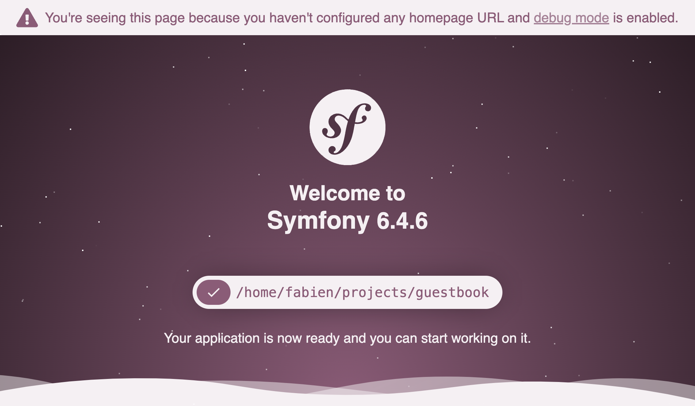

Vom Nichts zum Produktivbetrieb
===============================

Ich mag schnelle Ergebnisse. Deshalb möchte ich, dass unser kleines Projekt so schnell wie möglich live geschaltet wird. Und zwar genau jetzt. Im Produktivbetrieb. Da wir noch nichts entwickelt haben, werden wir zunächst eine schöne und einfache "Under Construction"-Seite einrichten. Du wirst es lieben!

Nimm Dir Zeit dafür das ideale, altmodische und animierte "Under Construction" GIF im Internet zu finden. Hier ist `was,`_ ich benutzen werde:

.. image:: images/under-construction.gif
    :align: center

Ich habe Dir ja gesagt, dass es eine Menge Spaß machen wird.

Das Projekt initialisieren
--------------------------

Erstelle ein neues Symfony-Projekt mit dem ``symfony`` CLI-Tool, das wir zuvor gemeinsam installiert haben:

.. code-block:: terminal

    $ symfony new guestbook --version=6.4 --php=8.3 --webapp --docker --cloud
    $ cd guestbook

Dieser Befehl ist ein dünner Wrapper von ``Composer`` der die Erstellung von Symfony-Projekten erleichtert. Er verwendet ein `Projektskelett`_, das nur die allernötigsten Abhängigkeiten (Dependencies) enthält; die Symfony-Komponenten, die für fast jedes Projekt benötigt werden: ein Konsolenwerkzeug und die HTTP-Abstraktion, die für die Erstellung von Webanwendungen erforderlich ist.

Da wir eine vollfunktionelle Anwendung erstellen, haben wir ein paar Optionen hinzugefügt, die unser Leben einfacher machen:

* ``--webapp``: Standardmäßig ist eine Anwendung mit der kleinstmöglichen Anzahl an Dependencies erstellt. Für die meisten Web-Projekte ist es zusätzlich empfohlen das ``webapp``-Paket zu nutzen. Es beinhaltet die gebräuchlichen Pakete für eine "moderne" Web-Anwendung. Das ``webapp``-Paket fügt eine Menge Symfony-Pakete inklusive Symfony Messenger und PostgreSQL via Doctrine hinzu.

* ``--docker``: Auf Deinem lokalen Computer nutzen wir Docker um Dienste wie PostgreSQL zu verwalten. Diese Option aktiviert Docker, so dass Symfony automatisch die erforderlichen Docker-Dienste hinzufügt (Zum Beispiel ein PostgreSQL-Dienst wenn ein ORM  hinzugefügt wird oder ein Mail-Catcher für Symfony Mailer).

* ``--cloud``: Wenn Du Dein Projekt auf Platform.sh deployen möchtest, generiert diese Option automatisch ein passende Platform.sh-Konfiguration. Platform.sh ist die bevorzugte und einfachste Art um Test-, Staging- und Produktivumgebungen in die Cloud zu deployen.

Wenn Du Dir das GitHub-Repository vom Skeleton ansiehst, wirst Du feststellen, dass es fast leer ist. Nur eine ``composer.json`` Datei. Aber das ``guestbook`` Verzeichnis ist voller Dateien. Wie ist das überhaupt möglich? Die Antwort liegt im ``symfony/flex``-Paket. Symfony Flex ist ein Composer-Plugin, das sich in den Installationsprozess einfügt. Wenn es ein Paket erkennt, für das es ein *Recipe* (Rezept) gibt, wird dieses ausgeführt.

Der wichtigste Einstiegspunkt eines Symfony-Recipes ist eine Manifestdatei, welche die Vorgänge beschreibt, die durchgeführt werden müssen, um das Paket automatisch in einer Symfony-Anwendung zu registrieren. Du musst nie eine README-Datei lesen, um ein Paket mit Symfony zu installieren. Automatisierung ist ein wesentliches Merkmal von Symfony.

Da Git auf unserer Maschine installiert ist, hat ``symfony new`` auch ein Git-Repository für uns erstellt und den allerersten Commit hinzugefügt.

Wirf einen Blick auf die Verzeichnisstruktur:

.. code-block:: text
    :class: ignore

    ├── bin/
    ├── composer.json
    ├── composer.lock
    ├── config/
    ├── public/
    ├── src/
    ├── symfony.lock
    ├── var/
    └── vendor/

Das ``bin/`` Verzeichnis enthält den wichtigsten CLI-Einstiegspunkt: ``console``. Du wirst ihn ständig verwenden.

Das ``config/`` Verzeichnis besteht aus einer Reihe von sinnvollen Standard-Konfigurationsdateien. Eine Datei pro Paket. Du wirst sie kaum ändern, den Standardeinstellungen zu vertrauen ist fast immer eine gute Idee.

Das ``public/``-Verzeichnis ist das Web-Root-Verzeichnis und das ``index.php``-Skript ist der Einstiegspunkt für alle dynamischen HTTP-Ressourcen.

Das ``src/`` Verzeichnis enthält den gesamten Code, den Du schreiben wirst; dort wirst Du die meiste Zeit verbringen. Standardmäßig verwenden alle Klassen in diesem Verzeichnis den ``App`` PHP-Namespace. Es ist Dein Zuhause. Dein Code. Deine Domänenlogik. Symfony hat dort sehr wenig zu sagen.

Das ``var/`` Verzeichnis enthält Caches, Logs und Dateien, die zur Laufzeit von der Anwendung generiert werden. Dieses kannst Du getrost in Ruhe lassen. Es ist das einzige Verzeichnis, das im Produktivbetrieb beschreibbar sein muss.

Das ``vendor/`` Verzeichnis enthält alle von Composer installierten Pakete, einschließlich Symfony selbst. Es ist unsere Geheimwaffe, um produktiver zu sein. Lass uns das Rad nicht neu erfinden. Du wirst dich auf bestehende Bibliotheken verlassen, die die harte Arbeit für dich erledigen. Dieses Verzeichnis wird vom Composer verwaltet, also niemals anfassen.

Das ist alles, was Du im Moment wissen musst.

Öffentliche Ressourcen erstellen
---------------------------------

Alles, was unter ``public/`` liegt, ist über einen Browser zugänglich. Wenn Du beispielsweise Deine animierte GIF-Datei (Name ``under-construction.gif``) in ein neues ``public/images/`` Verzeichnis verschiebst, ist sie unter einer URL wie ``https://localhost/images/under-construction.gif`` erreichbar.

Lade mein GIF-Bild hier herunter:

.. code-block:: terminal

    $ mkdir public/images/
    $ php -r "copy('https://clipartmag.com/images/website-under-construction-image-6.gif', 'public/images/under-construction.gif');"

Einen lokalen Web-Server starten
--------------------------------

.. index::
    single: Symfony CLI;server:start

Im Lieferumfang der ``symfony`` CLI ist ein Webserver enthalten, der für die Entwicklungsarbeit optimiert ist. Es wird Dich nicht überraschen, wenn ich Dir sage, dass er für Symfony reibungslos funktioniert. Verwende ihn jedoch niemals im Produktivbetrieb.

Starte, vom Projektverzeichnis aus, den Webserver im Hintergrund (``-d`` Flag):

.. code-block:: terminal

    $ symfony server:start -d

Der Server startete auf dem ersten verfügbaren Port, beginnend mit 8000. Als Abkürzung öffne die Webseite über die CLI in einem Browser:

.. code-block:: terminal
    :class: ignore

    $ symfony open:local

Dein bevorzugter Browser sollte in den Vordergrund kommen und eine neue Registerkarte öffnen, die etwas Ähnliches wie das Folgende anzeigt:

.. tip::

    Um Probleme zu beheben, führe ``symfony server:log`` aus; es verfolgt die Protokolle vom Webserver, PHP und Deiner Anwendung.

Gehe auf ``/images/under-construction.gif``. Sieht es so aus?

.. index::
    single: Git;add
    single: Git;commit

Zufrieden? Lasst uns unsere Arbeit committen:

.. code-block:: terminal
    :class: ignore

    $ git add public/images
    $ git commit -m'Add the under construction image'

Den Produktivbetrieb vorbereiten
--------------------------------

.. index::
    single: Platform.sh;Initialization

Wie sieht es mit dem Deployment in die Produktivumgebung aus? Ich weiß, wir haben noch nicht einmal eine eigene HTML-Seite, um unsere Benutzer*innen zu begrüßen. Aber das kleine "Under Construction"-Bild auf einem Produktivserver sehen zu können, wäre ein großer Schritt nach vorne. Und Du kennst das Motto: *deploy early and often*.

Du kannst diese Anwendung bei jedem Provider hosten, der PHP unterstützt... also bei fast allen Hosting-Providern. Überprüfe jedoch ein paar Dinge: Wir wollen die neueste PHP-Version und die Möglichkeit, Dienste wie eine Datenbank, eine Queue und einiges mehr zu hosten.

Ich habe meine Wahl getroffen, es wird `Platform.sh`_ sein. Sie bietet alles, was wir brauchen, und hilft die Entwicklung von Symfony zu finanzieren.

.. index::
    single: Symfony CLI;project:init

Da wir die ``--cloud``-Option gewählt haben, als wir das Projekt erstellten, ist Platform.sh bereits mit ein paar Dateien initialisiert, die Platform.sh braucht; genauer gesagt: ``.platform/services.yaml``, ``.platform/routes.yaml`` und ``.platform.app.yaml``.

Der Weg zum Produktivsystem
---------------------------

.. index::
    single: Symfony CLI;cloud:project:create
    single: Symfony CLI;cloud:push

Zeit zu deployen?

Erstelle ein neues remote Platform.sh-Projekt:

.. code-block:: terminal

    $ symfony cloud:project:create --title="Guestbook" --plan=development

Dieser Befehl macht viel:

* Wenn Du diesen Befehl zum ersten Mal ausführst, dann authentifiziere Dich mit Deinen Platform.sh-Zugangsdaten, falls noch nicht geschehen.

* Er stellt ein neues Projekt auf Platform.sh bereit (Du erhältst 30 Tage *kostenlos* für Dein erstes Projekt).

Dann deploye:

.. code-block:: terminal

    $ symfony cloud:push

Der Code wird durch das Pushen des Git-Repository bereitgestellt. Nach der Ausführung des Befehls hat das Projekt einen bestimmten Domainnamen, mit dem Du darauf zugreifen kannst.

.. index::
    single: Symfony CLI;cloud:url

Überprüfe, ob alles geklappt hat:

.. code-block:: terminal
    :class: ignore

    $ symfony cloud:url -1

Du solltest eine 404er Fehlerseite bekommen, aber das browsen zu ``/images/under-construction.gif`` sollte unsere Arbeit enthüllen.

Beachte, dass Du nicht die schöne Standard-Symfony-Seite auf der Platform.sh erhältst. Warum? Du wirst bald feststellen, dass Symfony mehrere Environments (Umgebungen) unterstützt und Platform.sh den Code automatisch in der Production-Environment (Produktivumgebung) bereitgestellt hat.

.. index::
    single: Symfony CLI;cloud:project:delete

.. tip::

    Wenn Du das Projekt bei Platform.sh löschen möchtest, verwende den ``cloud:project:delete``-Befehl.

.. sidebar:: Weiterführendes

    * Die Repositories für die `offiziellen Symfony-Recipes`_ und für die von `der Community beigesteuerten Recipes`_, wo Du deine eigenen Recipes einreichen kannst;

    * Der `lokale Symfony Webserver`_;

    * Die `Platform.sh-Dokumentation`_.

.. _`was,`: https://clipartmag.com/images/website-under-construction-image-6.gif
.. _`Projektskelett`: https://github.com/symfony/skeleton
.. _`Platform.sh`:     https://platform.sh/marketplace/symfony/?utm_source=symfony-cloud-sign-up&utm_medium=backlink&utm_campaign=Symfony-Cloud-sign-up&utm_content=symfony-book
.. _`offiziellen Symfony-Recipes`: https://github.com/symfony/recipes
.. _`der Community beigesteuerten Recipes`: https://github.com/symfony/recipes-contrib
.. _`lokale Symfony Webserver`: https://symfony.com/doc/current/setup/symfony_server.html
.. _`Platform.sh-Dokumentation`: https://docs.platform.sh/guides/symfony.html?utm_source=symfony-cloud-sign-up&utm_medium=backlink&utm_campaign=Symfony-Cloud-sign-up&utm_content=symfony-book
