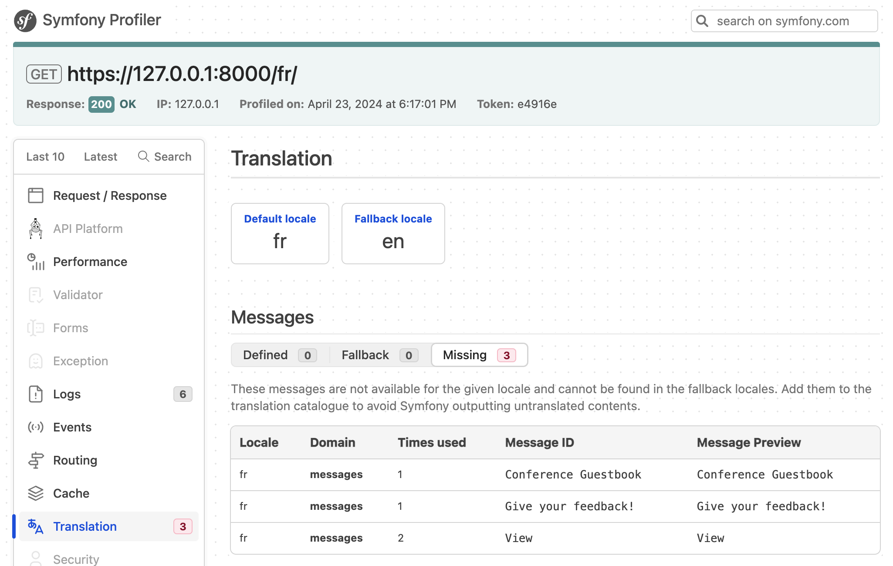
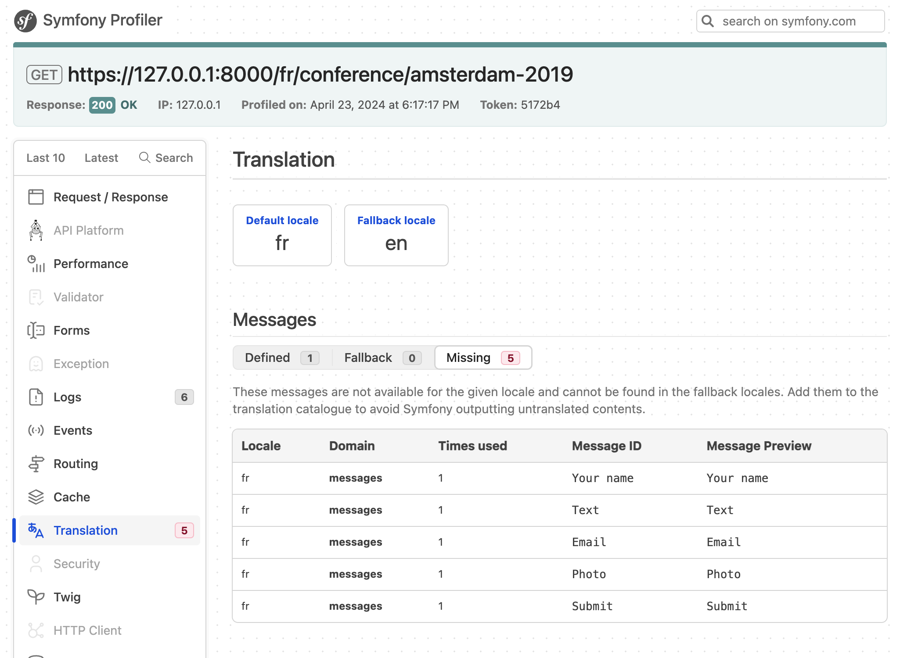

Localizing an Application
=========================

With an international audience, Symfony has been able to handle internationalization (i18n) and localization (l10n) out of the box since, like, forever. Localizing an application is not just about translating the interface, it is also about plurals, date and currency formatting, URLs, and more.

Internationalizing URLs
-----------------------

.. index::
    single: Components;Routing
    single: Routing;Locale
    single: Routing;Requirements
    single: Attributes;Route

The first step to internationalize the website is to internationalize the URLs. When translating a website interface, the URL should be different per locale to play nice with HTTP caches (never use the same URL and store the locale in the session).

Use the special ``_locale`` route parameter to reference the locale in routes:

.. code-block:: diff
    :caption: patch_file
    :emphasize-lines: 8

    --- i/src/Controller/ConferenceController.php
    +++ w/src/Controller/ConferenceController.php
    @@ -27,7 +27,7 @@ final class ConferenceController extends AbstractController
         ) {
         }

    -    #[Route('/', name: 'homepage')]
    +    #[Route('/{_locale}/', name: 'homepage')]
         public function index(ConferenceRepository $conferenceRepository): Response
         {
             return $this->render('conference/index.html.twig', [

On the homepage, the locale is now set internally depending on the URL; for instance, if you hit ``/fr/``, ``$request->getLocale()`` returns ``fr``.

As you will probably not be able to translate the content in all valid locales, restrict to the ones you want to support:

.. code-block:: diff
    :caption: patch_file
    :emphasize-lines: 8

    --- i/src/Controller/ConferenceController.php
    +++ w/src/Controller/ConferenceController.php
    @@ -27,7 +27,7 @@ final class ConferenceController extends AbstractController
         ) {
         }

    -    #[Route('/{_locale}/', name: 'homepage')]
    +    #[Route('/{_locale<en|fr>}/', name: 'homepage')]
         public function index(ConferenceRepository $conferenceRepository): Response
         {
             return $this->render('conference/index.html.twig', [

Each route parameter can be restricted by a regular expression inside ``<`` ``>``. The ``homepage`` route now only matches when the ``_locale`` parameter is ``en`` or ``fr``. Try hitting ``/es/``, you should have a 404 as no route matches.

As we will use the same requirement in almost all routes, let's move it to a container parameter:

.. code-block:: diff
    :caption: patch_file

    --- i/config/services.yaml
    +++ w/config/services.yaml
    @@ -9,6 +9,7 @@ parameters:
         admin_email: "%env(string:default:default_admin_email:ADMIN_EMAIL)%"
         default_base_url: 'http://127.0.0.1'
         router.request_context.base_url: '%env(default:default_base_url:SYMFONY_DEFAULT_ROUTE_URL)%'
    +    app.supported_locales: 'en|fr'

     services:
         # default configuration for services in *this* file
    --- i/src/Controller/ConferenceController.php
    +++ w/src/Controller/ConferenceController.php
    @@ -27,7 +27,7 @@ final class ConferenceController extends AbstractController
         ) {
         }

    -    #[Route('/{_locale<en|fr>}/', name: 'homepage')]
    +    #[Route('/{_locale<%app.supported_locales%>}/', name: 'homepage')]
         public function index(ConferenceRepository $conferenceRepository): Response
         {
             return $this->render('conference/index.html.twig', [

Adding a language can be done by updating the ``app.supported_languages`` parameter.

Add the same locale route prefix to the other URLs:

.. code-block:: diff
    :caption: patch_file

    --- i/src/Controller/ConferenceController.php
    +++ w/src/Controller/ConferenceController.php
    @@ -35,7 +35,7 @@ final class ConferenceController extends AbstractController
             ])->setSharedMaxAge(3600);
         }

    -    #[Route('/conference_header', name: 'conference_header')]
    +    #[Route('/{_locale<%app.supported_locales%>}/conference_header', name: 'conference_header')]
         public function conferenceHeader(ConferenceRepository $conferenceRepository): Response
         {
             return $this->render('conference/header.html.twig', [
    @@ -43,7 +43,7 @@ final class ConferenceController extends AbstractController
             ])->setSharedMaxAge(3600);
         }

    -    #[Route('/conference/{slug}', name: 'conference')]
    +    #[Route('/{_locale<%app.supported_locales%>}/conference/{slug}', name: 'conference')]
         public function show(
             Request $request,
             Conference $conference,

We are almost done. We don't have a route that matches ``/`` anymore. Let's add it back and make it redirect to ``/en/``:

.. code-block:: diff
    :caption: patch_file

    --- i/src/Controller/ConferenceController.php
    +++ w/src/Controller/ConferenceController.php
    @@ -27,6 +27,12 @@ final class ConferenceController extends AbstractController
         ) {
         }

    +    #[Route('/')]
    +    public function indexNoLocale(): Response
    +    {
    +        return $this->redirectToRoute('homepage', ['_locale' => 'en']);
    +    }
    +
         #[Route('/{_locale<%app.supported_locales%>}/', name: 'homepage')]
         public function index(ConferenceRepository $conferenceRepository): Response
         {

Now that all main routes are locale aware, notice that generated URLs on the pages take the current locale into account automatically.

Adding a Locale Switcher
------------------------

.. index::
    single: Twig;path
    single: Twig;Locale

To allow users to switch from the default ``en`` locale to another one, let's add a switcher in the header:

.. code-block:: diff
    :caption: patch_file

    --- i/templates/base.html.twig
    +++ w/templates/base.html.twig
    @@ -34,6 +34,16 @@
                                         Admin
                                     </a>
                                 </li>
    +<li class="nav-item dropdown">
    +    <a class="nav-link dropdown-toggle" href="#" id="dropdown-language" role="button"
    +        data-bs-toggle="dropdown" aria-haspopup="true" aria-expanded="false">
    +        English
    +    </a>
    +    <ul class="dropdown-menu dropdown-menu-right" aria-labelledby="dropdown-language">
    +        <li><a class="dropdown-item" href="{{ path('homepage', {_locale: 'en'}) }}">English</a></li>
    +        <li><a class="dropdown-item" href="{{ path('homepage', {_locale: 'fr'}) }}">Français</a></li>
    +    </ul>
    +</li>
                             </ul>
                         

                     

To switch to another locale, we explicitly pass the ``_locale`` route parameter to the ``path()`` function.

.. index::
    single: Twig;app.request
    single: Twig;locale_name

Update the template to display the current locale name instead of the hard-coded "English":

.. code-block:: diff
    :caption: patch_file

    --- i/templates/base.html.twig
    +++ w/templates/base.html.twig
    @@ -37,7 +37,7 @@
     <li class="nav-item dropdown">
         <a class="nav-link dropdown-toggle" href="#" id="dropdown-language" role="button"
             data-bs-toggle="dropdown" aria-haspopup="true" aria-expanded="false">
    -        English
    +        {{ app.request.locale|locale_name(app.request.locale) }}
         </a>
         <ul class="dropdown-menu dropdown-menu-right" aria-labelledby="dropdown-language">
             <li><a class="dropdown-item" href="{{ path('homepage', {_locale: 'en'}) }}">English</a></li>

``app`` is a global Twig variable that gives access to the current request. To convert the locale to a human readable string, we are using the ``locale_name`` Twig filter.

.. index::
    single: Components;String

Depending on the locale, the locale name is not always capitalized. To capitalize sentences properly, we need a filter that is Unicode aware, as provided by the Symfony String component and its Twig implementation:

.. code-block:: terminal

    $ symfony composer req twig/string-extra

.. index::
    single: Twig;u.title

.. code-block:: diff
    :caption: patch_file

    --- i/templates/base.html.twig
    +++ w/templates/base.html.twig
    @@ -37,7 +37,7 @@
     <li class="nav-item dropdown">
         <a class="nav-link dropdown-toggle" href="#" id="dropdown-language" role="button"
             data-bs-toggle="dropdown" aria-haspopup="true" aria-expanded="false">
    -        {{ app.request.locale|locale_name(app.request.locale) }}
    +        {{ app.request.locale|locale_name(app.request.locale)|u.title }}
         </a>
         <ul class="dropdown-menu dropdown-menu-right" aria-labelledby="dropdown-language">
             <li><a class="dropdown-item" href="{{ path('homepage', {_locale: 'en'}) }}">English</a></li>

You can now switch from French to English via the switcher and the whole interface adapts itself quite nicely:

.. figure:: screenshots/intl-switcher.png
    :alt: /fr/conference/amsterdam-2019
    :align: center
    :figclass: with-browser

Translating the Interface
-------------------------

.. index::
    single: Components;Translation
    single: Translation
    single: Twig;trans

Translating every single sentence on a large website can be tedious, but fortunately, we only have a handful of messages on our website. Let's start with all the sentences on the homepage:

.. code-block:: diff
    :caption: patch_file

    --- i/templates/base.html.twig
    +++ w/templates/base.html.twig
    @@ -20,7 +20,7 @@
                 <nav class="navbar navbar-expand-xl navbar-light bg-light">
                     

                         <a class="navbar-brand me-4 pr-2" href="{{ path('homepage') }}">
    -                        &#128217; Conference Guestbook
    +                        &#128217; {{ 'Conference Guestbook'|trans }}
                         </a>

                         <button class="navbar-toggler border-0" type="button" data-bs-toggle="collapse" data-bs-target="#header-menu" aria-controls="navbarSupportedContent" aria-expanded="false" aria-label="Show/Hide navigation">
    --- i/templates/conference/index.html.twig
    +++ w/templates/conference/index.html.twig
    @@ -4,7 +4,7 @@

     
         <h2 class="mb-5">
    -        Give your feedback!
    +        {{ 'Give your feedback!'|trans }}
         </h2>

         
    @@ -21,7 +21,7 @@

                                 <a href="{{ path('conference', { slug: conference.slug }) }}"
                                    class="btn btn-sm btn-primary stretched-link">
    -                                View
    +                                {{ 'View'|trans }}
                                 </a>
                             

                         

The ``trans`` Twig filter looks for a translation of the given input to the current locale. If not found, it falls back to the *default locale* as configured in ``config/packages/translation.yaml``:

.. code-block:: yaml
    :class: ignore
    :emphasize-lines: 2

    framework:
        default_locale: en
        translator:
            default_path: '%kernel.project_dir%/translations'
            fallbacks:
                - en

Notice that the web debug toolbar translation "tab" has turned red:

.. figure:: screenshots/intl-wdt.png
    :alt: /fr/
    :align: center
    :figclass: with-browser

It tells us that 3 messages are not translated yet.

Click on the "tab" to list all messages for which Symfony did not find a translation:

Providing Translations
----------------------

As you might have seen in ``config/packages/translation.yaml``, translations are stored under a ``translations/`` root directory, which has been created automatically for us.

Instead of creating the translation files by hand, use the ``translation:extract`` command:

.. code-block:: terminal

    $ symfony console translation:extract fr --force --domain=messages

This command generates a translation file (``--force`` flag) for the ``fr`` locale and the ``messages`` domain. The ``messages`` domain contains all **application** messages excluding the ones coming from Symfony itself like validation or security errors.

Edit the ``translations/messages+intl-icu.fr.xlf`` file and translate the messages in French. Don't speak French? Let me help you:

.. code-block:: diff
    :caption: patch_file
    :class: ignore

    --- i/translations/messages+intl-icu.fr.xlf
    +++ w/translations/messages+intl-icu.fr.xlf
    @@ -7,15 +7,15 @@
         <body>
           <trans-unit id="eOy4.6V" resname="Conference Guestbook">
             <source>Conference Guestbook</source>
    -        <target>__Conference Guestbook</target>
    +        <target>Livre d'Or pour Conferences</target>
           </trans-unit>
           <trans-unit id="LNAVleg" resname="Give your feedback!">
             <source>Give your feedback!</source>
    -        <target>__Give your feedback!</target>
    +        <target>Donnez votre avis !</target>
           </trans-unit>
           <trans-unit id="3Mg5pAF" resname="View">
             <source>View</source>
    -        <target>__View</target>
    +        <target>Sélectionner</target>
           </trans-unit>
         </body>
       </file>

.. code-block:: xml
    :caption: translations/messages+intl-icu.fr.xlf
    :class: hide

    <?xml version="1.0" encoding="utf-8"?>
    <xliff xmlns="urn:oasis:names:tc:xliff:document:1.2" version="1.2">
    <file source-language="en" target-language="fr" datatype="plaintext" original="file.ext">
        <header>
        <tool tool-id="symfony" tool-name="Symfony" />
        </header>
        <body>
        <trans-unit id="LNAVleg" resname="Give your feedback!">
            <source>Give your feedback!</source>
            <target>Donnez votre avis !</target>
        </trans-unit>
        <trans-unit id="3Mg5pAF" resname="View">
            <source>View</source>
            <target>Sélectionner</target>
        </trans-unit>
        <trans-unit id="eOy4.6V" resname="Conference Guestbook">
            <source>Conference Guestbook</source>
            <target>Livre d'Or pour Conferences</target>
        </trans-unit>
        </body>
    </file>
    </xliff>

Note that we won't translate all templates, but feel free to do so:

.. figure:: screenshots/intl-translated.png
    :alt: /fr/
    :align: center
    :figclass: with-browser

Translating Forms
-----------------

.. index::
    single: Translation;Form
    single: Form;Translation

Form labels are automatically displayed by Symfony via the translation system. Go to a conference page and click on the "Translation" tab of the web debug toolbar; you should see all labels ready for translation:

Localizing Dates
----------------

.. index::
    single: Localization
    single: Twig;format_datetime
    single: Twig;format_time
    single: Twig;format_date
    single: Twig;format_currency
    single: Twig;format_number

If you switch to French and go to a conference webpage that has some comments, you will notice that the comment dates are automatically localized. This works because we used the ``format_datetime`` Twig filter, which is locale-aware (``{{ comment.createdAt|format_datetime('medium', 'short') }}``).

The localization works for dates, times (``format_time``), currencies (``format_currency``), and numbers (``format_number``) in general (percents, durations, spell out, ...).

Translating Plurals
-------------------

.. index::
    single: Translation;Plurals
    single: Translation;Conditions

Managing plurals in translations is one usage of the more general problem of selecting a translation based on a condition.

On a conference page, we display the number of comments: ``There are 2 comments``. For 1 comment, we display ``There are 1 comments``, which is wrong. Modify the template to convert the sentence to a translatable message:

.. code-block:: diff
    :caption: patch_file

    --- i/templates/conference/show.html.twig
    +++ w/templates/conference/show.html.twig
    @@ -44,7 +44,7 @@
                             

                         

                     
    -                
There are {{ comments|length }} comments.

    +                
{{ 'nb_of_comments'|trans({count: comments|length}) }}

                     
                         <a href="{{ path('conference', { slug: conference.slug, offset: previous }) }}">Previous</a>
                     

For this message, we have used another translation strategy. Instead of keeping the English version in the template, we have replaced it with a unique identifier. That strategy works better for complex and large amount of text.

Update the translation file by adding the new message:

.. code-block:: diff
    :caption: patch_file

    --- i/translations/messages+intl-icu.fr.xlf
    +++ w/translations/messages+intl-icu.fr.xlf
    @@ -17,6 +17,10 @@
             <source>Conference Guestbook</source>
             <target>Livre d'Or pour Conferences</target>
         </trans-unit>
    +    <trans-unit id="Dg2dPd6" resname="nb_of_comments">
    +        <source>nb_of_comments</source>
    +        <target>{count, plural, =0 {Aucun commentaire.} =1 {1 commentaire.} other {# commentaires.}}</target>
    +    </trans-unit>
         </body>
     </file>
     </xliff>

We have not finished yet as we now need to provide the English translation. Create the ``translations/messages+intl-icu.en.xlf`` file:

.. code-block:: xml
    :caption: translations/messages+intl-icu.en.xlf
    :emphasize-lines: 10

    <?xml version="1.0" encoding="utf-8"?>
    <xliff xmlns="urn:oasis:names:tc:xliff:document:1.2" version="1.2">
      <file source-language="en" target-language="en" datatype="plaintext" original="file.ext">
        <header>
          <tool tool-id="symfony" tool-name="Symfony" />
        </header>
        <body>
          <trans-unit id="maMQz7W" resname="nb_of_comments">
            <source>nb_of_comments</source>
            <target>{count, plural, =0 {There are no comments.} one {There is one comment.} other {There are # comments.}}</target>
          </trans-unit>
        </body>
      </file>
    </xliff>

Updating Functional Tests
-------------------------

Don't forget to update the functional tests to take URLs and content changes into account:

.. code-block:: diff
    :caption: patch_file

    --- i/tests/Controller/ConferenceControllerTest.php
    +++ w/tests/Controller/ConferenceControllerTest.php
    @@ -11,7 +11,7 @@ class ConferenceControllerTest extends WebTestCase
         public function testIndex()
         {
             $client = static::createClient();
    -        $client->request('GET', '/');
    +        $client->request('GET', '/en/');

             $this->assertResponseIsSuccessful();
             $this->assertSelectorTextContains('h2', 'Give your feedback');
    @@ -20,7 +20,7 @@ class ConferenceControllerTest extends WebTestCase
         public function testCommentSubmission()
         {
             $client = static::createClient();
    -        $client->request('GET', '/conference/amsterdam-2019');
    +        $client->request('GET', '/en/conference/amsterdam-2019');
             $client->submitForm('Submit', [
                 'comment[author]' => 'Fabien',
                 'comment[text]' => 'Some feedback from an automated functional test',
    @@ -41,7 +41,7 @@ class ConferenceControllerTest extends WebTestCase
         public function testConferencePage()
         {
             $client = static::createClient();
    -        $crawler = $client->request('GET', '/');
    +        $crawler = $client->request('GET', '/en/');

             $this->assertCount(2, $crawler->filter('h4'));

    @@ -50,6 +50,6 @@ class ConferenceControllerTest extends WebTestCase
             $this->assertPageTitleContains('Amsterdam');
             $this->assertResponseIsSuccessful();
             $this->assertSelectorTextContains('h2', 'Amsterdam 2019');
    -        $this->assertSelectorExists('div:contains("There are 1 comments")');
    +        $this->assertSelectorExists('div:contains("There is one comment")');
         }
     }

.. sidebar:: Going Further

    * `Translating Messages using the ICU formatter`_;

    * `Using Twig translation filters`_.

.. _`Translating Messages using the ICU formatter`: https://symfony.com/doc/current/translation/message_format.html
.. _`Using Twig translation filters`: https://symfony.com/doc/current/translation/templates.html#translation-filters
